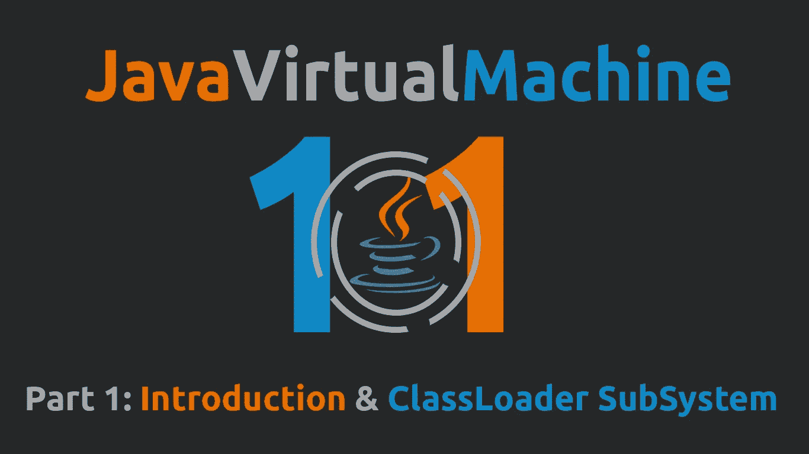
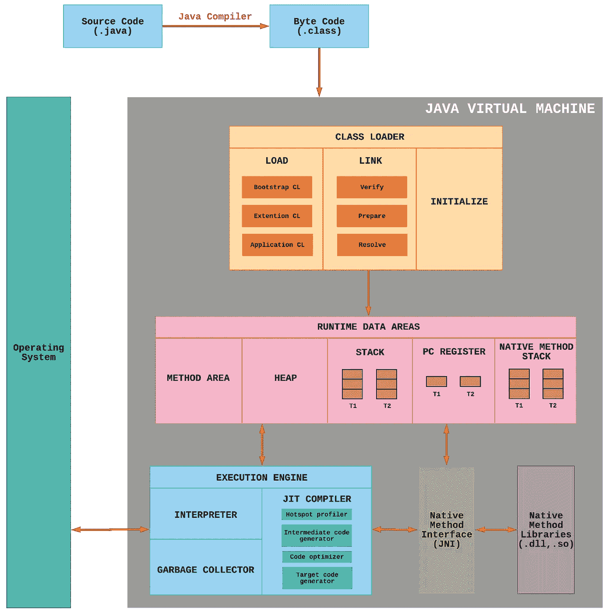
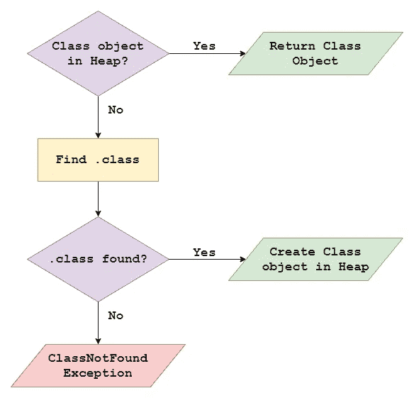
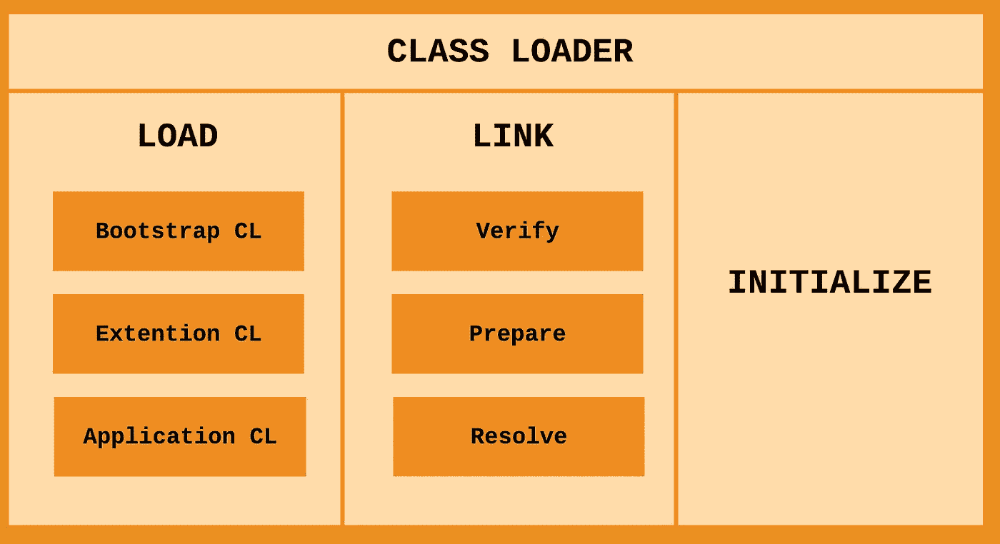
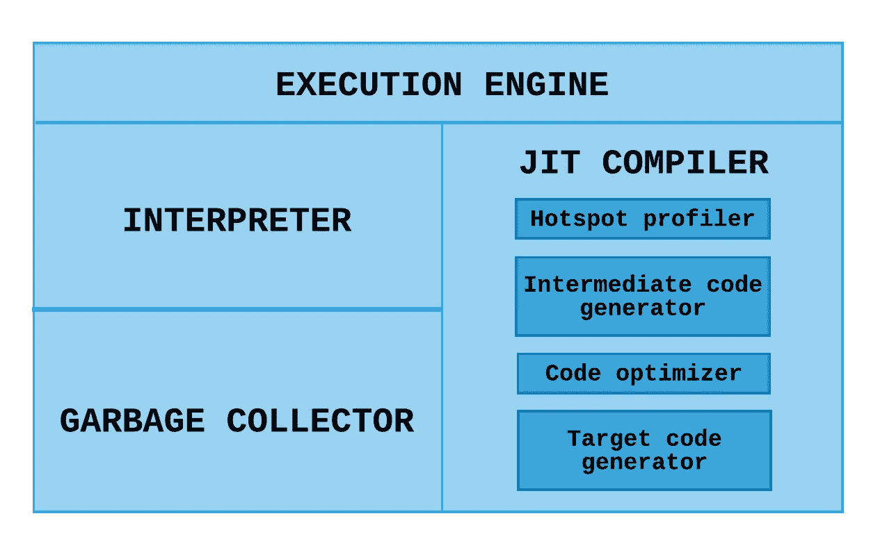

# JVM 101:简介、类加载器子系统和 JIT 编译器(第 1 部分)

> 原文：<https://medium.com/javarevisited/jvm-101-introduction-classloader-sub-system-jit-compiler-part-1-9e5a6782fa3e?source=collection_archive---------0----------------------->

读者们好！今天，我为您带来了一个与 Java 内存模型相关的小而新鲜的文章系列。这是我很久以来真正热爱并想到要写的话题之一。希望你会喜欢！🤗

不管怎样，我们开始吧。今天我们要学习一些与 Java 相关的东西。我们许多开发人员都是从 Java 开发人员开始的，我们中的一些人可能已经转移到其他领域，但是，我们通常都在 Java 中保持一步，因为它是世界上使用最广泛的编程语言之一。然而，我们大多数人没有注意到的一件事是关于 Java 的类型生命周期和内存模型的幕后细节。但是，在创建行业级应用程序时，理解这些事情是很重要的。

有一个单独的组件处理这两个任务以及其他一些小任务。那就是 JVM 或者 Java 虚拟机。

JVM 的话题有点大。因此，我将分三部分进行讨论:

1.  简介，类加载器子系统和 JIT 编译器
2.  垃圾收集和堆
3.  堆栈和其他运行时数据区

这篇文章是第 1 部分:介绍，类加载器子系统和 JIT 编译器，在这里我们将讨论 JVM 的大图，类加载器子系统的职责和 JIT 编译器做什么。

# JVM 和职责

顾名思义，JVM 是一个能够执行 Java 字节码的虚拟机。(如果你不确定什么是 Java 字节码，可以看看我之前的帖子，[Java 如何实现平台无关性](/javarevisited/java-platform-independency-2dddd92a53f8))。但是，它还有其他一些职责:

1.  加载和解释字节码
2.  安全性
3.  自动内存管理

有一点需要注意，就是有 ***没有******通用 JVM 设计*** 。Oracle 公司提供了一个关于 JVM 中需要包含什么的 ***规范*** ，用户可以使用它来实现自己的 JVM。然而，这些规范已经有足够多的行业级实现，如 IBM 的 Eclipse OpenJ9、Oracle 的 HotSpot JVM 等。

还有，另一个需要注意的要点是，JVM 是 ***平台依赖的*** 。这意味着 Windows 操作系统的 JVM 不同于你的 Linux 机器的 JVM。这是为了实现 Java 平台独立性的关键特性(阅读更多关于 Java 如何实现平台独立性的内容)

无论何时运行 Java 程序，都会创建一个 JVM 运行时实例并加载到内存中。这样一个运行时实例只负责运行一个 Java 程序。

现在让我们来看看 JVM 是如何满足我上面提到的职责的，以及它为每个任务使用了哪些组件。

一个映像中的 JVM 架构

从上图可以看出，JVM 中有三大部分；类加载器、运行时数据区(RDA)和执行引擎。我们将在这个帖子系列中深入讨论这三个问题。除此之外，我们还有本地方法接口和本地方法库。简而言之，每个人都有以下职责:

1.  ***类加载器子系统*** :接受字节码，如果是第一次访问，就把类(执行字节码所需要的)加载到内存中
2.  ***运行时数据区*** :有几个任务，由它的五个主要组件执行。(很难简要介绍☹️检查这一系列的下两个职位)
3.  ***执行引擎*** :一段一段执行加载到 RDA 的字节码，GC 清理堆。
4.  ***JNI (Java 本地接口)*** :执行引擎访问用 C 和 C++等语言编写的本地库的接口
5.  ***原生方法库*** :执行引擎与操作系统有效通信所需的原生方法库的集合。

让我们首先详细讨论一下类加载器子系统。

# 类装入器子系统

ClassLoader 接受字节码，并负责将字节码中指定类型的类对象加载到堆中(在 RDA 中)。这些类对象只在第一次访问 ***【类型】*** 时创建一次。

## 第一次加载一个类的类对象是什么时候？

1.  创建类的“新”实例
2.  调用类中的静态方法
3.  访问类中的静态字段(访问编译时常数的情况除外)
4.  子类被加载到内存中(它在内部调用超类)
5.  从命令行运行(例如:`java hello.class`)
6.  反射

> 旁注:从 Java 8 开始，所有 2 到 5 对于接口都是正确的。(第四点是在接口的情况下，加载子接口，而不是子类)

## 谁有类对象？

类对象包含关于类名、超类、包、方法、字段等类型的元信息。不仅类有类对象，基元类型、引用类型(类、接口、数组)，甚至 void 都有一个类对象。

Array 的类对象有点特殊。相同类型、相同维度的数组(不考虑它们的长度)有相同的类对象。

例如:int[5]和 int[100]有相同的类对象，因为它们都是 1D 整数数组。

## 类别加载流程和阶段

类别加载过程

每次需要访问一个类型时，JVM 都会检查它的类对象是否存在于堆中。如果它不存在，那么“类加载器子系统”就不仅仅是查找。类文件和创建类对象，还要链接和初始化。换句话说，类加载器子系统负责三项任务:

1.  装货
2.  连接
3.  正在初始化

类加载器子系统及其流程阶段

## 荷载阶段

在加载阶段，3 个主要的类加载器搜索。类文件，并创建类对象。找到了类文件。这 3 个主要的类装入器是:

1.  引导(原始)类加载器
2.  扩展类加载器
3.  应用程序(系统)类加载器

这三个类加载器被安排在一个 ***父委托模型*** (类似于类的层次结构)中，其中 Bootstrap ClassLaoder 位于层次结构的顶端，被认为是 ***最值得信赖的*** 类加载器。(沿着层级向下遍历时，可信度降低)

当一个字节码正在访问某个类型时，如果它在堆中没有找到它的类对象，它首先联系应用程序类加载器来帮助查找. class。由于应用程序类加载器在层次结构的底部，他然后联系他的父类，Extention ClassLoader 来寻求帮助，后者然后调用他的父引导类加载器。因此，最初搜索。类从引导类加载器启动。

引导类加载器检查主包和类中的类(即核心 Java API 中的类)。换句话说，它检查所需类的`jdk/jre/lib/rt.jar`。如果没有找到，那么 Bootstrap ClassLoader 将接力棒传递给 Extension ClassLoader，后者检查来自标准 java 扩展 API 的附加应用程序类。这意味着，扩展类加载器正在检查`jdk/jre/lib/ext`目录。如果它也找不到类，那么它调用应用程序类加载器来检查`CLASSPATH`。如果应用程序类加载器也找不到该类，就会抛出`**java.lang.ClassNotFound**`异常。

这里需要注意的一点是，有时在类加载器层次结构的底层可能还有另一个类加载器，称为“**用户定义的类加载器**”。顾名思义，这些是用户定义的类加载器。它们是用 java 编写的，并且扩展了一个名为`java.lang.ClassLoader`的抽象类。它的职责是检查非标准的、用户定义的源(如数据库)中的类。如果这种用户定义的类加载器存在，它被认为是最初接受字节码的那个，也是在应用程序类加载器找不到类之后最后检查类的那个。此外，由于它位于类加载器父委托模型的底部，所以它是最不可信的类加载器。

假设我们的一个类加载器找到了。类，然后它将加载它并移动到下一个阶段，即链接阶段。

## 链接阶段

链接阶段将类对象作为输入，并执行 3 个主要的链接相关步骤；第三个是可选的和按需的，取决于 JVM 实现。

***1。验证:***

在验证过程中， ***字节码验证器*** 检查类型的。类来查看它是否具有字节码完整性。它检查结构是否正确，是否与 JVM 兼容，是否由有效的编译器生成等等。

有人可能会问，为什么我们需要一个验证步骤，因为编译过程也做验证部分。如果。类不是来自本机编译器。因为 Java 程序可以通过网络移植。我们正在访问的类可能是我们下载的，并且是由恶意编译器创建的。这就是在链接阶段再次执行验证过程的原因。

如果在验证过程中检测到一些异常，它将抛出一个`java.lang.VerifyError`，后者又抛出`java.lang.LinkageError`。

**②*。准备:***

在准备步骤中，JVM 为静态变量分配内存，并用默认值初始化它们。

例如:布尔→假

如果流程是由于实例创建而触发的，则实例字段也会分配内存并分配给默认值。然而，这只有在处理完当前类的整个类层次结构的静态字段之后才会发生。

如果出现内存不够分配的情况，就会抛出`java.lang.OutOfMemoryError`。

***3。*解析:**

如果有符号引用(指向其他类的逻辑引用)，通过将引用类加载到内存并使用它们的实际内存位置替换符号引用来解决它们。请注意，如果一个符号引用在类中多次使用，则解析只发生一次。

使用符号引用并在运行时解析它们被称为 ***动态链接*** 。如前所述，这个步骤是可选的或按需的。这是因为动态链接有两种方法。

1.  急切链接:链接发生在准备步骤之后
2.  惰性链接:只有在执行带有符号引用的语句时，链接才会在初始化步骤之后发生)

大多数 JVM 使用惰性链接，因为大多数时候，带有符号引用的语句不会被执行，因此，将它们加载到内存中完全是浪费资源。

如果由于某种原因，没有找到符号引用所引用的类，该进程将抛出异常`java.lang.ClassDefNotFound`，反过来抛出`java.lang.ClassNotFound`异常。

## 初始化阶段

用实际值初始化静态变量和块。这是以自顶向下的方式发生的，从加载到内存中的当前类的超类开始。

# 执行引擎

执行引擎

在执行引擎内部，有 3 个主要部分；

1.  解释器—类似于任何其他解释器。它的职责是解释字节码中的指令。
2.  垃圾收集器——自动内存管理(在第 2 部分:垃圾收集和堆中讨论)
3.  JIT 编译器

## JIT 编译器

JIT 编译器或实时编译器对 Java 的快速执行贡献最大。它的主要职责是识别频繁执行的代码，并将它们编译成本机代码，以便在下次执行该代码时访问。因此，资源不会浪费在多次执行同一任务上(就像传统的解释器一样),所花费的时间也大大减少了。

让我们举个例子:

想象你有两种方法；方法 a()和 b()。这个 a()可能已经执行了 500 次了。因此，JIT 编译器发现它被执行了很多次。因此，它所做的是，将该方法预编译成本机代码，并进一步优化它以便快速执行。因此，当方法 a()被第 501 次触发时，解释器不是逐行解释该方法，而是执行与特定方法(经过优化)对应的本机代码。现在假设这个方法被执行了 2000 次；然后，JIT 编译器对本机代码执行另一轮优化。

但是方法 b()可能不像方法 a()那样，它可能要执行 10 次。那么该方法将在每次被调用时被解释。

为了处理这个过程，JIT 编译器有 4 个部分:

1.  ***热点剖析器*** :检测并剖析“热点”，即频繁执行的代码片段。
2.  ***中间代码生成器*** :负责生成中间代码。
3.  ***代码优化器*** :对生成的中间代码进行优化。
4.  ***目标代码生成器*** :生成本机代码。

我想这是一篇有趣的文章，谈论的是你没有太注意的事情。希望它不会拖得太久，并且你喜欢阅读。

反正别忘了在下面留个评论。非常欢迎批评，因为它有助于我下次写得更好。😇

让我们在第二部分尽快见面。在那之前，祝阅读愉快！！❤️

也要注意安全，❤️

 [## 学习 JVM 内部机制、内存管理、GC 和 Java 性能调优的前 5 门课程

### 对于一个高级 Java 开发人员来说，了解 JVM 的工作原理以及如何解决与…相关的问题是非常重要的

javarevisited.blogspot.com](https://javarevisited.blogspot.com/2019/04/top-5-courses-to-learn-jvm-internals.html)  [## 深入学习 Java 虚拟机、垃圾收集和性能的前 5 本书

### 在过去的几年里，我看到了一种趋势，许多 Java 开发人员想要学习更多关于 JVM 的知识…

www.java67.com](https://www.java67.com/2019/08/best-books-to-learn-java-virtual-machine-in-depth.html)