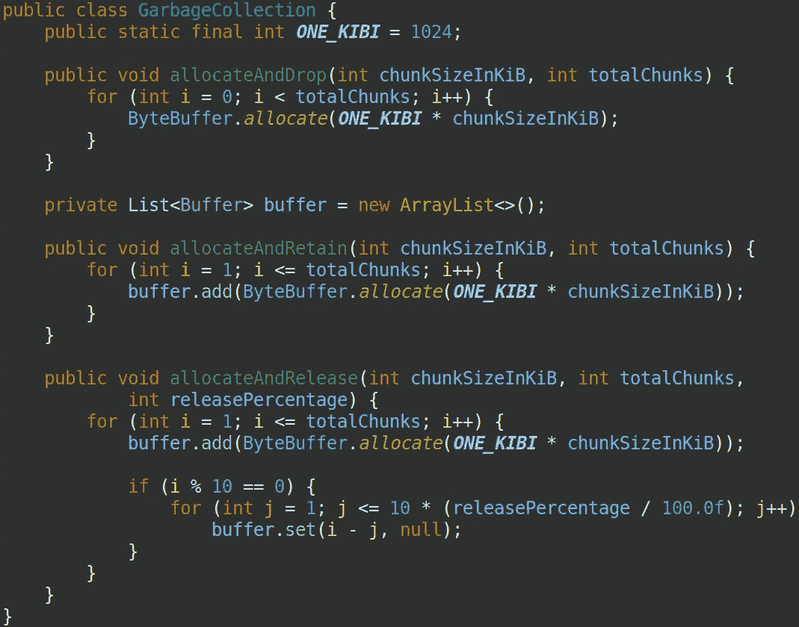
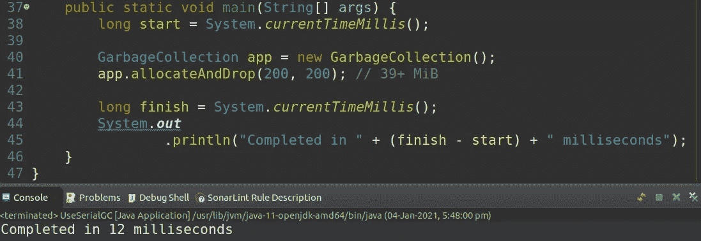
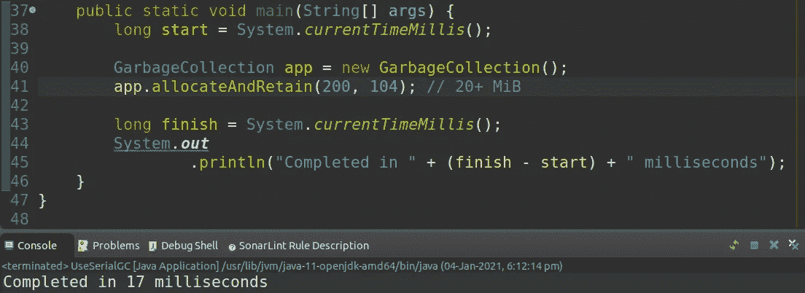
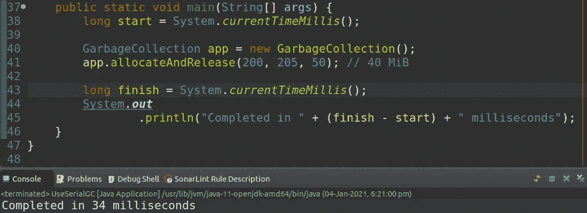

# JVM 垃圾收集日志—基础知识

> 原文：<https://medium.com/javarevisited/jvm-garbage-collection-logs-basics-2dc2bc364c41?source=collection_archive---------1----------------------->


[宁石](https://unsplash.com/@ningshi?utm_source=unsplash&utm_medium=referral&utm_content=creditCopyText)在 [Unsplash](https://unsplash.com/s/photos/collection?utm_source=unsplash&utm_medium=referral&utm_content=creditCopyText) 上拍照

JVM 垃圾收集期间发生了很多事情。GC 日志是最接近的目击者😄并在事件发生时记录下来。通过查看这些日志，我们将能够了解我们的应用对于给定场景、配置和/或负载的表现如何。

会得到回答的典型问题有

*   全 GC 太多了吗？
*   有停顿时间长的 GC 吗？
*   GCs 发生的太频繁了吗？

> [让我们学习在 Java 9](https://www.slideshare.net/PoonamBajaj5/lets-learn-to-talk-to-gc-logs-in-java-9) 中与 GC 日志对话

我们将使用一个简单的 Java 程序探索 GC 日志，该程序涵盖了三种不同的用例

1.  **分配和删除对象**——尽可能使用局部变量
2.  **分配和保留对象** —常规用例
3.  **分配并释放对象** —释放未使用的对象*(如果需要)*将是有益的

这个博客旨在展示这种技术和可能性。

> 不包括弱引用、软引用和幻像引用。改天再写博客

[](https://javarevisited.blogspot.com/2019/04/top-5-courses-to-learn-jvm-internals.html)

GC 演示应用

**统一 JVM 日志**在 [Java SE 9](https://openjdk.java.net/jeps/158) 中引入，目的是通过允许**细粒度且易于配置的日志选项**来简化根本原因分析。运行以下命令来理解统一的 [JVM 日志](https://www.java67.com/2016/08/10-jvm-options-for-java-production-application.html)支持的语法和选项

```
**java -Xlog:help**-Xlog Usage: -Xlog[:[selections][:[output][:[decorators][:output-options]]]]
         where 'selections' are combinations of tags and levels of the form tag1[+tag2...][*][=level][,...]
         NOTE: Unless wildcard (*) is specified, only log messages tagged with exactly the tags specified will be matched.Available log levels:
 off, trace, debug, info, warning, errormore...
```

我将在所有的测试运行中使用以下日志配置

```
java -XX:+UseSerialGC -Xms22m **-Xmx22m** -Xlog:**gc*=info,heap*=debug,safepoint=info**:file=/home/prasad/logs/gc.log::filecount=3,filesize=1m GarbageCollectorApp- We will be using Serial GC for simplicity sake
- We can switch between **info, debug and off** log levels as required
- Maximum of 22 MB heap size is allocated (2 MB extra is provided for miscellaneous purpose)
```

**分配并删除用例**

[](https://javarevisited.blogspot.com/2020/04/top-10-advanced-core-java-courses-for-experienced-developers.html)

分配并删除测试运行

**基于 GC 日志的高级摘要是**

*   有 6 个年轻一代 GC 周期
*   没有老一代 GC 循环
*   没有一个对象升级到旧版本

> 将迭代次数从 200 更改为 2000。程序将完成而不会抛出错误—[Java . lang . out of memory error:Java 堆空间](http://javarevisited.blogspot.sg/2011/09/javalangoutofmemoryerror-permgen-space.html#axzz5DmwFLA1K)

```
[0.004s]*[debug]*[gc,heap] Minimum heap 23068672  Initial heap 23068672  Maximum heap 23068672[0.004s][info ][gc     ] **Using Serial**Skipped multiple lines...[0.050s][info ]**[gc,start     ] GC(5) Pause Young (Allocation Failure)**[0.050s][info ][gc,heap      ] GC(5) DefNew: 5919K->0K(6784K)[0.050s][info ][gc,heap      ] GC(5) Tenured: 494K->494K(15040K)[0.050s][info ][gc,metaspace ] GC(5) Metaspace: 178K->178K(1056768K)[0.050s][info ]**[gc           ] GC(5) Pause Young (Allocation Failure) 6M->0M(21M) 0.128ms**Skipped multiple lines...[0.050s][info ][safepoint    ] **Total time for which application threads were stopped: 0.0003480 seconds, Stopping threads took: 0.0000088 seconds**Skipped multiple lines...[0.051s]*[debug]*[gc,heap,exit ] **Accumulated young generation GC time 0.0026503 secs, 6 GC's, avg GC time 0.0004417**[0.051s]*[debug]*[gc,heap,exit ] **Accumulated old generation GC time 0.0000000 secs, 0 GC's, avg GC time 0.0000000**[0.051s][info ][safepoint    ] Application time: 0.0014018 seconds
```

除了所有这些见解之外，您还可以通过专门的工具免费获得详细的分析报告，如 [gceasy](https://gceasy.io/)

[](https://www.java67.com/2020/04/top-5-advanced-courses-to-learn-java-perofrmance-concurrency-memory-management.html)

gceasy 报告的快照示例

**分配并保留用例**

[](https://javarevisited.blogspot.com/2018/07/top-5-java-performance-tuning-books-for.html#axzz6ieZZarMY)

分配和保留测试运行

**基于 GC 日志的高级摘要是**

*   有 3 个年轻一代 GC 周期
*   有 1 个老一代 GC 循环
*   “所有”对象都被提升到老一代(除了保留在伊甸园中的最后一次运行)

> 将迭代次数从 104 更改为 105。程序将抛出错误—[Java . lang . out of memory error:Java 堆空间](https://javarevisited.blogspot.com/2016/10/how-to-increase-heap-size-of-eclipse-OutOfMemoryError.html)

```
Skipped multiple lines....[0.224s]*[debug]*[gc,heap,exit   ] **Accumulated young generation GC time 0.0081142 secs, 3 GC's, avg GC time 0.0027047**[0.224s]*[debug]*[gc,heap,exit   ] **Accumulated old generation GC time 0.0038210 secs, 1 GC's, avg GC time 0.0038210**[0.225s][info ][safepoint      ] Application time: 0.0011887 seconds
```

[](http://javarevisited.blogspot.sg/2011/11/hotspot-jvm-options-java-examples.html#axzz54oJiRW8k)

gceasy 报告的快照示例

**分配和发布用例**

[](https://javarevisited.blogspot.com/2011/04/garbage-collection-in-java.html#axzz4zt6jlTWS)

分配和释放 50%的对象

**基于 GC 日志的高级摘要有**

*   有 6 个年轻一代 GC 周期
*   有 5 个老一代 GC 循环
*   通过释放 50%的已分配对象，我们成功地迭代了更多——从 104 到 205

```
Skipped multiple lines....[0.080s]*[debug]*[gc,heap,exit   ] **Accumulated young generation GC time 0.0121265 secs, 6 GC's, avg GC time 0.0020211**[0.080s]*[debug]*[gc,heap,exit   ] **Accumulated old generation GC time 0.0119243 secs, 5 GC's, avg GC time 0.0023849**[0.080s][info ][safepoint      ] Application time: 0.0010042 seconds
```

[](https://javarevisited.blogspot.com/2020/04/top-5-courses-to-become-full-stack-java-developer-with-Angular-and-Reactjs.html#axzz6Nq9yk7Sc)

gceasy 报告的快照示例

如果你需要复习一下[垃圾收集](/javarevisited/7-best-courses-to-learn-jvm-garbage-collection-and-performance-tuning-for-experienced-java-331705180686)，请参考我以前的博客

[](/javarevisited/jvm-garbage-collection-basics-edce6791ae98) [## JVM 垃圾收集基础知识

### 了解 JVM 垃圾收集和每种收集器算法背后的机制与…

medium.com](/javarevisited/jvm-garbage-collection-basics-edce6791ae98)