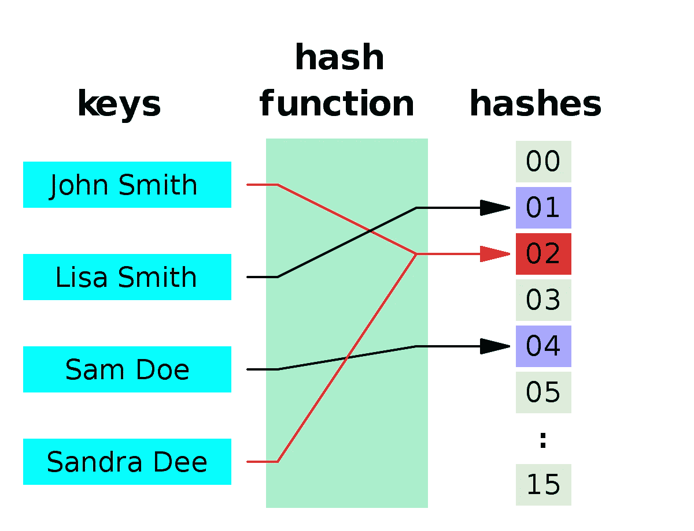
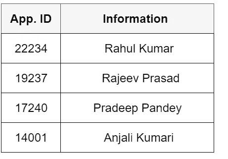
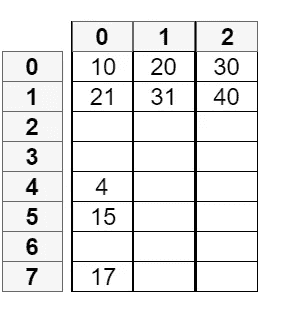
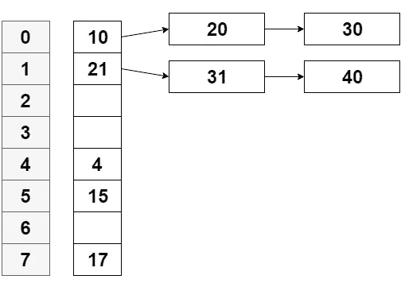

# 了解哈希！

> 原文：<https://medium.com/javarevisited/know-about-hashing-f093babc034a?source=collection_archive---------2----------------------->

读者们好，

我带着新文章回来了。今天我将讨论一个关于数据结构的有趣话题，这就是**散列，**散列是数据结构中一个非常重要的概念，它帮助你映射有意义的数据以便快速访问，或者你可以说是为了更好地安排表或记录中的数据。

表 1.1:显示一个简单的数据库

现在，让我们假设我们必须记录已经被特定学院录取的所有候选人**(如上表 1.1 所示)**的姓名，并以有组织的方式将他们的数据存储在一个表中以备将来之用，现在为了便于识别候选人，我们需要他们的唯一标识，该标识对于每个学生必须是不同的。 **应用 id (Key)** 对于每个候选人来说都是唯一的，无论任何两个候选人的姓名是否相同，它都是从表中获取特定学生姓名的最佳媒介，这使得用户可以轻松地从表中搜索、插入和删除候选人的特定条目。 从上面的例子中，我们可以看到，某个特定学生的每个名字都被映射到一个表中，这个表使用了一个唯一的键，这个键对于每个人来说可能是相同的，也可能不是相同的**(取决于散列函数)**，现在，每当用户想要获得关于某个特定学生的信息时，他/她可以使用这个键来获得它，而不必在整个表中逐一搜索。

现在，为了保持上述所需的学生记录，我们可以通过以下方法进行

1.  **通过创建一个链表**来存储候选节点的名字，对于在链表中搜索数据需要 O(n)的最坏情况时间复杂度，对于插入和删除操作需要 O(n)的最坏情况时间复杂度。
2.  **通过创建一个数组**来存储块中的候选名称，当数组中的数据被排序时，需要 O(nlogn)的最坏情况搜索时间，并且插入-删除操作变得昂贵，因为在插入或删除元素时所有元素都要被移动。
3.  **通过创建一个表**，该表存储与关键字值映射的候选人的姓名，以便在最坏情况时间复杂度为 O(1)的情况下进行搜索、插入和删除过程，其中应用 id 用作候选人姓名的唯一关键字值。这种结构的唯一问题是存储大量记录所需的空间。例如，如果应用程序 id 是 n 位数，我们需要 O(m * 10n)的空间来存储表，其中“m”是要记录的指针的大小。另一个问题是[编程语言中的整数变量](/hackernoon/10-best-programming-languages-to-learn-in-2019-e5b05af4a972)可能不会存储 n 位数字。

**什么是哈希..？**

哈希被定义为在哈希表中用唯一的小值(键)映射大数据值的技术，用于优化和快速的存储、删除和搜索操作。比如上图，直接知道候选人的键值，就可以在 O(1)时间内搜索到候选人的名字。

**与哈希相关的术语**

与哈希相关的各种术语有:-

1.  **哈希表:**哈希表是存储和映射具有大数据值的关键字的桶或槽的数组，用于优化和快速的存储、删除和搜索操作。哈希表基本上使用哈希函数将键值索引到表中。
2.  **散列函数:**散列函数被定义为在有限的范围内为各个密钥产生不同值的数学函数，这在实践中很难获得，从而限制了散列表的大小。有限的范围可能在如此定义的哈希表的总大小之下，它们等于哈希表的索引值。使用散列函数的优点是可以快速访问数据值，甚至可以在[散列表](https://javarevisited.blogspot.com/2012/01/java-hashtable-example-tutorial-code.html)中分配关键字。将所有键映射到每个不同槽索引的散列函数被称为**完美散列函数。**
3.  **Key:** 在 hashing key 中定义为存储数据值的地址的映射索引，它用于获取存储在 hash 函数形成的哈希表的特定索引处的数据值。

**构建哈希函数**

散列函数的形成取决于程序员，散列函数应该以这样一种方式来设计，即减少冲突，并且在散列表中均匀地分布关键字，同时对于给定的一组关键字具有高的加载因子。

以下是获取哈希函数的一些常用方法:

1.  **折叠:**折叠是一种散列函数的形成方法，它将键值均匀地分成几部分，并执行任何基本的算术运算，如加、减、乘或除，以获得一个数，其中这样获得的数的最后两位被取出并用于散列给定的数据值。
2.  **截断:**截断是一种形成散列函数的方法，其中根据提供的算法选择键值的任意随机索引，并使用随后的索引来散列给定的数据值。

**模运算:**模运算是一种用于形成散列函数的方法，其中由散列函数如此形成的索引利用模运算以及散列表的大小，使得 **H(X) = k mod l 其中 k 是整数值，l 是散列表的大小。**

**磕磕碰碰**

图 2.2:显示了散列过程中的冲突情况

现在，假设给定的信息**(如上图 2.2 所示)**必须存储在一个空间较小的有限内存表中，为此，我们将所有候选的应用程序 id 散列到一个较小的值，以便将数据值存储在较小的内存空间中。现在，假设我们对该操作使用哈希函数，该函数表示或定义为 **H(X) =候选人% 2** 的申请号，现在从上表中我们可以看到，申请号 22234 和 17240 从哈希函数中产生相同的索引值，在这种情况下，哈希函数为两个不同的数据值产生相同的索引值被称为**冲突**。这是每个程序员在构造散列函数时面临的最常见的问题。为了概括的目的，让 X1，X2，..Xn 是表中数据值的关键字，因此根据散列函数，我们得到 H(X1) = H(X2) =… H(Xn)其中 X1，X2..Xnis 被称为同义词。冲突也可以定义为哈希表中不同键值的两个数据值的位置冲突。上图恰当地说明了两个不同的数据值存储在同一索引时的冲突。

**哈希冲突的处理**

哈希中的冲突可以通过以下方法处理:-

图 3.3:显示了一个线性开放寻址的例子

1.  **线性开放寻址:**现在，让我们举一个例子，我们有一组整数，比如说 **S = {10，20，21，15，17，4，30，40，31}** 现在，如果我们希望这些数字存储在一个哈希表中，哈希函数定义为 **H(X) = X mod 10。**从上表中，我们可以看到给定哈希函数在哈希表中所占的位置，仔细查看该表，我们可以看到 40 被 10 完全整除，保留在桶 1 的槽 2 中。这是因为前面的三个整数也被 10 完全整除，因此没有剩余槽(这通常称为溢出情况)。 在将前面的整数存储到哈希表中之后，我们将继续遍历该表，直到并且除非我们找到与我们从哈希表中获得的结果索引接近的索引，即 2。 类似地，如果在一组整数中有更多的元素，那么如果特定桶中的槽已满，则根据散列函数映射元素并将其存储在下一个索引中，如果没有冲突，则根据如此定义的散列函数存储所有其他整数。因此，线性开放寻址是解决哈希冲突的最佳方式之一。在线性开放寻址哈希表中执行以下操作:
    **i.** **搜索:如果哈希表中有“m”个槽，并且“n”是要插入表中的键的数量，则** **Load factor = n / m < (1)，因此搜索时间为<1/(1-Load factor)并且大约= 1/(1-Load factor)。
    二。插入:**哈希表中的插入操作通过检查每一个最近的空槽或桶来进行，如果必须放置元素的桶被占用。**如果哈希表中有“m”个槽，并且“n”是要插入表中的键的数量，则** **Load factor = n / m < (1)，因此插入时间是<1/(1-Load factor)并且大约= 1/(1-Load factor)。
    三。删除:**哈希表中的删除过程是非常低效的，因为当从表中删除任何数据值时，然后当我们遍历表来搜索数据值时，如果表中有空槽，则搜索操作停止，空槽之后的数据值被忽略，我们无法得出正确的结论或结果。**如果哈希表中有“m”个槽，并且“n”是要插入表中的键的数量，则** **负载因子= n / m < (1)，因此删除时间是<1/(1-负载因子)并且大约= 1/(1-负载因子)。**

**采用开放式寻址的不同类型的冲突解决技术**

有不同的方法来解决冲突过程，即:

1.  **重散列或双重散列:**重散列顾名思义就是对哈希值反复散列，直到在哈希表中找到一个空槽。现在，线性寻址在存储数据值方面是低效的，并且数据以非常笨拙的方式被存储，并且在表中非常紧密地聚集，这降低了插入、删除和搜索操作的效率，因此为了解决这个问题，我们有了重新散列方法，其中先前的散列值被重新散列，并且在表中搜索索引，如果索引被其他数据值占用，则新的散列值再次被散列，等等，直到在表中有索引的空槽。
2.  **二次探测:**这是一种在二次散列函数的基础上进行索引的方法，二次散列函数与散列值成比例增加，如果哈希表中有“m”个槽，并且“n”是要插入表中的键的数量，则使用的散列函数是 **H(X) = (n + k2) % m。**在插入数据值的过程中，如果存储数据的槽被占用，则使用哈希函数检查下一个槽，依此类推。尽管重复散列，二次探查不一定减少哈希表中的聚类。
3.  **随机探测:**顾名思义，随机探测是一种散列方法，其中随机函数生成器用于生成整数值，并帮助探测找到哈希表中的空闲空间来存储数据值。然而，这个方法必须生成相同的整数序列。

**链接:**由于哈希表中数据值的存储是非动态的，并且需要初始化大小，这用作非常低效的存储空间，这导致溢出，并且许多槽被浪费，并且低效的搜索、插入和删除操作造成大量存储器浪费， 因此，为了保持数据值的有效存储空间，使用了一种称为**链接或开放式散列**的方法，其中数据值以单链表的形式存储，这在本质上是动态的，并且减少了由于散列表中未被占用的槽而造成的空间存储器的损失。 尽管它需要额外的空间来链接到其他节点，但下面是使用链接的散列的图示。上面解释的相同例子的技术。

图 4.4:示出了在散列过程中链接以解决冲突的情况

在线性开放寻址散列表中执行以下操作:

1.  **搜索:**在散列表上执行的搜索操作不依赖于散列表的大小，并且在最好的情况下时间复杂度为 O(1 ),因为所有的数据值不是存储在一个单独的桶中，而是分布在表中，搜索的最坏情况时间复杂度为 O(n ),其中“n”是链的大小，在这种情况下，当表中的所有数据值存储在一个桶中并且要搜索的数据值在链的最后一个节点。平均而言，搜索操作的时间复杂度优于线性开放寻址方法。
2.  **插入:**哈希表中的插入操作采用 O(n)的相同最坏情况时间复杂度，其中‘n’是当数据值将被存储在单个桶链的末端时发生的链的大小，并且 O(1)的最佳情况时间复杂度发生在当数据元素必须紧接在桶之后被索引时。
3.  **删除:**哈希表中的删除操作采用 O(n)的相同最坏情况时间复杂度，其中‘n’是当数据值将在单个桶链的末端被删除时发生的链的大小，并且当数据元素必须通过保持链的链接而在桶之后被删除时，出现 O(1)的最佳情况时间复杂度。

所以，这都是关于散列和它的概念，特别是在[面试](https://www.java67.com/2018/05/top-75-programming-interview-questions-answers.html)和在线测试中，这篇文章就足够了！

继续学习，继续成长，继续探索！

**万事如意！**

更多有趣和信息丰富的文章和提示，请关注我的 [**Medium**](https://swapnilkant11.medium.com/) **和**[**Linkedin**](https://www.linkedin.com/in/swapnil-kant-279a3b148/)

## 您可能喜欢的其他数据结构文章

</hackernoon/50-data-structure-and-algorithms-interview-questions-for-programmers-b4b1ac61f5b0>  </javarevisited/top-21-string-programming-interview-questions-for-beginners-and-experienced-developers-56037048de45> 