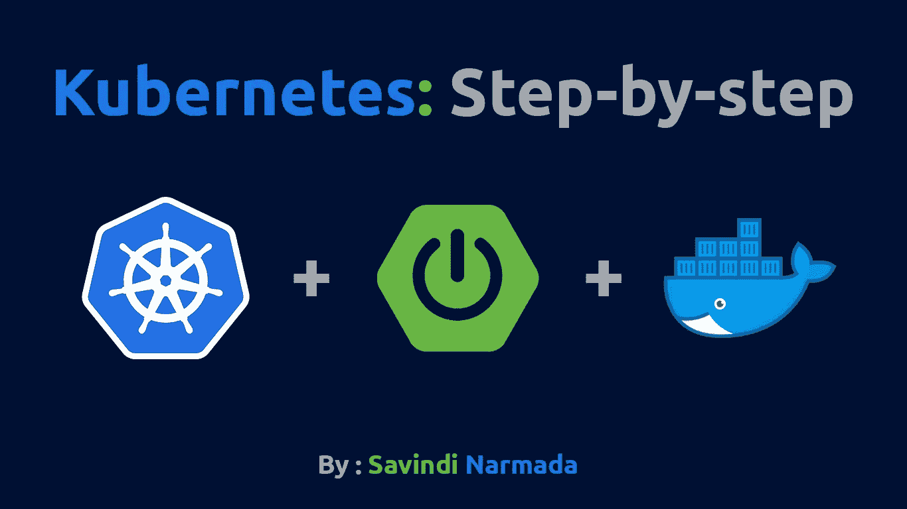
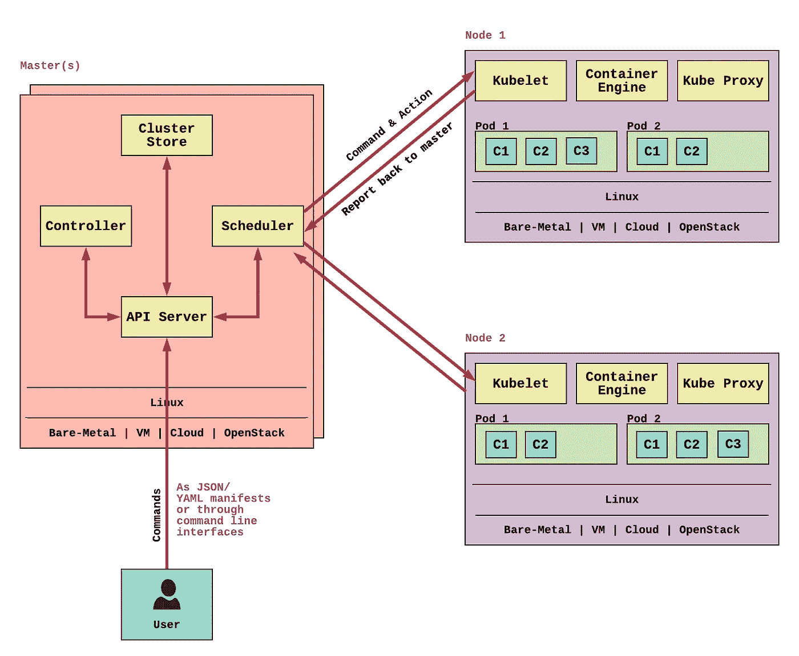
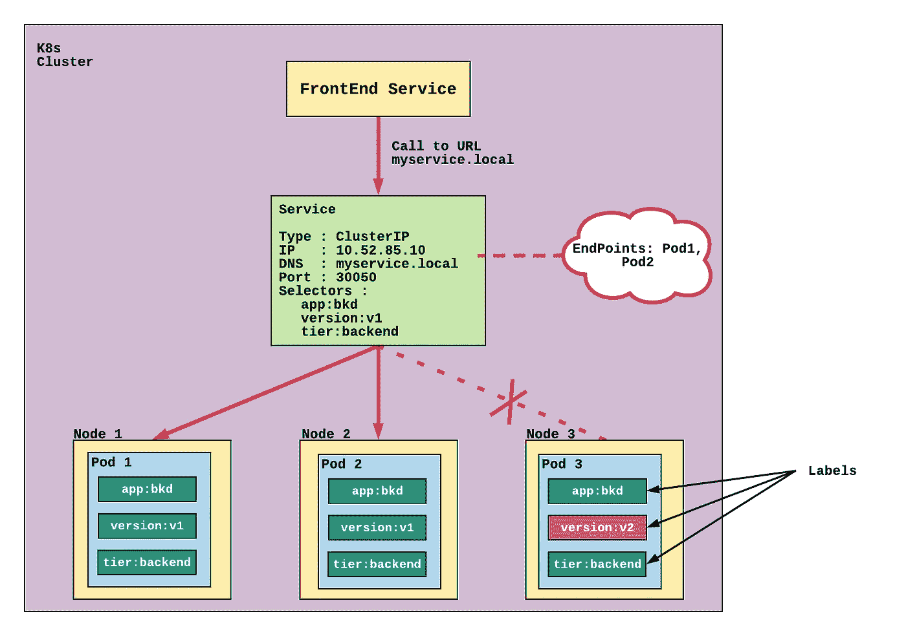
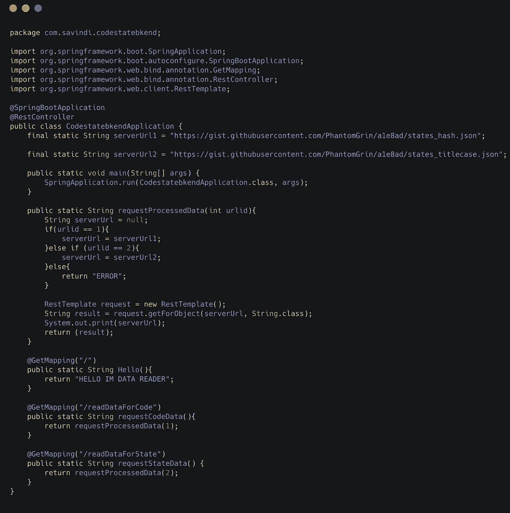
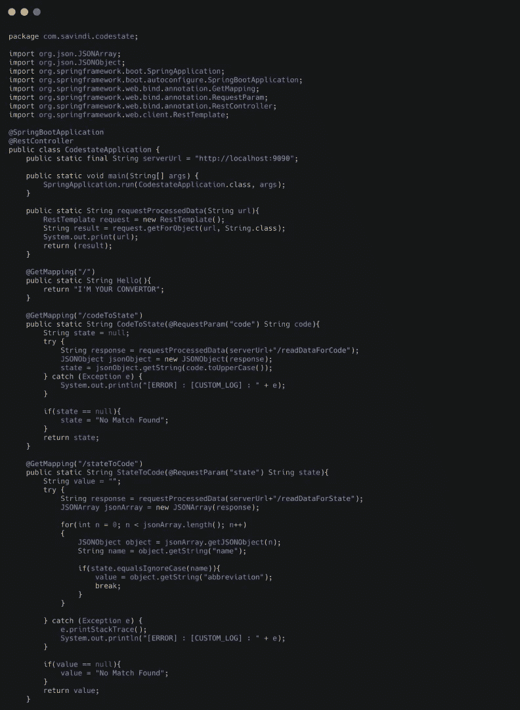
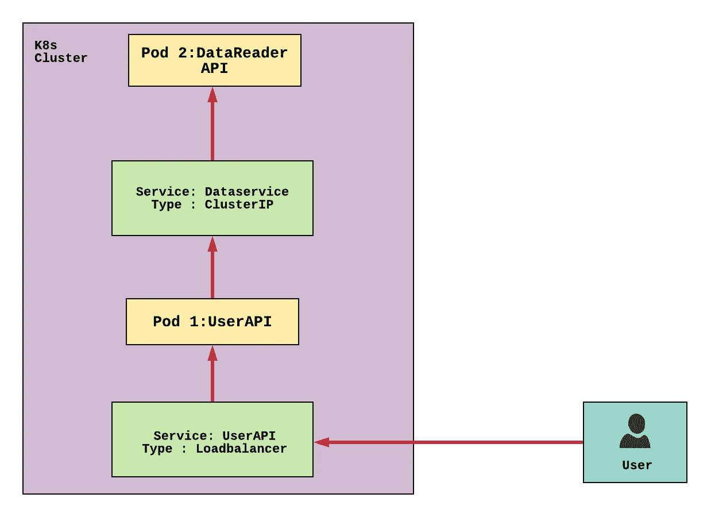

# KUBERNETES:一步一步的指南与 Spring Boot，多克和 GKE

> 原文：<https://medium.com/javarevisited/kubernetes-step-by-step-with-spring-boot-docker-gke-35e9481f6d5f?source=collection_archive---------0----------------------->

[](https://javarevisited.blogspot.com/2019/05/top-5-courses-to-learn-docker-and-kubernetes-for-devops.html)

又见面了。欢迎回来。🤗

今天我们要讲的是世界上另一个众所周知的技术； [Kubernetes](https://kubernetes.io/) 。我相信你已经听过很多次了。但是你真的知道那是什么吗？如果答案是一个大大的“不”，那就继续读这篇文章吧。今天的帖子会有点长，但你会看到自己从“零”到“英雄”的转变。💪

我先说一下今天的大纲:

1.  容器
2.  容器编排器及其角色
3.  什么是 Kubernetes
4.  为什么是 Kubernetes
5.  库伯内特斯的建筑
6.  库伯内特斯的主要成分
7.  亲自动手

# 容器

简单来说，容器是指没有自己的操作系统的虚拟机。我们可以在遥远的数据中心创建这些容器，并完成我们的工作。它的重要性在于，它确保我们的工作最大限度地利用资源，而不是为操作系统等浪费资源。

在通常的生产环境中，有成百上千个容器专用于各种[微服务](https://javarevisited.blogspot.com/2018/02/top-5-spring-microservices-courses-with-spring-boot-and-spring-cloud.html)。因此，管理它们不是一项简单的任务。他们需要更新、版本控制、健康检查、扩展和更多的功能。这就是需要一个 ***【容器编制器】*** 的地方。如果你想了解更多关于容器的知识，你也可以查看这些[最佳课程，为开发者学习 Docker 和 Kubernetes](https://dev.to/javinpaul/top-10-courses-to-learn-docker-and-kubernetes-for-programmers-4lg0) 。

[](https://javarevisited.blogspot.com/2019/05/top-5-courses-to-learn-docker-and-kubernetes-for-devops.html) [## 2020 年学习 Docker 和 Kubernetes 的 5 大课程-最佳课程

### 伙计们，你们好吗？你有望实现今年的目标吗？我相信你在…的时候已经有了目标

javarevisited.blogspot.com](https://javarevisited.blogspot.com/2019/05/top-5-courses-to-learn-docker-and-kubernetes-for-devops.html) 

# 容器编排器及其角色

想想一场足球比赛。如果教练不告诉球员他们的位置，他们会站在他们想站的地方。如果是那样的话，那个队会赢吗？我想不会。

> 所以教练做的是，他告诉球员他们需要站在哪里，他们需要做什么。

类似地， [Kubernetes](https://javarevisited.blogspot.com/2019/01/top-5-free-kubernetes-courses-for-DevOps-Engineer.html) ，或者任何其他容器编排器，告诉容器它们应该呆在哪里以及它们应该如何表现。简而言之，容器编排者就像教练，而玩家就像容器或微服务。

# 什么是 Kubernetes

Kubernetes 诞生于 Google，是他们管理容器的内部技术之一。它是用 Go 语言写的。

2015 年，Kubernetes 首次向公众发布。后来，谷歌把它交给了 CNCF (Linux 基金会)来管理。

所以目前 Kubernetes 是 Apache 2.0 许可下的一个开源项目。有时在业内， [Kubernete](http://www.java67.com/2019/03/5-free-devops-courses-to-learn-jenkins.html) s 也被称为“K8s”。广泛用来形容 Kubernetes 的术语是 ***【容器管弦乐】*** 。

如果你想学习 Kubernetes 和 Docker，那么 [**Docker 和 Kubernetes:完全指南**](https://click.linksynergy.com/deeplink?id=JVFxdTr9V80&mid=39197&murl=https%3A%2F%2Fwww.udemy.com%2Fdocker-and-kubernetes-the-complete-guide%2F) 是最好的开始。

[](https://click.linksynergy.com/deeplink?id=JVFxdTr9V80&mid=39197&murl=https%3A%2F%2Fwww.udemy.com%2Fdocker-and-kubernetes-the-complete-guide%2F) [## Docker 和 Kubernetes:完全指南

### 如果你厌倦了学习如何部署 web 应用程序，那么这就是适合你的课程。CI+CD…

click.linksynergy.com](https://click.linksynergy.com/deeplink?id=JVFxdTr9V80&mid=39197&murl=https%3A%2F%2Fwww.udemy.com%2Fdocker-and-kubernetes-the-complete-guide%2F) 

# 为什么 Kubernetes 胜过其他管弦乐队

*   **与平台无关**:即 Kubernetes 可用于裸机、虚拟机、云、开放堆栈等。
*   不仅仅是基于容器的编排。您也可以将它与普通聚类一起使用。
*   不与 [Docker](https://hackernoon.com/10-free-courses-to-learn-docker-for-programmers-and-devops-engineers-7ff2781fd6e0) 等任何其他特定公司或平台捆绑。许多公司支持基于 Kubernetes 的集群，包括 Google、 [Amazon Web Services](https://hackernoon.com/top-5-amazon-web-services-or-aws-courses-to-learn-online-free-and-best-of-lot-d94e192054b7) 等。
*   让目标部署

# 库伯内特斯的建筑

[](https://click.linksynergy.com/deeplink?id=JVFxdTr9V80&mid=39197&murl=https%3A%2F%2Fwww.udemy.com%2Fdocker-and-kubernetes-the-complete-guide%2F)

库伯内特建筑在一个图像中

**如你所见，Kubernetes 也遵循主-从架构(也称为主-从)。让我们以一种非常高级的方式逐一讨论这些组件。**

## **主人**

主设备是集群的控制元素。有人称之为集群的“大脑”。它是唯一对集群用户开放的端点。出于容错的目的，一个集群可以有多个主设备。

母版有 4 个部分:

1.  API 服务器:

这是和用户沟通的前端。它是一个基于 REST 的 API ,用于消费 JSON 输入。默认情况下，它运行在端口 443。

2.调度程序:

调度程序监视 API 服务器的新 Pod 请求。它与节点通信以创建新的 pod，并在分配资源或施加约束时向节点分配工作。

3.群集存储:

群集存储是保存群集状态和配置详细信息的持久性存储。它使用 ETCD(开源分布式键值存储)来存储这些数据。

4.控制器:

包括节点控制器、端点控制器、名字空间控制器等。

## 节点(从属/下属)

节点是工人。他们执行分配给集群的所有“工作”。在一个节点内，除了 ***【吊舱】*** (稍后我会谈到吊舱)，还有 3 个主要组件。这三个部分是:

1.  库伯莱

Kublets 在节点内部做了很多工作。它们向集群注册节点，监视来自调度程序的工作分配，实例化新的 pod，向主节点报告，等等。

2.集装箱发动机

容器引擎是管理容器的负责人。它完成所有的图像提取、容器停止、启动等操作。使用最广泛的容器引擎是 [Docker](https://javarevisited.blogspot.com/2018/02/10-free-docker-container-courses-for-Java-Developers.html) 。但是，您也可以使用 Rocket 来实现这一点。

3.Kube 代理

Kube 代理负责为每个 pod 分配 IP 地址。每次 pod 创建时，都会为该 pod 分配一个新的 IP 地址。Kube 代理也做负载平衡工作。

除了上面提到的组件，节点有自己的默认组件，如日志、健康检查、DNS 等。每个节点通过(通常)localhost:10255 公开 3 个只读端点。这些端点是，

*   /规格
*   /健康 z
*   /豆荚

# 库伯内特斯的主要成分

在开始使用 Kubernetes 之前，任何人都应该知道 Kubernetes 集群架构的几个主要组件。第一个是豆荚:

## 分离舱

> pod 是 Kubernetes 中部署或调度的原子单位。

Pod 是一个环形环境，有自己的网络堆栈和内核名称空间。里面有容器。没有容器就没有 pod。但是，根据我们部署的应用程序，可能有单容器容器或多容器容器。

例如，如果您有一个带有 API 和日志的紧密耦合的应用程序，您可以使用一个 API 容器和另一个日志容器。但是您可以在同一个 Pod 中部署它们。然而，行业最佳实践是采用单容器架构。

关于 Pod 另一个需要注意的小事情是，他们是 ***“凡人”。*** 糊涂了？让我解释一下。pod 的生命周期有 3 个阶段:

挂起→运行→成功/失败

这类似于出生→活着→死去。不会有**复活**；不再生。如果一个 Pod 没有完成他的任务就死了，一个新的 Pod 将被创建来代替死的 Pod。最重要的是，这个新 pod 的 IP 和所有其他因素都将与死 pod 不同。

## 部署控制器

为了管理 pod，Kubernetes 中提供了许多[控制器。这种用于部署和声明性更新的控制器被称为部署控制器。](https://kubernetes.io/docs/concepts/workloads/controllers)

在部署对象中(最常用的格式是 YAML 文件。但在本教程中，我使用命令行)我们可以描述我们的“期望状态”，如需要部署什么样的映像、要公开什么样的端口、要有多少副本、需要添加什么样的标签等。部署控制器所做的是定期检查这个期望的状态，并在集群中进行更改，以确保达到期望的状态。

## 服务

我将在本教程中使用的另一个组件是“服务”。在讲述什么是服务之前，我将描述一下我们为什么需要服务。

正如我前面提到的，豆荚是会死的。当一个豆荚死亡时，一个新的豆荚就会诞生来取代它。它和死去的那个没有相同的 IP 地址。

因此，设想一个场景，我们有一个同时具有前端服务和后端服务的系统。从前端调用后端，我们需要一个 IP 或者 URL。假设我们在前端代码中使用了后端服务的 pod IP。我们面临三个问题:

1.  我们需要首先部署我们的后端并获取它的 IP。然后我们需要在制作 docker 映像之前将其包含在前端代码中。该命令**必须**遵守。
2.  如果我们想扩展我们的后端，该怎么办？我们需要用新的 pod IPs 再次更新前端。
3.  如果后端 pod 失效，将会创建一个新的 pod。然后我们需要用新的 pod IP 更改前端代码，并再次制作 docker 映像。我们还必须在前端交换图像。如果后端有几个 pod，这将变得更加困难。

工作太多，工作复杂。这就是我们需要“服务”的原因。

[](https://click.linksynergy.com/deeplink?id=JVFxdTr9V80&mid=39197&murl=https%3A%2F%2Fwww.udemy.com%2Fcourse%2Flearn-kubernetes%2F)

Kubernetes 服务如何工作

服务有自己的 IP 地址和稳定的 DNS。所以前端成功地从后端服务中分离出来。因此，服务是多个 pod 的高级稳定抽象点。

对于 pod 的发现，服务使用一种叫做“标签”的东西。pod 通过标签属于服务。在服务初始化阶段，我们通过“选择器”标志描述服务应该寻找什么标签。如果服务找到一个带有选择器部分中提到的所有标签的 pod，服务将附加其端点列表并将 Pod 添加到列表中。(除上述标签外，还可以有额外的标签。但是不应该错过任何提到的标签。)

当服务收到请求时，它使用 Round-Robbin、Random 等方法。选择“请求转发”窗格。

服务对象的使用为我们提供了许多优势，比如只将请求转发给健康的 pod、负载平衡、版本回滚等。但是服务最重要的优势是系统组件的成功解耦。

Kubernetes 中有 5 种服务可供我们根据自己的目的进行选择:(来源:Kubernetes.io，2019)

1.  **ClusterIP** :公开集群内部 IP 上的服务。选择该值将使服务只能从集群内部访问。这是默认的`ServiceType`。
2.  [**节点端口**](https://kubernetes.io/docs/concepts/services-networking/service/#nodeport) :在一个静态端口(节点端口)公开每个节点 IP 上的服务。自动创建节点端口服务将路由到的 ClusterIP 服务。您将能够通过请求`<NodeIP>:<NodePort>`从集群外部联系节点端口服务。
3.  [**负载平衡器**](https://kubernetes.io/docs/concepts/services-networking/service/#loadbalancer) :使用云提供商的负载平衡器对外公开服务。会自动创建外部负载平衡器将路由到的节点端口和集群 IP 服务。
4.  [**ExternalName**](https://kubernetes.io/docs/concepts/services-networking/service/#externalname) :将服务映射到`**externalName**`字段的内容(例如 foo.bar.example.com)，返回一个`**CNAME**`记录及其值。没有设置任何类型的代理。这需要 1.7 或更高版本的`**kube-dns**`

好吧！理论说够了。让我们把手弄脏吧😉。如果你想了解更多，请查看面向绝对初学者的 Kubernetes 动手课程，这绝对是一种享受。

[](https://click.linksynergy.com/deeplink?id=JVFxdTr9V80&mid=39197&murl=https%3A%2F%2Fwww.udemy.com%2Fcourse%2Flearn-kubernetes%2F) [## Kubernetes 的绝对初学者-动手

### “这是迄今为止 Udemy 上最好的 Kubernetes 课程”-学生证明学习 Kubernetes 对任何…

click.linksynergy.com](https://click.linksynergy.com/deeplink?id=JVFxdTr9V80&mid=39197&murl=https%3A%2F%2Fwww.udemy.com%2Fcourse%2Flearn-kubernetes%2F) 

# 实践 Springboot 和 Google Kubernetes 引擎

我们的小系统可以将美国州代码转换为州名，反之亦然。我需要制作这个教程来谈谈**和*吊舱之间的通信。因此我将使系统有两个 API 而不是一个，即使我们只用一个服务就能做到。***

好吧！我们将制作 2 个 APIs“ ***用户 API*** ”和“***Datareader API***”。

[](https://dev.to/javinpaul/top-10-courses-to-learn-spring-boot-and-microservices-for-java-programmers-3hjg)

导师项目的微服务架构

由用户授权访问的用户 API 有两个端点。

*   [GET]请求→ /codeToState(带参数“代码”)
*   [GET] request → /stateToCode(带参数“state”)

由 UserAPI 访问的 Datareader API 也有两个端点。

*   [GET]请求→ /readDataForCode
*   [GET]请求→ /readDataForState

让我们从使用 Spring boot 在本地开发这个开始。

## 1.开发 Spring Boot API

我将使用 IntelliJ Idea Ultimate 来创建我的 Spring Boot 项目。

在 IntelliJ 中，转到“新建项目”并从侧窗格中选择 Spring Initializer。将服务 URL 保留为默认值，并选择您的 JDK 版本，然后单击 next。在下一个窗口中，也记得选择合适的 [Java 版本](http://www.java67.com/2018/12/how-to-set-specific-java-version-for-Maven.html)。其余的你可以根据自己的喜好修改，再次点击下一步。

在下一个窗口中，从侧窗格中选择 web，并选中 Web 和 Rest 存储库依赖项前面的复选框。再次单击下一步。在最终窗口中选择项目位置，然后单击完成。

首先，我们将使用刚刚创建的项目制作 Datareader API。在主类中，编写以下代码。



Datareader API 的代码(在 [my GitHub repo](https://github.com/PhantomGrin/code2statebkend) 中找到代码)

因为我希望在 Spring boot 默认端口(8080)中运行用户 API，所以我将使用 resource 文件夹中的“***application . properties***”文件将这个端口更改为 9090。在 application.properties 中，写入`server.port=9090`。

然后执行 Maven Goal(在 Maven 侧边栏)→全新安装。

现在运行项目，并使用软件如 [Postman](https://www.udemy.com/postman-crash-course-for-beginners-learn-rest-api-testing/?ranMID=39197&ranEAID=JVFxdTr9V80&ranSiteID=JVFxdTr9V80-yrke8E7QSrnBAypGRS7BPQ&LSNPUBID=JVFxdTr9V80) 或使用浏览器检查端点。如果你成功了，你将从调用两个端点得到两个不同的 JSON。

让我们在用户触发用户 API 的端点时，使用用户 API 调用 DataReader API。下面是它的代码:



用户 API 代码(在 [my GitHub repo](https://github.com/PhantomGrin/codestate.git) 中找到代码)

同时运行这两个服务，并检查所有端点是否都在工作。

> 注意:这里用户 API 的 serverUrl 变量是 localhost

如果一切正常，你就可以进入下一步了。

## 2.将 Spring Boot API 转换为 Docker 图像

我将首先对我的 Datareader API 进行 dockerize。

转到项目的根目录(在我的例子中是“codestatebkend”)并在终端中打开它。接下来，使用`touch Dockerfile`创建一个 Dockerfile 文件。使用文本编辑器或`nano`打开 docker 文件，并输入以下内容:

```
# Start with a base image containing Java runtime (mine java 8)
FROM openjdk:8u212-jdk-slim# Add Maintainer Info
LABEL maintainer="[savindi.narmada@gmail.com](mailto:savindi.narmada@gmail.com)"# Add a volume pointing to /tmp
VOLUME /tmp# Make port 8080 available to the world outside this container
EXPOSE 8080# The application's jar file (when packaged)
ARG JAR_FILE=target/codestatebkend-0.0.1-SNAPSHOT.jar# Add the application's jar to the container
ADD ${JAR_FILE} codestatebkend.jar# Run the jar file 
ENTRYPOINT ["java","-Djava.security.egd=file:/dev/./urandom","-jar","/codestatebkend.jar"]
```

我们已经完成了 Docker 文件，现在我们可以继续制作 [Docker 图像](http://www.java67.com/2018/02/5-free-docker-courses-for-java-and-DevOps-engineers.html)。为了避免在我的本地机器上安装任何东西，也为了方便起见，我将从 Dockerizing 到 Kubernetes 部署使用 Google shell。

让你的项目进入 Google shell 最简单的方法是通过一个 [Git 库](https://dev.to/javinpaul/5-free-courses-to-learn-git-and-github-in-depth-jpp)。在 Git Repo 中提交代码后，进入 Google cloud account，点击右上角的 shell 按钮。然后使用`git clone`在项目 shell 中克隆 Git repo。

转到克隆项目的根目录，键入`./mvnw clean package`来创建 jar 文件。现在都准备好了。首先，使用以下命令设置`PROJECT-ID`变量:

```
export PROJECT_ID=”$(gcloud config get-value project -q)”
```

现在，让我们用下面的代码在终端中构建 Docker 映像。(不要忘记结尾的点)

```
docker build -t gcr.io/${PROJECT_ID}/codestatebkend .
```

让我们看看我们是否成功:

```
docker images
```

如果你在列表中看到你的图像，你就成功了！


现在让我们运行这个 docker 映像来检查是否一切正常。

```
docker run --rm -p 8080:8080 gcr.io/${PROJECT_ID}/codestatebkend:latest
```

点击 Shell 窗口右上角的“Web 预览”按钮。您将看到消息“您好，我是 DataReader”

类似地，为用户 API 创建 Docker 映像。在此之前，不要忘记将代码中的目标 URL(我的代码中名为`serverUrl`的变量)从 localhost 改为下面的:

```
http://dataservice.default.svc.cluster.local
```

使用上面使用的 URL，必须**将我们的 ClusterIP 服务命名为“dataservice”。**

## 3.在 Google 图像库中部署 Docker 图像

```
docker push gcr.io/${PROJECT_ID}/codestatebkend:latest
```

## 4.形成一个集群

在创建群集之前，我将向您描述我将在部署中使用的体系结构:

[](https://medium.com/javarevisited/top-10-free-courses-to-learn-maven-jenkins-and-docker-for-java-developers-51fa7a1e66f6)

正在部署的系统的架构

这里根据用例，我为我们的系统选择了 Loadbalancer 服务和 ClusterIP 服务。

让我们首先创建一个包含 3 个节点的集群。

```
gcloud container clusters create k8s-medium --num-nodes=3 --zone=us-central1-b
```

## 5.部署 Datareader API

```
kubectl run dataserver --image=gcr.io/${PROJECT_ID}/codestatebkend:latest --port 8080 --labels="app=codestatebkend,tier=backend"
```

让我们检查一个 pod 是否是用我们的部署对象创建的

```
kubectl get pods
kubectl get deployment
```


带有 Datareader API 映像和新创建的部署对象的新创建的 pod

## 6.服务发现

使用`expose`命令向外界公开您的用户 API:

```
kubectl expose deployment userapi --type=LoadBalancer --port 80 --target-port 8080
```

使用`kubectl get service`获取 Kubernetes 服务列表。


新创建的服务对象

使用这里提到的外部 IP 通过网络浏览器访问服务。你可以看到信息“我是你的转换器”正在显示。

现在让我们将用户 API 与后端 Datareader API 连接起来。为此，我将使用 ClusterIP 服务。

```
kubectl expose deployment dataservice --type=ClusterIP --port 80 --target-port 8080 --selector="app=codestatebkend,tier=backend"
```


这两项服务都已启动并运行！

为了检查一切是否正常工作，使用 postman 或浏览器调用用户 API 的端点

例:*http://104.154.103.27/stateToCode?state=alabama*


成功！我们的系统按预期运行

瞧啊。您有一个两层系统，完全运行在 Google Cloud 的 Kubernetes 集群上！

## 6.自动缩放功能

给你额外的东西😋

上面的系统我为每个 API 都做了一个运行 pod。但是在实际场景中，您需要不止一个 Pod 来管理负载。让我告诉你如何扩展你的应用:

```
kubectl scale deployment userapi --replicas=2
```

用`kubectl get pods`来检查一下是否成功。


具有 2 个用户应用编程接口单元的集群

## 7.打扫

```
gcloud container clusters delete [CLUSTER NAME]--zone=us-central1-b
```

是啊！事情就是这么简单🤗

希望你喜欢和我一起编码。请在下面留下你对本教程的评论。如果你面临任何问题，留下你的评论，我会帮助你。批评也是受欢迎的😉

下一篇文章再见！

编码快乐！❤

> 更多知识:
> [https://kubernetes.io/docs/concepts/](https://kubernetes.io/docs/concepts/)
> [5 门免费课程学习 Kubernetes](https://javarevisited.blogspot.com/2019/01/top-5-free-kubernetes-courses-for-DevOps-Engineer.html)
> [Docker 和 Kubernetes:完整指南](https://www.udemy.com/docker-and-kubernetes-the-complete-guide/?ranMID=39197&ranEAID=JVFxdTr9V80&ranSiteID=JVFxdTr9V80-ldJ9hcxgvGr.BFe0RYD7ZQ&LSNPUBID=JVFxdTr9V80)
> [学习 DevOps:完整的 Kubernetes 课程](https://www.udemy.com/learn-devops-the-complete-kubernetes-course/?ranMID=39197&ranEAID=JVFxdTr9V80&ranSiteID=JVFxdTr9V80-h_6jHKhNbh1wFRTLXcjPCw&LSNPUBID=JVFxdTr9V80)
> [完整的 DevOps 路线图](https://hackernoon.com/the-2018-devops-roadmap-31588d8670cb)
> [10 门免费课程学习 Maven、Jenkins 和 Docker](/javarevisited/top-10-free-courses-to-learn-maven-jenkins-and-docker-for-java-developers-51fa7a1e66f6)

如果你不是媒体成员，我强烈推荐你加入媒体，阅读不同领域伟大作家的精彩故事。你可以在这里**加入中等**[](/@somasharma_81597/membership)