# 从头开始学习 OSGi——eclipse、IntelliJ 和 WSO2 平台🖥️

> 原文：<https://medium.com/javarevisited/learn-osgi-from-scratch-eclipse-intellij-and-wso2-platform-%EF%B8%8F-bf4c5629e097?source=collection_archive---------0----------------------->

考虑下面这个问题。在任何大型工程项目中，例如，设计一座新桥或喷气式客机，最难克服的挑战是什么？

答案是💥*复杂。*

兰博基尼 Aventador 有大约 100 万个零件，它是一台非常非常复杂的机器，因为这种复杂性，没有一个人能够完全理解它是如何工作的。尽管它已经建成，而且它的复杂性每年都在成倍增加。那么工程师如何才能造出这样的机器呢？

答案是将机器分成更小、更容易理解的模块。

模块化带来了几个重要的好处。

*   **分工**——可以分配单独的个人或小组在单独的模块上工作。从事一个模块工作的人将会对他们自己的模块有一个彻底的了解。
*   [**抽象**](https://javarevisited.blogspot.com/2010/10/abstraction-in-java.html#axzz6oOeSmpNw)——把 Aventador 当做一个抽象模型。我们可以得到这样的想法，它会移动，而不必掌握燃料如何供应或发动机如何工作的想法。
*   **重复使用** —考虑到设计 Aventador 更小的组件所花费的时间，当我们需要在另一辆车上使用类似的组件时，从头开始设计是一种浪费。因此，如果我们可以重用组件，只需做最小的改动，那将会很有帮助。
*   **易于维护和修理**——每当车胎漏气时就要重新组装整辆车简直是疯了。模块化设计允许在不影响机器其余部分的情况下，移除故障模块并进行维修或更换。

Java 编程语言是构建大型企业应用程序以及小型但广泛部署的移动应用程序最流行的语言之一。然而， **Java 本身并不能以任何有用的方式支持模块化。但是 Java 的灵活性和可伸缩性允许在其上构建一个强大的模块系统。**

那个模块系统被称为 **OSGi** (之前是**开放服务网关倡议**的首字母缩写)，读作(Oh-ess-gee-eye)。

# 🚀什么是模块？

那么，什么是*软件模块呢？*软件模块具有以下属性。

*   **自包含** —一个模块整体是逻辑的。它可以作为一个单元移动、安装和卸载。它由较小的部分组成，这些部分是模块的组成部分。如果其中一个被移除，模块可能会停止工作。
*   高度内聚 —内聚是一个模块职责紧密相关程度的度量。一个模块不应该做很多不相关的事情，而应该坚持一个逻辑目的并完成它。(例如，网络模块不应检查持久性、数据库验证、输入验证。它应该只坚持网络部分。)
*   **松耦合** —一个模块不应该关心它与之交互的其他模块的内部实现。松散耦合允许我们更改一个模块的实现，而不需要更新使用它的所有其他模块。

为了支持所有这三个属性，模块必须有一个*明确定义的接口*来与其他模块交互。稳定的接口加强了模块之间的逻辑界限，并防止对内部实现细节的访问。

# 🚀罐子的问题

Java 中的标准部署单元是 JAR 文件。jar 是基于 ZIP 文件格式的归档文件，允许将许多文件聚集成一个文件。

通常，存档中包含的文件是编译后的 Java 类和图像等资源文件的组合。此外，在 [JAR 归档文件](https://javarevisited.blogspot.com/2012/03/how-to-create-and-execute-jar-file-in.html)中有一个元数据的标准位置——**META-INF**文件夹，其中可以包含许多不同格式的文件，而 **MANIFEST。MF** 文件是最重要的文件。

JAR 文件提供单个库或应用程序的一部分功能。因此，构建 Java 应用程序需要组合许多 JAR 文件。

然而，Java 开发工具包( [JDK](https://javarevisited.blogspot.com/2011/12/jre-jvm-jdk-jit-in-java-programming.html) )只提供了非常基本的管理和编写 jar 的工具。事实上，这些工具太简单了，以至于开发人员用“JAR Hell”这个术语来描述管理 JAR 的问题。

JAR 文件作为部署单元的最关键问题如下:

*   没有**对应 JAR 的运行时**概念；它们只在**构建时**和**部署时有意义。**一旦 [JVM](/javarevisited/7-best-courses-to-learn-jvm-garbage-collection-and-performance-tuning-for-experienced-java-331705180686?source=---------8------------------) 运行，所有 jar 的内容都被简单地作为一个单一的全局列表: **Classpath。**
*   他们没有标准的元数据来表示依赖关系。
*   它们没有版本控制，因此不能同时加载多个 jar。
*   jar 之间没有信息隐藏的机制。

## 类加载和全局类路径

术语 [**类路径**](http://www.java67.com/2012/08/what-is-path-and-classpath-in-java-difference.html) 来自命令行参数，当从命令 shell 运行简单的 Java 应用程序时，可以将该参数传递给`java`命令。它指定了一个包含编译后的 Java 类文件的 JAR 文件和目录的**列表。**

例如，下面的命令启动一个 Java 应用程序，在类路径上有`log4j.jar`和`classes`目录。UNIX/macOS X 命令是:

`java -classpath log4j.jar:classes org.example.HelloWorld`

最后一个参数是要执行的**主**类的名称，按照我们的假设，它被编译到`classes`目录中的`org/example/HelloWorld.class`。

JVM 的职责是加载该类文件中的**字节**并将它们转换成一个`Class`对象，然后它可以执行`[static main](http://javarevisited.blogspot.sg/2011/12/main-public-static-java-void-method-why.html#axzz4uMEUqg5v)`方法。让我们看看这在标准 JRE 中是如何工作的。

Java 中加载类的类是`[java.lang.ClassLoader](https://javarevisited.blogspot.com/2021/05/java-classloader-interview.html)`，它有两个职责。

*   根据逻辑类名查找类，即磁盘上的物理字节。
*   将这些物理字节转换成内存中的一个`Class`对象。

当我们运行命令`java -classpath log4j.jar:classes org.example.HelloWorld`时，JRE 确定它需要加载类`org.example.HelloWorld`，因为它是`main`类，它使用一个名为*应用程序类加载器的特殊`ClassLoader`。*应用程序类加载器做的第一件事是请求它的父类加载类。

这个过程是 Java 类加载中的一个关键特性，称为**父类优先委托。为了简单地说明整个过程，我们将使用下面给出的流程图。**

[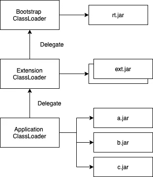](https://javarevisited.blogspot.com/2012/12/how-classloader-works-in-java.html#axzz6uFgb20Y4)

图 JRE 类加载

图中有三个类加载器，bootstrap 类加载器在树的顶部，它负责**加载基础 JRE 库中的所有类** ( `java`、`javafx`等。)

接下来，扩展类加载器从**扩展库加载，这些库不是基础 JRE 的一部分，而是由管理员安装到 JRE 的** `**libext**` **目录中。**最后是应用程序类加载器，加载 [**类路径**](https://javarevisited.blogspot.com/2011/01/how-classpath-work-in-java.html#axzz6uq12fuKh) 。

1.  JRE 要求应用程序类加载器加载一个类
2.  应用程序类加载器要求扩展类加载器加载类。
3.  扩展类装入器要求引导类装入器装入类。
4.  引导类装入器找不到类，所以扩展类装入器试图找到它。
5.  扩展类加载器找不到类，应用程序类加载器试图找到它，首先在`log4j.jar`中查找
6.  该类不在`log4j.jar`中，因此类加载器在`classes`目录中查找。
7.  如果找到并加载了该类，它将从第 1 步开始再次加载其他类。否则，它将给出常见的`ClassNotFoundException.`

## 冲突类

Java 中的[加载类在大多数时候都能顺利运行，但是如果我们添加一个包含旧版本`HelloWorld`的过时 JAR，会发生什么呢？让我们称这个 JAR 文件为`obsolete.jar`](https://javarevisited.blogspot.com/2012/07/when-class-loading-initialization-java-example.html#axzz6ucXRVFjY)

`java -classpath obsolete.jar:log4j.jar:classes org.example.HelloWorld`

由于在类路径中，`obsolete.jar`出现在`classes`之前，并且由于*应用程序类加载器*在找到匹配项时会尽快停止，因此该命令将始终具有与使用旧版本的`HelloWorld`相同的影响，并且`classes`目录将**永远不会**被使用。

## 缺乏明确的依赖关系

虽然有一些**独立的** JAR 文件不依赖于其他 JAR 文件，但是大多数 JAR 文件依赖于其他 JAR 文件。如果没有正确的文档来说明如何使用这些 JAR 文件，那么这些功能将是有害的。

## **缺少版本信息**

世界不会静止不动，图书馆也不会。他们一直在更新和获得新的版本。因此，指出依赖项或库是不够的。我们需要知道我们需要的确切的*版本*。大多数时候，文档帮助我们不陷入那些版本陷阱。但有时我们会遇到类似下面这个例子的问题:

假设有三个 JAR 文件，A.jar、B.jar 和 C.jar。A.jar 需要 1.1 版本的 C.jar，B.jar 需要 1.2 版本的 c . JAR。我们的应用程序需要 a . JAR 和 B.jar。

在这种情况下，由于类路径只选择了 C.jar 的一个版本，我们会遇到与 A.jar 或 B.jar 的依赖问题。因此，很明显，如果不重写与 A.jar 或 B.jar 相关的源代码，传统的 Java 无法解决这些问题。

## 缺乏跨罐的信息隐藏

所有面向对象编程语言都提供了不同的隐藏信息的方式。在 Java 中，*封装*依赖于我们使用的*访问修饰符*。

*   `[public](https://javarevisited.blogspot.com/2012/10/difference-between-private-protected-public-package-access-java.html#axzz6j8KhisSX)` <https://javarevisited.blogspot.com/2012/10/difference-between-private-protected-public-package-access-java.html#axzz6j8KhisSX>—每个人都可以看到成员。
*   `[protected](http://www.java67.com/2012/12/what-is-public-private-protected-package-default-private-access-modifier-java.html)` <http://www.java67.com/2012/12/what-is-public-private-protected-package-default-private-access-modifier-java.html>—成员对同一包中的子类和其他类可见。
*   `private` —成员仅在同一类中可见
*   `default` —未声明上述三个访问级别的成员。它们只对同一个包内的其他类可见，对包外的类不可见。

因此，JAR 之外的客户机可以访问所有这些声明为公共的类。因此，整个 JAR 基本上是公共 API，甚至是我们希望隐藏的部分。

**所以，jar 不是模块。尽管它们可以被移动，但是它们具有紧密耦合的低内聚力的 ZIP 存档。**

但这并不是说我们不使用 jar 就不能构建模块化系统。模块化系统的实现需要 jar，但它们不是模块。

# 🚀J2EE 级装载

Java 2 企业版(J2EE)规范为**分布式多层计算定义了一个平台。**J2EE 架构的关键特性是*应用服务器*，它托管多个应用组件并为它们提供企业级服务。

这些需求暗示了图-1 中简单的类加载图是不够的。因为有了**单一的平面类路径，来自一个应用程序的类很容易干扰其他应用程序。**因此，J2EE 使用了更高级的类加载层次结构，这基本上是一个树，每个部署的应用都有一个分支。

J2EE 应用程序被部署为**企业归档(EAR)** 文件，这些文件是包含元数据文件— `application.xml`以及一个或多个以下文件的 ZIP 文件:

*   普通 Java 库 JAR 文件
*   包含(企业 Java bean)EJB 应用程序的 JAR 文件(EJB-JARs)
*   Web ARchive (WAR)文件，包含实现 Web 功能的类，如 servlets 和 JSP。

但是这种架构也有问题，上层类加载器(而不是分支中的加载器)之间的类共享会导致版本冲突。

[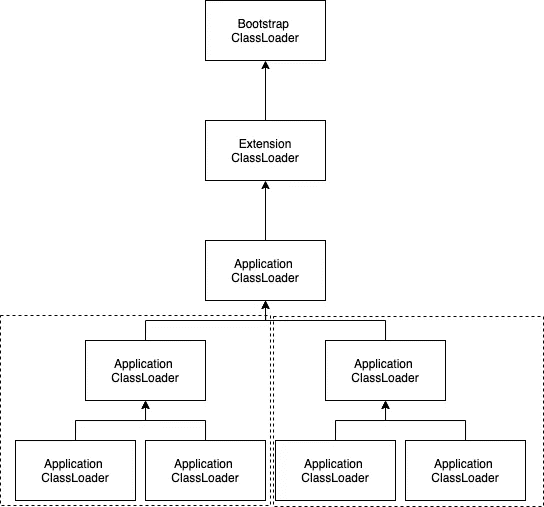](https://javarevisited.blogspot.com/2018/09/top-5-java-ee-courses-to-learn-online.html)

图 2——J2EE 等级载荷

# 🚀OSGi


OSGi 是 Java 的模块系统。它定义了一种创建真正模块的方法，以及这些模块在运行时交互的方法。

OSGi 的主要思想很简单。传统 Java 中大多数问题的根源是全局的、扁平的类路径。因此，OSGi 采取了不同的方法:**每个模块都有自己的类路径，与所有其他模块的类路径相分离。**

这几乎消除了我们之前讨论的所有问题。但是这并没有结束，我们仍然需要我们的模块一起工作，这意味着共享类。OSGi 使用**显式导入和导出机制，对如何跨模块共享类有非常具体和定义良好的规则。**

那么，OSGi 模块看起来像什么？第一，我们不叫它模块，我们在 OSGi 叫它 ***捆绑*** 。事实上，它只是一个 JAR 文件！但是它包含将它提升为一个包的元数据。元数据包括:

*   管束的*名称*。
*   捆绑包的*版本*。
*   *进口*和*出口的清单。*
*   可选地，关于包需要运行的最低 Java 版本的信息。
*   各种人类可读信息，如供应商、版权声明、联系地址等。

这些元数据放在 JAR 文件中一个名为 **MANIFEST 的特殊文件中。MF** ，它是所有标准 JAR 文件的一部分，正是为了这个目的。由于*包*是 JAR 文件，它们可以在 OSGi 运行时之外使用。

## 树与图

在 OSGi，它为每个*包提供了一个单独的类路径。这仅仅意味着我们为每个包提供了一个类加载器，并且类加载器可以看到包的 JAR 文件中的类和资源。然而，为了让包一起工作，应该有一种方法来加载从一个包的类加载器委托给另一个包的类。*

在图 1 和图 2 的*中，类加载器被安排在一个层次树中，并且类加载请求总是被向上委托给每个类加载器的父类，而这两棵树没有办法进行水平委托。要使一个库对多个分支可用，它必须被提升到这些分支的共同祖先中。*

但是在 OSGi，它是通过使用一个*图来解决的。两个模块之间的依赖关系不是层次关系:没有父、子委托，只有提供者和用户的网络。基于包之间的依赖关系，类加载请求被从一个包委托给另一个包。*

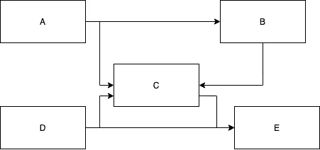

图 3 — OSGi 类加载器图表

包之间的链接基于导入和导出的包。

例如，假设*图 3* 中的 bundle B 包含一个名为`org.foo`的包，它可以通过在其 **MANIFEST.MF.** 的 exports 部分声明它来选择导出该包，然后 Bundle A 通过在其 **MANIFEST.MF.** 的 imports 部分声明它来选择导入`org.foo`。现在，OSGi 框架会将导入与匹配的导出相匹配:这被称为**解析**过程。一旦导入与导出匹配，所涉及的包就被**连接在一起**用于特定的包名。这意味着当包 A 中的类加载请求发生在`org.foo`包中的任何类上时，该请求将立即被委托给包 b 的类加载器

那么，如果 resolution 失败了会发生什么呢？在这种情况下，包 A 将无法解析，也无法使用。假设我们的两个包 A 和 B 构造正确，我们在基于 OSGi 的应用程序中不会看到任何类似于`ClassNotFoundException`或`NoClassDefFoundError`的错误。事实上，它会告诉初创企业有些不对劲。因此，当使用 OSGi 时，我们可以在之前知道一组包*中的解析错误，我们从不执行应用程序。*

## 版本控制和并行版本

OSGi 不仅仅提供基于包名的依赖，它还提供包的版本控制。这允许处理我们使用的库的发布版本中的变化。

**包的导出**用**版本属性声明，**但是**导入**声明**版本*范围。*** 这允许我们有一个依赖于例如从版本 1.1.0 到版本 2.1.0 的库的包。如果在该范围内没有任何包导出该包的版本，那么该包将无法解析，我们将收到一条有用的错误消息，告诉我们发生了什么问题。

我们甚至可以在同一个应用程序中同时拥有同一个库的不同版本。

# 🚀OSGi 建筑

OSGi 平台由两部分组成: **OSGi 框架**和 **OSGi 标准服务。**

## OSGi 框架

当您创建基于 OSGi 的应用程序时，OSGi 框架起着至关重要的作用。在 OSGi 规范中定义了三个概念层。

*   **模块层—** 与打包和共享代码有关
*   **生命周期层—** 负责提供执行时模块管理和对底层 OSGi 框架的访问
*   **服务层—** 关注模块之间的交互和通信，特别是模块中包含的组件。

## OSGi 标准服务公司

标准服务为常见任务(如日志记录)定义了可重用的 API。

## OSGi 实施

现在有几个独立实现的 OSGi 框架，包括四个开源软件。

*   春分
*   Knopflerfish
*   菲力克斯(男子名)
*   看门人

# 🚀OSGi 的第一步

## OSGi 开发工具

理论上，当构建 OSGi 包时，除了标准的 Java 工具之外，不需要任何额外的工具:用于 Java 源代码编译的`javac`，用于打包的`jar`，以及用于创建**清单的文本编辑器。MF** 文件。

然而，使用这些基本工具很费力，因为它们需要大量的工作。因此，在实践中，我们使用像 *Ant* 或 *Maven、*这样的构建工具和像 *Eclipse、NetBeans、*或 *IntelliJ 这样的 ide。*

在这个阶段，我们将使用 Eclipse IDE。但是在稍后的阶段，我们将展示如何使用 IntelliJ 构建一个 OSGi 项目。

## 获得一个框架

正如我们之前提到的，有四个开源 OSGi 实现——Equinox、Knopflerfish、Felix 和 Concierge。在本教程中，我们将主要与*春分点*一起工作。下面给出了下载链接:

<http://download.eclipse.org/equinox>  

从下载页面下载最新的 SDK，解压到类似`equinox-SDK`的文件夹。我们将这个顶级目录称为`EQUINOX_HOME`。解压缩后，我们将有一个名为`plugins`的目录，在那里我们可以找到所有实现 Equinox 及其支持包的 jar。在 Eclipse 中，底层运行时环境中有 Equinox 框架。

## Eclipse 中的项目🌓

打开 Eclipse IDE，进入`New` → `Project` → `Plug-in Project`

[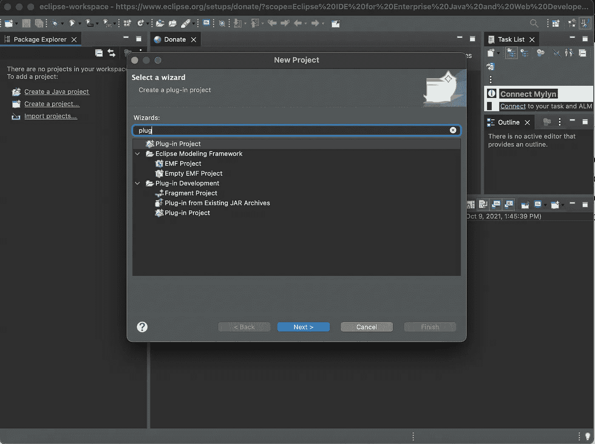](https://javarevisited.blogspot.com/2020/05/top-5-courses-to-learn-eclipse-ide-for-java-developers.html)

图 4 —设置 eclipse 项目

给出项目名称`OSGi Tutorial`，选择`Equinox`作为 OSGi 框架。

[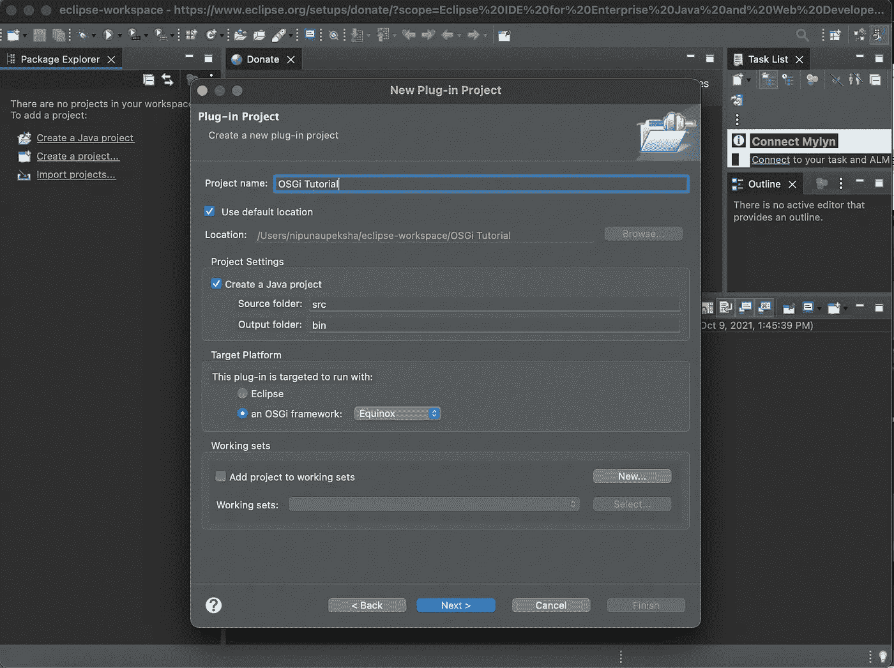](https://javarevisited.blogspot.com/2019/05/10-free-websites-to-learn-git-online.html)

图 5 —设置 eclipse 项目

然后点击`Next >`，选择执行环境。为此，请选择您安装到计算机中的 Java 版本。并选择*生成激活器*复选框。然后点击`Finish`

[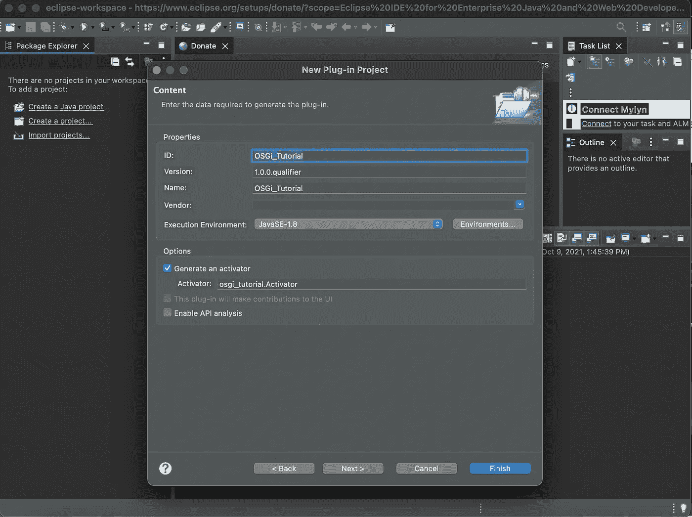](https://javarevisited.blogspot.com/2018/07/top-5-websites-to-learn-coding-in-java.html)

图 6 —设置 eclipse 项目

[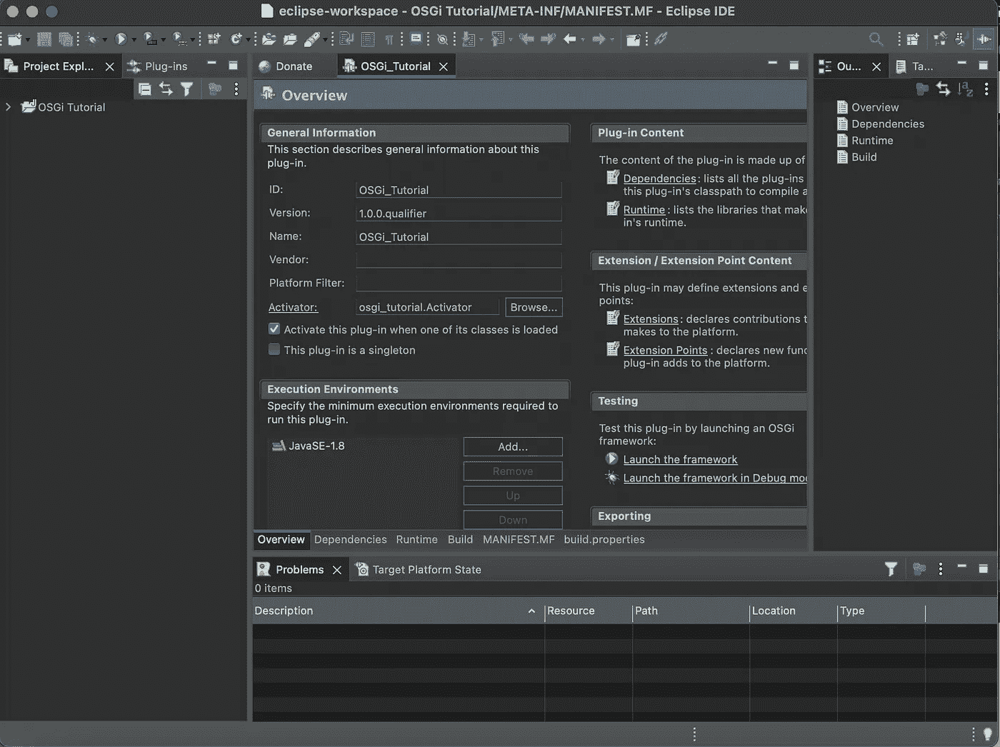](https://javarevisited.blogspot.com/2015/10/133-java-interview-questions-answers-from-last-5-years.html)

图 7 —项目概述

## 你好，世界！

为了保持长久以来的传统，我们在 OSGi 的第一个节目将是简单地打印“你好，世界！”到控制台。但是，大多数此类程序在打印邮件后会立即退出。但我们将延续这一传统，不仅在启动时打印“你好”，而且在关闭时打印“再见”。

在我们的项目中，转到`src` → `osgi_tutorial` → `Activator.java`文件并将其重命名为`HelloWorldActivator.java`，然后用以下代码片段替换代码。

既然我们将`Activator.java`更改为`HelloWorldActivator.java`，我们应该在**清单中更改它。MF** 文件也是。转到**货单。MF** 文件并将`osgi_tutorial.Activator`改为`osgi_tutorial.HelloWorldActivator`

[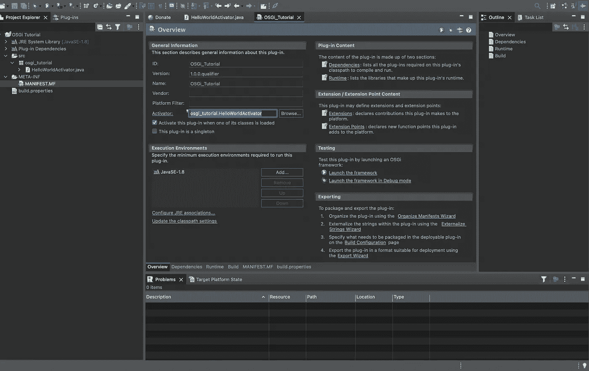](https://javarevisited.blogspot.com/2021/08/top-5-spring-data-jpa-courses-for-java.html)

图 8-更改清单。MF 文件

值得注意的是，您可以查看**清单。MF** 文件也使用底部选项卡窗格。自从制造了**之后。MF** 是 OSGi 项目最重要的部分，更好地了解所有与**清单相关的选项。MF** 文件编辑。

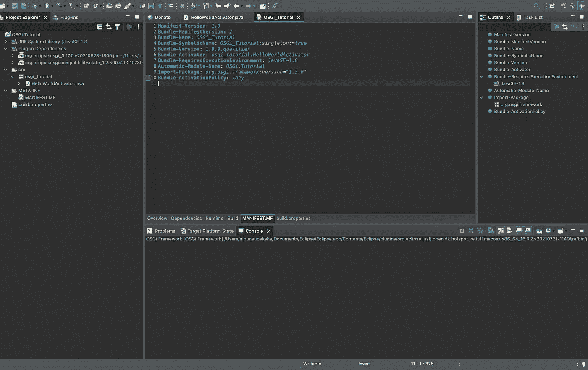

图 9-清单。MF 文件

现在点击左侧窗格中的 *OSGi 教程*并右键点击`Run As` → `OSGi Framework`

[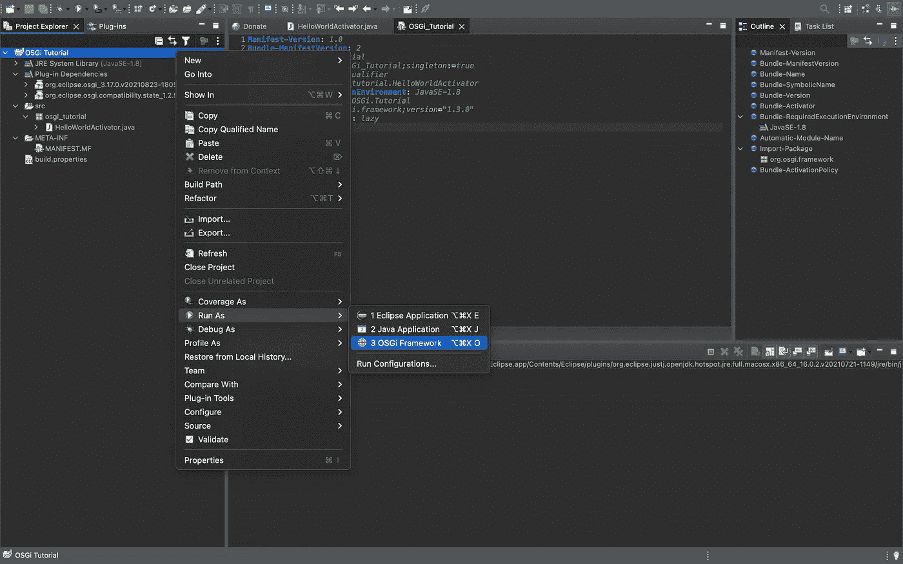](https://medium.com/javarevisited/12-advanced-spring-framework-courses-for-java-programmers-a273f6e4448c)

图 10 —运行 OSGi 项目

当你这样做的时候，你会在控制台中得到一串错误信息，就像这样。

[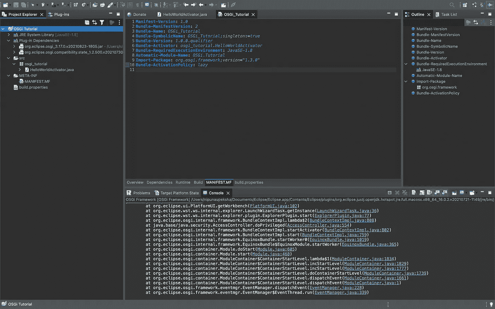](https://javarevisited.blogspot.com/2015/06/5-websites-to-learn-sql-online-for-free.html)

图 11 —控制台输出

之后，检查您是否正在使用`osgi`控制台。如果您正在使用`osgi`控制台，您会在控制台中看到类似`osgi >`的内容。键入`ss`查看项目中运行的所有包。你会看到类似这样的 id。

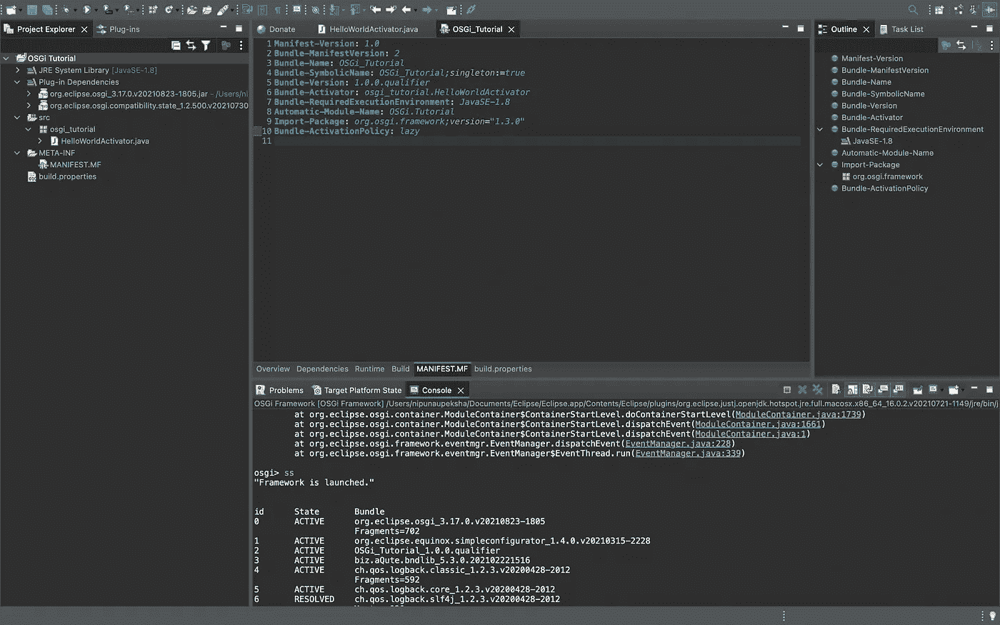

图 12-查看所有束的 ss

您可以看到 id 为`2`的 out `OSGi_Tutotial_1.0.0.qualifier`现在您可以通过键入`stop 2`来停止它，并通过在`osgi`控制台中键入`start 2`来再次启动它。

[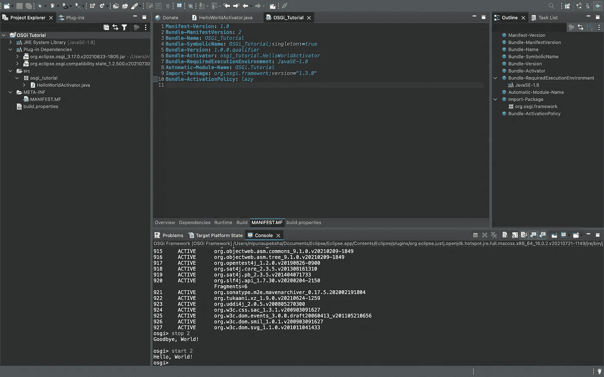](https://javarevisited.blogspot.com/2021/02/spring-security-interview-questions-answers-java.html)

图 13 —开始和停止项目

正如您所注意到的，这个`start`和`stop`与我们在`HelloWorldActivator.java`文件中编写的方法相关。

## 捆绑包生命周期

有人提到 OSGi 捆绑包有一个生命周期，但是这个生命周期到底是什么呢？

我们的`OSGi_Tutorial`包从`install`命令开始，并进入`INSTALLED`状态。然后随着`start`命令，它转换到`ACTIVE`状态。虽然我们看不到两种状态之间的直接联系，但是 bundles 只有在`RESOLVED`状态下才能启动。然而，当我们试图启动一个`INSTALLED`包时，框架会在开始启动它之前先尝试解决它。`RESOLVED`表示满足该包的约束。在被解析后，它通过`STARTING`进入`ACTIVATE`状态。`STARTING`状态是一个瞬态。

当执行`stop`命令时，束转变到`RESOLVED`状态，同时经过瞬态`STOPPING`

要获得更多关于生命周期的信息，请查看下图。

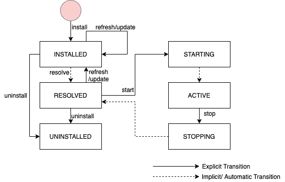

图 14 —捆绑包生命周期

我们的`HelloWorldActivator.java`文件中的`BundleContext`允许我们做多件事情，

*   查找系统范围的配置。
*   通过 ID 找到另一个已安装的包。
*   获取所有已安装软件包的列表。
*   以编程方式安装新的软件包。
*   注册和取消注册捆绑包监听器。
*   注册和取消注册服务侦听器。

因此简单地改变`Activator`类我们可以做几件事。

# 🚀捆绑依赖关系

正如我们前面指出的，管理依赖关系是实现模块化的关键。这在 Java 和许多其他语言中也是一个大问题，因为只有少数语言提供构建大型应用程序所需的模块系统。JAVA 中的默认模块系统是以 JAR 为中心的“类路径”模型，失败主要不是因为它不能管理依赖关系，而是把它们留给机会。

OSGi 通过管理依赖关系去掉了偶然因素，因此它们是*显式的、声明性的、*和*版本化的。*

*   **Explicit —** 包的依赖关系是公开的，任何人都可以看到，而不是隐藏在类文件的代码路径中，等待在运行时被发现。
*   **声明性—** 依赖关系以简单、静态、文本的形式指定，以便于检查。一个工具可以计算出需要哪一组包来满足特定包的依赖关系，而不需要实际安装或运行它们中的任何一个。
*   **版本化—** 库随着时间而变化，仅仅依赖一个库而不考虑它的版本是不够的。因此，OSGi 允许所有的包间依赖关系指定一个版本范围，甚至允许同一包的多个版本同时存在和使用。

# 🚀做好准备，OSGi 来了！


现在我们对 OSGi 有了一个了解，让我们试着用 IntelliJ 创建一个使用 OSGi 的 *Maven 项目。*我们在这里使用 IntelliJ 的原因是为了表明 OSGi 是独立于 IDE 的。

我们将使用 IntelliJ plus OSGi 创建一个名为`book-inventroy`的项目。

在这个项目中，*读者(消费者)*请求阅读一本书，*图书提供者(生产者)*找到那本书(生成)并让读者阅读。现在，为了映射上述场景，我们需要不同的模块。因此，**阅读器模块**将具有像*请求图书、查看图书详情等功能。*和**提供者**模块将具有*生成书籍、更新书籍等功能。*

构建 OSGi 项目最重要的任务是编写清单。上面我们讲过的 MF 文件。在大多数情况下，从头开始编写并不容易。因此，我们使用 **Maven 捆绑插件**来完成这个任务。现在让我们动手做一些编码工作。

进入`New Project` → `Maven`新建一个 [Maven 项目](/javarevisited/6-best-maven-courses-for-beginners-in-2020-23ea3cba89)。并选择`Next`

[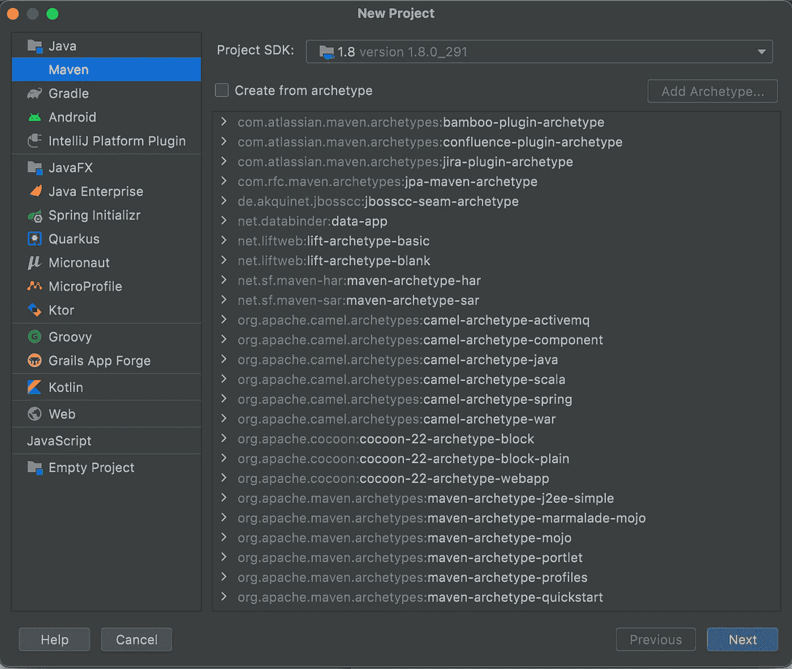](https://javarevisited.blogspot.com/2015/01/difference-between-maven-ant-jenkins-and-hudson.html#axzz6cKi4RVpi)

图 15 —新的 maven 项目

对于该项目，我们将给出以下细节:

`**groupId:** org.wso2.carbon
**artifactId:** book-inventory
**version:** 1.0-SNAPSHOT
**packaging:** pom
**name:** WSO2 Carbon-Book Inventory`

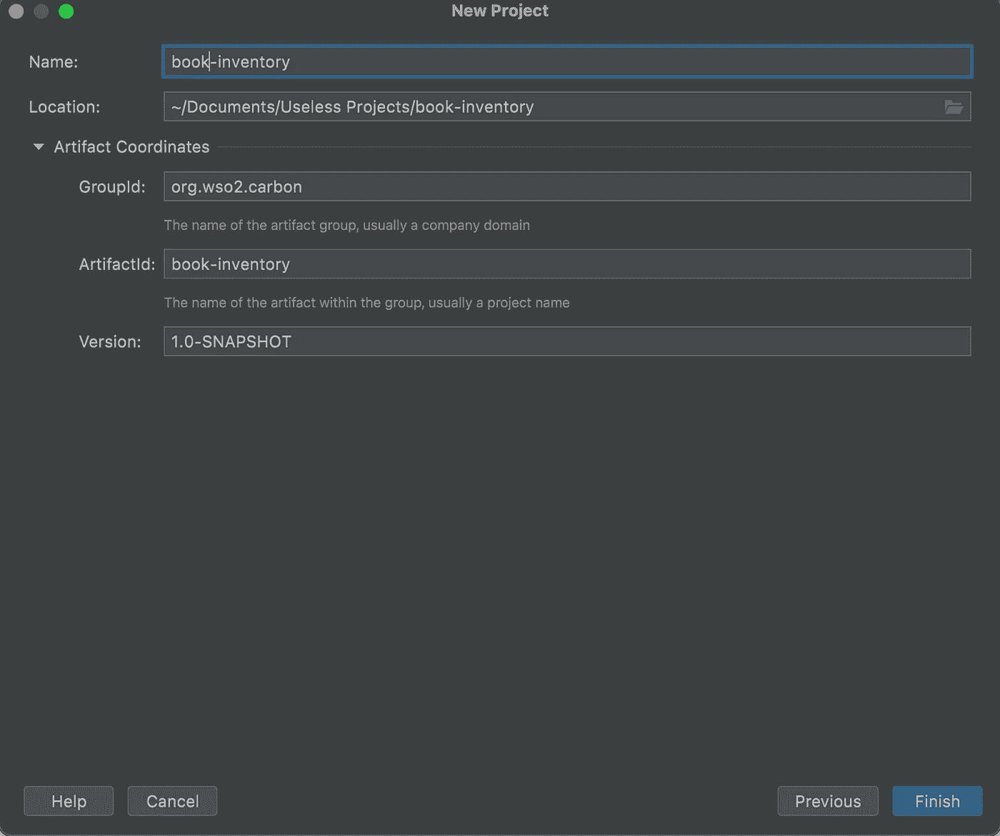

图 16 —账面库存项目

由于`book-inventory`是我们的父模块，我们可以删除自动生成的`src`文件夹。我们这样做是因为我们没有导出*父*模块。这就是我们将包装命名为`pom`的原因

在创建了*父*模块后，我们应该创建两个子模块，`org.wso2.carbon.book.reader`和`org.wso2.carbon.book.provider`要创建这些模块，右键单击*父*项目，选择`Add New` → `Module`添加完这两个子模块后，项目将如下所示(忽略`pom.xml`文件)。)

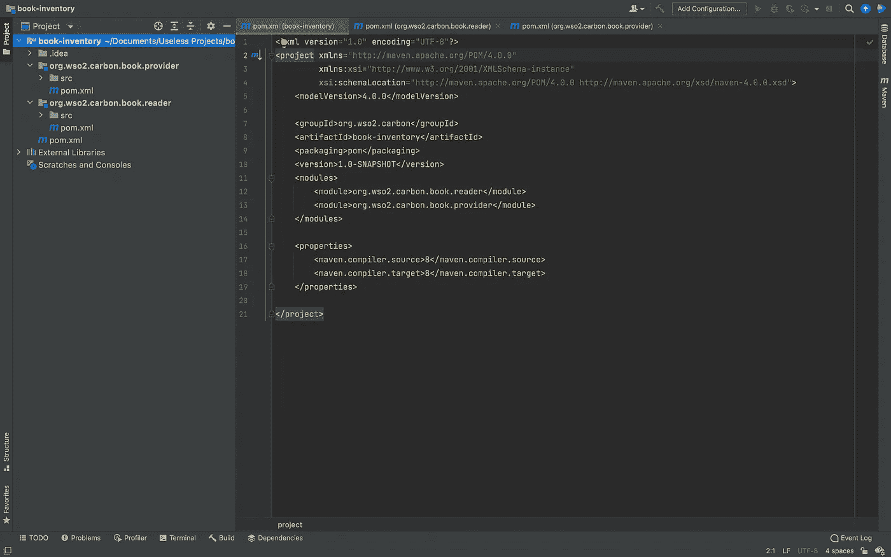

图 17 —项目结构

> 当向项目添加子模块时，父项目`pom.xml`应该用`<modules>`更新，子模块`pom.xml`将有`<parent>`标签。如果您使用的是 IDE，它会自动生成它们。

`book-inventory`的最终`pom.xml`看起来会是这样的:

**图书供应商**

`org.wso2.carbon.book.provider`将具有以下规格

`**artifactId:** org.wso2.carbon.book.provider
**packaging:** bundle
**plugin:** maven-bundle-plugin, maven-scr-plugin
**dependency:** org.apache.felix.scr.ds-annotations, org.eclipse.osgi.services, org.eclipse.osgi
**name:** WSO2 Carbon-Book Provider`

这里使用了`<packaging>bundle</packaging>`,因为我们需要将它捆绑进来，您可以看到我们正在使用`maven-bundle-plugin`

在`maven-bundle-plugin`中，我们确定了以下内容:

*   捆绑符号名称
*   捆绑包名称
*   出口包装
*   进口包装
*   私人包装

在这里，你可以看到，

```
<private-package>org.wso2.carbon.book.provider.internal</private-package>
<Export-Package>
    !org.wso2.carbon.book.provider.internal,
    org.wso2.carbon.book.provider.*
</Export-Package>
```

因为我们不希望`internal`包被导出。

让我们开始创建与🧑相关的文件🏻‍💻

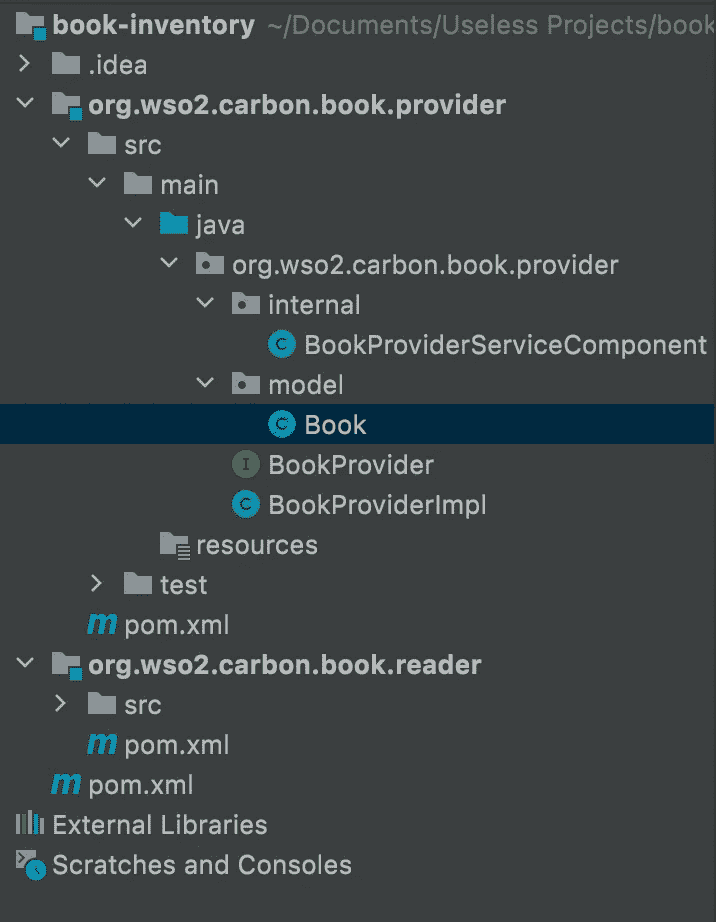

图 18 —项目结构

现在，我们将在注册表中注册图书提供商创建的服务，以便在其他组件中使用它。这是通过`BookProviderServiceComponent.java`完成的，类似于我们上面讨论的在 Eclipse 中创建 OSGi 项目的`Activator`。

**图书阅读器**

`org.wso2.carbon.book.reader`将具有以下规格。

`**artifactId:** org.wso2.carbon.book.reader
**packaging:** bundle
**plugin:** maven-bundle-plugin, maven-src-plugin
**dependency:** org.apache.felix.src.ds-annotations, org.eclipse.osgi.services, org.eclipse.osgi, org.wso2.carbon.book.provider
**name:** WSO2 Carbon-Book Reader`

在这里，您可以看到，提供程序是导入的。

```
<Import-Package>
    org.osgi.framework; version="${osgi.framework.imp.pkg.version.range}",
    org.osgi.service.component; version="${osgi.service.component.imp.pkg.version.range}",
    **org.wso2.carbon.book.provider.***; version="${project.version}"
</Import-Package>
```

在这个子模块中，我们将有以下文件结构。

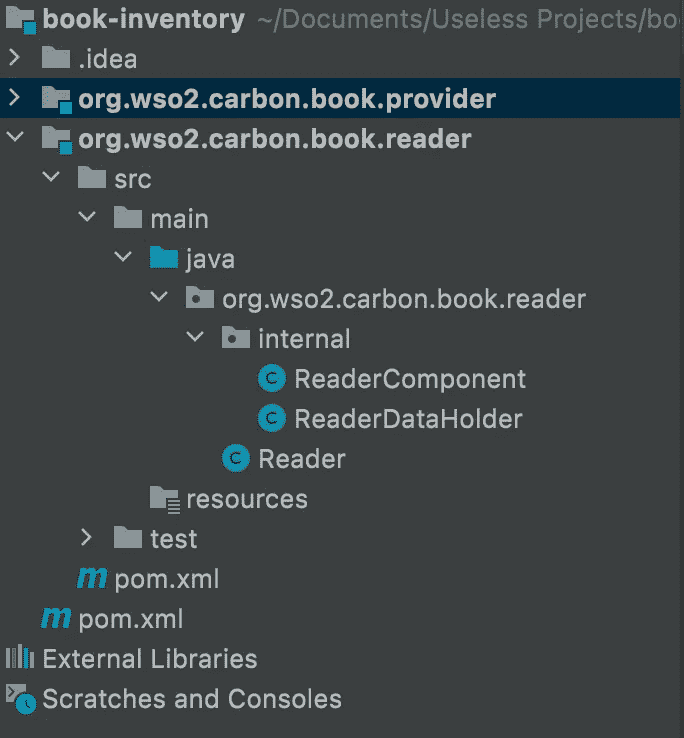

图 19 —项目结构

下面给出了文件的代码片段。

之后，在终端上键入`maven clean install -DskipTests`或简单地键入`maven clean install`来构建各自的 jar。

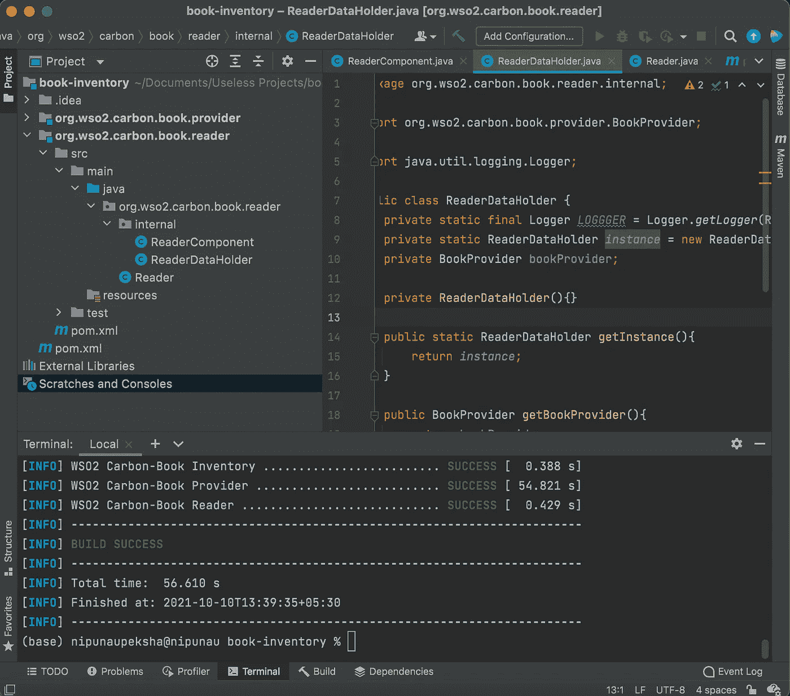

图 20 —在终端中成功构建

现在，你可以在`org.wso2.carbon.book.reader`和`org.wso2.carbon.book.provider`中看到一个新生成的文件夹，名为`target`，在这些文件夹中有 jar`org.wso2.carbon.book.reader-1.0-SNAPSHOT.jar`和`org.wso2.carbon.book.provider-1.0-SNAPSHOT.jar`，如果你解压它们，你可以看到它们里面的文件。它们包含代码和**清单。MF** 文件和 **OSGI-INF** 文件。

# 🚀WSO2 身份服务器

现在我们将运行我们在 WSO2 平台中创建的 OSGi 项目。去[https://wso2.com/identity-server/](https://wso2.com/identity-server/)下载**最新** IS 版本。解压缩后，你会得到一个文件夹。我们将称之为`<IS_HOME>`

转到`<IS_HOME>/repository/components/dropins`并将`org.wso2.carbon.book.reader-1.0-SNAPSHOT.jar`和`org.wso2.carbon.book.provider-1.0-SNAPSHOT.jar`粘贴在里面。然后通过控制台进入`<IS_HOME>/bin`并启动身份服务器。

**在 Linux/macOS 中→**

窗口中的**→`wso2server.bat -DosgiConsole`**

**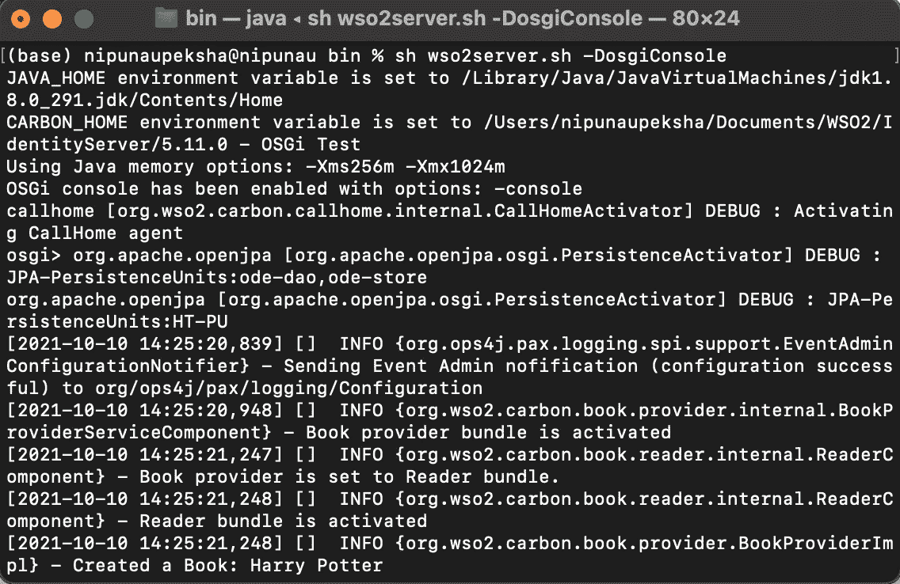**

**图 21 —启动 wso2-is**

**您可以看到，我们的包正在被激活并正常工作。**

**要停止`wso2-is`，只需按下`CTRL+C`。**

# **🚀OSGi 命令**

**有几个我们应该熟悉的 OSGi 命令。**

*   **`ss` →用捆绑包 id 列出服务器中的捆绑包。**
*   **`ss <name>` →在捆绑包中搜索给定的名称并列出来。**
*   **`ls` →列出服务。**
*   **`b <id>` →显示捆绑信息。**
*   **`diag <id>` →显示未满足的捆绑约束。**

# **🚀参考**

**这些是我为了创作这篇文章而读过的书。**

*   ****实践中的 OSGi—**巴特利特**
*   ****OSGi 和 Equinox——创建高度模块化的 Java 系统** —杰夫·麦卡弗，保罗·范德雷，西蒙·阿切尔**
*   **行动中的 OSGi——理查德·霍尔、卡尔·保罗、斯图尔特·麦卡洛克、大卫·萨维奇**

**这就是关于如何在 IntelliJ 或 Eclipse 上与 OSGi 一起工作的全部内容。下面给出了 IntelliJ 项目的链接。**

**<https://github.com/nipunaupeksha/osgi-book-inventory>  

编码快乐！🧑🏻‍💻😇**