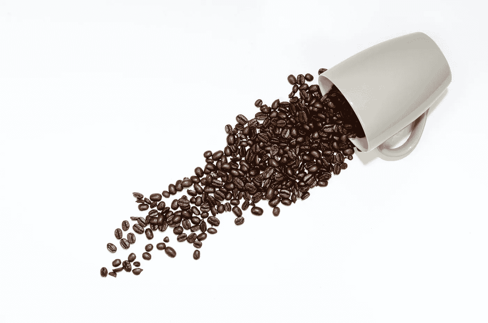

# 清晰的兰姆达斯

> 原文：<https://medium.com/javarevisited/legible-lambdas-4259c831918e?source=collection_archive---------0----------------------->



照片由[数学](https://unsplash.com/@builtbymath?utm_source=unsplash&utm_medium=referral&utm_content=creditCopyText)在 [Unsplash](https://unsplash.com/s/photos/java?utm_source=unsplash&utm_medium=referral&utm_content=creditCopyText)

我们都喜欢羊肉，不是吗？Lambdas 是强大的(传递方法，摆脱匿名类……你明白了),强大的能力意味着巨大的责任。当我们在工作中切换到使用 Java 8 时，我很兴奋终于可以使用 [lambdas](/javarevisited/7-best-java-tutorials-and-books-to-learn-lambda-expression-and-stream-api-and-other-features-3083e6038e14?source=---------14------------------) ！但是很快，我发现自己把所有的代码都塞进了 lambda。我不仅试图过度使用它，我还写了非常不可读的代码。

在过去几年的过程中，我收集了一些使用 lambdas 的“惊喜”和“陷阱”，这些是我遇到过的，更重要的是，是我逃避过的(所有的例子主要与 Java 有关):

## **使用消费者、功能和供应商**

消费者就像具有 void 返回类型和一个输入参数的方法。函数是处理方法，接受 A 类型的元素并产生 B 类型的元素(A 和 B 也可以是相同的类型)。

`Suppliers` 类似于没有输入参数但总是产生输出的方法。我花了一段时间才掌握这些细微差别。当您必须使用这些接口之一重构一些代码时，理解这些差异会有很大帮助。

例如，考虑以下代码片段:

```
someList.stream().map(listItem -> {
    Step 1;
    return result of Step 1;
}).map(step1Item -> {
    Step 2;
    return result of Step 2; 
})someOtherList.stream().map(listItem -> {
    Step 1;
    return result of Step 1;
}).map(step1Item -> {
    Step 3;
    return result of Step 3;
})
```

为了能够重用将步骤 1 应用到列表项，我们可以将第一个 map 方法的输入提取到一个[函数接口](https://javarevisited.blogspot.com/2018/01/what-is-functional-interface-in-java-8.html)中，经过这一更改，代码现在看起来如下:

```
someList.stream().map(applyStep1())
.map(step1Item -> {
    Step 2;
    return result of Step 2;
})someOtherList.stream().map(applyStep1())
.map(step1Item -> {
    Step 3;
    return result of Step 3;
})Function<a> applyStep1() {
    return A -> {
        Step 1;
        return result of Step 1;
    };
}
```

一个简单的方法是:让您的 IDE 帮助您将映射的输入提取到函数中(选择映射中的整个代码块->右键单击并重构->提取->方法->命名函数和 TADA)。其他接口如`Consumers` 和`Suppliers`也可以这样做！

## **重复使用还原方法**

想得到列表中所有项目的总和吗？平均水平？不用再看了，streams API 对这两者都有一个方法！

```
integerList.stream().mapToInt(Integer::intValue).sum()
integerList.stream().mapToInt(Integer::intValue).average()
```

我在这里想说的是，有现成的简化方法可以提供，在冒险写自己的方法之前先看看是个好主意:)

## **并非所有东西都必须使用流/并行流 API**

[流 API](https://www.java67.com/2014/04/java-8-stream-examples-and-tutorial.html) 是 java 8 最广为人知的特性之一，的确如此。它与 lambdas 配合得非常好，作为一个新手，我下意识地将我所有的收藏转换成 streams，不管它是否是必需的。

类似地[流 vs 平行流](https://www.java67.com/2018/10/java-8-stream-and-functional-programming-interview-questions-answers.html)。平行是好的，对吗？是的。一直都好吗？绝对不行。互联网上有很多关于这些主题的文章和性能基准，我强烈建议您在浏览代码库之前做好研究。

## **打散巨型兰姆达斯！**

我们需要将 44 个步骤应用到我们的输入中，我们决定使用地图。但是我们需要在一个地图方法中应用所有的 44 个步骤吗？让我想想。因此，如果我们只使用一个 map 方法，我们的代码看起来应该是这样的:

```
someList.stream().map(listItem -> {
    Step 1;
    Step 2;
    Step 3;
    Step 4;
    .
    .
    .
    Step 44;
    return result of all above Steps;
});
```

接下来考虑这个:

```
someList.stream().map(listItem -> {
    Step 1;
    return result of Step 1;
}).map(step1Item -> {
    Step 2;
    return result of Step 2;
}).map(step2Item -> {
    Step 3;
    return result of Step 3;
}).map(step3Item -> {
    Step 4;
    return result of Step 4;
});
.
.
.
```

我相信使用 lambdas 的最大优势之一是您可以非常优雅地将处理步骤分解成它们自己的 map 方法(也可以使用其他方法，我在这里只是引用 map 作为例子)。我总是喜欢把大的 [map 方法](/javarevisited/how-to-use-streams-map-filter-and-collect-methods-in-java-1e13609a318b?source=---------10------------------)分解成更易读、更易维护的单个方法(这也考虑到了可重用性)。

同时，我建议不要盲目地在每个 map 方法中只执行一行代码。我们总是可以在合适的时候将处理步骤合并到一个映射中(例如，步骤 1–3 可以在一个映射中)。

## **带有中频环路的 map()与滤波器**

您可以使用 [filter()](https://www.java67.com/2016/08/java-8-stream-filter-method-example.html) 过滤收藏中的项目。我花了多长时间才把 if 移动到我的映射中，使之成为过滤谓词？够久了。我要说的是:

```
someList.stream().map(listItem -> {
    if(listItem.startsWith("A") {
        //Do Something
    }
});
```

可以写成这样:

```
someList.stream()
.filter(listItem -> listItem.startsWith("A"))
.map(listItem -> {
    //Do Something
});
```

虽然这可能会也可能不会提高性能，但它增加了可读性，并确保使用适当的方法。

切换到使用 [lambdas](/javarevisited/8-best-lambdas-stream-and-functional-programming-courses-for-java-developers-3d1836a97a1d) 对我来说是一个很大的飞跃，花了很长时间来适应，它继续让我惊讶、沮丧，同时也让我惊叹！