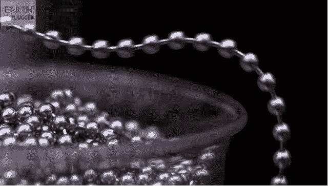

# 让我们去 Java 流

> 原文：<https://medium.com/javarevisited/lets-go-to-the-java-stream-6db12f16eff5?source=collection_archive---------2----------------------->


啊啊——清爽的溪流，冲过森林中的岩石。好吧，不是那种流。 [Java API stream](/javarevisited/7-best-java-collections-and-stream-api-courses-for-beginners-in-2020-3ad18d52c38) 允许将多个操作一个接一个地应用于对象组(集合、数组、I/O 资源)。



首先，我们需要获得一个流。需要注意的是，stream 不是一个数据结构，它不会改变初始数据。可以通过多种方式获得流。集合接口有 [stream()](https://javarevisited.blogspot.com/2021/05/java-8-stream-lambda-expression-d.html) 方法为此:

```
List<String> lettersList = Arrays.*asList*(**"a"**, **"b"**, **"c"**, **"d"**, **"ef"**);
lettersList.stream();
```

可以在流上执行的操作被分为中间和终端，并且是流管道的一部分。流管道由一个源、零个或多个中间操作以及一个终端操作组成。

让我们看看流管道的例子，其中[过滤器()](https://www.java67.com/2018/03/java-8-stream-find-first-and-filter-example.html)是中间操作，而[计数](https://www.java67.com/2014/04/java-8-stream-examples-and-tutorial.html)是终端:

```
**long** numberOfLetters = lettersList.stream()
        .filter(letter -> letter.length() > 0)
        .count();
```

中间操作是懒惰的，这意味着它们直到终端操作执行后才开始执行。这样的懒惰导致了显著的效率。

我们可以在一次数据传递中执行多个操作，有时我们不必检查所有数据，我们只需要找到满足我们条件的第一个案例。


终端操作执行后，该流被视为已消耗，不能使用。如果需要再次遍历数据，则需要获得新的流。

[Java stream](https://www.java67.com/2020/03/how-to-write-clean-code-using-java-8.html) 只是一个数据包装器，可以快速方便地进行批量处理。

快乐编码我的朋友们！


代码可在此处找到:

<https://github.com/forfireonly/MediumArticlesJava> 