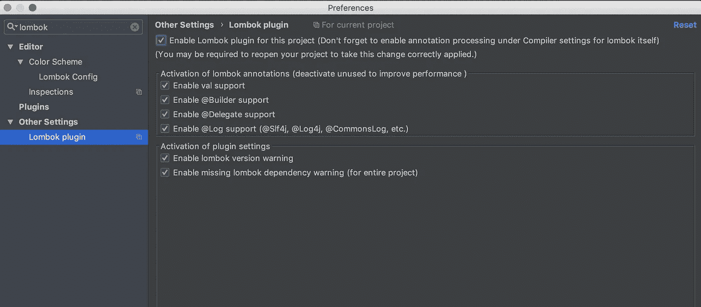

# 让我们一起学习会话:龙目岛项目

> 原文：<https://medium.com/javarevisited/lets-learn-together-sessions-the-project-lombok-6eaabefa63da?source=collection_archive---------2----------------------->

我将告诉你 Lombok，Java 开发人员使用的最流行的库之一，它消除了 Java 的冗长。


在 [Unsplash](https://unsplash.com?utm_source=medium&utm_medium=referral) 上由 [Mathis Jrdl](https://unsplash.com/@mtsjrdl?utm_source=medium&utm_medium=referral) 拍摄的照片

# 什么是龙目岛项目？

龙目岛是印尼的一个岛屿，可惜在这篇文章里，我们就不谈这个岛的美了。

Java 仍然是软件世界中最常用的编程语言之一，因为它是一种稳定、强大和有用的语言，所以 years.Java 赢得了这个位置。得益于这些， [Java](/javarevisited/top-5-java-online-courses-for-beginners-best-of-lot-1e1e240a758) 在不同的领域和用途中获得了越来越多的社区，从电子商务到图像处理应用。

虽然人们乐于使用 Java，但许多 Java 开发人员抱怨与其他编程语言相比，Java 的结构过于冗长。龙目岛项目就在这一点上展开。project Lombok 的官网对 Lombok 的定义是::

> " Project Lombok 是一个 java 库，可以自动插入到你的编辑器和构建工具中，增加你的 java 的味道."

Lombok 主要是**减少样板代码**和**在开发过程中为开发者节约时间**。它使用 IDE 在编译时生成所有这些样板代码。它使用 Java 自带的注释处理函数 [JSR-269](https://jcp.org/aboutJava/communityprocess/final/jsr269/index.html) 。

[**Lombok**](https://projectlombok.org/) **是一个开源项目**，因此每个人都可以很容易地将 Lombok 作为一个依赖项添加到他们的项目中，这要感谢他们的依赖管理工具，例如 [Maven](/javarevisited/6-best-maven-courses-for-beginners-in-2020-23ea3cba89) 、 [Gradle、](/javarevisited/5-best-gradle-courses-and-books-to-learn-in-2021-93f49ce8ff8e)或 [Ant](https://javarevisited.blogspot.com/2015/01/difference-between-maven-ant-jenkins-and-hudson.html#axzz6d0HXyv00) 。因为 Lombok 在编译时生成代码，所以如果您第一次尝试使用 Lombok，就会在构建时遇到解析器错误。Lombok 通过为流行的 ide 解析器开发插件解决了这个问题。

Lombok 易于使用，并提供了配置选项，如启用/禁用一些 Lombok 功能并更改它们的行为，如返回错误或警告，以及抛出非空变量的 [NullPointerException](https://javarevisited.blogspot.com/2013/05/ava-tips-and-best-practices-to-avoid-nullpointerexception-program-application.html) 或 IllegalArgumentException。

# **从何说起？**

如果您想在您的项目中使用 Lombok，您必须首先使用依赖项管理工具将它作为一个依赖项添加到您的项目中。如果您使用的是 [Maven](/javarevisited/top-10-free-courses-to-learn-maven-jenkins-and-docker-for-java-developers-51fa7a1e66f6) ，您可以将 Lombok 添加到 pom.xml 文件中，如下所示:

```
<dependencies>
	<dependency>
		<groupId>org.projectlombok</groupId>
		<artifactId>lombok</artifactId>
		<version>1.18.12</version>**#remove for latest version**
		<scope>provided</scope>
	</dependency>
</dependencies>
```

如果你用 [Gradle](https://javarevisited.blogspot.com/2020/05/top-5-courses-and-books-to-learn-gradle.html#axzz6fk6WjYD0) ，有两个备选方案可以用。第一种是使用名为 [Frefair](https://plugins.gradle.org/plugin/io.freefair.lombok) 的工具，它为您的项目提供了 Lombok 和 delombok 功能。您可以将它添加为依赖项，如下所示:

```
buildscript {
  dependencies {
    classpath "io.freefair.gradle:lombok-plugin:5.1.0"
  }
}

apply plugin: "io.freefair.lombok"
```

另一种选择只关心 Lombok 功能的编译范围。它告诉 [Gradle](https://javarevisited.blogspot.com/2020/06/maven-vs-gradle-beginners-introduction.html#axzz6dHZ7oEpK) 只在编译时将 Lombok 添加到它的作用域中。您可以在 build.gradle 的帮助下集成此功能，如下所示:

```
dependencies {
	compileOnly 'org.projectlombok:lombok:1.18.12'
	annotationProcessor 'org.projectlombok:lombok:1.18.12'

	testCompileOnly 'org.projectlombok:lombok:1.18.12'
	testAnnotationProcessor 'org.projectlombok:lombok:1.18.12'
}
```

正如我已经说过的，Lombok 在编译时生成代码，所以在编译时会出现解析错误。Java 解析器在构建期间无法找到来自 [Lombok 注释](https://javarevisited.blogspot.com/2021/08/how-to-use-lombok-library-in-java.html)的一些方法和定义，因此需要定制来破解 Java，以便在构建期间从错误中恢复项目。Lombok 为大多数流行的 ide 提供定制的解析器插件，如 [IntelliJIDEA](/javarevisited/7-best-courses-to-learn-intellij-idea-for-beginners-and-experienced-java-programmers-2e9aa9bb0c05) 、 [Eclipse](/javarevisited/6-free-best-eclipse-ide-courses-for-java-programmers-1229ee9e5d87) 等等…

您可以按照下面的两个步骤为我最喜欢的 IDE IntelliJIDEA 添加 Lombok 解析器插件:

*   通过搜索从首选项面板下的插件面板安装 Lombok，并重新启动 IntelliJIDEA。
*   打开偏好设置面板，启用 Lombok 并自定义 Lombok 的配置，如果您需要的话，如下图所示。

[](https://javarevisited.blogspot.com/2018/09/top-5-courses-to-learn-intellij-idea-java-and-android-development.html#axzz6A8Vy1sea)

偏好设置中的 Lombok 插件面板

现在你已经准备好用 Lombok 进行开发了。

# 如何在 Java 中使用 Lombok？

Lombok 使用 Java 的注释处理功能在编译时生成样板代码。我将用真实的用例逐一介绍一些 Lombok 注释。

## 1-) @Val 和@Var:

使用局部变量和循环变量时，不再需要借助 Lombok 注释“**Val”**来指定类型。Lombok 从初始化表达式中获取对象类型。Val 变量会被定义为 final，所以如果需要不可变的变量，可以使用 Lombok 的 Val，而不是将变量声明为 [final 关键字](https://javarevisited.blogspot.com/2011/12/final-variable-method-class-java.html)。

另一方面，**“var”**类型与 Val 颇为相似，但它们之间唯一的区别是 var 类型没有被定义为 [final](https://javarevisited.blogspot.com/2016/09/21-java-final-modifier-keyword-interview-questions-answers.html) 。

在下面的例子中，我做了一个使用 Var 和 Val 对象类型的简单例子。这个例子只是使用这两种类型的 Lombok 注释列出了有序和无序返回。

```
public void returnToDoListWithPrioritizedOrder(){

    HashMap<Integer,String> todoListWithPriorities =  new HashMap<>();
    todoListWithPriorities.put(3,"clean the house");
    todoListWithPriorities.put(1,"feed the cats");
    todoListWithPriorities.put(4,"water the garden");
    todoListWithPriorities.put(5,"go to the gym");
    todoListWithPriorities.put(2,"go to the shopping");

 **var copyOfToDoListWithProrities = todoListWithPriorities;** 
    *out*.println("To Do List Not Ordered:");

    for(**var toDoObject : copyOfToDoListWithProrities.entrySet()**){
        *out*.println("Priority: "+ toDoObject.getKey()+" To Do: "+toDoObject.getValue());
    }

    **val prioritizedOrderToDoList = new TreeMap<>(todoListWithPriorities);**

    *out*.println("To Do List Ordered:");

    for(**val toDoObject : prioritizedOrderToDoList.entrySet()**){
        *out*.println("Priority: "+ toDoObject.getKey()+" To Do: "+toDoObject.getValue());
    }

}
```

## 2-)@非空批注:

非空注释是最常用的 Lombok 注释之一，它对函数或构造函数参数生成空检查[。Lombok 在编译时将以下代码片段添加到方法或构造函数中:](http://javarevisited.blogspot.sg/2017/01/how-to-check-for-null-values-in-sql.html#axzz4r9r7atOR)

```
if (param == null) throw new NullPointerException("param is marked @NonNull but is null");
```

如果由 NonNull 注释定义的参数为 Null，它抛出 [NullPointerException](https://www.java67.com/2021/05/how-to-solve-nullpointerexception-in-java.html) 异常，并带有包含参数名的注释。这是 Lombok 的默认配置，但是您可以在 Lombok 配置功能的帮助下更改应用程序的行为。

为此，您必须创建一个文件，并在项目目录中将其命名为 **"lombok.config"** 。对于非空注释，在[空变量](https://javarevisited.blogspot.com/2014/12/9-things-about-null-in-java.html)的情况下，可以返回警告而不是异常。或者可以将异常类型从 NullPointerException 更改为另一种类型，如 IllegalArgumentException。配置示例如下:

```
**lombok.nonNull.flagUsage** = WARNING
**lombok.nonNull.exceptionType** = IllegalArgumentException
```

为了演示注释的功能，我做了一个简单的例子来检查文本是否是一个[回文](https://www.java67.com/2012/09/palindrome-java-program-to-check-number.html)。我向方法参数添加了非空注释，以防止对空文本运行回文检查，并提供直接抛出警告:

```
public boolean isPalindrome (**@NonNull** String text){
    for(int i=0;i<text.length()/2;i++){
        if(text.charAt(i) != text.charAt(text.length()-1-i)){
            return false;
        }
    }
    return true;
}
```

## 3-)@清理注释:

在 Java 7 中，Java 揭示了用 [try-with-resources 块](https://javarevisited.blogspot.com/2011/09/arm-automatic-resource-management-in.html)退出 try 块后关闭资源的功能。Lombok 用**清理**注释提供了一种替代方法。在作用域结束时，它自动触发**【close】**方法。

如果你想在 Java 中使用 I / O 或 stream，你可以通过使用 CleanUp 注释来避免内存泄漏和基于资源的错误。我实现了一个示例，它使用 CleanUp 注释从一个文件读取文本并将文本写入另一个文件。

```
public String getSecretNumberFromFile(){

    try{

        **@Cleanup var reader = new BufferedReader(new FileReader("lombok/secretcode.txt"));**

        return reader.readLine();

    } catch (IOException ex) {
        *err*.format("Exception message is: %s%n", ex);
        return null;
    }
}

public void setSecretNumberToBackUpFile(@NonNull String secretNumber){

    var dateFormatter = new SimpleDateFormat("yyyy-MM-dd HH:mm:ss.SSS");
    String formattedDate = dateFormatter.format(Calendar.*getInstance*().getTime());

    String outputLink = "lombok/secretcode-"+formattedDate+".txt";

    try {
        **@Cleanup FileOutputStream outputStream = new FileOutputStream(outputLink);**

        outputStream.write(secretNumber.getBytes());

    } catch (IOException ex) {
        *err*.format("Exception message is: %s%n", ex);
    }

}
```

## **4-) @Getter 和@Setter 注释:**

Getter/Setter 是访问[类变量](https://javarevisited.blogspot.com/2011/11/static-keyword-method-variable-java.html)并为这些变量赋值的 Java 功能之一。它保护对类变量的直接访问，以隐藏属性的内部表示。它提供了类属性的封装和可用性。

但是对于 Java 开发人员来说，如果他们的项目中有多个 POJO 类，那么它们就被认为是样板代码。Lombok 实现了 **Getter 和 Setter** 注释来减少这些函数的冗长。

您只能向类或类变量添加 Getter 和 Setter 批注。所有这些方法都被 Lombok 定义为 public。此外，您可以通过指定访问级别来定义这些注释。(合法访问级别为 [**【公共】******【包】**【私有】**](https://javarevisited.blogspot.com/2012/10/difference-between-private-protected-public-package-access-java.html#axzz6j8KhisSX) ****)。**除了这些级别，还可以通过指定 AccessLevel.NONE 来删除变量的 getter 或 setter 操作**

**我已经用 Getter 和 Setter 注释对具有不同访问级别的变量定义了示例 POJO 类，如下所示:**

```
**@Getter
@Setter**
public class StudentObject {
    public StudentObject(){
        setSecretCode();
        this.advisor = Advisor.*getRandomAdvisor*();
    }

    **@NonNull
    @Getter(AccessLevel.*NONE*)**
    private int schoolNumber;

    **@Getter(AccessLevel.*PRIVATE*)**
    private String personName; private String major;

    **@Getter(AccessLevel.*NONE*) @Setter(AccessLevel.*PRIVATE*)** private int studentSecretCode;

    **@Setter(AccessLevel.*NONE*)** private Advisor advisor;

    private void setSecretCode(){
        Random random = new Random();
        this.setStudentSecretCode(random.nextInt());
    }
}
```

## **5-) @ToString 批注:**

**在 Java 中，如果你创建一个新的类，一些方法会自动出现，而不需要定义它们。这些方法是 **java.lang.Object，**的一部分，所以每个对象都有它。[ToString](http://javarevisited.blogspot.sg/2012/09/override-tostring-method-java-tips-example-code.html#axzz54v9Z26qM) 就是这些方法中的一种，它显示了一个对象的字符串表示。它被广泛用于记录用户的操作，并将详细的对象参数传递给定制的异常。默认的 ToString 实现不方便，所以建议通过包含特定的属性来覆盖它。**

```
Test test = new Test();

*out*.println(test);

**Output:** 
com.justayar.springboot.util.Test@21f41d55
```

**流行的 ide 为开发人员提供了用选定的参数自动生成这种方法的功能。借助 IDE 创建对象方法可以节省时间，但是每次添加参数时都需要递归地更新 toString 方法。**

**此时，Lombok 用 toString 注释创建了一个更好的解决方案。它获取所有非静态字段，并在编译时创建对象的字符串表示。除了默认行为之外，由于使用了 **@ToString，您还可以从 toString 方法中排除一些属性。排除**。**

**反过来，您也可以使用 **@ToString 来指定您想要将哪些参数添加到 String 方法中。包括**注释。对于有更多字段的类来说，这是一个很好的选择，在 ToString 方法中，我们只需要这么多字段中的一小部分。要在 toString 上启用此功能，必须按如下方式定义 Lombok ToString 注释:**

```
@ToString(onlyExplicitlyIncluded = true)
```

**除了这些功能之外，由于其**“rank”**配置，Lombok toString 还可以根据需要对 toString 表示中的参数进行排序。**

**如果您的类是超类的子类，您可以通过将 **callSuper = true** 添加到 toString 注释声明来包含超类的属性，如下所示:**

```
@ToString(callSuper = true)
```

**具有不同功能的 Lombok ToString 注释的简单演示如下:**

```
@ToString(onlyExplicitlyIncluded = true)
public class Product {

    private int productId;
    @ToString.Include(name="Product Name",rank = 1)
    private String productName;
    @ToString.Include(name="Product Amount",rank=3)
    private int productAmount;
    @ToString.Include(name="Product Unit Price",rank=2)
    private double productUnitPrice;
    @ToString.Include(name="Product Category",rank=4)
    private ProductSubCategory productCategory;
}@ToString(onlyExplicitlyIncluded = true)
public class ProductCategory {

    private int categoryId;
    @ToString.Include(name="Main Category Name")
    private String categoryName;
}@ToString(callSuper = true)
public class ProductSubCategory extends ProductCategory {

    private int subCategoryId;
    @ToString.Include(name="Sub Category Name",rank=2)
    private String subCategoryName;
}@ToString
public class ShoppingCart {

    @ToString.Exclude
    private int cartId;
    private double cartTotal=0.0;
    private List<Product> productList = new ArrayList<>();

    public void addProductToCart(Product product){
        productList.add(product);
        cartTotal += product.getProductAmount()*product.getProductUnitPrice();
    }

}
```

## ****6-) @EqualsAndHashCode:****

**和 toString 一样，equals 和 hashCode 也是默认的方法，来自于**Java . lang . object .**[**【equals】**](https://javarevisited.blogspot.com/2011/02/how-to-write-equals-method-in-java.html)用来定义一个对象的唯一性，或者标识任意两个对象是否相同。**

**另一方面， [hashCode](http://javarevisited.blogspot.sg/2013/08/10-equals-and-hashcode-interview.html) 是对象内存地址的整数表示。它返回一个对于每个对象都是唯一的随机整数。如果根据 equals 方法，两个方法是相同的，则它们生成相同的哈希代码。Lombok 允许我们通过 **EqualsAndHashCode** 注释来配置 equals 和 hashCode 实现。**

**它的行为和参数类似于 ToString 注释。您可以使用 **@EqualsAndHashCode 从[相等检查](https://www.java67.com/2012/11/difference-between-operator-and-equals-method-in.html)中排除参数。排除**。**

**也可以告诉 Java 只使用由 **@EqualsAndHashCode 声明的参数。包含**以检查是否相等。默认情况下，它不能接受非静态和非瞬态字段，但是同样，您也可以包含这样的字段。***【call super】***功能还增加了超类字段来检查相等性。**

**您可以在下面的**中看到 Lombok EqualsAndHashCode 注释的示例代码片段。****

```
@EqualsAndHashCode(onlyExplicitlyIncluded = true)
public class Car {

    @EqualsAndHashCode.Include
    private int year;
    @EqualsAndHashCode.Include
    private double horsePower;
    private FuelType fuelType;
    @EqualsAndHashCode.Include
    private String model;

    private static final double *GRAVITY* = 9.80665;

    public enum FuelType {
        *Gasoline*,
        *Diesel*,
        *Cng*,
        *Ethanol*,
        *BioDiesel*;
    }
}@EqualsAndHashCode(callSuper=true, onlyExplicitlyIncluded = true)
public class SportCar extends Car{

    @EqualsAndHashCode.Include
    private int maxSpeed;
    private double oneHundredKilometersReachTimeInSeconds;
}
```

## **7-) @NoArgsConstructor，@RequiredArgsConstructor，@AllArgsConstructor:**

**构造函数是用来初始化对象的方法。在 Java 中，你可以用不同的字段顺序创建多个构造函数。Lombok 通过添加构造函数注释自动为你生成这些[构造函数](https://javarevisited.blogspot.com/2012/12/what-is-constructor-in-java-example-chainning-overloading.html)。**

**此外，您可以通过特定的名称创建带有静态工厂的私有构造函数。您可以创建一个没有任何字段的新对象，也可以创建带有必填字段的新对象，或者创建带有 **@NoArgsConstructor、@RequiredArgsConstructor 和@AllArgsConstructor** 批注的所有字段的新对象。**

```
@NoArgsConstructor(force = true)
@RequiredArgsConstructor(staticName = "of")  // create private constructor with static factory with named "of"
@AllArgsConstructor
@ToString
public class Dress {

    @NonNull
    private FabricType fabricType;
    private String color;
    private String productionPlace;
    private double price;
    @NonNull
    private String brand;
    private Size size;

    private static final String *DRESS_SIZE_UNIT* = "cm";

    public enum FabricType{
        *Silk*,
        *Jersey*,
        *Crepe*,
        *Linen*,
        *Cotton*,
        *Canvas*,
        *Woven*,
        *Twill*;
    }

    public enum Size{
        *Small*,
        *Medium*,
        *Large*,
        *XLarge* }
}
```

**用静态工厂方法创建一个带有必填字段的私有构造函数，称为“的**，如下所示:****

```
Dress dressWithRequiredArgs =Dress.*of*(Dress.FabricType.*Cotton*,"Prada");
```

## **8-)@数据和@值:**

**Lombok 的目标是减少来自类的样板代码，但是如果你使用许多 Lombok 注释，你必须处理另一种类型的样板代码。**

**为此，Lombok 从最常用的 Lombok 注释中创建了一个快捷注释，将其命名为**“Data”。**数据标注包括下图龙目标注:**

*   ****托串****
*   ****EqualsAndHashCode****
*   ****吸气剂****
*   ****设定器****
*   ****RequiredArgsConstructor****

**您可以覆盖 **@Data** 批注下的批注。可以用[静态工厂方法](http://javarevisited.blogspot.sg/2017/02/5-difference-between-constructor-and-factory-method-in-java.html#axzz4tUeeQOAU)创建一个类似于 **@RequiredArgsConstructor** 的私有构造函数。您可以在 **@Getter** 和 **@Setter** 注释上更改字段的访问级别。您可以看到下面的数据注释示例:**

```
@Data(staticConstructor="of")    // It covers lombok annotations: @ToString, @EqualsAndHashCode, @Getter / @Setter and @RequiredArgsConstructor
public class Meal {

    @NonNull
    private String mealName;
    private boolean isSalty;
    @NonNull
    private String region;
    @NonNull
    private List<Ingredient> ingredients;
}
```

****@Value** 注释类似于 **@Data** 注释，但可以认为是数据的[不可变](/javarevisited/how-to-create-an-immutable-list-list-and-map-in-java-5ac1254c128?source=---------31------------------)替代。所有私有的和最终的类字段，setters 不是由 Lombok 生成的。类在值注释中也被设为 final。值注释是下面的类声明的简写:**

```
final @ToString @EqualsAndHashCode @AllArgsConstructor @FieldDefaults(makeFinal = true, level = AccessLevel.PRIVATE) @Getter
```

## ****9-) @Builder 注释:****

****Builder** 是[四人组](https://www.journaldev.com/31902/gangs-of-four-gof-design-patterns)设计模式之一。它是一种创造性的设计模式，旨在促进对象创建，并使对象对扩展开放。对于包含更多字段的类来说，这是一个非常好的选择。对于那种类，你需要有更多的构造函数。当一个新的字段添加到类中时，您必须更新构造函数。**

**要在类中实现[构建器模式，您必须创建一个静态内部类，并返回这个内部类作为类中每个 setter 方法的返回。还实现了一个生成器方法，用生成器创建一个新对象。构建器模式在类中的示例实现如下:](http://javarevisited.blogspot.sg/2012/06/builder-design-pattern-in-java-example.html)**

```
public class Bread {

    private BreadType breadType;
    private boolean isIncludeSesame;

    public Bread(Bread.Builder builder) {
        this.breadType = builder.breadType;
        this.isIncludeSesame = builder.isIncludeSesame;
    }

    public BreadType getBreadType() {
        return breadType;
    }

    public boolean isIncludeSesame() {
        return isIncludeSesame;
    }

    public static class Builder{

        private String breadType, isIncludeSesame;

        public Builder(){ }

        public BreadType.Builder breadType(String breadType){
            this.breadType = breadType;
            return this;
        }

        public BreadType.Builder isIncludeSesame(String isIncludeSesame){
            this.isIncludeSesame = isIncludeSesame;
            return this;
        }

        public BreadType build(){
            return new BreadType(this);
        }
    }

    public enum BreadType{
        *Ciabatta*,
        *WholeWheat*,
        *White*,
        *WholeGrain*;
    }
}
```

**Lombok 试图减少构建器模式实现的冗长性。使用 **@Builder** 注释，您可以通过下面的代码片段获得相同的功能:**

```
@Data
@Builder
public class Bread {

    private BreadType breadType;
    private boolean isIncludeSesame;

    public enum BreadType{
        *Ciabatta*,
        *WholeWheat*,
        *White*,
        *WholeGrain*;

    }
}
```

**除此之外，Builder annotation 还为您提供了其他一些不错的特性。其中一个是**建造者。默认**注释允许您为某些字段分配默认值。用法示例如下**

```
@Builder.Default
private String orderTime = new SimpleDateFormat("dd-MM-YYYY hh:mm:ss").format(Calendar.*getInstance*().getTime());
```

**如果您的类包含一个属性，该属性是 [Java 集合](/javarevisited/7-best-java-collections-and-stream-api-courses-for-beginners-in-2020-3ad18d52c38)的子类，比如 [List 或 Map，](https://www.java67.com/2017/10/java-8-convert-arraylist-to-hashmap-or.html)您不必创建一个集合对象来向主对象添加元素。由于有了 **@Singular** 注释，您可以逐个添加每个收藏元素。**

**另一方面，在某些情况下，您必须更新用[构建器模式](https://www.java67.com/2012/09/top-10-java-design-pattern-interview-question-answer.html)创建的对象。对于这种情况，您必须将对象反向转换为构建器。Lombok 也通过 **toBuilder=true** 配置提供参数化功能。**

```
@Data
@Builder(toBuilder = true)
public class Menu {

    private Hamburger hamburger;
    private Drink drink;
    private Fries fries;
    @Singular("sauces")
    private List<Sauce> sauces;

    public void giveOrderToKitchen(){

    }
}
```

## **10-)@ sneaky rows:**

**如果你的代码包含一个被检查的异常，一种必须在抛出异常的方法中被捕获或声明的异常，你不再需要在抛出块中捕获这些异常，或者将[抛出声明](https://javarevisited.blogspot.com/2012/02/difference-between-throw-and-throws-in.html)添加到方法签名中。由于 Lombok @ **SneakyThrows** 注释，您可以轻松地抛出检查过的异常。您可以看到带有 IOException 的 SneakyThrows 的示例用法，如下所示:**

```
public class Reader {

    @SneakyThrows(IOException.class)
    public String getSecretNumberFromFile() {

        var reader = new BufferedReader(new FileReader("lombok/secretcode.txt"));

        return reader.readLine();

    }
}
```

## **11-)@同步**

**有些应用程序支持多线程结构。许多客户端试图访问同一资源来更新或读取数据。对于这样的场景，Java 提供了同步的方法块。**

**只有一个线程可以执行这个 [***同步块***](https://www.java67.com/2013/01/difference-between-synchronized-block-vs-method-java-example.html) ，其他线程都被阻塞，直到活动线程完成其执行。在 Java 世界中，这是由**T21 监视器**提供的概念。**

**同步块可以被认为是一个监视器。每个线程都试图获取一个要监视的锁，但是在给定时间只有一个线程可以获取。**

**Java 代码片段示例如下:**

```
public class Raffle {

    private static final Object *$LOCK* = new Object[0];

    private int currentCounter = 0;

    private static final String [] *winnerCounters* = {"10","100","1000","10000"};

    public boolean didIWin(){

        synchronized(*$LOCK*) {

            setCurrentCounter(getCurrentCounter() + 1);

            String predicateCounter = currentCounter + "";

            return Arrays.*stream*(*winnerCounters*).anyMatch(predicateCounter::equals);
        }

    }   
}
```

**Lombok 试图在编译时用 Java 的注释处理功能来简化这个[同步过程](https://javarevisited.blogspot.com/2011/04/synchronization-in-java-synchronized.html#axzz6ngd8ND25)。上述代码的 Lombok 替代代码如下:**

```
@Data
public class Raffle {

    private final Object raffleLock = new Object();

    private int currentCounter = 0;

    private static final String [] *winnerCounters* = {"10","100","1000","10000"};

    @Synchronized("raffleLock")
    public boolean didIWin(){

        setCurrentCounter(getCurrentCounter()+1);

        String predicateCounter = currentCounter+"";

        return Arrays.*stream*(*winnerCounters*).anyMatch(predicateCounter::equals);

    }
}
```

## **12-) @Getter(lazy=true)或 LazyGetter**

**有时候 getter 的生成真的需要太多时间。这可能会导致高 CPU 使用率或内存泄漏。对于这样的字段，缓存数据是一个很好的选择。Lombok lazy getter 注释为您完成了这项工作。要启用它，您必须声明一个私有的 final 字段，并用耗时的方法初始化它。**

**在下面的例子中，我们试图列出从 0 到 500000 的所有质数。当我们调用这个方法两次时，执行次数如下:**

```
There are 41540 numbers in 13 seconds.

There are 41540 numbers in 0 seconds.
```

**因为第二个调用来自缓存数据，所以它的执行时间是 0 秒。此方法的代码片段如下:**

```
@Value
public class PrimeNumber {

    @Getter(lazy = true)
    private final List<Integer> primeNumbers = getAllPrimeNumbers();

    private ArrayList<Integer> getAllPrimeNumbers() {

        ArrayList<Integer> primeNumbers = new ArrayList<>();

        for (int i = 0; i < 500000; i++) {
            if(isPrime(i)){
                primeNumbers.add(i);
            }
        }

        return primeNumbers;
    }

    private boolean isPrime(int number) {
        for (int i = 2; i <= number / 2; ++i) {
            if (number % i == 0) {
                return false;
            }
        }

        return true;
    }
}
```

## **13-) @Log(和朋友)**

**应用开发的一个重要部分是[日志](https://javarevisited.blogspot.com/2011/05/top-10-tips-on-logging-in-java.html)。它可以提供丰富的信息，并指导错误分析和调试过程。在 Java 中，有很多日志框架可供选择，比如 [Log4j](https://javarevisited.blogspot.com/2013/12/how-to-configure-log4j-in-java-program.html) 、 [Slf4j、](https://javarevisited.blogspot.com/2013/08/why-use-sl4j-over-log4j-for-logging-in.html#axzz6JyHI5fGb)等等…**

**要在类中使用日志，必须如下初始化 logger 对象:**

```
private static final org.apache.log4j.Logger *log* = org.apache.log4j.Logger.getLogger(LogExample.class);
```

**如果使用 Lombok，只需要给类添加 **@Log** 注释，Lombok 自动为你做初始化过程。在下面的例子中，您可以看到 Log4j 与一个基本类的集成。**

```
@Log4j2
public class TextUtils {

    public String reverseOfText(String text){

        *log*.info("Trying to get reverse of text is "+text);

        return new StringBuilder(text).reverse().toString();
    }
}
```

**除了这 13 个注释，Lombok 还提供了一些实验性的注释作为演示，但是我建议在生产环境中使用稳定的 Lombok 注释。**

# **结论**

**多年来，Java 一直是大型组织构建高度可伸缩和稳定的应用程序的最佳选择之一。Java 的开源世界和[平台无关的 JVM](http://java67.com/2012/08/how-java-achieves-platform-independence.html) 特性使其在软件世界中不可或缺。**

**尽管大多数 Java 开发人员喜欢用 Java 开发应用程序，但 Java 社区多年来一直认为 Java 过于冗长。在这一点上，Lombok 承担起了责任，为 Java 开发人员创建了方便而有用的注释。Lombok 的目标是减少样板代码，从而消除 Java 的冗长。**

**很容易将 Lombok 集成到您的项目中，学习曲线几乎不存在。用 Lombok 转换项目不像其他工具或库那样痛苦。**

**我建议你给龙目一个机会，相信我，你以后会感谢我的。**

> **让我们使用 Lombok，让 Java 再次变得伟大:)**

**该代码可在 [Github](https://github.com/justayar/SpringBootTemplates/tree/master/lombok) 上获得。**

## **感谢您的阅读。随意分享:)**