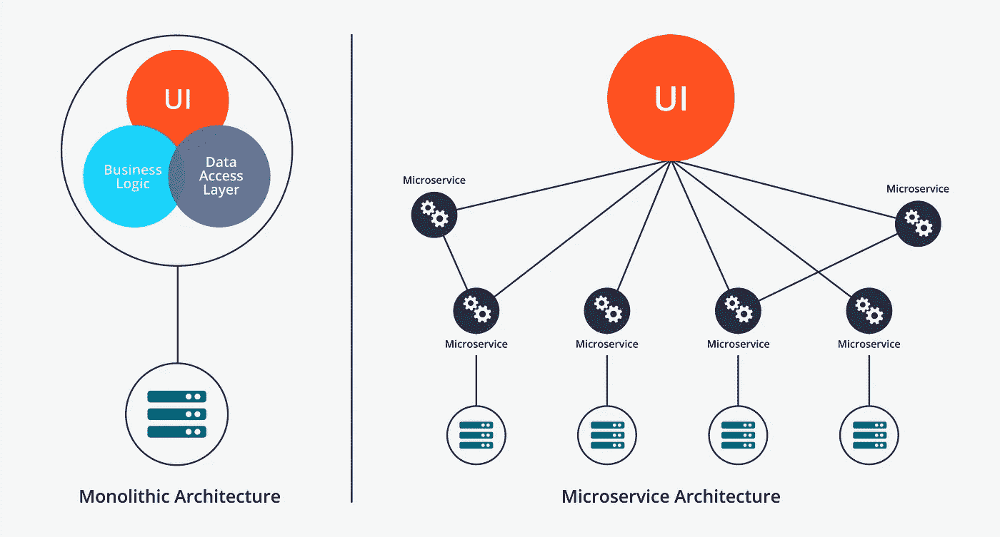
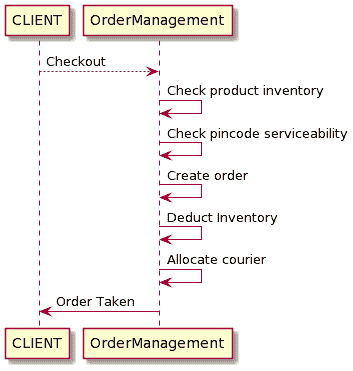
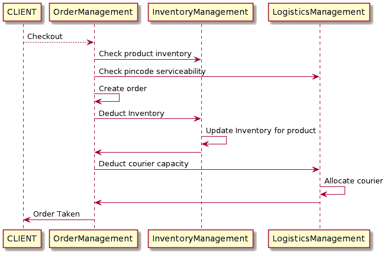
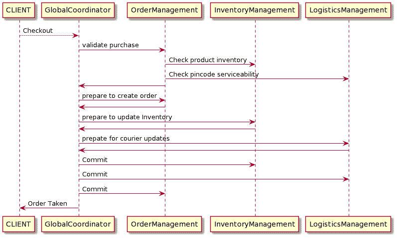
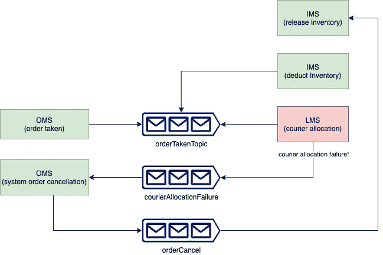

# 管理跨微服务的事务…

> 原文：<https://medium.com/javarevisited/managing-transactions-spanning-across-microservices-ccfd7c8a6e42?source=collection_archive---------1----------------------->

如何管理跨微服务的分布式事务？



毫无疑问，与整体架构相比，微服务架构有很多优点，但有一点在整体系统上更好，那就是事务性。在整体系统上更容易获得酸性(原子性、一致性、隔离性、持久性)属性，因为数据库可以确保酸度。但是当同一个系统被分解成许多微服务时，同一个事务可以被分解成许多按特定顺序调用的分布式本地事务。这些分布式事务增加了确保服务不会以全局不一致的数据结束的难度。

# 问题是



我们以一个典型的电子商务网站的接单系统为例。这是一个整体服务结账流程的例子。monolith 系统可以创建一个跨越多个实体的本地事务，如果出现任何问题，整个事务都可以回滚。

这是一个 ACID 的例子，这里是数据库系统保证的。

> ***原子*** *:事务在这里要么提交，要么回滚，* ***一致性*** *:因为数据在这里是一致的，* ***隔离*** *:当前事务对其他事务是不可见的，* ***持久性*** *:一旦提交就不能撤销*

当在微服务领域构建相同的系统时，所有服务都将拥有自己的数据库，相同的结账流程如下所示:

```
Order Management Service (OMS) — Job Order lifecycle management
Inventory Management Service (IMS) — Job Item Inventory Management
Logistics Management Service (LMS) — Job order fullfillment
```



现在，当 checkout 调用到来时，所有三个服务都必须对其数据库进行更改，同一事务现在分布在不同微服务的多个本地事务中，虽然很容易保持这些微服务上发生的单个事务的原子性，但整体事务可能会导致数据不一致。在上面的例子中，如果 LMS 快递分配失败，系统仍然会为它创建一个订单并更新库存。它是如何打破

# 分布式事务中的原子性🚀

为了解决上面讨论的问题，我们需要一种方法来告诉 OMS 和 IMS，LMS 已经失败，事务必须回滚！有两种广泛使用的架构来解决这个问题

1.  两阶段提交方法
2.  传奇模式

# 两阶段提交(2pc)

根据定义:

> **两阶段提交协议**将数据库提交分为两个阶段，以确保分布式数据库系统中的正确性和容错性。

顾名思义，2pc 将事务分为两个阶段——*准备阶段*和*提交阶段。*在准备阶段，所有相关的服务都被要求为事务做准备，一旦所有的服务都确认了准备，它们就被要求提交事务。如果任何服务以否定确认响应(在任何内部错误的情况下)，则在所有涉及的服务中全局中止事务。

为了实现这一点，需要一个事务协调器来管理整个事务生命周期，它向各个微服务发出准备命令并监听它们的响应。

让我们看看如何使用带有全局协调器的 2pc 来解决上述问题。



例如，如果后勤管理服务对全局协调器(GC)的准备调用作出否定确认的响应(这可能是由于任何内部服务故障)，GC 将向所有涉及的微服务发出中止命令，并且事务将被全局回滚。相反，如果服务肯定地确认了所有的准备调用，则 GC 调用提交这些更改，并且全局地提交事务。

**2pc 的优势:**

*   即使一个服务准备失败，整个事务也会中止，否则整个事务会成功。这确保了全局事务本质上总是原子的。
*   数据损坏的可能性很低。
*   读写隔离，因为数据只有在全局协调器提交更改时才可用。
*   如果同步调用响应成功，这意味着整个涉及微服务的事务是成功的。

**2pc 的缺点:**

*   2pc 最大的缺点是它长时间阻塞资源，所有的服务都需要锁定它们的资源，直到事务完成。多个相关的微服务增加了整个事务的时间，导致对象上的长锁。这就是为什么它只在某些情况下有用，不建议在其他情况下使用。这种方法不能用于高吞吐量的事务系统。
*   2pc 还需要一个单独的服务来充当事务协调者，这意味着管理和扩展该服务的额外责任。
*   事务协调器是 2pc 中的单点故障

# 传奇模式

2pc 的主要问题是它的同步特性，这会导致长锁，而 Saga 模式本质上是异步的(反应式的),从而使本地事务在单个微服务上快速运行。

这些本地事务通过事件总线异步触发。这里的想法是，每当源服务做出更改时，它都会发出一个事件，然后依赖服务可以侦听该事件以做出所需的更改。如果任何下游依赖服务失败，它们可以发出一个失败事件，源系统可以通过运行其补偿逻辑对其做出反应。



使用 Saga 模式的服务交易

继续我们的订单管理服务示例，IMS 和 LMS 可以开始监听订单创建更新，并为每个更新运行各自的本地事务，源微服务(OMS)可以依次监听来自 IMS 或 LMS 的任何更新，以运行其补偿逻辑(订单取消)。

**优势**

*   Saga 模式的一个主要优势是快速的本地交易。因为没有微服务依赖于任何外部服务，所以本地事务非常快，这也意味着资源上的锁被缩短，因此这可以在高吞吐量系统中使用。

**劣势**

*   使用 saga 模式的流中的多个微服务会使流变得复杂，可能会有多个故障点，并且会带来维护事件总线的额外责任。这种复杂性也增加了调试时间，以防出现任何问题。
*   因为单个服务事务不等待其他服务，所以所有本地事务不需要同步(这里没有读隔离)。如果队列中有一些延迟，这个问题将被放大。然而，这些系统将最终达到一致。
*   对同步调用的响应(上例中对订单服务的*初始结账调用*)可能会成功，但这并不一定意味着交易会在全球范围内成功。

# 结论

分布式系统中的事务具有挑战性，尽管有解决它们的方法，但所有这些方法都带来了一系列新的问题。首先应该设法避免微服务世界中的分布式事务，但如果有不可避免的需求，Saga 模式通常是架构的首选，主要是因为 2pc 在高吞吐量事务系统中不能很好地扩展，但前者有其自身的一系列问题，如事务之间没有读取隔离，最终一致性而不是即时一致性，以及系统的额外责任和复杂性。

如果你需要更多帮助，请随时联系我。请务必关注所有新的更新。谢谢你的阅读。干杯🍺

您可能喜欢的其他 **Spring Boot 和微服务文章**

[](/javarevisited/10-advanced-spring-boot-courses-for-experienced-java-developers-5e57606816bd) [## 面向有经验的 Java 开发人员的 10 门高级 Spring Boot 课程

### 高级 Spring Boot 课程为有经验的 Java 开发人员学习 Spring Boot 测试，云和容器…

medium.com](/javarevisited/10-advanced-spring-boot-courses-for-experienced-java-developers-5e57606816bd) [](/javarevisited/10-best-java-microservices-courses-with-spring-boot-and-spring-cloud-6d04556bdfed) [## 2021 年 Spring Boot 和 Spring Cloud 的 10 个最佳 Java 微服务课程

### 我最喜欢的 2021 年用 Spring Boot 和 Spring Cloud 为初学者学习 Java 微服务的在线课程来自…

medium.com](/javarevisited/10-best-java-microservices-courses-with-spring-boot-and-spring-cloud-6d04556bdfed) [](/javarevisited/top-10-courses-to-learn-spring-boot-in-2020-best-of-lot-6ffce88a1b6e) [## 我最喜欢的 2021 年学习 Spring Boot 的课程——最好的

### 大家好，如果你有兴趣学习 Spring Boot 并寻找一些很棒的资源，如书籍，教程…

medium.com](/javarevisited/top-10-courses-to-learn-spring-boot-in-2020-best-of-lot-6ffce88a1b6e)