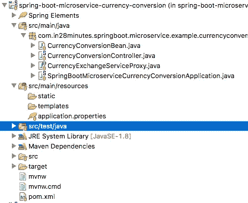
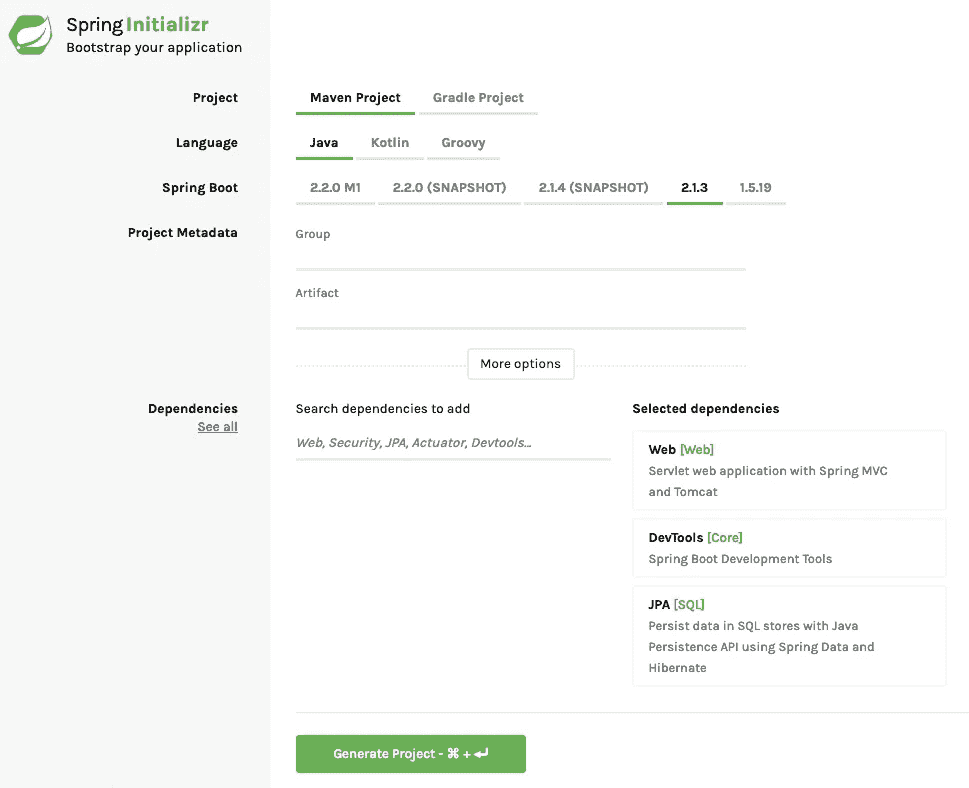

# 使用 Spring Boot 和 Java 的微服务—第 3 部分—示例 2 —创建货币兑换微服务

> 原文：<https://medium.com/javarevisited/microservices-with-spring-boot-and-java-part-3-example-2-creating-currency-conversion-55c008814201?source=collection_archive---------2----------------------->

我们来学习一下微服务和微服务架构的基础知识。我们还将开始研究 Spring Boot 微服务的基本实现。我们将创建几个微服务，并让它们使用 Eureka 命名服务器和 Ribbon 进行客户端负载平衡。

以下是微服务系列大纲:Spring Boot 微服务

*   第 1 部分— [微服务架构入门](https://www.springboottutorial.com/creating-microservices-with-spring-boot-part-1-getting-started)
*   第二部分— [打造外汇微服务](https://www.springboottutorial.com/creating-microservices-with-spring-boot-part-2-forex-microservice)
*   当前部分—第 3 部分—创建货币兑换微服务
*   第 4 部分— [使用 Ribbon 进行负载平衡](https://www.springboottutorial.com/microservices-with-spring-boot-part-4-ribbon-for-load-balancing)
*   第 5 部分— [使用 Eureka 命名服务器](https://www.springboottutorial.com/microservices-with-spring-boot-part-5-eureka-naming-server)

这是本系列的第 3 部分。在这一部分，我们将重点创建货币转换微服务。

# 你会学到的

*   如何用 Spring Boot 创建微服务？
*   如何使用 RestTemplate 执行一个 REST 服务？
*   如何使用 Feign 来执行 REST 服务？
*   相比 RestTemplate，Feign 有什么优势？

# 免费课程—10 步学会

*   [免费 5 天挑战——学习春天和 Spring Boot](https://links.in28minutes.com/SBT-Page-Top-LearningChallenge-SpringBoot)
*   [用 10 个步骤学习 Spring Boot](https://links.in28minutes.com/in28minutes-10steps-springboot)
*   [10 步学会 Docker](https://links.in28minutes.com/in28minutes-10steps-docker)
*   [十步学会 Kubernetes](https://links.in28minutes.com/in28minutes-10steps-k8s)
*   [用 10 个步骤学习 AWS](https://links.in28minutes.com/in28minutes-10steps-aws-beanstalk)

如果你需要更多的选择，你可以查看这些[免费的春季和 Spring Boot 课程](https://www.java67.com/2017/11/top-5-free-core-spring-mvc-courses-learn-online.html):

[](https://www.java67.com/2017/11/top-5-free-core-spring-mvc-courses-learn-online.html) [## 供初学者在线学习的 5 大免费核心 Spring、Spring MVC 和 Spring Boot 课程

### 我最近分享了很多资源，例如书籍和课程，当我将我的 5 大课程列表发布给…

www.java67.com](https://www.java67.com/2017/11/top-5-free-core-spring-mvc-courses-learn-online.html) 

# 资源概述

货币转换服务(CCS)可以将一批货币转换成另一种货币。它使用外汇服务来获取当前的货币兑换值。CCS 是服务消费者。

请求和响应的示例如下所示:

转到[http://localhost:8100/currency-converter/from/EUR/to/INR/quantity/10000](http://localhost:8100/currency-converter/from/EUR/to/INR/quantity/10000)

```
{
  id: 10002,
  from: "EUR",
  to: "INR",
  conversionMultiple: 75,
  quantity: 10000,
  totalCalculatedAmount: 750000,
  port: 8000,
}
```

上面的请求是找出 10000 欧元的印度卢比值。总计算金额为 750000 印度卢比。

下图显示了 CCS 和 FS 之间的通信。


# 项目代码结构

下面的屏幕截图显示了我们将要创建的项目的结构。



一些细节:

*   用 Spring 初始化器生成的 Spring Boot 应用程序类。这个类充当应用程序的启动点。
*   `pom.xml` -它包含了构建这个项目所需的所有依赖项。我们将使用 Spring Boot 入门网站。
*   `CurrencyConversionBean.java`——比恩按住我们想要发出的回应。
*   `CurrencyExchangeServiceProxy.java` -这将是调用外汇服务的虚拟代理。
*   `CurrencyConversionController.java` - Spring Rest 控制器公开货币兑换服务。这将使用`CurrencyExchangeServiceProxy`调用外汇服务。

# 您将需要的工具

*   Maven 3.0+是您的构建工具
*   你最喜欢的 IDE。我们使用 Eclipse。
*   JDK 1.8 以上

如果你需要了解更多关于 Java 开发人员必备工具的信息，你可以点击这里:

[](https://www.java67.com/2018/04/10-tools-java-developers-should-learn.html) [## 2020 年 Java 开发人员应该学习的 10 种工具-(更新)

### 我们离 2020 年只有一两个星期了，许多程序员已经开始为他们的目标制定一个好的过程…

www.java67.com](https://www.java67.com/2018/04/10-tools-java-developers-should-learn.html) 

# 用代码示例完成 Maven 项目

> 我们的 Github 存储库中有所有的代码示例—[https://Github . com/in 28 minutes/spring-boot-examples/tree/master/spring-boot-basic-microservice](https://github.com/in28minutes/spring-boot-examples/tree/master/spring-boot-basic-microservice)

# 使用 Spring Initializr 引导

用 Spring Initializr 创建微服务是小菜一碟。

spring Initializr[http://start.spring.io/](https://start.spring.io/)是启动你的 Spring Boot 项目的伟大工具。

您可以使用 Spring Initializr 创建各种各样的项目。



对于 Web 服务项目，必须完成以下步骤

*   启动 Spring Initializr 并选择以下选项
*   选择`com.in28minutes.springboot.microservice.example.currencyconversion`作为群组
*   选择`spring-boot-microservice-currency-conversion`作为神器
*   选择以下依赖项
*   网
*   开发工具
*   假装
*   单击生成项目。
*   将项目导入 Eclipse。文件->导入->现有 Maven 项目。

> 不要忘记在依赖项中选择 Feign

# 正在创建 CurrencyConversionBean

这是一个用于创建响应的简单 bean。

```
public class CurrencyConversionBean {
  private Long id;
  private String from;
  private String to;
  private BigDecimal conversionMultiple;
  private BigDecimal quantity;
  private BigDecimal totalCalculatedAmount;
  private int port; public CurrencyConversionBean() { } public CurrencyConversionBean(Long id, String from, String to, BigDecimal conversionMultiple, BigDecimal quantity,
      BigDecimal totalCalculatedAmount, int port) {
    super();
    this.id = id;
    this.from = from;
    this.to = to;
    this.conversionMultiple = conversionMultiple;
    this.quantity = quantity;
    this.totalCalculatedAmount = totalCalculatedAmount;
    this.port = port;
  }
```

# 用 RestTemplate 实现 REST 客户端

下面的代码展示了 REST 客户端调用 forex 服务并处理响应的实现。如您所见，需要编写大量代码来进行简单的服务调用。

```
@RestController
public class CurrencyConversionController { private Logger logger = LoggerFactory.getLogger(this.getClass()); @GetMapping("/currency-converter/from/{from}/to/{to}/quantity/{quantity}")
  public CurrencyConversionBean convertCurrency(@PathVariable String from, @PathVariable String to,
      @PathVariable BigDecimal quantity) { Map<String, String> uriVariables = new HashMap<>();
    uriVariables.put("from", from);
    uriVariables.put("to", to); ResponseEntity<CurrencyConversionBean> responseEntity = new RestTemplate().getForEntity(
        "http://localhost:8000/currency-exchange/from/{from}/to/{to}", CurrencyConversionBean.class,
        uriVariables); CurrencyConversionBean response = responseEntity.getBody(); return new CurrencyConversionBean(response.getId(), from, to, response.getConversionMultiple(), quantity,
        quantity.multiply(response.getConversionMultiple()), response.getPort());
  }
```

# 配置应用程序名称和端口

/spring-boot-微服务-货币-转换-服务/src/main/resources/application . properties

```
spring.application.name=currency-conversion-service
server.port=8100
```

我们正在分配一个应用程序名和一个默认端口`8100`。

# 测试微服务

通过启动 SpringBootMicroserviceCurrencyConversionApplication.java 来启动 Spring Boot 应用程序

到达`[http://localhost:8100/currency-converter/from/EUR/to/INR/quantity/10000](http://localhost:8100/currency-converter/from/EUR/to/INR/quantity/10000)`

```
{
  id: 10002,
  from: "EUR",
  to: "INR",
  conversionMultiple: 75,
  quantity: 10000,
  totalCalculatedAmount: 750000,
  port: 8000,
}
```

如果您运行在 Linux 上，您还可以使用 [cURL 命令](http://javarevisited.blogspot.sg/2017/03/10-examples-of-curl-command-in-unix-and-Linux.html)来测试 REST web 服务和微服务，如本文所示:

[](https://www.java67.com/2017/10/how-to-test-restful-web-services-using.html) [## 从命令行测试 RESTful Web 服务的 7 个 Linux cURL 命令示例

### Linux 的 curl 或 command 是一个非常强大和通用的命令，它允许您发送复杂的 HTTP…

www.java67.com](https://www.java67.com/2017/10/how-to-test-restful-web-services-using.html) 

# 创建虚拟代理

Feign 为 RestTemplate 提供了一个更好的替代方法来调用 REST API。

/spring-boot-microservice-currency-conversion-service/src/main/Java/com/in 28 minutes/spring boot/microservice/example/currency conversion/currencyexchangeserviceproxy . Java

```
package com.in28minutes.springboot.microservice.example.currencyconversion;import org.springframework.cloud.openfeign.FeignClient;
import org.springframework.cloud.netflix.ribbon.RibbonClient;
import org.springframework.web.bind.annotation.GetMapping;
import org.springframework.web.bind.annotation.PathVariable;@FeignClient(name="forex-service" url="localhost:8000")
public interface CurrencyExchangeServiceProxy {
  @GetMapping("/currency-exchange/from/{from}/to/{to}")
  public CurrencyConversionBean retrieveExchangeValue
    (@PathVariable("from") String from, @PathVariable("to") String to);
}
```

我们首先定义一个简单的代理。

*   `@FeignClient(name="forex-service" url="localhost:8100")` -声明这是一个虚假的客户端，外汇服务所在的 url 是`localhost:8100`
*   `@GetMapping("/currency-exchange/from/{from}/to/{to}")` -我们想要消费的服务的 URI

# 从微服务控制器使用假装代理

使用代理进行调用非常简单。您可以在下面的代码中看到它的作用。我们所要做的就是自动连接代理并使用来调用方法。

```
@Autowired
  private CurrencyExchangeServiceProxy proxy; @GetMapping("/currency-converter-feign/from/{from}/to/{to}/quantity/{quantity}")
  public CurrencyConversionBean convertCurrencyFeign(@PathVariable String from, @PathVariable String to,
      @PathVariable BigDecimal quantity) { CurrencyConversionBean response = proxy.retrieveExchangeValue(from, to); logger.info("{}", response); return new CurrencyConversionBean(response.getId(), from, to, response.getConversionMultiple(), quantity,
        quantity.multiply(response.getConversionMultiple()), response.getPort());
  }
```

# 启用伪装客户端

在我们能够使用 Feign 之前，我们需要在定义客户端代理的适当包中使用`@EnableFeignClients`注释来启用它。

```
@SpringBootApplication
@EnableFeignClients("com.in28minutes.springboot.microservice.example.currencyconversion")
@EnableDiscoveryClient
public class SpringBootMicroserviceCurrencyConversionApplication { public static void main(String[] args) {
    SpringApplication.run(SpringBootMicroserviceCurrencyConversionApplication.class, args);
  }
}
```

# 使用 Feign 测试微服务

进入[http://localhost:8100/currency-converter-feign/from/EUR/to/INR/quantity/10000](http://localhost:8100/currency-converter-feign/from/EUR/to/INR/quantity/10000)

```
{
  id: 10002,
  from: "EUR",
  to: "INR",
  conversionMultiple: 75,
  quantity: 10000,
  totalCalculatedAmount: 750000,
  port: 8000,
}
```

# 摘要

我们现在已经创建了两个微服务，并在它们之间建立了通信。


然而，我们在 CCS 中硬编码 FS 的 url。这意味着当启动新的 FS 实例时，我们无法在它们之间分配负载。

# 后续步骤

在下一部分中，我们将使用 Ribbon 启用客户端负载分布。

Spring Boot 的微服务

*   第 1 部分— [微服务架构入门](https://www.springboottutorial.com/creating-microservices-with-spring-boot-part-1-getting-started)
*   第二部分— [打造外汇微服务](https://www.springboottutorial.com/creating-microservices-with-spring-boot-part-2-forex-microservice)
*   当前部分—第 3 部分—创建货币兑换微服务
*   第 4 部分— [使用 Ribbon 实现负载平衡](https://www.springboottutorial.com/microservices-with-spring-boot-part-4-ribbon-for-load-balancing)
*   第 5 部分— [使用 Eureka 命名服务器](https://www.springboottutorial.com/microservices-with-spring-boot-part-5-eureka-naming-server)

如果你等不及了，想了解更多关于微服务的知识，可以看看这个 [**用 Spring**](https://dev.to/javinpaul/top-10-courses-to-learn-spring-boot-and-microservices-for-java-programmers-3hjg) 学习微服务的最佳课程列表:

[](https://dev.to/javinpaul/top-10-courses-to-learn-spring-boot-and-microservices-for-java-programmers-3hjg) [## Java 程序员学习 Spring Boot 和微服务的 10 大课程

### 披露:这个帖子包括附属链接；如果您从…购买产品或服务，我可能会收到报酬

开发到](https://dev.to/javinpaul/top-10-courses-to-learn-spring-boot-and-microservices-for-java-programmers-3hjg) 

# 完整的代码示例

# /spring-boot-microservice-currency-conversion-service/POM . XML

```
*<?xml version="1.0" encoding="UTF-8"?>*
<project  xmlns:xsi="http://www.w3.org/2001/XMLSchema-instance"
  xsi:schemaLocation="http://maven.apache.org/POM/4.0.0 http://maven.apache.org/xsd/maven-4.0.0.xsd">
  <modelVersion>4.0.0</modelVersion> <groupId>com.in28minutes.springboot.microservice.example.currency-conversion</groupId>
  <artifactId>spring-boot-microservice-currency-conversion</artifactId>
  <version>0.0.1-SNAPSHOT</version>
  <packaging>jar</packaging> <name>spring-boot-microservice-currency-conversion</name>
  <description>Microservices with Spring Boot and Spring Cloud - Currency Conversion Service</description> <parent>
    <groupId>org.springframework.boot</groupId>
    <artifactId>spring-boot-starter-parent</artifactId>
    <version>2.0.0.RELEASE</version>
    <relativePath /> *<!-- lookup parent from repository -->*
  </parent> <properties>
    <project.build.sourceEncoding>UTF-8</project.build.sourceEncoding>
    <project.reporting.outputEncoding>UTF-8</project.reporting.outputEncoding>
    <java.version>1.8</java.version>
    <spring-cloud.version>Finchley.M8</spring-cloud.version>
  </properties> <dependencies> <dependency>
      <groupId>org.springframework.boot</groupId>
      <artifactId>spring-boot-starter-web</artifactId>
    </dependency> <dependency>
      <groupId>org.springframework.cloud</groupId>
      <artifactId>spring-cloud-starter-openfeign</artifactId>
    </dependency> <dependency>
      <groupId>org.springframework.boot</groupId>
      <artifactId>spring-boot-devtools</artifactId>
      <scope>runtime</scope>
    </dependency>
    <dependency>
      <groupId>org.springframework.boot</groupId>
      <artifactId>spring-boot-starter-test</artifactId>
      <scope>test</scope>
    </dependency>
  </dependencies> <dependencyManagement>
    <dependencies>
      <dependency>
        <groupId>org.springframework.cloud</groupId>
        <artifactId>spring-cloud-dependencies</artifactId>
        <version>${spring-cloud.version}</version>
        <type>pom</type>
        <scope>import</scope>
      </dependency>
    </dependencies>
  </dependencyManagement> <build>
    <plugins>
      <plugin>
        <groupId>org.springframework.boot</groupId>
        <artifactId>spring-boot-maven-plugin</artifactId>
      </plugin>
    </plugins>
  </build> <repositories>
    <repository>
      <id>spring-snapshots</id>
      <name>Spring Snapshots</name>
      <url>https://repo.spring.io/snapshot</url>
      <snapshots>
        <enabled>true</enabled>
      </snapshots>
    </repository>
    <repository>
      <id>spring-milestones</id>
      <name>Spring Milestones</name>
      <url>https://repo.spring.io/milestone</url>
      <snapshots>
        <enabled>false</enabled>
      </snapshots>
    </repository>
  </repositories> <pluginRepositories>
    <pluginRepository>
      <id>spring-snapshots</id>
      <name>Spring Snapshots</name>
      <url>https://repo.spring.io/snapshot</url>
      <snapshots>
        <enabled>true</enabled>
      </snapshots>
    </pluginRepository>
    <pluginRepository>
      <id>spring-milestones</id>
      <name>Spring Milestones</name>
      <url>https://repo.spring.io/milestone</url>
      <snapshots>
        <enabled>false</enabled>
      </snapshots>
    </pluginRepository>
  </pluginRepositories> </project>
```

# /spring-boot-microservice-currency-conversion-service/src/main/Java/com/in 28 minutes/spring boot/microservice/example/currency conversion/currencyconversionbean . Java

```
package com.in28minutes.springboot.microservice.example.currencyconversion;
import java.math.BigDecimal;public class CurrencyConversionBean {
  private Long id;
  private String from;
  private String to;
  private BigDecimal conversionMultiple;
  private BigDecimal quantity;
  private BigDecimal totalCalculatedAmount;
  private int port; public CurrencyConversionBean() { } public CurrencyConversionBean(Long id, String from, String to, BigDecimal conversionMultiple, BigDecimal quantity,
      BigDecimal totalCalculatedAmount, int port) {
    super();
    this.id = id;
    this.from = from;
    this.to = to;
    this.conversionMultiple = conversionMultiple;
    this.quantity = quantity;
    this.totalCalculatedAmount = totalCalculatedAmount;
    this.port = port;
  } public Long getId() {
    return id;
  } public void setId(Long id) {
    this.id = id;
  } public String getFrom() {
    return from;
  } public void setFrom(String from) {
    this.from = from;
  } public String getTo() {
    return to;
  } public void setTo(String to) {
    this.to = to;
  } public BigDecimal getConversionMultiple() {
    return conversionMultiple;
  } public void setConversionMultiple(BigDecimal conversionMultiple) {
    this.conversionMultiple = conversionMultiple;
  } public BigDecimal getQuantity() {
    return quantity;
  } public void setQuantity(BigDecimal quantity) {
    this.quantity = quantity;
  } public BigDecimal getTotalCalculatedAmount() {
    return totalCalculatedAmount;
  } public void setTotalCalculatedAmount(BigDecimal totalCalculatedAmount) {
    this.totalCalculatedAmount = totalCalculatedAmount;
  } public int getPort() {
    return port;
  } public void setPort(int port) {
    this.port = port;
  }}
```

# /spring-boot-microservice-currency-conversion-service/src/main/Java/com/in 28 minutes/spring boot/microservice/example/currency conversion/currencyconversioncontroller . Java

```
package com.in28minutes.springboot.microservice.example.currencyconversion;import java.math.BigDecimal;
import java.util.HashMap;
import java.util.Map;import org.slf4j.Logger;
import org.slf4j.LoggerFactory;
import org.springframework.beans.factory.annotation.Autowired;
import org.springframework.http.ResponseEntity;
import org.springframework.web.bind.annotation.GetMapping;
import org.springframework.web.bind.annotation.PathVariable;
import org.springframework.web.bind.annotation.RestController;
import org.springframework.web.client.RestTemplate;@RestController
public class CurrencyConversionController { private Logger logger = LoggerFactory.getLogger(this.getClass()); @Autowired
  private CurrencyExchangeServiceProxy proxy; @GetMapping("/currency-converter/from/{from}/to/{to}/quantity/{quantity}")
  public CurrencyConversionBean convertCurrency(@PathVariable String from, @PathVariable String to,
      @PathVariable BigDecimal quantity) { Map<String, String> uriVariables = new HashMap<>();
    uriVariables.put("from", from);
    uriVariables.put("to", to); ResponseEntity<CurrencyConversionBean> responseEntity = new RestTemplate().getForEntity(
        "http://localhost:8000/currency-exchange/from/{from}/to/{to}", CurrencyConversionBean.class,
        uriVariables); CurrencyConversionBean response = responseEntity.getBody(); return new CurrencyConversionBean(response.getId(), from, to, response.getConversionMultiple(), quantity,
        quantity.multiply(response.getConversionMultiple()), response.getPort());
  } @GetMapping("/currency-converter-feign/from/{from}/to/{to}/quantity/{quantity}")
  public CurrencyConversionBean convertCurrencyFeign(@PathVariable String from, @PathVariable String to,
      @PathVariable BigDecimal quantity) { CurrencyConversionBean response = proxy.retrieveExchangeValue(from, to); logger.info("{}", response); return new CurrencyConversionBean(response.getId(), from, to, response.getConversionMultiple(), quantity,
        quantity.multiply(response.getConversionMultiple()), response.getPort());
  }}
```

# /spring-boot-microservice-currency-conversion-service/src/main/Java/com/in 28 minutes/spring boot/microservice/example/currency conversion/currencyexchangeserviceproxy . Java

```
package com.in28minutes.springboot.microservice.example.currencyconversion;import org.springframework.cloud.openfeign.FeignClient;
import org.springframework.cloud.netflix.ribbon.RibbonClient;
import org.springframework.web.bind.annotation.GetMapping;
import org.springframework.web.bind.annotation.PathVariable;@FeignClient(name="forex-service" url="localhost:8000")
public interface CurrencyExchangeServiceProxy {
  @GetMapping("/currency-exchange/from/{from}/to/{to}")
  public CurrencyConversionBean retrieveExchangeValue
    (@PathVariable("from") String from, @PathVariable("to") String to);
}
```

# /spring-boot-microservice-currency-conversion-service/src/main/Java/com/in 28 minutes/spring boot/microservice/example/currency conversion/spring boot microservice currencyconversionapplication . Java

```
package com.in28minutes.springboot.microservice.example.currencyconversion;import org.springframework.boot.SpringApplication;
import org.springframework.boot.autoconfigure.SpringBootApplication;
import org.springframework.cloud.client.discovery.EnableDiscoveryClient;
import org.springframework.cloud.netflix.feign.EnableFeignClients;@SpringBootApplication
@EnableFeignClients("com.in28minutes.springboot.microservice.example.currencyconversion")
public class SpringBootMicroserviceCurrencyConversionApplication { public static void main(String[] args) {
    SpringApplication.run(SpringBootMicroserviceCurrencyConversionApplication.class, args);
  }
}
```

# /spring-boot-微服务-货币-转换-服务/src/main/resources/application . properties

```
spring.application.name=currency-conversion-service
server.port=8100
```

# /spring-boot-microservice-currency-conversion-service/src/test/Java/com/in 28 minutes/spring boot/microservice/example/currency conversion/spring boot microservice currencyconversionapplicationtests . Java

```
package com.in28minutes.springboot.microservice.example.currencyconversion;import org.junit.Test;
import org.junit.runner.RunWith;
import org.springframework.boot.test.context.SpringBootTest;
import org.springframework.test.context.junit4.SpringRunner;@RunWith(SpringRunner.class)
@SpringBootTest
public class SpringBootMicroserviceCurrencyConversionApplicationTests { @Test
  public void contextLoads() {
  }}
```

您可能喜欢的其他 **Java 和 Spring 文章**

*   每个 Java 开发者都应该知道的 5 个 Spring Boot 特性([特性](https://javarevisited.blogspot.com/2018/11/top-5-spring-boot-features-java.html#axzz5YFjHrt5j))
*   2020 年在线掌握 Spring Boot 5 门课程([课程](https://javarevisited.blogspot.com/2018/05/top-5-courses-to-learn-spring-boot-in.html))
*   Java 开发人员在 2020 年应该学会的 10 件事([目标](https://javarevisited.blogspot.com/2017/12/10-things-java-programmers-should-learn.html#axzz5atl0BngO))
*   Java 开发人员在日常生活中使用的 10 个工具([工具](http://javarevisited.blogspot.sg/2017/03/10-tools-used-by-java-programming-Developers.html#axzz55lrMRnNC))
*   2020 年成为更好的 Java 开发人员的 10 个技巧
*   Java 程序员可以从 Spring 学习的 3 个最佳实践([最佳实践](https://javarevisited.blogspot.com/2018/06/3-best-practices-java-programmers-can-learn-from-spring-framework.html#axzz5K0PIOpHD))
*   2020 年学习 Spring Boot 和春云的 5 门课程([门课程](https://javarevisited.blogspot.com/2018/07/top-5-books-to-learn-spring-boot-and-spring-cloud-java.html))
*   改变 Spring Boot Tomcat 端口的 3 种方法([教程](https://www.java67.com/2019/07/spring-boot-3-ways-to-change-port-of-tomcat.html))
*   Java 开发者应该学习的 10 个 Spring MVC 注解([注解](https://www.java67.com/2019/04/top-10-spring-mvc-and-rest-annotations-examples-java.html))
*   15 Spring Boot Java 程序员面试问题([问题](https://www.java67.com/2018/06/top-15-spring-boot-interview-questions-answers-java-jee-programmers.html))

[](https://javarevisited.blogspot.com/2019/10/the-java-developer-roadmap.html#123) [## 2020 年 Java 开发者路线图

### 大家好，首先祝大家 2020 新年快乐。我已经分享了很多成为网络的路线图…

javarevisited.blogspot.com](https://javarevisited.blogspot.com/2019/10/the-java-developer-roadmap.html#123) [](/javarevisited/10-advanced-spring-boot-courses-for-experienced-java-developers-5e57606816bd) [## 面向有经验的 Java 开发人员的 10 门高级 Spring Boot 课程

### 高级 Spring Boot 课程为有经验的 Java 开发人员学习 Spring Boot 测试，云和容器…

medium.com](/javarevisited/10-advanced-spring-boot-courses-for-experienced-java-developers-5e57606816bd)