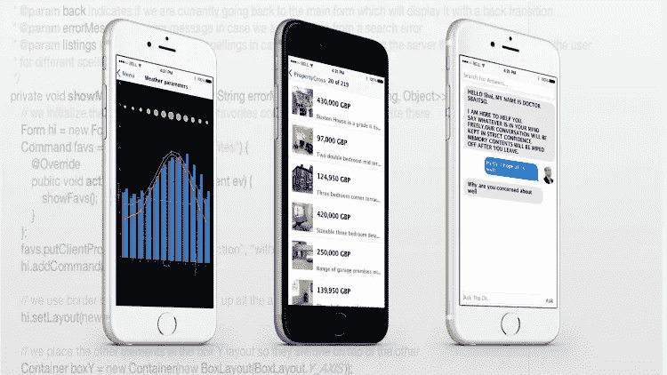

# Codename One 如何从 App Engine 迁移到 Spring Boot

> 原文：<https://medium.com/javarevisited/migrating-from-app-engine-to-spring-boot-75de8b4566ce?source=collection_archive---------1----------------------->

周末，我们将大量代码迁移到新的构建服务器上。在这篇文章中，我将尝试涵盖三个独立的事情。我将解释迁移的架构/历史和过程。哪些可行，哪些不可行，以及吸取的经验教训。最后，这将如何影响[代号一](https://www.codenameone.com/)的用户前进。

我希望非 Codename One 用户的普通公众会对这感兴趣，这是一个成功关闭应用引擎(和类似的 PaaS)的故事，特别是在我们的[应用引擎](/@Codename_One/why-and-how-we-left-app-engine-after-it-almost-destroyed-us-40ac2fc0b1a8)的可怕经历之后。

我将从一点历史开始解释背景和动机。我们在 2012 年 1 月成立了代号一。当时，我和陈在加速器中以完全启动模式工作。陈之前从未在初创公司工作过，他对工作的速度感到惊讶，他开玩笑地说，我们在太阳微系统公司 3 个月做的工作比 5 年还多！

构建云是在那段时间构建的，但在过去的 6 年中进行了改进，以适应我们不断增长的需求。我们错误地为构建云选择了应用引擎，因为我们希望缩短上市时间，同时保持实现的可扩展性。

> 谷歌为初创公司提供免费托管积分也是一个很大的激励因素。

构建云是作为一个整体构建的，这不是一件坏事。事实上，马丁·福勒特别建议人们先从整体架构开始。云服务器实际上不做构建，因为我们需要专用的独立服务器(例如 MAC、Windows 机器等)。

它本质上协调了所有不同的部分，使它们能够一起工作。过去，它处理的内容要多得多，但随着时间的推移，我们一个接一个地将这些内容分割出来，以迁移到微服务架构中，例如:

*   推
*   碰撞保护
*   构建文件提交
*   构建服务器 web 用户界面

还有更多。我们试图删除所有东西，因为应用引擎实在太糟糕了，但仍有相当多的东西留在云服务器上:

*   用户授权/注册/激活
*   构建流程编排—提交、状态、服务器分配等。
*   账单——我们不存储账单信息，但 PayPal 会通知旧服务器付款
*   一些事务性邮件基础结构

前两个是包含大量代码的大块。它们也与其他事物紧密相连。

当我们开始使用 App Engine 时，我们相信谷歌声称它支持 JPA。为了保持代码的可移植性，我们使用了 [JPA](https://javarevisited.blogspot.com/2018/01/top-5-hibernate-and-jpa-courses-for-java-programmers-learn-online.html) ，这样我们就可以迁移了。

> 正如我们发现的，JPA 对 App Engine 的支持是一个可悲的笑话。基本功能无法正常工作，并且令人痛苦地失败了，具有讽刺意味的是，这些故障只在业务扩展时才会发生，因此我们没有平稳地降低性能，而是停机了。

随着我们向前推进，我们重写了许多 JPA 代码，以使用 App Engine 实体 API 和`memcached`。谢天谢地，我们保存了很多旧的 JPA 代码。

在过去的一年里，更新应用引擎部署变得不可能，因为谷歌屏蔽了它用来支持应用引擎的旧插件。

迁移到一个全新的项目结构的方法没有得到很好的记录，并且看起来像是一个巨大的风险，因为事情可能会严重失败。所以我们别无选择。

# 它是如何工作的？

在开发[课程](https://codenameone.teachable.com/p/build-real-world-full-stack-mobile-apps-in-java)和[即将出版的书籍](https://www.codenameone.com/blog/uber-clone-book.html)时，我们与 Spring Boot 合作了很多。开发速度和易用性完全不同。

考虑到这一点，我们决定实时迁移到 Spring Boot 的服务器上，作为 app engine 的替代产品。为了保持可扩展性，我们决定使用 Cloudflare(就像我们在主网站上做的那样)。这使得扩展变得非常容易。

因为我们过去已经从 app engine 中提取了构建 UI，现在将它作为我们网站的一部分，我们对后端服务器有一个清晰的 API。有了它，我们可以改变所有进入 app engine 服务器的调用，并将完全相同的调用指向新的云服务器。

云服务器决定它是应该在本地处理呼叫还是让 App Engine 为它执行呼叫。通过这种方式，我们为现有用户添加了一个新层，但它应该是 100%兼容的，不应该失败。

我们不得不采取这种方法的原因是由于插件，因为它们安装在最终用户的机器上，有些可能仍然指向旧的应用程序引擎。我们不希望所有的构建突然中断。我们希望用户能够逐渐远离旧的应用引擎部署。

通常从零开始重写会更容易，但是因为我们希望尽可能少的中断，我们试图设置新的 [Spring Boot 服务器](http://www.java67.com/2018/06/top-15-spring-boot-interview-questions-answers-java-jee-programmers.html)100%兼容，所以我们必须导入代码，并试图将没有层的旧 servlets 混搭转换成适当的架构，适当地分离层。

它看起来仍然有点混乱，因为原始的有线协议是混乱的。但现在这已经成为过去，我们将能够重新审视这一点，并改善许多缺失的部分。

# 哪里出了问题？

> 很多事情都以意想不到的方式失败了。

我们在生产中遇到的最大问题是由于 Cloudflare。Cloudflare 阻止 DDoS 攻击，它使用的技巧之一是阻止所有不包括`User-Agent`报头的流量。

> 我们的很多代码使用了`URL`类，但没有添加这个头。所以基本的东西在开发环境中工作得很好，但在生产中却失败了。

当我们从数据存储转移到 [SQL](https://hackernoon.com/top-5-sql-and-database-courses-to-learn-online-48424533ac61) 时，我们迁移了许多旧的数字键。所以新的基于字符串的键工作得相当好，但是一些 JavaScript 客户端函数使用了语法，比如:`doThis(id)`。

这看起来是可行的，但是当密钥是一个字符串时，它就无声地失败了。我们必须给这些方法加上引号才能通过。由于平台中有如此多细微的特性，我们错过了测试。

一些 OTA 和安装功能在生产中失败。这与我们完全忽略的 app engine 实现中相对隐藏/模糊的代码有关。

事实上，我们在旧的应用引擎中使用了 [JSP](http://www.java67.com/2018/02/5-free-servlet-jsp-and-jdbc-online-courses-for-java-developers.html) 来实现一些特性。虽然 Spring Boot 支持 JSP，但它有一些部署限制，所以我们只是将代码转换为标准的 web 服务调用。

这不是一个理想的解决方案，但由于需要移植的代码很少，这是我们可以解决的问题。

工作一段时间后，Spring Boot 会因内存错误而失败。原来我们需要使用一个 conf 文件在 Spring Boot 显式设置`[Xmx/Xms](http://www.java67.com/2016/08/10-jvm-options-for-java-production-application.html)` [标志](http://www.java67.com/2016/08/10-jvm-options-for-java-production-application.html)。我们在之前的部署中没有遇到这种情况，因为我们没有像在这里一样执行一些繁重的 IO 任务。

# 什么工作很棒

> 这么多东西“就这么管用”！

到 SQL 的迁移基本上是顺利的，只有一些缺陷/模式变化。能够使用合适的 [SQL](http://www.java67.com/2018/02/5-free-database-and-sql-query-courses-programmers.html) 代替数据存储是一大进步。它快得多，我们不需要 Memcached，并获得更好的性能启动！

真正令人惊奇的是查询和第三方工具。这极大地提高了我们解决问题的能力。

尽管存在这个问题，Cloudflare 仍然是一笔巨大的资产。这使得缓存重复查询变得微不足道。更好的是，由于我们现在通过服务器代理一些下载，我们可以通过 Cloudflare 获得更快/更可靠的下载。

我对 [Spring Boot](http://www.java67.com/2017/11/top-5-free-core-spring-mvc-courses-learn-online.html) 赞不绝口，这让这变得微不足道。它有它的痛点(不可读的巨大堆栈痕迹)，但开发的容易程度是惊人的。我们现在通过 IaaS 管理自己的基础设施。与以前的 PaaS 部署相比，它更容易、更快、更便宜并且可扩展性更好。四个标准中的四个。

虽然到目前为止我们没有测试最大程度的扩展，但是 CPU 利用率是持平/较低的。这种架构可能比 app engine 更具扩展性。

> 谷歌将 App Engine 作为“谷歌规模”解决方案出售，但任何使用过它的人都会知道，这只有在你能花“谷歌总和”来支付的情况下才适用。

App Engine 试图通过增加计算资源来扩展，而不仅仅是降低速度。

这意味着，如果你有 10000 个活跃用户，你需要购买大量的服务器来处理这些用户。我们当前的解决方案可以轻松处理 10k 并发用户。它会慢下来，但不会崩溃。多亏了 Linode，它还是很便宜。

我们还借此机会将大部分交易电子邮件转移到 mailgun。因此，如果您收到我们的电子邮件，您会注意到它使用了不同的域名。

过去开发者注册时遇到的一个大问题是由于公司的收件箱把我们降级为垃圾邮件。我们做出了一些错误的技术选择，假设 SendGrid 可以帮助我们解决这些问题。T

与其说这是 SendGrid 的错，不如说是我们对这一领域缺乏了解。

我们决定为电子邮件开一个新的领域。我们没有把所有东西都搬到那里，我不确定我们是否会这样做，因为我担心是否能送达。不管怎样，这似乎是一个很好的举措，因为到目前为止，我们有 100%的送达率。

# 这对你有什么影响

我已经在这里讨论了其中的一些。但是还有一个额外的条目:IPN。

我们通过贝宝处理我们的订阅。我们很乐意添加其他选项，但所有这些选项的全球部署都存在后勤问题。我们不希望在我们的服务器上有任何计费数据，因为我们不想处理这种复杂性。

贝宝账单可以通过一个名为 IPN 的解决方案，这意味着贝宝调用我们的每一个账单。这样，我们可以根据收到的付款更新我们的用户数据库。到目前为止一切顺利。

遗憾的是，IPN 地址一旦设定就不能更改。因此，现有用户仍然指向旧的应用引擎 URL。我们有一个解决方案，轮询现有用户的订阅级别的应用程序引擎。

这只会影响当前的付费用户，并可能导致您的订阅似乎还有 2 天时间，即使它还有更多时间。

我们计划在 app engine 中迁移项目，因此 IPN 将是唯一剩下的部分，它将指向我们的服务器。为此，我们需要将 app engine 离线，并使用新项目对其进行设置。这需要时间。因此，目前，这种变通办法已经到位。

我们计划在月底禁用应用引擎版本。这意味着你需要更新你的插件到最新版本来构建。如果你不这样做，你会得到一个错误。我们仍然不会删除应用引擎，因为其他一些功能很难迁移。

# 下一步是什么？

现在这已经就绪，我们终于可以实现一些我们一直渴望的很酷的功能了…为免费用户提供更高的构建配额，包括推送通知等功能。

所有这些都将在未来几个月内出现…

我不想宣布日期，因为我仍在工作，我们需要推出代号 1 5.0，但它即将到来，希望在 5.0 之前，现在定于 9 月。

如果你想更多地了解 Spring Boot，这里有一些有用的资源，如书籍和课程，供进一步阅读:

1.  [Spring Boot 在行动](https://www.amazon.com/Spring-Boot-Action-Craig-Walls/dp/1617292540?tag=javamysqlanta-20)
2.  [Spring 框架大师班——初学者到专家](https://click.linksynergy.com/fs-bin/click?id=JVFxdTr9V80&subid=0&offerid=323058.1&type=10&tmpid=14538&RD_PARM1=https%3A%2F%2Fwww.udemy.com%2Fspring-tutorial-for-beginners%2F)
3.  [创建你的第一个 Spring Boot 应用](https://pluralsight.pxf.io/c/1193463/424552/7490?u=https%3A%2F%2Fwww.pluralsight.com%2Fcourses%2Fspring-boot-first-application)
4.  [学习春天和 Spring Boot 的 5 门免费课程](http://www.java67.com/2017/11/top-5-free-core-spring-mvc-courses-learn-online.html)
5.  [2018 年成为更好的 Java 开发人员的 10 个技巧](http://javarevisited.blogspot.sg/2018/05/10-tips-to-become-better-java-developer.html)
6.  [5 门春季安全课程在线学习](http://www.java67.com/2017/12/top-5-spring-security-online-training-courses.html)
7.  [学习 Spring Boot 和春云的 3 种方法](http://javarevisited.blogspot.sg/2018/01/how-to-learn-spring-core-spring-mvc-boot-security-framework.html#axzz55IgfKjy8)
8.  [2019 年学习 Spring Boot 的 5 门课程](https://javarevisited.blogspot.sg/2018/05/top-5-courses-to-learn-spring-boot-in.html)