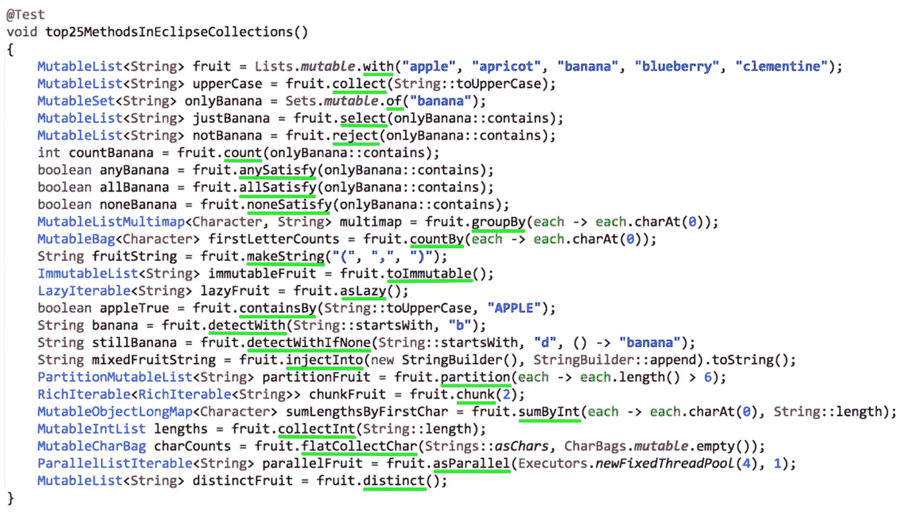
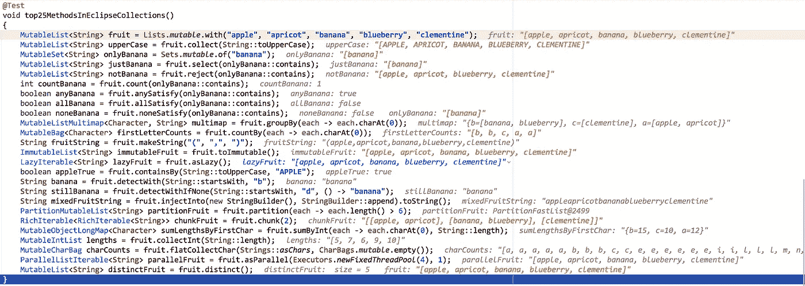

# Eclipse 集合 API 中我最喜欢的 25 个方法

> 原文：<https://medium.com/javarevisited/my-25-favorite-eclipse-collections-apis-a51589ee5c4a?source=collection_archive---------4----------------------->

在数百种可能性中，这些是 Eclipse Collections API 中我最喜欢的方法。

Eclipse 集合中我最喜欢的方法

# Eclipse 集合 API

Eclipse Collections 有一个功能非常丰富的 API。如果您曾经希望 Java 集合可以做一些更“像集合”的事情，Eclipse 集合可能有一个方法可以做到这一点。下面的博客给出了 Eclipse Collections API 上可用方法的思维导图。

</oracledevs/visualizing-eclipse-collections-646dad9533a9>  

# 可视化结果

你可以试着在脑子里调试上面的结果，但是我认为如果我用 IntelliJ 内联显示结果会更有帮助。

在 IntelliJ 中调试内联结果

# 我的前 25 名名单

我重点介绍的 25 种方法都链接到了它们的 JavaDoc，并提供了描述和链接到单独的支持博客。

*   [与](https://www.eclipse.org/collections/javadoc/10.4.0/org/eclipse/collections/api/factory/list/MutableListFactory.html#with(T...))/——集合[工厂方法](https://donraab.medium.com/my-25-favorite-eclipse-collections-apis-a51589ee5c4a?source=friends_link&sk=4376b5fd10ccefe47c4f56905cc89846)
*   [集合](https://www.eclipse.org/collections/javadoc/10.4.0/org/eclipse/collections/api/RichIterable.html#collect(org.eclipse.collections.api.block.function.Function)) — [将集合](https://donraab.medium.com/ec-by-example-collect-262a46030c49?source=friends_link&sk=8e4a6aee340389976c787f41c13b9f4c)从一种类型转换为另一种类型
*   [选择](https://www.eclipse.org/collections/javadoc/10.4.0/org/eclipse/collections/api/RichIterable.html#select(org.eclipse.collections.api.block.predicate.Predicate)) / [拒绝](https://www.eclipse.org/collections/javadoc/10.4.0/org/eclipse/collections/api/RichIterable.html#reject(org.eclipse.collections.api.block.predicate.Predicate)) — [过滤集合](https://donraab.medium.com/ec-by-example-filtering-4f14b906f718?source=friends_link&sk=1594797d204bcb37f59f70cf5b2454ef)
*   [计数](https://www.eclipse.org/collections/javadoc/10.4.0/org/eclipse/collections/api/RichIterable.html#count(org.eclipse.collections.api.block.predicate.Predicate)) — [基于谓词计数元素](https://donraab.medium.com/ec-by-example-counting-688dfaaf513c?source=friends_link&sk=ffee0e8ed0a363e72f4a2430b7d21d78https://donraab.medium.com/ec-by-example-counting-688dfaaf513c?source=friends_link&sk=ffee0e8ed0a363e72f4a2430b7d21d78https://donraab.medium.com/ec-by-example-counting-688dfaaf513c?source=friends_link&sk=ffee0e8ed0a363e72f4a2430b7d21d78https://donraab.medium.com/ec-by-example-counting-688dfaaf513c?source=friends_link&sk=ffee0e8ed0a363e72f4a2430b7d21d78)
*   [任意](https://www.eclipse.org/collections/javadoc/10.4.0/org/eclipse/collections/api/RichIterable.html#anySatisfy(org.eclipse.collections.api.block.predicate.Predicate)) / [全部](https://www.eclipse.org/collections/javadoc/10.4.0/org/eclipse/collections/api/RichIterable.html#allSatisfy(org.eclipse.collections.api.block.predicate.Predicate)) / [无满足](https://www.eclipse.org/collections/javadoc/10.4.0/org/eclipse/collections/api/RichIterable.html#noneSatisfy(org.eclipse.collections.api.block.predicate.Predicate)) — [短路方法](https://donraab.medium.com/ec-by-example-short-circuiting-methods-e60121bc5a?source=friends_link&sk=5ecb3da7c269dd43ba3f207443c88505)带谓词
*   [groupBy](https://www.eclipse.org/collections/javadoc/10.4.0/org/eclipse/collections/api/RichIterable.html#groupBy(org.eclipse.collections.api.block.function.Function)) — [根据函数对元素](/oracledevs/ec-by-example-groupby-7ca219358c3b?source=friends_link&sk=a2784eaa165bef00d6324dba4b403ef8)进行分组
*   [计数依据](https://www.eclipse.org/collections/javadoc/10.4.0/org/eclipse/collections/api/RichIterable.html#countBy(org.eclipse.collections.api.block.function.Function)) — [通过函数](/oracledevs/ec-by-example-countby-a2d6411e95e1?source=friends_link&sk=4c2605cfab962b8cb977b25e9e4a5d5d)对元素进行计数
*   [makeString](https://www.eclipse.org/collections/javadoc/10.4.0/org/eclipse/collections/api/RichIterable.html#makeString(java.lang.String,java.lang.String,java.lang.String)) — [使用分隔符将集合转换成字符串](https://dzone.com/articles/jvm-advent-calendar-hidden-treasures-of-eclipse-co)
*   [将一个集合转换成不可变的](https://www.eclipse.org/collections/javadoc/10.4.0/org/eclipse/collections/api/list/MutableList.html#toImmutable())等价物
*   [懒散](https://www.eclipse.org/collections/javadoc/10.4.0/org/eclipse/collections/api/RichIterable.html#asLazy()) — [在系列上创建懒散视图](https://donraab.medium.com/lazy-and-inexhaustible-f41ffda857dc?source=friends_link&sk=5c9ff9618a6a0acaaa714a3819cda2aa)
*   [包含 By](https://www.eclipse.org/collections/javadoc/10.4.0/org/eclipse/collections/api/RichIterable.html#containsBy(org.eclipse.collections.api.block.function.Function,V)) — [检查基于函数](/javarevisited/fusing-methods-for-productivity-c15c9eb2d666?source=friends_link&sk=ddde162c6aab068bda4619266d3b3bfb)的值的包含性
*   [detectWith](https://www.eclipse.org/collections/javadoc/10.4.0/org/eclipse/collections/api/RichIterable.html#detectWith(org.eclipse.collections.api.block.predicate.Predicate2,P)) — [找到匹配谓词的第一个元素](https://donraab.medium.com/ec-by-example-detect-a764c241bb81?source=friends_link&sk=5cb52ff4181d32b229a0e93e5b4d068d)
*   [detectWithIfNone](https://www.eclipse.org/collections/javadoc/10.4.0/org/eclipse/collections/api/RichIterable.html#detectWithIfNone(org.eclipse.collections.api.block.predicate.Predicate2,P,org.eclipse.collections.api.block.function.Function0)) —与 detectWith 相同，但处理无的情况
*   [注入](https://www.eclipse.org/collections/javadoc/10.4.0/org/eclipse/collections/api/RichIterable.html#injectInto(IV,org.eclipse.collections.api.block.function.Function2)) — [连续转移函数](https://donraab.medium.com/ec-by-example-injectinto-923a35c3b0cd?source=friends_link&sk=730f9e02a2622fa8fb9cba009b226ede)
*   [分区](https://www.eclipse.org/collections/javadoc/10.4.0/org/eclipse/collections/api/RichIterable.html#partition(org.eclipse.collections.api.block.predicate.Predicate)) — [基于谓词](https://donraab.medium.com/ec-by-example-partitioning-d2704f826e66?source=friends_link&sk=bac93f4516d88e47b719fcc778f40b79)分割集合
*   [chunk](https://www.eclipse.org/collections/javadoc/10.4.0/org/eclipse/collections/api/RichIterable.html#chunk(int)) — [根据大小将一个集合分成多个块](https://dzone.com/articles/jvm-calendar-hidden-treasures-of-eclipse-collectio)
*   [sumByInt](https://www.eclipse.org/collections/javadoc/10.4.0/org/eclipse/collections/api/RichIterable.html#sumByInt(org.eclipse.collections.api.block.function.Function,org.eclipse.collections.api.block.function.primitive.IntFunction)) —按关键函数和 Int 值对集合求和
*   [集合](https://www.eclipse.org/collections/javadoc/10.4.0/org/eclipse/collections/api/RichIterable.html#collectInt(org.eclipse.collections.api.block.function.primitive.IntFunction))—[的 8 个原始版本集合](https://www.eclipse.org/collections/javadoc/10.4.0/org/eclipse/collections/api/RichIterable.html#collect(org.eclipse.collections.api.block.function.Function))
*   [flatCollectChar](https://www.eclipse.org/collections/javadoc/10.4.0/org/eclipse/collections/api/RichIterable.html#flatCollectChar(org.eclipse.collections.api.block.function.Function,R))—[flatCollect](/@goldbal/ec-by-example-flatcollect-into-primitive-collections-43d40c16eb85)[的 8 个原始版本](https://donraab.medium.com/ec-by-example-flatcollect-3efe24e43da2?source=friends_link&sk=86b0fd5c5692d76a3404444d6685e4ef)
*   [asParallel](https://www.eclipse.org/collections/javadoc/10.4.0/org/eclipse/collections/api/list/ListIterable.html#asParallel(java.util.concurrent.ExecutorService,int)) —返回一个[performant Lazy parallel able](https://www.infoq.com/presentations/java-streams-scala-parallel-collections/)
*   [distinct](https://www.eclipse.org/collections/javadoc/10.4.0/org/eclipse/collections/api/list/MutableList.html#distinct()) — [返回列表中的 distinct 值](https://dzone.com/articles/jvm-calendar-hidden-treasures-of-eclipse-collectio)

# Eclipse 通过测试收集方法

我在下面包含了一个要点，以及使用 Eclipse 集合对每种方法的单独测试。

# 为什么既有 with 又有 of？

如果您想知道为什么 Eclipse Collections 在工厂类上既有`with`又有`of`方法，下面的博客会详细解释。

</javarevisited/preposition-preference-1f1c709b098b>  

# 比 EC 更熟悉 Java 流？

José Paumard 已经发布了一组使用 Java 流代替 Eclipse 集合的方法的解决方案。这有助于为开发人员提供“Rosetta Stone ”,使他们能够在 Eclipse 集合和 Java 流之间进行转换。以下是他的解决方案要点。谢谢你何塞！

下面的文章还可以帮助您利用 Java 流知识来学习 Eclipse Collections API。

<https://www.infoq.com/articles/Refactoring-to-Eclipse-Collections/>  

# 想自己尝试这些方法吗？

这个博客已经发展成为五个 Eclipse 代码集之一。

<https://github.com/eclipse/eclipse-collections-kata/tree/master/top-methods-kata>  

在 GitHub 上查看开放源代码[Eclipse Collections Kata repo](https://github.com/eclipse/eclipse-collections-kata)，并在 Top25MethodsTest 中尝试这些方法。

尽情享受吧！

*我是*[*Eclipse Collections*](https://github.com/eclipse/eclipse-collections)*OSS 项目在*[*Eclipse Foundation*](https://projects.eclipse.org/projects/technology.collections)*的项目负责人。* [*月食收藏*](https://github.com/eclipse/eclipse-collections) *是开投* [*投稿*](https://github.com/eclipse/eclipse-collections/blob/master/CONTRIBUTING.md) *。如果你喜欢这个库，你可以在 GitHub 上让我们知道。*