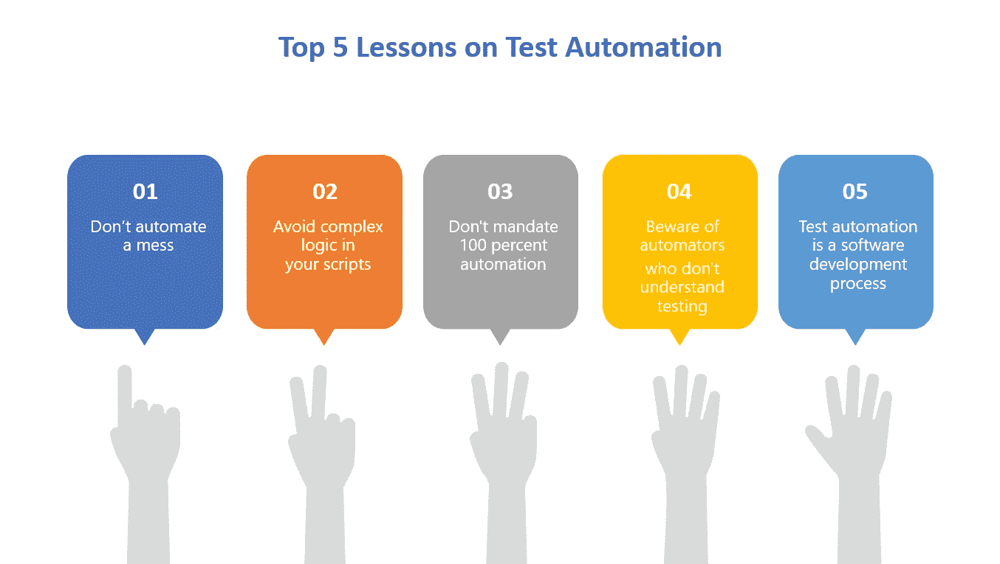
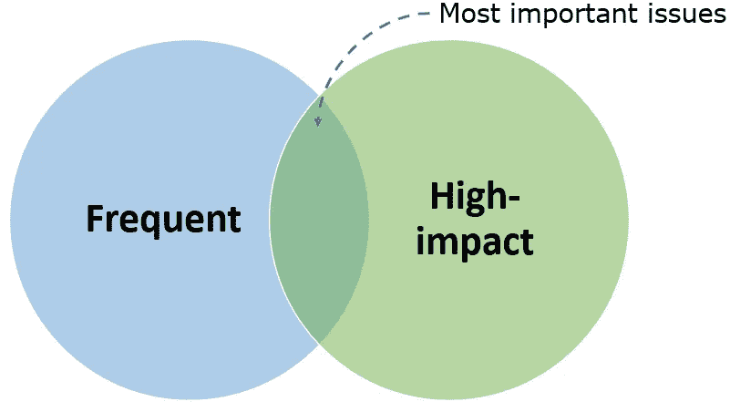
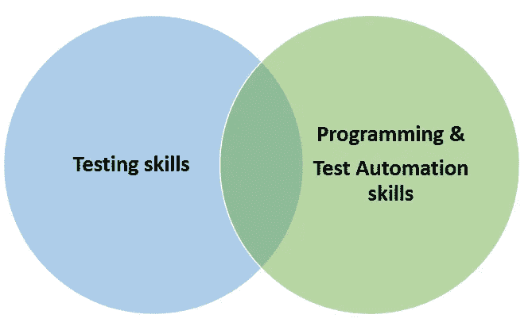
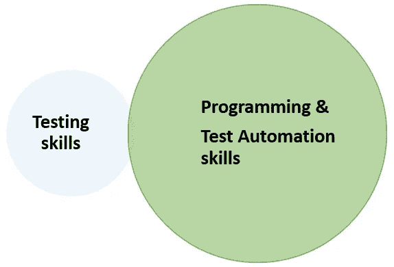
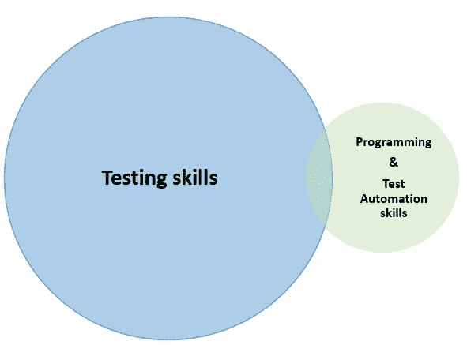
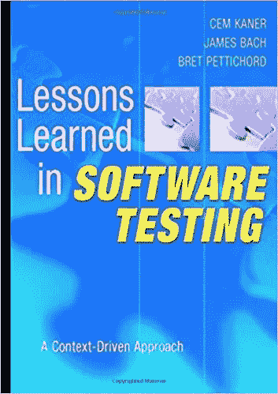

# 我关于测试自动化的前 5 课

> 原文：<https://medium.com/javarevisited/my-top-5-lessons-on-test-automation-ad4dec93ae2f?source=collection_archive---------1----------------------->

我最近发表了一个故事:

</@andrejss88/my-top-10-lessons-in-software-testing-458c929c4500>  

这些经验是我个人最喜欢的，来自《软件测试中的经验教训》这本书，我会讨论为什么它们特别重要，但是我故意忽略了《T2》第五章:自动化测试中的经验教训。

这有两个原因:

*   这是一个有 40 课的大章节
*   我是一名自动化工程师，所以自动化领域的问题和挑战对我来说尤为重要

所以我忍不住写了一个单独的故事，讨论自动化上最重要的课程。我喜欢并同意这 40 课中的大部分，所以挑选出最好的是一个挑战。为此，我应用了两个标准:

*   反映我在职业生涯中遇到的或从别人那里听到的最常见的**问题的经验教训**
*   强调**高影响力**问题的课程

# 1.不要让混乱自动化

**第 107 课**
**频率**:中等
**:非常高**

**您已经阅读了一些关于被测系统(SUT)的文档，您已经与向您解释 SUT 的同事进行了几次会谈，现在您很想开始，自动化一些测试，并向其他人展示您如何为项目增加价值！**

**但是你可能还没有准备好！在你写第一行自动化代码之前，请投入更多的时间来更好地理解你正在处理的东西。保持好奇，询问更多细节。一个简单的事实可能会极大地改变你的理解并影响你的行动。**

**你可能听过比尔·盖茨的这句经典名言:**

> **商业中使用的任何技术的第一条规则是，应用于高效运营的自动化将放大效率。第二是**自动化应用于低效率的操作会放大低效率**。"**

**或者正如本书作者更简洁地表述的那样:**

> **如果您有糟糕的测试，自动化可以帮助您更快地完成糟糕的测试。**

**事实上，通用的垃圾进垃圾出(GIGO)法则也适用于自动化。**

**你是否收到了一套由人工测试人员创建的测试，而你的工作就是将它们转换成代码？我从没见过这工作做得好的。手动测试人员创建测试来满足他们的需求(这是可以的),而不理解自动化的挑战。由此产生的自动化测试往好里说是笨拙的，往坏里说是不可维护的。**

**此外，你是否有足够的知识去挑战别人做的一些测试？也许他们错了，或者有一个缺口，或者有一个重叠，或者许多场景验证了多件事情，或者套件的结构很差？如果你对 SUT 不够了解，你会错过这些缺陷，并把它们“移植”到你的代码库中。**

> **作为一名自动化工程师，您的工作绝对是获得对领域和 SUT 的足够深入和广泛的理解，从而自己创建健壮的、有价值的测试场景！**

**测试和测试过程都在你的直接控制之下，作为一名专业的质量保证人员，你应该确保你所做工作的高质量。**

**当然，其他因素可能不在你的控制之下，比如一个大型的、复杂的、不稳定的测试环境，或者开发人员没有编写单元测试，但是那些是不同的事情。**

# **2.在你的脚本中避免复杂的逻辑**

****第 125 课**
频率:高
**冲击**:中等**

**好了，你已经确保了你理解了 SUT，并且你自动化的测试是高质量的。**

****但是好的输入仍然可能导致差的输出！****

****

**好的测试场景转换成坏的脚本**

**有很多方法可以让你的脚本变得更糟，但是经常出现的一种方法是**不必要的复杂逻辑**。当然，复杂的系统可能需要大量的支持或实用程序代码来处理 [*API 调用*](/javarevisited/7-best-courses-to-learn-postman-tool-for-web-service-and-api-testing-f225c138fa5a) 以及其他动作和计算。**

**但是这些不应该出现在你的测试体中。所有这样的代码都应该被包装到帮助器方法中并被移出。这些演变成类结构和整个测试自动化框架 (TAFs)。**

**以下是表明您的脚本比预期更复杂的两个信号:**

1.  ****if-else 或另一种分支，循环****

**分支经常暗示(a)你的测试没有使用参数化，或者(b)它正在验证几件事情，应该被分割。**

**(a)在 [Java](https://www.java67.com/2018/08/top-10-free-java-courses-for-beginners-experienced-developers.html) 中，TestNG 框架为我们提供了数据提供者。JUnit 也有类似的东西。**

**(b) *“用输入 A，我们验证一种行为，用输入 B，我们验证另一种”*？那是两个测试，不是一个，所以请分开。**

****2。任何种类的嵌套****

**你的测试应该是完全平坦的，因此读起来像一个故事。你能在你的剧本的侧面从上到下画一个直的垂直箭头吗？**

**生产或测试框架中的一些嵌套是可以的，但是无论如何应该通过标准的重构实践最小化。**

**但是在测试中，我提倡对嵌套代码(接近)零容忍。将所有助手代码包装成实用程序代码，并将其移动到其他地方，以便以后重用。**

> **当测试变得太复杂时，它们往往会出错。保持简单。保持测试的线性。**

**自然，嵌套不应该与缩进混淆，以提高可读性，特别是在像 [AssertJ](https://assertj.github.io/doc/) 这样的库使用 Fluent 接口的情况下:**

# **3.不要要求 100%的自动化**

****第 105 课**
**频率**:极高
**冲击**:中等**

**你和你的团队这个月已经写了几十或几百个测试。他们通过了，他们很稳定，他们甚至发现了一个回归错误。干得好！**

**但是它们只涵盖了所有可能的测试场景的一小部分，对吗？所以不可避免的问题来了(毫无疑问，来自管理层)——*覆盖范围是什么？我们什么时候能达到 100%？***

*   **在**单元测试**中强制 100%覆盖是个坏主意。一些[通过调整覆盖的定义来争论这个](https://dzone.com/articles/why-you-should-enforce-100-code-coverage)。“代码覆盖率”(差)和“分支覆盖率”(更好)之间也有区别。**

**来自 Vladimir Khorikov 的优秀著作“[单元测试原则、实践和模式](https://www.manning.com/books/unit-testing)”:**

> **[……]依靠覆盖度量来确定测试套件的质量是不够的。如果你开始把一个特定的覆盖率作为目标，不管是 100%，90%，甚至是 70%，这也会导致危险的区域。**查看覆盖率指标的最佳方式是将其作为一个指标，而不是目标本身。****

*   **对更高层次的测试强制 100%的覆盖率更糟糕！**

**为什么？因为这完全取决于你想出的测试场景！**

**事情是这样的:**

1.  **你为一个特性设想了 10 个测试，并且自动化了它们**
2.  **你说过你有 100%的保险。管理层**不可避免地**将其解释为 100%安全。**
3.  **在生产中发现了一个 bug，因为你没有想到第 11 种情况。或者这是一个复杂的整合问题。**
4.  **祝你解释清楚。**

**

来自 [Pexels](https://www.pexels.com/photo/man-wearing-brown-suit-jacket-mocking-on-white-telephone-1587014/?utm_content=attributionCopyText&utm_medium=referral&utm_source=pexels) 的[驼鹿照片](https://www.pexels.com/@moose-photos-170195?utm_content=attributionCopyText&utm_medium=referral&utm_source=pexels)** 

**经理们想要也需要数字来衡量业绩。你不会改变的。但是**从来没有**承诺 100%的覆盖率。相反，交流一下用你所拥有的时间和资源你能做什么和不能做什么。**

# **4.小心那些不懂测试的机器人**

****第 134 课**
**频率**:中等
**冲击**:高**

**你肯定知道好的测试自动化工程师是测试技能和编程技能的平衡混合体，对吗？**

****

**有时程序员承担测试自动化的任务。他们的测试知识几乎是不存在的，他们的态度可能更糟糕(“这不是真正的编程”)。在最好的情况下，您将拥有干净的、编程良好的测试，除了愉快的路径之外，不会验证太多。**

**过多关注编程而过少关注测试并不是一件好事。**

****

*   **关于 guru99.com 的[测试技术](https://www.guru99.com/software-testing.html)部分是一个良好的开端。**
*   ***第 3 章:测试技术*这篇文章所基于的那本书甚至更好。**

# **5.测试自动化是一个软件开发过程**

****第 118 课**
**频率**:高
**冲击**:非常高**

**前一点表明[程序员](https://hackernoon.com/whey-every-bloggerprogrammerhacker-should-create-online-courses-as-sidehustle-1kr230bf)低估了测试的技能，这导致了(可能)干净但低价值的测试自动化。**

**这一点是相反的——好的测试人员学习一些脚本，但是在没有应用干净的代码基础和其他原则的情况下复制粘贴他们的方法，直到代码库达到临界质量，项目被放弃，因为它是不可维护的。**

****

**换句话说，转向自动化的测试人员并没有学到“真正的”编程。每个人对什么是“真正的”编程都有自己的看法。**

**在我看来，你不必在白板上实现经典的排序算法，也不必理解低级的内存管理(除非你的工作直接要求你这么做)。**

**但是这里有一个我希望我的队友拥有和知道的技能和原则的列表:**

*   **[**清理代码原理**](https://pluralsight.pxf.io/c/1193463/424552/7490?u=https%3A%2F%2Fwww.pluralsight.com%2Fcourses%2Fjava-writing-readable-maintainable-code)**
*   ****坚实的原则—** 必须避免许多反模式**
*   ****模式**——至少 5 种最常见的模式，如[策略](https://javarevisited.blogspot.com/2014/11/strategy-design-pattern-in-java-using-Enum-Example.html)、[构建器](http://javarevisited.blogspot.sg/2012/06/builder-design-pattern-in-java-example.html)、[单体](https://javarevisited.blogspot.com/2014/05/double-checked-locking-on-singleton-in-java.html)。我自己对 [GoF 的模式列表](/javarevisited/7-best-online-courses-to-learn-object-oriented-design-pattern-in-java-749b6399af59)只了解一半。**
*   ****特定于语言的最佳实践—** 对于 Java 来说，这意味着阅读 Joshua Bloch 的[“有效的 Java”](https://www.java67.com/2018/01/effective-java-3rd-edition-by-joshua-bloch-must-read-book-for-java-develoeprs.html)。这也意味着使用[声纳资源规则](https://rules.sonarsource.com/java)。**
*   **测试自动化的具体做法——[首先，BICEP，正确的原则](https://www.pluralsight.com/courses/test-automation-java-fundamentals)。**
*   **代码评审——一项被严重低估的技能。许多人只是粉饰你的代码而没有给出适当的反馈，然后点击“批准”按钮。**
*   ****工具** (IDE、Build 工具、[、 Git](/javarevisited/7-best-courses-to-master-git-and-github-for-programmers-d671859a68b2) 等。)**

**掌握这些主题需要几年时间，但只要个人和团队不断努力，他们应该会没事的。但是没有它们，任何长期的测试自动化努力注定会失败。**

**<https://pluralsight.pxf.io/c/1193463/424552/7490?u=https%3A%2F%2Fwww.pluralsight.com%2Fcourses%2Ftest-automation-java-fundamentals>  <https://pluralsight.pxf.io/c/1193463/424552/7490?u=https%3A%2F%2Fwww.pluralsight.com%2Fcourses%2Fjava-writing-readable-maintainable-code>  

# 荣誉奖:鼓励单元测试套件的开发

**第 133 课**
**频率**:罕见
**影响**:未知，但可能非常有益

你是否曾经在高级功能测试中发现一个 bug，并对自己说“这真的可以通过简单的单元测试发现。他们没有吗？”

我当然有。但是我只是通知开发人员，建议他们为某些东西增加一个单元测试。我永远也不会知道他们有没有。

无论我到哪里，我都看到开发人员在做他们自己的事情([编写单元测试](https://javarevisited.blogspot.com/2015/02/simple-junit-example-unit-tests-for-linked-list-java.html))，软件开发人员在做他们自己的测试(编写更高层次的测试)。双方都不知道对方的测试套件。我认为这是非常低效的。

有很多关于“左移”的讨论——尽早测试，因此**防止**错误，而不是对它们做出反应。我坚信有能力的自动化工程师能够并且*应该*为单元测试套件做出贡献。

不，不是接管全部责任，让开发人员摆脱这项费力的任务，而是**为**做出贡献。

但截至 2020 年，这种做法并不普遍。事实上，我只知道一家公司做这样的事情——谷歌。在他们的书“Google 如何测试软件”中，作者解释说他们的 SDETs 是非常普通的开发人员，他们和团队的其他成员坐在一起编码，但是他们也关注、促进和执行所有可能的质量标准和测试自动化原则。

只有时间才能证明 IT 世界的其他人是否会以他们为榜样。

# **结论**

*   《软件测试中的经验教训》是一本很棒的书，即使在它首次出版 18 年后仍然有意义。
*   只有一章是关于测试自动化的，但是它充满了有价值的见解，我向所有当前和未来的 SDETs 推荐它。

您可能还对以下内容感兴趣:

</javarevisited/my-top-10-lessons-in-software-testing-458c929c4500>  </javarevisited/so-you-want-to-become-a-test-automation-engineer-16cad0db257c>  

*本文是“固执己见的 SDET 的故事”系列的一部分。*

*Andrejs Doronins 是职业 SDET 和* [*复数视线课程作者*](https://pluralsight.pxf.io/c/1193463/424552/7490?u=https%3A%2F%2Fwww.pluralsight.com%2Fauthors%2Fandrejs-doronins) *。如果你想学习测试自动化——查看我的课程——一个* [*免费试用版*](https://bit.ly/3q4ngNK) *将让你访问它们和 7000 多门其他课程的整个库。***