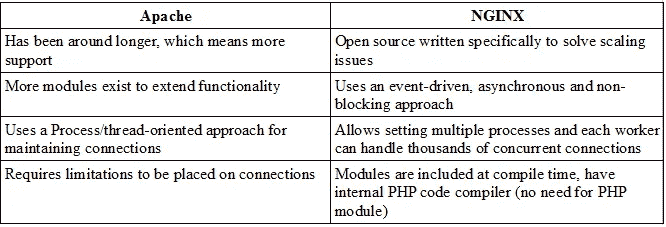

# NGINX——更好更快的 Web 服务器技术

> 原文：<https://medium.com/javarevisited/nginx-better-and-faster-web-server-technology-72ce5ad6305a?source=collection_archive---------4----------------------->

Nginx

网络服务器是任何互联网运营的支柱，决定正确的网络服务器类型可能是一个成功的应用程序/网站和一个落后的平庸网站之间的区别。所以，在你决定选择哪一个服务器之前，了解你的需求是很重要的。

# NGINX 是什么？

NGINX ，发音为 engine-X，是一个流行的 web 服务器，它还兼作 HTTP、TCP 和 UDP 服务器的反向代理、负载平衡器和 HTTP 缓存。伊戈尔·塞索耶夫在 2004 年设计的这个网络服务器是为了绕过 C10k 问题而设计的。

NGINX 是一个开放软件，但也提供付费计划，目前运行在多种环境中，包括 Unix、Linux、BSD 变体、MacOS、Solaris、AIX、HP-UX 和 Windows。塞索耶夫创建这个 web 服务器的目标是创建最快的 web 服务器，社区一直在努力保持这个目标。在衡量 web 服务器性能的基准测试中，它击败了其他 web 服务器。

随着网站变得越来越动态，NGINX 也紧随其后。从简单的 HTML 页面到动态网站，NGINX 支持现代网络的所有组件，包括 WebSocket、HTTP/2 和多种视频格式(HDS、HLS、RTMP 等)的流。

# C10k 问题

当互联网还年轻的时候，扩展并不是一个大问题。然而，随着互联网发展成为一种巨大的业务辅助工具，并通过网络将人们联系起来，伸缩性成为需要解决的主要问题之一。

web 服务器通常面临的主要问题是负载过重，当需要建立更多的连接时，web 服务器会变慢。1999 年，丹·凯格尔提出了 C10k 问题，他指的是 cdrom.com 的 Simtel FTP 主机，在那一年通过千兆以太网同时服务 10，000 个客户。

尽管今天的服务器已经具备处理如此多负载的能力，但许多 web 服务器仍然会遇到的问题是每秒处理更多的请求，这降低了处理请求的速度。NGINX 使用更具可扩展性的事件驱动(异步)架构，而不是依赖基于线程的请求处理系统，从而在不牺牲速度的情况下，每秒钟可以高效地处理更多请求。

# NGINX 的特点

*   低内存占用
*   能够同时处理 10，000 多个连接
*   静态文件、索引文件和自动索引的处理
*   带缓存的反向代理
*   负载平衡
*   兼容 IPv6
*   基于名称和基于 IP 的虚拟服务器
*   PUT、DELETE、MKCOL、COPY 和 MOVE 方法
*   FLV 和 MP4 流媒体
*   响应速率限制
*   限制来自一个地址的同时连接或请求的数量
*   嵌入式 Perl

这只是 NGINX 的几个特性，你可以在这里查看其特性的完整分类[。](https://nginx.org/en/)

# LEMP 堆栈

LEMP 是一个变位词，它定义了一组用于启动和运行服务器的软件。该堆栈包括以下四个软件:Linux、NGINX(发音为 engine-X) MySQL 和 PHP。

LEMP 栈是著名的 LAMP 栈的变体，但是用轻量级的强大的 NGINX 代替了 Apache，保持了栈的其余部分不变。

# LEMP 和灯的区别

如上所述，LAMP 和 LEMP 堆栈之间的唯一区别是 web 服务器。LAMP 的应用程序使用 Apache 网络服务器软件，而 LEMP 的应用程序使用 NGINX。

Apache 长期以来一直主导着服务器技术，并在万维网的最初发展中发挥了关键作用，但与 NGINX 和 Varnish 相比，它在静态页面的交付方面速度缓慢且落后。然而，在 2.4 系列中，Apache 已经成功地与基于事件的 web 服务器展开了正面竞争。你可以在这个教程中学习 Apache 的基础知识。

目前，LAMP stack 在构建网站时更受欢迎。然而，LEMP 紧随其后，为开发者提供速度更快、占地面积更小的 web 服务器。

# Apache vs NGINX

Apache 和 NGINX 可以被认为是硬币的两面，两者都以不同的方式提供相同的最终目标。Apache 和 NGINX 都是出色的软件，可以构建强大的动态网站。

**下面是每种服务器技术的一些特点:**

特征

虽然 Apache 和 NGINX 都是构建 web 服务器的出色软件，但 Apache 更适合功能繁重的应用程序和网站，而 NGINX 更快，能够处理更高的负载。NGINX 还提供了其他功能，如反向代理、负载平衡器和 HTTP 缓存，使一个强大的软件唾手可得。

如果你想掌握 NGINX，你可以从零开始学习这个神奇的 web 服务器，包括如何在这个[初学者教程](https://www.eduonix.com/courses/Software-Development/practical-nginx-the-zero-to-hero-guide?coupon_code=sfbsh10#utm_source=medium&utm_medium=referral&utm_campaign=sdaprl)中安装、配置和设置它。