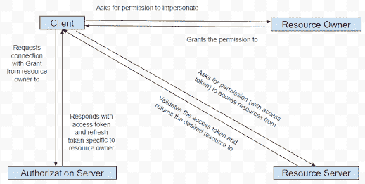

# 带有 Google 客户端库的 OAuth 2.0:Java SDK

> 原文：<https://medium.com/javarevisited/oauth-2-0-with-google-client-libraries-java-sdk-e5439accdf7a?source=collection_archive---------1----------------------->

> *免责声明:本实施指南旨在增强用户对概念的理解，而不是构建一个完全成熟的 Gmail 抓取应用程序，因此它只演示了在用户邮箱上执行的非常有限的操作。*

关于 Google OAuth 的设置和理论，我们已经讨论够了:

 [## Google OAuth 2.0:保护您的邮件抓取应用

### 免责声明:本文是对该解决方案的严格概述。详细的实施和设计不在…

medium.com](/@hrishabhpurohit/google-oauth-2-0-securing-your-mail-scraping-application-b5520ef0f390) 

现在让我们享受一些行动吧！

惊喜！！至少对我来说是。老实说，在我的上一篇文章中，我认为我已经承诺了很多，声明我将带着 Google [OAuth 2.0](/javarevisited/top-10-courses-to-learn-spring-security-and-oauth2-with-spring-boot-for-java-developers-8f0222d6066d) Gmail 用例的完整实现回来。结果是，我对自己的推销太少了。

是的，我带回了一份完整的指南，为你的 Gmail 抓取应用程序实现 OAuth 2.0。所以，只是重申一下，本指南以 Gmail 作为 Google OAuth 2.0 实现的用例，使用 Gmail API SDK 进行实现。

现在，对于阅读这篇文章的聪明人来说，如果您已经在想，每次您想从实现中复制一些代码时，都必须参考这篇文章，不要担心，我已经为您做好了准备。你可以直接从我的 [Git repo](https://github.com/HrishabhPurohit/google-oauth-demo) 中克隆实现，而不用参考本文中的代码片段。

不客气

所以我们直接开始吧，好吗？

# 再说一遍，什么？

好了，这是写给那些即使在“浏览”了前面提到的文章和 Github 库之后，仍然不知道我们到底在谈论什么的人的。

这一切都是为了保护任何云应用程序与第三方电子邮件服务器的连接，这些云应用程序试图通过抓取邮件服务器并代表其客户端提取信息来实现工作流自动化。

这是由 [OAuth 2.0 协议](https://www.blogger.com/blog/post/edit/1146479294431978500/5630876963551024394#)完成的。“如何设置”部分是我们在上一篇文章中讨论过的，而**“如何实施”**部分是针对这一篇文章的。总而言之，我们将会看到如何使用 **Google 的 OAuth 2.0 来连接给定用户的 Gmail 服务器**并对其收件箱进行操作。

# 有意义

正如我们现在必须知道的，OAuth 设置有一些核心组件需要在利用协议之前定义。让我们试着回忆一下:

*   **客户端** —在我们的例子中，它是我们的 Java 应用程序。
*   **资源服务器**——在我们的例子中，它是 Gmail。
*   **资源所有者** —在我们的例子中，它是我们想要操作其收件箱的用户。
*   **授权服务器**——在我们的例子中，它是 Google。

现在，让我们**将这些组件**编织在一起，让它们更有意义:

注意:请继续阅读以理解上述流程的顺序

从上面的流程可以清楚地看出，客户机组件需要足够智能，能够理解来自所有其他组件的响应，并向这些组件发出有效的请求。

这种智能只不过是第三方服务提供商提供的 API SDKs。在我们的例子中，我们将使用 Google OAuth API SDK 和 Gmail API SDK。这些**API 定义了客户机和服务器之间的契约**,这样客户机就可以发出有效的请求，并理解从服务器得到的响应。

# 谷歌 OAuth 2.0 客户端

正如我们已经讨论过的，对于我们的用例，我们将使用 OAuth 2.0 客户端方法实现 OAuth 2.0。另一种方法是使用服务帐户，需要对组织的 Gmail 域拥有管理员权限。

对于这个客户端应用程序，我已经在一个公共的 **Google cloud console 项目**中创建了一个对应的 OAuth 2.0 客户端。我说的“公开”是指它对任何电子邮件地址以“gmail.com”结尾的用户开放，并由所有者添加到项目中。

# 客户端请求模拟资源所有者的权限

客户端应用需要从资源所有者处获得**授权，授权其代表资源所有者尝试请求**访问和刷新令牌**。**

下面是我们如何通过 Google OAuth Java SDK 实现这一点:

我们来分析一下，好吗？

您需要两个常量:

然后，我们需要向我们的客户端应用程序提供我们创建的 OAuth 2.0 客户端的**客户端 id 和客户端机密**。这是 OAuth 客户端的身份，Google 授权服务器需要它来验证我们的客户端应用程序。这一行获取创建 OAuth 2.0 客户端时从 google cloud console 下载的 **JSON 文件**:

下面是我们的客户端应用程序将从读取这个 JSON 文件中获得的一些额外的重要信息:

*   **auth _ uri**:[https://accounts.google.com/o/oauth2/auth](https://www.blogger.com/blog/post/edit/1146479294431978500/5630876963551024394#)
*   **token _ uri**:[https://oauth2.googleapis.com/token](https://www.blogger.com/blog/post/edit/1146479294431978500/5630876963551024394#)

我们最终会看到这些 URIs 的用途，但现在让我们启动授权流程:

这里，我们使用 OAuth 2.0 客户端来启动带有一些附加属性的**授权流**。这里需要注意的一件重要事情是 **DataStoreFactory** 的使用。这个数据存储用于存储用户的访问和刷新令牌，这样即使应用程序被终止，下次应用程序启动时，它也不会从头开始。

现在，我们需要打开一个端口来监听来自资源所有者的**授权**(只有**授权码**)。以下命令将打开端口 8888:

如果您认为缺少了什么，我们还没有使用“auth_uri ”,下面是它的用法:

让我们仔细看看，我们可能没有注意到 auth_uri 的使用。一旦执行了上面的代码行，就会在系统输出或控制台中打印一个 URL:

> [https://accounts.google.com/o/oauth2/auth?access _ type = offline&approval _ prompt = auto&client _ id = 134130959775-v 05 vdon 8 u 5 da 7 eoa 1 k1 e 00 ufv 9 cnjru 9 . apps . Google user content . com&redirect _ uri = http://localhost:8888/Callback&response _ type = code&scope = https://www . Google APIs . com/auth/Gmail . readonly](https://www.blogger.com/blog/post/edit/1146479294431978500/5630876963551024394#)

看起来很相似对吗？是的，你是对的，它就是 auth_uri，只是它附加了一些查询参数。我假设参数定义是清楚的，因为我们在上次讨论中讨论了这里每个参数的含义。让我们分析这些参数，并尝试了解它们的来源:

1.  **access_type** :来自 6 号代码行。
2.  **审批 _ 提示**:来自 7 号代码行。
3.  **client_id** :来自 1 号代码行提供的 OAuth 客户端 JSON 文件。
4.  **redirect_uri** :这是一个本地主机 uri，因为我们期望授权代码在本地端口 8888 上发送。
5.  **response _ type**:web 应用的默认值。
6.  **范围**:来自 5 号代码行。

# 资源所有者将权限授予客户端

到目前为止，我们已经将 auth_uri 输出到控制台。但是现在呢？

OAuth 客户端和服务帐户方法之间的重要区别在于:资源所有者的**手动干预**。是的，资源所有者必须手动单击上述 auth_uri 并登录到其 Google 帐户，然后通过单击 OAuth 2.0 **同意屏幕**上的“允许”按钮授予权限。

一旦资源所有者这样做了，就会生成授权代码(代表所有者的授权)并发送回 redirect_uri。

# 客户端请求使用资源所有者的授权连接到授权服务器

还是感觉少了点什么，对吗？我的意思是，是的，我们现在有了授权代码，但我们不必再编写任何代码来解释代码并将其交换为访问和刷新令牌，对吗？

SDK 正在处理这个问题。

由于我们的客户端应用程序知道了 **token_uri** 并且现在有了授权码，它可以**在资源所有者不知情的情况下悄悄地请求交换**。酷！

# 授权服务器向客户端发送访问和刷新令牌作为响应

如果您还没有意识到，token_uri 只不过是授权服务器。它验证授权码并返回与资源所有者对应的访问和刷新令牌。

我们没有看到的是，这种交换发生在这条线的一部分:

“Credential”对象是存储用户的访问和刷新令牌的 SDK 类类型。

# 客户端请求从资源服务器访问资源的权限

对我们来说，资源是电子邮件，资源服务器是 Gmail。现在我们有了资源所有者的访问令牌，让我们尝试从 Gmail 访问电子邮件:

“Gmail”是知道如何与 Gmail 服务交互的 Gmail API SDK 类类型。请注意，仅这一行**不会**触发任何 **API 网络调用**到 Gmail API，因为它不会指定要访问的确切资源或 Gmail 上的确切操作。

为了指定确切的操作，我们将使用相应的 Gmail API SDK 客户端方法:

从收件箱获取电子邮件列表:

# 资源服务器向客户端发送所需的资源

上面的代码行将对资源服务器进行所需的网络调用，然后资源服务器根据资源所有者验证访问令牌，如果有效，则检查令牌的到期日**。无效或过期的访问令牌将导致 4xx HTTP 响应。**

尽管如果访问令牌有效且尚未过期，资源服务器会以所请求的资源进行响应。

# 立正！

我们现在很好地使用 Google OAuth flow 来操作用户的收件箱。但是，在实施时，有几个要点需要考虑:

*   人们可以**将访问令牌和刷新令牌**通过适当的加密保存到 DB 中。这一点很重要，因为每次用户请求获取/刷新访问令牌时，应用程序都会访问 google 服务器，这会产生不必要的开销。因此，仅在新的访问令牌过期时才请求它可能是一种**高效的**方法。
*   不应该将 OAuth 客户机 JSON 文件放在应用服务器中。原因是，它将大部分暴露在公共互联网上，因此会使你的客户的数据易受攻击。人们可以将文件保存在安全的 BLOB 存储器中，如 [AWS S3](/javarevisited/7-best-aws-s3-and-dynamodb-courses-for-beginners-in-2021-a8a44b6066da) ，并将 S3 BLOB 的加密路径存储在数据库中。这确保了您的客户端数据的安全性。
*   请记住，一旦**终端客户端更改其 Gmail 帐户的密码**，刷新令牌就会失效。
*   为你的应用程序发出的每个 Google API 请求设置一个严格的一次性重试策略，以防间歇性网络故障，可以让你的应用程序更加健壮。
*   为用户的访问令牌构建一个应用程序级**缓存机制**可能会有所帮助，因为这将减少对您的 [DB](/hackernoon/top-5-sql-and-database-courses-to-learn-online-48424533ac61) 的调用次数。

# 下一步是什么？

接下来，将为同一解决方案实现 Google 服务帐户方法。虽然它需要一些领域管理活动，但我们将更多地关注我们作为开发人员能做些什么。小心那个！

# 参考

https://developers.google.com/gmail/api/quickstart/java