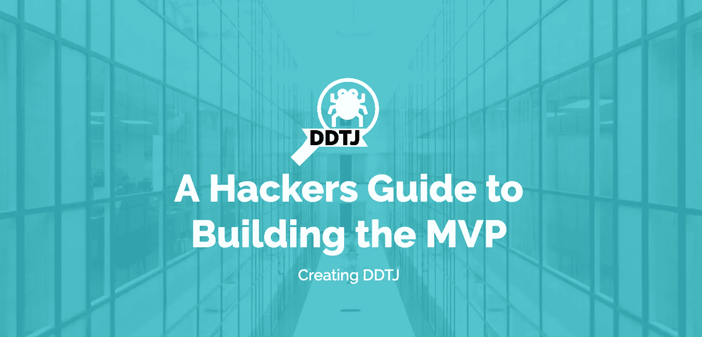

# 开源软件产品开发，构建 DDTJ —第 1 天

> 原文：<https://medium.com/javarevisited/open-source-software-product-development-building-ddtj-day-1-f87d0c648288?source=collection_archive---------2----------------------->

我正从 Lightrun 休假两周，我有一种建立新东西的冲动。我还有一个很棒的产品创意:DDT。过去我做过许多项目，包括商业项目和开源项目。我从未记录完整的过程。这是我想改变的事情。所以在这篇博客中，我将回顾从概念开发到产品原型的过程。注意，这个过程对于私有软件也是一样的，这是一个非常相似的方法。

你，读者，在这方面有一个关键的角色:你是我的“日报”。我没有能监督我的项目和产品经理，所以我需要你…

拖延是任何项目最大的失败点。这是项目兴衰的地方。在正常的公司环境中，我们每天都有会议来应对这种情况。你知道明天你将不得不站在整个团队面前谈论你所做的。所以你必须“做点什么”,这样你才能在每天的会议中被覆盖。

对于一个人的开源项目，你是孤独的。没有产品团队可以汇报，没有产品路线图，你也不会被解雇。拖延成为一个主要的诱惑。这就是博客可以通过利用开源社区的力量提供帮助的地方。我希望你能让我保持“诚实”，我需要你阅读并遵循这一点，所以停下来会很尴尬。但我也需要你提问题，让我专注于产品策略。人们很容易忘乎所以，试图创造一个过于复杂的产品。如果看起来我偏离了最有价值球员，请告诉我。

我计划写 10 篇博文，直到我们有了这个项目的第一个工作版本。我会跳过周末工作，因为如果我这样做，我的家人会杀了我…我希望我能保持这个速度，并记录这个过程。我也希望它会很有趣。

# 该过程

我已经过了第一个主要部分，也就是产品理念。我想已经有很多关于创意产生的文章了，所以我就不写了。正如我所说，我正在研究的想法是 DDT(确切地说是 DDTJ)，我很快就会谈到这一点。

这是未来 10 天的计划。我不知道我是否能坚持下去或超越它，但这是我的大方向。这不是“真正的”产品管理，但在早期阶段，黑客心态比有组织的过程更有用:

*   初始开发人员指南和基本设计
*   为项目搭建脚手架并实施 CI
*   使用初始服务器单元测试连接到服务器
*   实施 CLI 的第一个版本
*   实现模仿抽象逻辑
*   创建用于模仿知名库的测试*性能和集成测试

这是一个灵活的指南，而不是产品路线图。当我前进的时候，我会为错误、遗漏和延误留有余地。

# 目标市场

这个列表中还缺少一样东西，而我已经做了。你需要验证你正在做的项目的概念，一个“适合市场的产品”。亨利·福特有一句名言:

> “如果我问人们想要什么，他们会说是更快的马。”

但事情是这样的，[他没有说](https://quoteinvestigator.com/2011/07/28/ford-faster-horse/)！

也是个扯淡的概念。人们想要汽车，并提出要求。福特制造了人们所要求的东西:更快、更便宜的汽车。每个创新者都是如此。一个成功的产品或成功的开源项目始于真实的人的需求。

当我向人们解释这一点时，我经常得到的回应是，这是与专有软件相关的“闭源”思维。这是错误的，开源软件需要一个合适的产品开发过程，就像任何专有软件工具一样。我们希望人们使用我们的工具…但我们希望他们花时间使用我们的工具，而时间就是金钱。我们需要提供一个崇高的产品概念，不管我们的源代码许可证！

# 首先是开发人员指南

我基本上是按照时间顺序排列的。我非常相信非常“轻”的设计。我真的无法忍受这些庞大的文件最终成为我们所有错误的遗产。

你不能调试设计。在某些情况下，这是非常必要的，但它们通常是例外，而不是规则。

我通常从为最终的物理产品创建一个简单的开发人员指南开始。这具有以下优点:

*   它迫使我们首先考虑成品。它的外观和感觉
*   我们维护它，因为它是指南，它不会太陈旧。“活的”文档很重要
*   它让我们将产品策略集中在特定的目标上。例如，指南中的这个模块与系统中的那个模块相关
*   它向其他人解释产品。测试产品是否适合市场是很重要的，有一个清晰的指南是至关重要的

我今天完成了 DDTJ 开发者指南的初稿。你可以在这里查看。

# 脚手架和 CI

我相信首先要为所有的大作品创建模型。决定大的场景，然后一起冲洗出来。这背后的逻辑是尽快看到第一个全栈进程运行，以发现我们可能存在的任何概念问题。当我们有不止一个开发人员时，这也有助于开发团队更快地行动。我们可以找到各自的沙盒。

在我们的特定体系结构中，我们有三个层，其中有一个公共库。我们总是可以在 MVP 之后进行重构，所以我们不应该太纠结于决策。脚手架的主要部分是技术的选择。大多数情况下，这没什么大不了的。然而，我们需要限制我们的范围，警惕 RDD(简历驱动设计)，它是一个无声但致命的项目杀手。

将 CI 构建到位并进行一些代码质量验证是很好的常识。尤其是安全性、静态分析等。即使只有一个人在项目中工作，这也很重要…

# 那么什么是 DDT 或者 DDTJ 呢？

随着我们的进展，我将讨论其他要点，但是让我们谈一谈这个项目。如果你能在这里跟着它就太好了。

DDT 代表开发驱动测试。DDTJ 是 DDT 思想的实现。

这个想法很简单。当我们在几乎任何公司都有一个 bug 时，就需要添加一个测试来测试这个 bug。这通常比修复本身更难做到。DDT 就是修复 bug，运行你的服务器。然后为失败的案例生成单元测试。

单元测试通常很容易编写，但是模拟并不简单。那就是 DDT 要努力发光的地方。

基本技术还有许多其他用途，例如，我们可以检测到测试没有覆盖的代码，并自动为该代码生成单元测试。但那不是 MVP 的一部分。

# 产品管理路线图

我说过没有路线图，但我计划了 MVP，这有点像路线图。我们至少需要“证明”DDT 是有用的。

*   生成测试的 CLI
*   用 Spring Boot 应用程序支持 Java

我设定这些目标是因为它们将为足够大的社区提供一些有用的东西，并且我对 Java/Spring Boot 足够了解。我希望架构是通用的，因为这个概念可以翻译成大多数语言和框架。因此，如果 MVP 成功，DDT 将增加对其他平台/语言的支持。

# 技术挑战

明确地说，我不确定滴滴涕在技术上是否可行。所以我会尽快尝试用一个产品原型来证明。我认为即使产品开发失败了，仍然有很多东西要学，所以这仍然是一次宝贵的经历。

但我需要做好准备，所以我对未来的挑战做了很多思考，并把它们整理成以下有序列表:

1.  这是不可能的——本质上，我需要监控正在运行的应用程序中的每一个方法。最初，我想我会使用调试器 API 来遍历应用程序。但我不确定这是否可行。我正在考虑字节码操作，但是这有它自己的问题。主要问题是规模问题。调试器方法适用于小型应用程序，但可能不适用于大型应用程序。
2.  性能——它可能不切实际，因为它对性能有如此重大的影响，使应用程序不可用。在实际应用中，它可能会消耗太多内存。
3.  生成模拟可能很困难——生成阶段会非常困难，因为我们需要理解所涉及的类。我们需要生成模拟代码，为我们从未“见过”的类进行编译。
4.  支持其他语言/平台可能具有挑战性。它们并不都具有相同的能力。

在我解释我的架构选择时，我将在下面的帖子中解决这些问题。

# 明天

明天我计划谈谈为什么我做了一些架构选择，以及你应该如何选择合适的工具来构建你的 MVP。

我还将计划谈谈搭建过程以及我是如何开始这个项目的。

如果你想知道我最近在做什么？请在 twitter 上关注我。