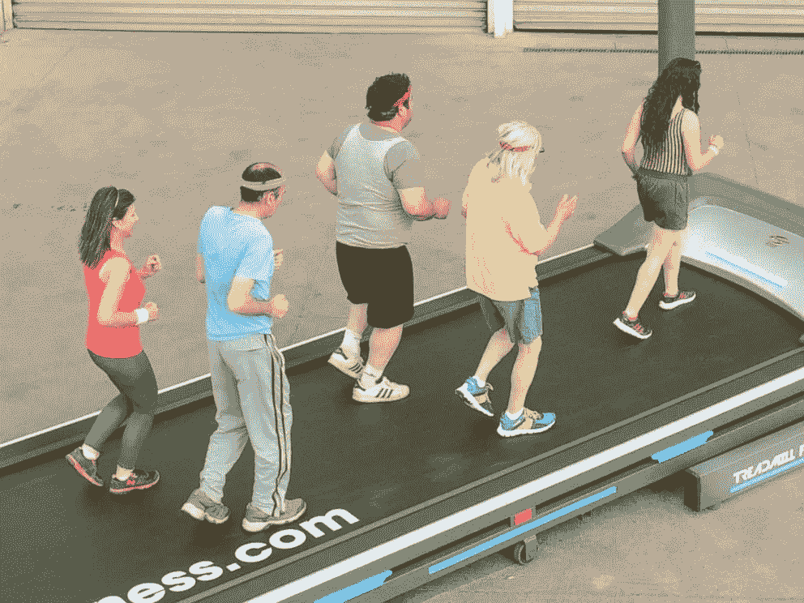
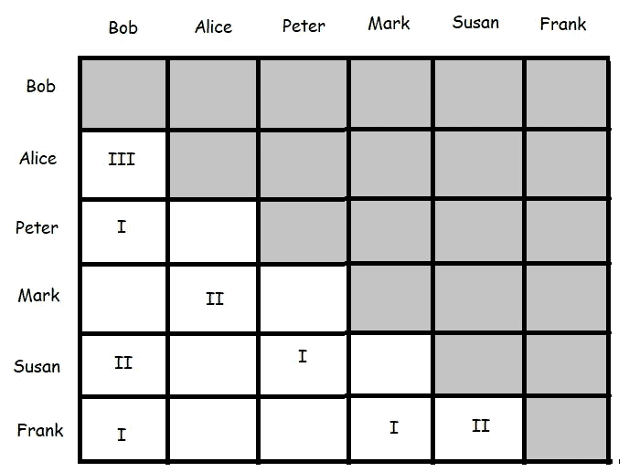
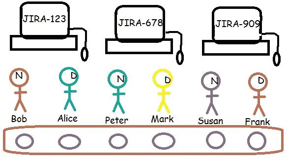
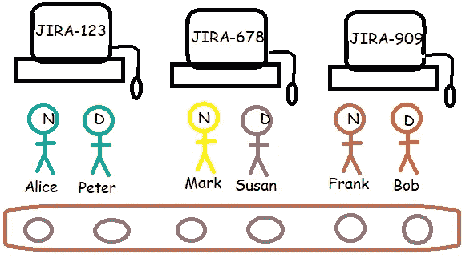
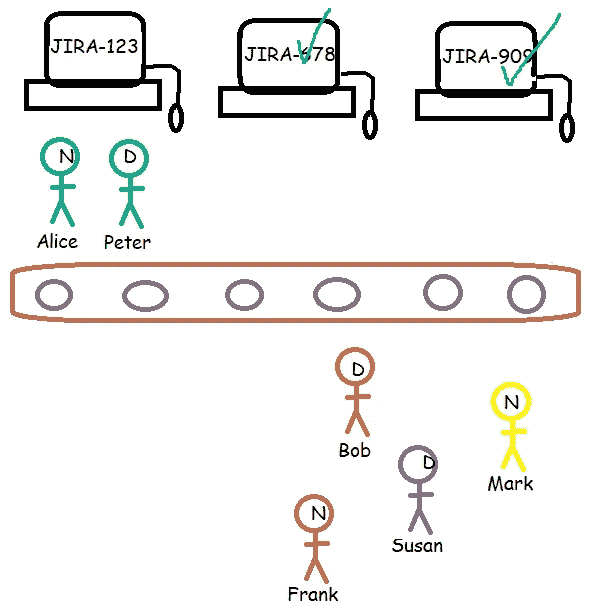
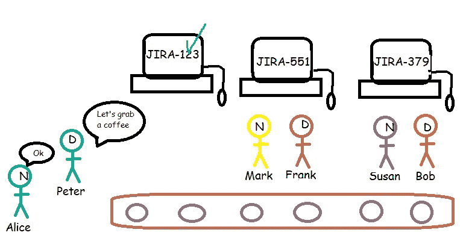

# 配对螺纹研磨机

> 原文：<https://medium.com/javarevisited/pairing-threadmill-9839aa260776?source=collection_archive---------3----------------------->

线程工厂中的成对程序员

当一个团队进行结对编程时，结对中有时会有很多重复。换句话说，同样的人一直在做，没有交换。

为了提醒两人应该交换位置，有一种东西叫做配对楼梯。这是一种直观的方式来查看谁已经与谁配对。是一个非常简单的图表，在这个图表中，团队成员每次完成一次配对后都会画一条线。

楼梯配对示例

正如我们在上面的图片中看到的，这个工具可以让我们了解谁在配对，谁没有配对，以及配对的次数。例如，我们可以很容易地注意到 Bob 几乎和每个人都配对过，但是其他团队成员并不经常配对。所以团队可以决定交换搭档。

这个工具既有用又灵活，因为在现实生活中，有时人们去度假、生病或其他某种事件会阻止他们配对。但不管怎样，我仍然认为它缺少一些东西:

**逻辑顺序** 由于这种工具依赖于简报/起立发言时的协商，并不执行严格的顺序，如果人们不体谅它，它可能会被无意识地滥用。虽然它提供的灵活性很大，但如果使用不当，就会有重复太多的风险，甚至会减缓学习体验，如果配对没有更均匀地混合的话。

结对编程中的冠军
由于这样或那样的原因，结对编程可能会在任务尚未完成时交换成员。如果这种交换发生了，重要的是只有一个成员离开，而不是两个都离开。留下的成员将被视为冠军。他的角色将是通过成为导航员来加速下一个成员的加入。

**谁开车谁导航？**
配对楼梯并没有告诉谁应该导航，谁应该开车。虽然在结对编程中，驾驶和导航的角色可以或者应该在每个会话期间至少交换一次，但是至少强制执行开始角色可能是有益的。其原因是，在配对楼梯中，我们可能不知道是否有背部练习，例如坐在后座上。也许一个新加入者不知不觉地只是有一个错误的经历，因为从来没有被允许开车，实际上只是一直跟着。

因此，基于上述原因，我想出了另一种配对方法，我称之为。配对螺纹研磨机。

配对螺纹轧机是一个工厂带分为两部分，顶部有一个标志，每次任务完成时都会改变。这对搭档按顺序进入皮带，皮带自然会决定谁是冠军，因为超车是不可能的。让我们看一看。

初始位置

在最初的布局中，每一对开始处理一张票。在约定的预设时间，皮带将向左移动。假设 1 小时后。

1 小时后的布局

因此，在新的情况下，传送带向左移动，迫使角色、组和任务互换(至少对团队的一半来说)。正如我们所见，我们已经可以看到一些好处。

知识保留样本

驾驶员和导航员的角色已经发生了变化，而且由于至少一半团队的任务已经发生了变化，因此出现了知识转移，因为最初的驾驶员现在是导航员，能够为新加入的成员提供上下文。

我们可以在左图中看到。马克起初是司机，但后来他成了领航员。他现在能够向 Susan 提供足够的上下文，以便任务能够继续。

驾驶和导航的角色应该在每个会话中至少转换一次。这样做将防止知识丢失，如果出于任何原因导航者当天不在的话。

你可能会想，这很好，但是因为皮带不允许跳过订单，所以不允许一些团队成员相互合作。在皮带移动两次后，你将再次使用你最初的一对，但只是扮演导航员的角色，而不是驾驶员，反之亦然。

实际上，任务将以不同的速度完成，而且还会发生其他事件，迫使团队成员脱离状态。

我们可以在任务完成时触发腰带，但我们也可以允许两人组成员进行一些有成效的放松，例如补收邮件、给家人打电话、喝杯茶、阅读等

结构良好的敏捷任务不应该花费大量的时间。它们应该在几个小时或者一天内完成。如果某件事花了这么长时间，可能需要对提炼或整理过程进行审查。

有些任务已经完成了，是时候休息一下了

正如我所解释的，在上面的例子中，2 个任务已经完成。团队中的一部分人会利用空闲时间给电池充电。一旦它们准备好，它们再次进入传送带，但这次要确保它们的**初始对**不同。

一些人开始，另一些人结束。实际上，皮带不必总是满的

团队的一部分重新开始新的工作，另一部分再次开始工作。Peter 和 Alice 现在要去喝咖啡，但他们可能会参加一个会议，或者可能会阅读一些东西，或者做一些对我们接下来的任务有帮助的有用的学习。一个运作良好的敏捷团队会分担各种责任。在敏捷团队中，另一件真正有帮助的事情是有一个完全透明的日程表，这个日程表会在会上提到。这样，其中一对就知道，如果到那个时候任务完成了，他们就可以去参加会议，这样就可以让团队领导或其他人不用去了。

理解线程工厂的概念需要一些时间，但是正如你所看到的，我现在不仅仅是在谈论线程工厂的动态，我还在潜意识里谈论敏捷的概念，比如共享所有权和共享责任。为什么团队领导应该参加某些类型的会议？团队中的任何人都应该能够参加，所以如果一对有空，他们应该和产品负责人一起参加那个无聊的会议。

许多公司要求特定的个人参加特定的会议(通常是不相关的),这不仅是结对编程的巨大反模式，也是敏捷的反模式。它会破坏并导致瓶颈。

我个人认为，如果一个团队在敏捷和/或 XP 实践中已经有了一定程度的成熟度，那么使用 thread mill 可能是一个有趣的尝试。

我希望你觉得这很有趣。请在评论区告诉我你的想法。