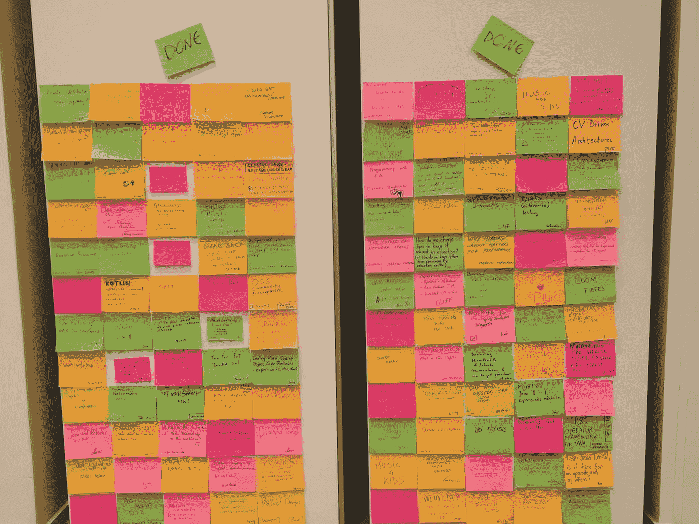

# JCrete 2019 个人笔记

> 原文：<https://medium.com/javarevisited/personal-notes-from-jcrete-2019-dc36d89b19c1?source=collection_archive---------6----------------------->

我刚从@ JCreteUnconf 回来，这是一个关于(你猜的)克里特岛 Java 相关技术的惊人的 unconference。

我已经在这里描述了我之前的出席情况[。](/@ramtop/what-i-learned-at-jcrete-2017-968923bfee79)

无论是人还是地点都让每一届 JCrete 都成为令人难忘的事件。

首先感谢 [@heinzkabutz](http://twitter.com/heinzkabutz) 和所有无组织者(一场无组织会议的组织者)[@ ixcherruiz](https://twitter.com/ixchelruiz)[@ kcpeppe](https://medium.com/u/59e6768391d4?source=post_page-----dc36d89b19c1--------------------------------)[@ aalmiray](https://twitter.com/aalmiray)[@ marcandsweep](https://twitter.com/marcandsweep)[@ gsas lis](https://twitter.com/gsaslis)[@ DVyazelenko](https://twitter.com/DVyazelenko)

(特别向 [@rgransberger](https://twitter.com/rgransberger) 问好，她这次因为一个很好的理由没有出席，但她在整理过去的版本方面做得很好)

在非正式会议中，每个人都是发言人，每个人都可以提出讨论的论点。只有 4 条规则:

讨论的所有主题

1:谁出现都是对的人
2:发生什么都好
3:什么时候开始都是对的时间
4:结束了就结束了

每天任何人都可以提出一个话题，他只需要在所有人面前解释它。在有足够的话题后，提议者将它们放在日程表上，新的一天开始了！

我甚至不会试图对所有讨论过的有趣话题做一个总结，但我列出了我学到的有用的东西和我想更好地研究的东西。

**周一笔记**

有一场由 [@cliff_click](https://twitter.com/cliff_click) 带动的关于各种语言异步模型的有趣讨论。人们一致认为，最常见的两个阻塞问题是网络套接字和数据库访问。但是尽管有许多 HTTP 等的异步库，但在数据库方面却没有多少。

这方面的主要项目是 [R2DBC](https://r2dbc.io/) ，但似乎仍有一些问题。对于 Kotliners 有 [ja-sync](https://github.com/jasync-sql/jasync-sql) 。我没试过，但它绝对在我的考虑范围之内。

@heinzkabutz 向我们展示了 Java 11 JDK 中引入的新`HttpClient`的一些奇怪行为。它允许异步调用使用`CompletableFuture`来异步调用和处理结果。

不幸的是，它的行为不直观(buggy？)的方式，而不是使用默认的执行器。它似乎使用给定的执行器进行 HTTP 调用，然后返回一个在公共线程池中运行的`CompletableFuture`。

Mob 调试既有趣又有教育意义！也许我们应该把它作为工作中的实践来介绍…

今天的最后一个话题是关于新的 Java 垃圾收集器。老将阿苏尔·C4 和新秀雷德哈特·谢南多阿和 ZGC 之间有很多相似之处。

一个有趣的注意事项是，C4 是分代的，也就是说，它根据对象的“年龄”收集不同的启发式对象。相反，谢南多阿和 ZGC 不是一代人。阿苏尔人捍卫他们的选择，因为“世代抽象真的有用”，并认为在未来谢南多阿和 ZGC 将会把世代信息加入他们的试探法。

说一下微服务，既然 Jdk13 Shenandoah 会把没用的内存还给操作系统。这对于容器部署非常有用。

一个完全不同的选择是使用 [OpenJ9](https://www.eclipse.org/openj9/index.html) 来代替微服务的 JDK。它针对在相对较小的内存堆(约 1GB)上运行的系统的低延迟和性能进行了优化，这是微服务的常见情况。相比之下，C4 和 ZGC 在 64 GB 或更多内存的机器上表现出色。

两个我第一次听说的有趣项目:

一个资助开源项目的密码:[https://gitcoin.co/](https://gitcoin.co/)

一种新的会议，我想移植到伦敦:[黑客，提交，推动](https://hack-commit-pu.sh/)

**周二笔记**

第二天以讨论哪种 Java 开始。对于现在看 Java 的人来说，理解从哪里下载是非常复杂的。甲骨文 JDK(非免费)？Oracle OpenJDK？AdoptJDK？红帽？亚马逊浓缩咖啡？阿祖尔？等等。一切都很混乱。最重要的是，没有关于版本次要号的硬性规定，所以来自不同供应商的相同版本的 OpenJDK 可以包含不同的补丁和错误修复。
大家也普遍认为 6 个月的发布周期太快了。

我将在第二节课中介绍 Kotlin 和协程。 [@kittylyst](https://twitter.com/kittylyst) 用锡兰、Go 和其他语言做了很多有趣的评论和比较。

Kotlin 的一个很好的特性是密封类。它们像一个联盟类型一样工作，但是它们在互操作性上仍然非常接近于 [Java](https://dev.to/javinpaul/10-free-courses-to-learn-java-in-depth-3ikn) 。真正的联合类型将允许使用现有类型定义一个新的类型，比如`Foo = String | Int`，不幸的是这在 [Kotlin](https://javarevisited.blogspot.com/2018/02/5-courses-to-learn-kotlin-programming-java-android.html) 中是不可能的。

当天的最后一场会议由@ dandreadis 主持，他是 Quarkus.io 团队负责人。他解释了很多关于 Quarkus.io 的哲学和目标。

我用 Quarkus 和 Kotlin 玩过很多次，我也移植了一个例子给 Kotlin，你可以在这里找到代码。

**周三笔记**

在线课程和培训是一个极好的机会，但也充满了问题。[@ heinzkabutz](https://twitter.com/heinzkabutz)[@ omniprof](https://twitter.com/omniprof)和凯·霍斯特曼等人分享了他们在不同平台上的巨大经验和发现的问题。

就我个人而言，我喜欢 [Katacoda](https://www.katacoda.com/) 的方法，但将其翻译成编程教学并不容易。你可以在 Udemy 上上传你的视频，但是仍然存在盗版和低参与度的问题。Safari 在线课程似乎更好，我从来没有做过，但我想试试。

顺便说一句，亨氏的[课程](https://javaspecialists.teachable.com/)是完全推荐的。

肯·福格尔的另一个有趣的观察是，在黑板上使用粉笔有助于保持学生的注意力，而在几张幻灯片后，大多数学生都在睡觉。

我共同主持了瓦尔哈拉工程的会议。展示了代码的样子。新的操作码,(临时)使用？对于不可展平的字段和可擦除泛型，紧凑数组等。许多有趣的评论和见解。

我正在准备一篇更长的博文，如果你感兴趣，请继续关注。

[@simoneborde](https://twitter.com/simonebordet) t 对 Jetty 架构进行了详细而有趣的解释，尤其是 Jetty 10 的新特性:模块化以及它如何支持 HTTP/2。

一个特别有趣的模式是他所谓的“吃你杀死的东西”线程模型。Jetty 没有让一个线程等待传入的连接，然后将它们传递给另一个[线程池](https://javarevisited.blogspot.sg/2013/07/how-to-create-thread-pools-in-java-executors-framework-example-tutorial.html#ixzz5EAhFySdA)来处理请求，而是让同一个线程处理请求，然后从线程池中挑选另一个线程来监听传入的连接。在 HTTP/2 多个请求的情况下，这允许更好的性能并简化了逻辑。

**周四笔记**

JCrete 也有很多非技术性的讲座。我参加了一个关于公共演讲技巧的讨论，由@melissajmcka y 主持。这是所有非会议中比较有启发性的一次。

参与者中有经验丰富的演讲者和初学者。以前听到每个人都很紧张，包括在任何会议上挤满房间的了不起的演讲者，这是令人惊讶的。

我们分享了第一次谈话的经验和改进的技巧。如果你想提高你的公众演讲能力，最好的建议就是练习，记录并和其他人比较结果。周围有很多公开演讲的聚会和团体，甚至是远程的。

另一个很好的建议是学习如何监测和控制你的呼吸，以克服紧张情绪，重拾信心。

@mauricenaft al 实际上给出了一个例子，说明即使你搞砸了你的现场编码示例，你也可以在公众的帮助下，仍然得到 Java RockStar 的反馈。令人欣慰的是，即使是这样伟大的演说家也有辉煌的时刻。

接下来是 [@mjpt777](https://twitter.com/mjpt777) 关于内存访问模式的有趣演讲。当我们有一个聚集的对象，并引用其他对象时，其他对象在堆中的分配位置会有很大的不同。与将所有对象分散在不同的内存页面中相比，将所有内容放在内存的连续部分中可以获得两个数量级的性能提升。

不幸的是，Java 没有提供一种机制(除了使用 sun.misc.Unsafe 指针)来解决这个问题。【Valhalla 项目在这里似乎没有什么帮助，因为它不能扁平化外部对象(例如字符串),还因为一些业务对象需要可变。

作为比较，Martin 指出 C# Dictionary 比 Java HashMap 快 10 倍，这是因为它分配内存的方式。他创建了 [ObjectLayout](http://objectlayout.github.io/ObjectLayout/) 项目来解决这些问题。这是我想更好看的东西。

另一个有趣的非技术性话题是关于内向者的自我意识(信不信由你，这里的人占大多数)。Cliff 在 GeeCon 做了一个演讲，我强烈推荐大家在这里观看。

**周五(黑客日)笔记**

周五致力于黑客活动。就几个主题组成的小组。我尝试过用 LeJOS 在 Java 和 Linux 上使用 LegoMindstorm EV3。不幸的是，只适用于 Java7。

@cliff_click 正在开发一种叫做 [AA](https://github.com/cliffclick/aa) 的新语言。主要目标是达到与编写良好的低级代码相同的性能，但使用强大的类型系统和最少的语法(几乎没有关键字)。

我对录制一些培训材料很感兴趣，制作了一些精彩视频的@DaschnerS 向我介绍了他的设置说明[这里](https://blog.sebastian-daschner.com/entries/chroma-keying-video-setup)。

最后，星期五晚上，我们一起去日落酒馆吃饭，享受美味的希腊食物，讨论我们最喜欢的话题。

