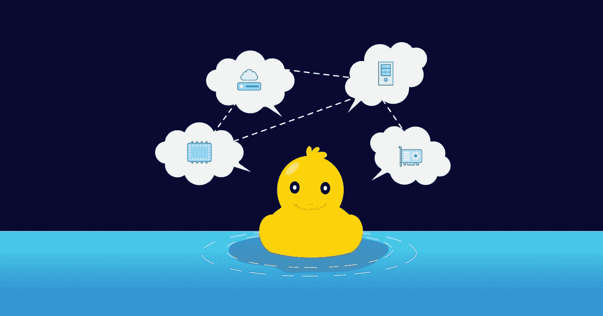

# 多语言云本机调试—超越 APM 和日志记录

> 原文：<https://medium.com/javarevisited/polyglot-cloud-native-debugging-beyond-apm-and-logging-8955ef25fc1b?source=collection_archive---------3----------------------->

自从我成为 Lightrun 的开发者倡导者以来，我已经做了很多会议演讲。我最受欢迎的一个演讲有一个标题和这个帖子的标题很相似。在这篇文章中，我会试着涵盖文章的主旨。你可以看到我 2021 年底在 DDD 演讲的一个更长的版本:

# 云原生应用

几乎有一大堆术语涵盖了公共云、混合云等。各种术语之间也有很多重叠。不管怎样，这篇文章的好处在于它仍然适用。你会遇到微服务、架构和单片应用或无服务器的问题。

调试是通用的，如今多语言也是如此。由于最近的 log4j shell bug，很多公司发现他们使用 Java。Python 无处不在，Node 现在也根深蒂固。很难找到一个云平台不具备这三个要素…多语言方法通过利用同类最佳产品来更快地交付产品，从而缩短了上市时间。

但是我想得太多了。让我们退一步来讨论这个问题。

# 云本机的生死取决于 APM 和日志

没有这两个，我们就瞎了。无论您选择何种架构。如果你没有可观察性，你就有一只在盒子里的猫(我会回到这个话题)。

我们需要调配云资源，需要知道事情是否正常进行…实际上开发运维团队需要知道这些事情。R&D 也应该知道，但他们并没有直接联系到这一点。早在云原生应用和 DevOps 出现之前，我们经常自己部署东西。

这往往没有好结果。

# 90 年代的可观察性——踢服务器

DevOps 实践和云原生彻底改变了这种痛苦而有问题的方法。他们通过删除通配符问题变量:研发做到了这一点。感谢 DevOps 团队，我们享受了 20 年前只能梦想的正常运行时间水平。私有云确保每个人都可以享受到云的这些好处。

容器编排、微服务架构、无服务器等。使扩展变得更加容易。但这也让应用程序部署变得更加困难。得益于 IaC 解决方案，云基础设施的部署变得更加容易，但复杂性也发生了变化。

云原生应用的故障排除更加困难。我们有惊人的观察工具，但它们处理的是复杂的底层基础设施。

# 云本机日志

近年来，云原生应用越来越依赖现代日志基础设施。这些不是我们的旧日志文件。云提供商日志记录解决方案处理接收、搜索、元数据、PII 减少等。在规模上。我无法想象在没有这些解决方案的情况下运行一个大型部署。

日志很棒，但是它们有两个主要缺点…

# 添加日志、测试、部署、清洗、重复

这就是日志记录的情况。我们不是千里眼。我们不知道我们的本机应用程序在部署目标中会如何失败。如果日志丢失，我们需要检查 CI/CD，这可能需要几个小时(对于某些部署流程可能需要几天)。然后，您需要再次经历这一过程，以进行修复或额外的日志记录。

在那段时间里，产品中有一个 bug，开发团队最终会浪费时间。因此，对于云应用程序来说，过度日志记录是很常见的。这将我们引向一个不同的问题。

# 绩效和费用

大规模记录云原生应用程序可能会很快成为您最大的支出。我们可以通过缓存来降低 IO 成本，但是即使是完全缓存命中的只读操作也会产生日志。由于规模的原因，现代云应用程序必须记录一切。摄入的日志的大小可能会变得令人望而却步。过度日志记录对性能的影响会加剧这个问题。接收更多的数据会严重影响性能，这需要更多的容器来处理相同的负载。额外的容器映像滋生了复杂性，这意味着更多的错误和对日志的更大需求。

当我们观察时，我们会影响观察者。薛定谔的猫如此，可扩展应用也是如此。

# 可观察性工具/APMs

现代观测工具是一个奇迹。我觉得应该有一个德语单词来描述一个人从详细的 APM 仪表板中获得的满足感。这些工具使我们能够生产前所未有的复杂应用程序。

这些工具太棒了。我不想用“但是他们是……”来形容这一点。他们很完美。对于运营团队来说，谁是这些工具的目标市场。

他们对 R&D 车队也很好，但我们不是目标市场。

# 检查发动机

我通常把这些工具比作检查引擎灯甚至蝙蝠信号。他们告诉我们云原生服务存在问题，但他们并不确切。例如，如果你的车显示“检查发动机”灯，你就把它送到机械师那里。然后，她将他的计算机直接连接到引擎，以便调试问题…

这些工具的作用是检测问题并提醒我们。作为一个额外的收获，他们经常给我们问题的初始方向，但是如果解决方案不是立即显而易见的，开发人员的选择是有限的。

# 表演

对于大多数应用程序来说，可观测性的开销是可以接受的，也是值得的。但是也有极限。大多数可观察性工具都可以被调优以观察更多的信息并权衡性能。

这通常是一个有问题的概念，它将我们带回到扩展基础设施以支持可观测性的讨论。

# 排除故障

当我们原生应用程序时，我们可以使用现有的原生技术(如平台调试器)来调试它们。这些对于本地调试非常有用，但是在规模上(尤其是水平规模)它们有一些问题:

*   安全性——我曾经公开讨论过远程调试的安全性问题。特别是 JDWP，但也包括其他协议
*   不切实际——当处理轻量级容器或无服务器时，我们没有地方来附加我们的调试器。我们可以有多个容器，一个用户可以访问任意一个服务器
*   稳定性——我听说过服务器因为一个断点无法释放而陷入生产的故事。使用调试器很容易导致生产崩溃

如果我们解决这些问题，调试器是完美的工具。R&D 知道如何使用它们，因为它们是软件开发的核心租户。

# 在云环境中调试

这就是连续可观测性介入的地方。可观察性工具通过监控整个系统和暴露相关信息来工作。

持续的可观察性扳动开关，我们向系统询问我们想知道的具体信息。这是解决问题的自然过程……一个可观察性平台指出我们原生软件中的一个问题，我们使用持续的可观察性来调查这个问题。

# 作为调试器

有许多工具我们可以归类为持续可观察性工具。我将重点关注 [Lightrun](https://lightrun.com/) ，它展示了它作为云本地计算环境的调试器的能力。它在以下方面不同于现有的可观察性工具:

*   IDE 集成——这是一个用于研发的工具。它直接在 IDE 中的源代码级别上工作，就像调试器一样
*   低影响—持续可观察性工具以较低的开销提供更多的信息。他们通过只观察你正在调试的代码区域来实现这一点。如果不使用该工具，影响是最小的
*   安全—有多种部署方法(公共云、内部部署等)。).然而，R&D 不能直接访问容器运行时。DevOps 仍然拥有完全控制权，R&D 不会意外破坏生产环境(还有其他保护措施，如 PII 减少、阻止列表等。)
*   扩展—您可以使用标记和类似功能一次调试多台服务器。无需搜索庞大的云部署
*   快照而不是断点——断点是调试中的一个核心概念，但我们显然不能在调试云服务器时使用它们。快照提供相同的功能(堆栈跟踪、帧变量状态等。)，而不挂起正在执行的线程

# 动态环境中的日志记录

一些软件开发人员认为日志优于调试。我一直认为它们是擅长不同事情的两种方法。日志正在调试。

日志的静态特性是它最大的问题。如果我们可以动态地注入一个日志，它会更好地适应云原生架构。

注意，我们仍然需要现有的日志记录来为我们提供上下文和方向。这只是针对开发人员正在检查日志并且遗漏了特定日志的情况。这解决了过度日志记录的问题，因为可以根据需要动态注入新的日志。

此外，注入的日志与本地日志交织在一起并被摄取。这为他们提供了我们理解问题根源所需的背景。

# 要立即验证的指标

调试首先是验证假设的实践。但是有些假设很难用快照或日志来验证，例如“这是降低我的 docker 容器速度的方法”。

这是我们通常会使用的分析器，但在生产环境中这样做是有问题的。或者，我们使用一个计时器，在方法进入时获取当前时间，在方法退出时记录它……这对开发机器来说很好，但是将这样的东西部署到生产环境中是“嘈杂的”和有问题的。我们通常希望不断缩小测量范围，以找到真正的罪魁祸首。

这就是度量标准的由来。我们可以添加计数器、计时器等来测量特定方法的执行情况。我们甚至可以将这些信息传送给普罗米修斯和其他类似的工具。当 APM 提醒我们完成的应用程序代码中存在性能损失时，我们可以用一个指标来缩小范围。

# 查明问题的条件

我稍微回避了连续可观测性条件中最大的特征之一。假设我想在关键代码上放置快照、日志或指标。它会立刻被击中。这可能正是我想要的，但如果我想调试一个只在特定条件下发生的问题，例如，对一个特定的用户…调试器以前通过提出条件断点解决了这个问题。这适用于连续可观测平台上的每一个动作。您可以对平台内的任何操作设置条件，例如，我可以设置一个快照，该快照只能由具有给定 ID 的用户触发。

# 现代应用

在构建云原生世界时，我们有时会更加小心翼翼。我们知道微小的变化会产生连锁反应，我们也知道追踪这些问题有多难。持续的可观察性变化，即动态的、高影响力的变化可以更容易地进行，因为我们现在有工具来处理它们。从这个意义上来说，调试器是一个安全网，可以让代码更快地进入生产周期。

但是，即使您不同意更“雄心勃勃”的持续部署策略。持续可观察性提供的额外安全网为您的整个应用提供了许多优势。

例如，你有没有问过自己，在生产中是否使用了某种特定的方法？

失败是相关服务的错，还是我的错误？

通过持续观察，您可以在自己的 IDE 中轻松找到答案。

从这个意义上来说，这是通过为开发人员提供获取适用信息的直接渠道来实现云原生计算。

# 多语言、跨平台、跨语言

大多数可观察性工具在系统级是平台不可知的。持续可观察性工具稍微复杂一点。持续可观察性工具在代码级工作，需要深入访问语言运行时。因此，它在每种平台上的每种编程语言中都被广泛采用。从技术上来说，支持所有语言是可能的，但也存在一些挑战。

在上面的演示视频中，我展示了在 NodeJS 中调试快照，这将我带到了 Spring Boot Java 后端的代码。对于云原生方法来说，使用这样的独立服务并不稀奇。由于时间不够，我没有演示 lambda 服务。对于无状态服务和无服务器，这种需求甚至更大。在本地调试无服务器是如此困难，以至于一些开发人员提倡直接部署到生产环境中(通过 CD 和测试)。

有了持续的可观察性工具，我们可以创造性地使用标签来监控无服务器服务，当它们上线时，将正确的动作绑定到功能上。

# TL；速度三角形定位法(dead reckoning)

在我的演讲中，我也做了一个演示，你可以在上面的视频中查看。

持续可观察性已经在以同样的方式革新云本地产业，十多年前的可观察性、现代日志和 docker 容器也是如此。它填补了我们当前本地技术中的一个重要盲点:一个让开发人员能够在完成的应用程序代码中深入生产问题的工具。

生产 bug 就像孢子一样，它们在 QA、staging 等环境中存活下来。它们富有弹性；我们需要重型武器来大规模杀伤他们。云原生技术使规模变得更大，因此调试也更加困难。

有了无服务器、微服务和工人框架(如气流、火花等。)事情更加可怕。生命周期如此艰难，以至于一些开发人员接受相对较高的失败率作为“做生意的成本”。

我希望这篇文章能让你迈出持续观察的第一步。我相信这项技术可以促进新一代的应用程序，从而改变客户体验和您的体验。

在 [Twitter](https://twitter.com/debugagent/) 上关注我，了解更多信息并获取未来帖子的更新。