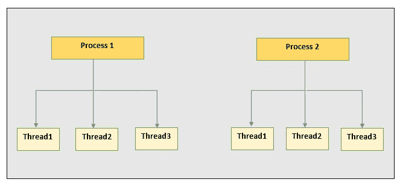
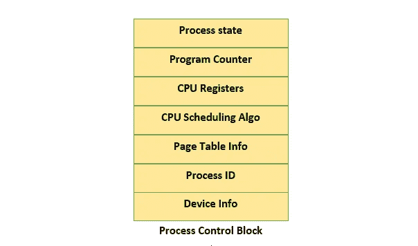

# 进程和线程上下文切换，你知道区别吗？

> 原文：<https://medium.com/javarevisited/process-and-thread-context-switching-do-you-know-the-difference-updated-8fd93877dff6?source=collection_archive---------3----------------------->

## Java 多线程——进程和线程

## 一篇关于进程和线程、它们的区别以及上下文切换的文章。

**进程和线程-作者图片**

我见过程序员对进程和线程相关的概念有点困惑。还有许多人在与进程和线程上下文切换作斗争。所以在这篇文章中，我将讨论这两个概念。

# 什么是过程？

程序是一组指令。它存储在计算机的磁盘上，因此它是 ***无源*** 。当同一个程序被加载到主内存中，操作系统分配一些堆内存给这个正在执行的程序(应用程序)时，称为**进程**。因此，进程就是正在执行的程序。所以我们可以说是**主动**。

当一个进程从辅助存储器加载到主存储器，而另一个进程从主存储器卸载到辅助存储器时，称为进程的**交换**。

与过程相关的信息存储在一个叫做 PCB(过程控制块)的东西里。通常，进程 id、进程号、进程状态、程序计数器、寄存器和打开的文件都存储在 PCB 中。该 PCB 存放在受保护的存储区域，以避免正常用户访问，因为它包含重要信息。

**PCB —作者图片**

一个流程可以通过使用 ***fork*** 系统调用来创建子流程。有不同类型的调度程序为进程执行不同的操作。

让我们看看调度程序的类型及其作用:

**短期调度程序(CPU 调度程序):**使用调度算法从主存储器(就绪队列)中选择一个进程在 CPU 中进行处理。

**长期调度器(作业调度器):**哪些进程应该放在主存(就绪队列)，哪些应该放在二级内存，都是由这个调度器来完成的。

**中期调度器:**进程的交换由中期调度器完成。

一个进程可以有多个线程来执行不同的任务。每个进程都有自己的内存(称为堆),不在不同的进程之间共享。

# 什么是线程？

线程是进程的一个片段或一部分，它执行进程的一些任务。一个进程可以有多个线程，这些线程可以在该进程中并发运行。每个线程都有自己的线程栈，但是一个进程的多个线程共享该进程的一个公共堆区。因此线程是轻量级的，比进程更快。

> 局部变量存储在线程堆栈中，它们不会在多个线程之间共享。
> 
> 对象的字段存储在堆上，因此它们在多个线程之间共享。

# 进程和线程的实际例子是什么？

正在执行的 java 应用程序就是一个**进程**的例子。该应用程序在执行时被分配了一些堆内存。该应用有一个名为`**main**` 的**线程** ，负责执行我们的代码。

类似地，我们可以在同一个应用程序中创建多个线程来执行不同的任务。

# 进程和线程有什么区别？

*   进程是正在执行的程序，而线程是进程的一部分。
*   该进程比线程花费更多的时间来创建和终止。
*   该进程比线程消耗更多的资源(内存、IO 等)。
*   进程不共享内存(堆),而线程共享公共堆内存。
*   进程上下文切换需要更多的时间，并且由操作系统完成，而线程上下文切换需要更少的时间，并且不需要操作系统调用。

# 进程和线程上下文切换有什么区别？

*   当 ***操作系统的调度器*** 保存运行程序(当前进程)的当前状态(包括 PCB 的状态)并切换到另一个进程时，进程上下文切换发生；而当 ***CPU*** 保存线程的当前状态并切换到同一进程的另一个线程时，线程上下文切换发生。
*   当 PCS 发生时，处理器的高速缓存和转换后援缓冲区被刷新，但是 TCS 处理器的高速缓存和转换后援缓冲区保持它们的状态。
*   PCS 涉及改变 ***过程控制块*** 的巨大成本，因此效率较低且速度较慢，而在 TCS 的情况下，不需要交换 PCB，因此效率较高且速度较快。

# 线程和 CPU 内核之间的关系是什么？

***CPU 核心是计算机中央处理器(CPU)中能够独立执行指令的物理处理单元。另一方面，线程是进程中的一个执行单元，它代表一系列可以由 CPU 独立执行的指令。***

一般来说，一个 CPU 上可以同时执行的线程数量受到 CPU 中可用内核数量的限制。每个内核一次可以执行一个线程，因此拥有多个内核可以并行执行多个线程，从而有可能提高性能。

然而，线程和 CPU 内核之间的关系比一对一的映射更复杂。

在现代计算机系统中，操作系统可以在不同的内核上动态调度线程，并且单个内核可以在多个线程之间切换，以便最大化地利用可用资源和 CPU 内核。

此外，一些系统还可能使用超线程等技术，将单个物理内核视为多个虚拟内核，从而有可能同时执行更多线程。

*本文到此为止。希望你喜欢。*

# 您可以关注[维克拉姆·古普塔](https://medium.com/u/2c3b611409dc?source=post_page-----8fd93877dff6--------------------------------)了解类似内容。

 [## Java ExecutorService 完全指南

### Executor、ExecutorService 和 ThreadPoolExecutor 是执行器的工厂方法。和理解未来物体…

medium.com](/javarevisited/a-complete-guide-on-executorservice-in-java-67528f1a535b)  [## 如何使用 Thread 和 Runnable 创建 Java 线程？

### 了解创建线程的方法以及如何启动它们。

medium.com](/javarevisited/how-to-create-java-thread-using-thread-and-runnable-2023-14e965474a7)  [## Java 中的同步:您需要知道的一切

### 如何在 java 编程中使用同步多线程:完全指南

medium.com](/@basecs101/synchronization-in-java-all-you-need-to-know-latest-6f86185ddf3)