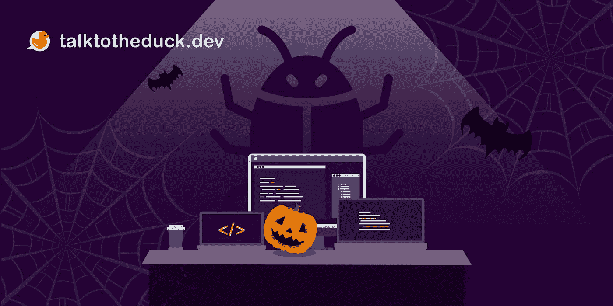

# 生产恐怖——处理灾难:公开汇报

> 原文：<https://medium.com/javarevisited/production-horrors-handling-disasters-public-debrief-9fc8b57b127a?source=collection_archive---------3----------------------->

万圣节可能是开始这个新博客系列最合适的时间。我在这个博客中谈了很多理论，但是当你在生产灾难的第一线时，它会很快“变得真实”。人们通常认为生产灾难是崩溃或网站关闭，就像最近的脸书宕机。虽然这是一个有趣的话题，但许多这样的事情可能会被忽视，并像一堵砖墙一样击中你。

今天的恐怖故事是关于一个年轻的创业公司，因为缓存差点破产。我是这家公司的创始人，过去我写了很多关于这个的文章。已经过去几年了，虽然它仍然很痛，但我希望这一次我能以一种更超然的声音写作。

# 介绍

我在 2012 年初共同创立了[代号 One](https://github.com/codenameone/CodenameOne) 。该公司的 SaaS 部分是一个复杂的后端，协调构建服务器。这是 2012 年，没有集装箱/码头或任何类似的东西可供生产。当时 PaaS 相当大，App Engine 也获得了一些支持。

因为 Codename One 是一家 Java 商店，它需要快速升级以获得应用引擎，因为基础设施非常有意义。谷歌免费提供了一些计算资源，从而敲定了这笔交易。

当时 App Engine 没有提供 [SQL](/javarevisited/5-best-books-to-learn-sql-and-database-design-for-programmers-and-developers-1e7839df2f3e) ，只有数据存储。我们再次决定使用它，如果它足够好来运行谷歌，它足够好来运行我们的小产品。

我们应该澄清一件重要的事情。App Engine 当时有一个本地调试环境。但是你不能调试应用程序，因为它运行在云中。在 Codename One 的前 2-3 年，我们对 App Engine 非常满意。我甚至在 JavaOne 等的一次演讲中提倡它。

最后要知道的一件重要事情是，Codename One 是一家自举公司。这是一个资金有限的开源框架。

# 灾难来袭

一个晴朗的日子，我们收到一封电子邮件，账单很高。这看起来很奇怪，但我们登录查看了一下。我们每月支付的金牌支持费用通常在 70 美元+ 400 美元左右。此时的账单已经是 4 位数了。

这就是歇斯底里发作的地方。我们没有那么多钱…

因此，首要任务是减少我们拥有的每项资源，例如实例数量等。但这些都不是账单问题的原因。我们试图从谷歌的金牌支持团队获得帮助，但这是“无益的”(委婉地说)。谷歌的唯一建议是定义一个支出限额，从而有效地降低我们的服务。

账单完全归因于声明中的一行:“应用引擎数据存储读取操作”。自然，我们希望了解这意味着什么，以及哪一部分代码正在执行所有这些读取…不幸的是，由于 App Engine 的构建方式(或大约在 2015 年构建)，没有办法知道这一点。

更糟糕的是，我们唯一的调试工具是日志，这很费钱。因此，为了解决支出增加的问题，我需要增加我们的支出。

众所周知，App engine 数据存储读取速度很慢。所以我们认为这是一个问题。Google 提供了一个 memcached 实例，您应该在访问数据存储时使用它。据我所知，我们在任何经常用来缓存重要信息的地方都使用它。但似乎我们错过了一些点，新的应用引擎更新触发了这一点。

# 解决

不幸的是，在生产环境中部署新的更新是调试或修复它的唯一方法。但情况变得更糟了。

Billing 当时没有列出“实时”号码(我不确定现在是否会列出)。因此，我们不得不通过添加缓存层来猜测修复方法，然后重新部署，并等待一天，看看更改是否会影响计费。这实际上是最糟糕的情况，我们不得不等待 24 小时，看看计费是否受到修复的影响。

正因为如此，每一次修复的尝试都包含了对代码的许多不同的改进。直到今天，我们也不知道这个 bug 是什么，以及最终是什么修复了它。这完全有可能是谷歌解决的应用引擎中的一个错误。我们无从得知。

# 汇报—吸取的经验教训

## 我们应该做什么

这些年来，我一直在思考这个问题，首先，我们能做些什么来避免这个问题呢？

此外，当我们第一次发现问题时，我们可以做些什么不同的事情？

**单元测试？** 我们能编写单元测试来检测或重现问题吗？

我真的不知道。我们使用 JPA 来抽象存储，我想我们可以模拟存储来查看访问是否被缓存。在我们有这个问题之前，这是一个非常小众的测试，我们可能不会写。

当[调试](https://javarevisited.blogspot.com/2011/07/java-debugging-tutorial-example-tips.html#axzz6bYzaddcE)这个的时候，我们试图通过测试或者在调试器中重现这个问题。我们无法重现这个问题。如果我们有更多的时间来调试这个问题并开发一个单元测试，我们也许能够在单元测试中重现它。但是我们在分秒必争地工作。一名医生试图修复一名流血的病人，没有时间进行复杂的测试。

因为这个问题发生在我们的代码之外，即使我们有 100%的测试覆盖率，我们也不会发现这个问题。因此，虽然单元测试确实是一个有价值的工具，但在这种情况下，我看不出它们事先会有什么帮助。

**可观察性** 这确实凸显了可观察性的重要性和它的缺失。在这种情况下，我对谷歌最大的不满之一是:他们对数据存储读取访问收费。但是它们不能告诉我我从哪个数据存储中读取(哪个实体/表)。如果有一个大致的方向，指出问题发生在哪里，可以为我们节省数千美元。

可观察性工具是至关重要的，它们需要深入挖掘粒度的能力。

**即时反馈** 这在其他情况下似乎是一种奢侈，但在这里我们看到了它的重要性。因为一个持续了几天的问题，测试/部署/等待周期实际上花费了我们数千美元。想象一下，如果我们是一家流量更大的公司，我们可能会损失数百万。

当您遇到生产问题时，您需要您的工具来立即报告。你需要知道确切的问题，你需要知道你的解决方法是否有效。由于 App Engine 的性质，我们无法使用当时可用的一些工具。回想起来，我们需要更好的工具。

**本地调试** 有一个运动是[反对本地调试的想法](https://dev.to/garethmcc/why-local-development-for-serverless-is-an-anti-pattern-1d9b)(至少在无服务器中)。我明白他们的一些观点。例如，在这种情况下，本地调试没有重现问题。这给了我们错误的信心，以为事情会成功，但事实并非如此。

但是我不确定我是否同意这个底线。我觉得本地调试应该更贴近生产。我仍然认为我们需要工具来[调试产品](https://lightrun.com/)，但是它们应该是对本地工作环境的补充。

**支出限额** 直到今天我都不知道自己跳过支出限额的决定是否正确。我们是否应该让服务中断几天，让我们“想办法解决问题”？

我真的不知道。

## 你有危险吗？

你可能会认为自己没有风险。你不用 App Engine，大概不用 PaaS。

然而，无服务器和第三方 API 也有类似的风险。这是一个非常普遍的问题，例如，有人甚至不小心用电子表格黑了自己。另一个团队获得了一个免费账户的 72000 美元账单

这些故事到处都是。

如果您选择使用此类服务，您必须定义一个消费限额。您还应该使用可观察性工具，并设置触发器，以便在发生任何变化时向您发出警告。

# 收场白

几年前，我见到了 Light run 的创始人。他们概述了他们对公司的愿景，公司实际上是一个生产调试器，可以安全地为我们提供即时反馈。我立刻想到了这个故事。

那时候我能用这个工具做什么呢？

当我们感受到痛苦时，想法就有了意义，我深深地感受到了痛苦。这使得加入 Lightrun 的决定显而易见。所以我猜这个恐怖故事有一个美好的结局。

# TL；速度三角形定位法(dead reckoning)

今天的恐怖故事是关于一个有前途的年轻自举公司，冒险进入一个似乎友好和有益健康的环境…却发现账单一夜之间突然翻转，并产生了巨额费用。

你可能是下一个，因为许多年轻的公司已经陷入了这个噩梦。

# 讲述你的故事

有没有有趣的生产灾难故事分享？

给我写信，地址是 shaia (at) lightrun (dot) com。如果你想去掉你的名字/公司名称，我很乐意帮忙…我可以提供一个超级酷的 Lightrun 赠品盒作为奖励，我们这里的赠品是顶级的！

期待收到你的来信。