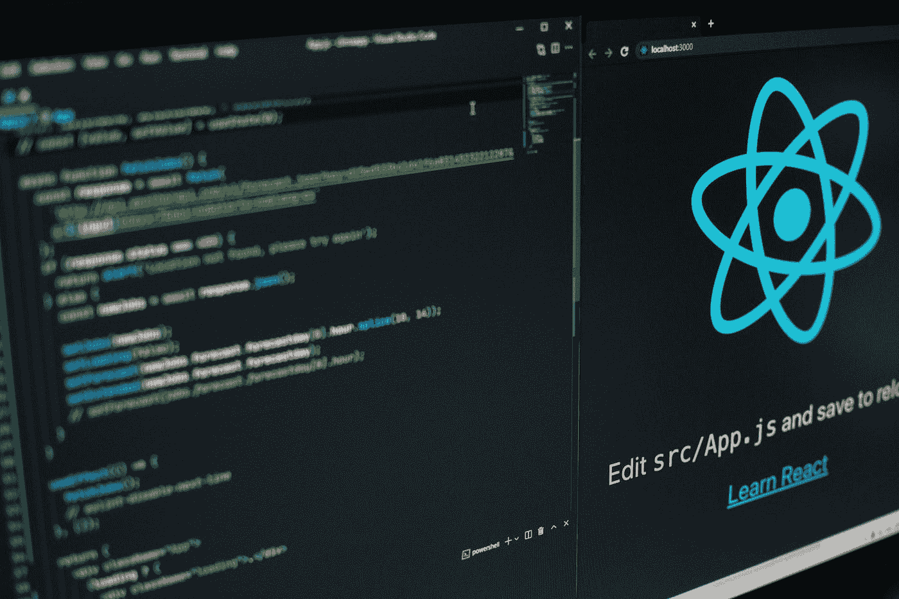

# 反应:让我们开始吧…

> 原文：<https://medium.com/javarevisited/react-lets-get-started-20f0e71bf50f?source=collection_archive---------2----------------------->

每当我听到**反应**的时候我就很着迷，但是我承认我看了它一眼，它吓了我一跳。我看到看起来像是一堆 **HTML** 混合着 **JavaScript** 的东西，心想，这不就是我们一直在努力避免的吗？React 有什么大不了的？

[](https://www.java67.com/2021/11/top-6-courses-to-learn-react-hooks.html)

照片由[劳塔罗·安德烈亚尼](https://unsplash.com/@lautaroandreani?utm_source=medium&utm_medium=referral)在 [Unsplash](https://unsplash.com?utm_source=medium&utm_medium=referral) 上拍摄

# 什么是反应？

[React](/javarevisited/top-10-free-courses-to-learn-react-js-c14edbd3b35f) 是一个 JavaScript 库。这在构建单页面应用程序时更受欢迎。

在 react 中，我们可以将我们的网站分成几个部分。就像我们可以独立发展一样，因为它们是相互分离的。这更易于管理。

我们在 React 中使用 **JSX( JavaScript 语法扩展)**。这类似于 HTML，但有一些变化，我们可以编写 [JavaScript](/javarevisited/my-favorite-free-tutorials-and-courses-to-learn-javascript-8f4d0a71faf2) 。

在 React 中，我们可以将我们的网站分成组件，我们可以独立开发它们，因为它们是相互独立的。这更易于管理。

*   React 不是框架(不像 [**棱角分明**](/javarevisited/10-courses-to-learn-angular-for-web-development-6da1bd2856dc?source=---------8------------------) ，比较固执己见)。
*   React 是由脸书创建的一个开源项目。
*   React 用于在前端构建用户界面(UI)等等。

# 为什么要反应？

想到这个问题，为什么要做出反应？正如我们可以用 [HTML](/javarevisited/10-best-html-and-css-courses-for-beginners-in-2021-6757eec00032) ，[CSS](/javarevisited/top-10-free-courses-to-learn-html-5-css-3-and-web-development-872d62d97a97)&[JavaScript](/javarevisited/12-free-courses-to-learn-javascript-and-es6-for-beginners-and-experienced-developers-aa35874c9a32)来开发我们的网站一样。

React 拥有大量的社区支持，是高要求的技能组合。有一些优势。

**可复用代码** : React 具有省时省力的可复用能力，这是它的一大亮点，在 [**React**](/javarevisited/the-2019-react-js-developer-roadmap-9a8e290b8a56) 、[](/javarevisited/10-free-angular-and-react-js-courses-from-udemy-and-coursera-best-of-lot-e67f7d811e6b?source=---------44----------------------------)****、****Vue**中也可以复用组件。**

****React 拥有基于组件的架构**:传统网站可以被拆分为组件，如页眉、页脚、侧边导航、主要内容等。**

****React 是声明性的**:React have React**DOM library**告诉 React 你想要什么(UI 应该是什么样子)，React 就会为你构建实际的 UI。有了这个 React，通过抽象出困难的部分来构建复杂的 UI 就变得不那么痛苦了。**

**React 可以无缝地集成到您的任何应用程序中，即使它是您的页面的一部分或整个页面，甚至是整个应用程序本身。**

**有了 React 的知识，可以借助 [**React Native**](/javarevisited/top-5-react-native-courses-for-mobile-application-developers-b82febdf8a46) 进入移动应用开发。**

# **React 的先决条件是什么？**

1.  ****HTML** 、 **CSS** 和 **JavaScript** 基础是必须的。**
2.  ****ES6** 一些概念。(假设&常量、箭头函数、模板文字、默认参数、对象文字、rest 和 spread 运算符以及析构赋值)。**
3.  **希望学习和做一些新的事情😏。**

# **基本安装**

**要使用 react，您需要进行以下安装:**

1.  **从安装 [**Node.js**](https://javarevisited.blogspot.com/2018/01/top-5-nodejs-and-express-js-online-courses-for-web-developers.html) 开始。Node 基本上允许您在浏览器之外读取和运行 JavaScript。要安装 **Node.js** ，请访问以下站点:**

**[](https://nodejs.org/en/) [## 节点. js

### Node.js 是基于 Chrome 的 V8 JavaScript 引擎构建的 JavaScript 运行时。

nodejs.org](https://nodejs.org/en/) 

2.现在，如果你已经有了一个文本编辑器，那就安装你喜欢的文本编辑器，比如[***Visual Studio Code***](/javarevisited/8-best-vs-code-courses-for-beginners-to-learn-online-bd5c169f59b7)。

[](https://code.visualstudio.com/) [## Visual Studio 代码-代码编辑。重新定义的

### Visual Studio Code 是一个重新定义和优化的代码编辑器，用于构建和调试现代 web 和云…

code.visualstudio.com](https://code.visualstudio.com/) 

# 创建 React 应用程序

创建 React 应用程序有几种方法。但是将 JavaScript 库加载到一个**静态 HTML 页面**并动态呈现 **React** 和 **Babel** 的方法不是很高效，而且很难维护。

幸运的是，脸书已经创建了 [**Create React App**](https://github.com/facebook/create-react-app) ，一个预配置了构建 React 应用所需一切的环境。它将创建一个 live development server，使用 **Webpack** 自动编译 [React](/javarevisited/10-best-react-courses-from-pluralsight-for-beginners-and-experienced-developers-80b7c640cca3) 、 **JSX** 和**ES6**CSS 文件，并使用 **ESLint** 测试和警告代码中的错误。

要设置`create-react-app`，在您的终端中运行以下代码，从您希望项目存在的位置向上一个目录(用您的应用程序的名称替换‘app-name’)。

```
$ npx create-react-app app-name
```

安装完成后，转到新创建的目录并启动项目，在终端中运行以下代码。

```
$ cd app-name
```

现在，

```
$ npm start
```

一旦您运行这个命令，一个新的窗口将在`localhost:3000`弹出，显示您的新 React 应用程序。

在这里你将会看到由**脸书**制作的默认反应应用。

> 感谢你阅读我的博客，我希望你学到了新的东西，并且喜欢它。关注更多此类信息丰富的博客，并给予👏还有评论，它给了我写更多博客的鼓励祝你有美好的一天！！！**