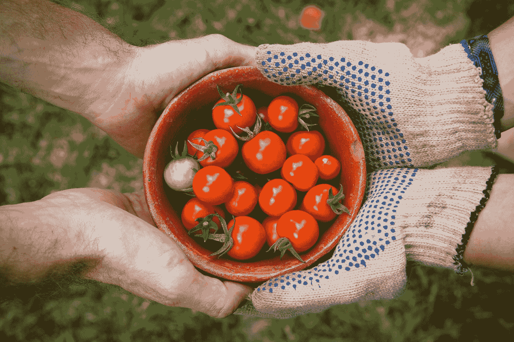

# 反应:道具

> 原文：<https://medium.com/javarevisited/react-props-7b86cd99612?source=collection_archive---------1----------------------->

在之前的博客中，我谈到了**组件**及其类型。但是我们仍然知道如何处理静态数据，现在让我们来看看如何将数据传递给组件。

[**反应**](/javarevisited/6-best-websites-to-learn-react-js-coding-for-free-ba7ec5c43433) 允许我们使用一种叫做**道具**(代表属性)的东西将信息传递给一个**组件**。 [**道具**](https://javarevisited.blogspot.com/2021/09/how-to-use-props-in-react-example.html#axzz7Eeg9YVnJ) 基本上是一类全局变量或对象。我们来详细看看。



[伊莱恩·卡萨普](https://unsplash.com/@ecasap?utm_source=medium&utm_medium=referral)在 [Unsplash](https://unsplash.com?utm_source=medium&utm_medium=referral) 上拍摄的照片

为了使用变量或者将数据从一个组件传递到另一个组件，我们使用 props。因此在道具的帮助下，我们可以使组件相互交互。

React 道具就像是[**JavaScript**](/javarevisited/10-best-online-courses-to-learn-javascript-in-2020-af5ed0801645)*中的函数参数和 **HTML 中的***属性。

## 在同一组件中使用

要将**道具**发送到**组件**中，使用与 **HTML** 属性相同的语法:

```
const element = <Human name="Ram" />;
```

**组件**接收参数作为**道具**对象:

```
function Human(props) {
  return <h2>I am a { props.name }!</h2>;
}
```

## 在其他组件中使用

首先，我们要使用**导入**另一个组件中的组件，在那里我们要传递道具。

假设我们有两个组件文件 **'component1.js'** 和 **'component2.js'** ，现在我们必须将数据从 **'component1.js'** 传递到 **'component2.js'** ，因此我们在 **'component2.js'** 中有如下导入。

在 **'component1.js' :**

```
import Component2 from “./component2.js”;
```

道具也是你将数据作为参数从一个组件传递到另一个组件的方式。

```
<Component2 mydata = "pass" />
```

现在在**‘component 2 . js’:**

```
const myfunction =() =>{
   return(
      <h1>{props.mydata}<h1/>
          );
};
```

同样，我们也可以传递函数和数据集。

> **注意:** *React 道具是只读的！如果你试图改变它们的值，你将得到一个错误。*

这样，我们就可以在组件中多次使用 props，只需传递一次。

这是我以前的博客，我试图解释组件:

</javarevisited/react-components-functional-class-components-84026d7c3a39>  

> ***谢谢！*** *对于阅读，我希望你学到了一些新的东西，并喜欢它。* ***关注*** *获取更多此类内容丰富的博客并给予👏并做* ***评论*** *，它给了我写更多博客的鼓励，* ***快乐学习！！祝你愉快！！！***