# 使用 Apache JMeter 进行 REST API 负载性能测试

> 原文：<https://medium.com/javarevisited/rest-api-load-performance-testing-using-apache-jmeter-63605572e862?source=collection_archive---------1----------------------->

用 Apache JMeter 进行 REST API 负载性能测试

# 介绍

在本文中，我们将使用 **Apache JMeter** 做一个基本的负载测试，这是一个开源软件，它可以用来模拟各种场景的负载，并以多种方式输出性能数据，包括 CSV 和 XML 文件和图表。因为它是一个 100%纯 Java 的应用程序，所以它是[平台独立的](https://www.java67.com/2012/08/how-java-achieves-platform-independence.html)(能够在每一个操作系统上运行)。

根据文档，这个工具有很多特性。如；

*   能够加载和性能测试许多不同的应用程序/服务器/协议类型。
*   通过从最流行的响应格式、 [**HTML**](https://jmeter.apache.org/usermanual/component_reference.html#CSS/JQuery_Extractor) **、JSON、**[**XML**](https://jmeter.apache.org/usermanual/component_reference.html#XPath_Extractor)**或** [**任何文本格式**](https://jmeter.apache.org/usermanual/component_reference.html#Regular_Expression_Extractor) 中提取数据的能力，轻松实现关联
*   完全可移植性和 **100% Java 纯度**。
*   **完整的** [**多线程**框架](/javarevisited/8-best-multithreading-and-concurrency-courses-for-experienced-java-developers-8acfd3b25094)允许多个线程并发采样，允许不同的线程组同时采样不同的函数。
*   测试结果的缓存和离线分析/重放。

# 装置

首先你需要从 [Apache JMeter 网站](https://jmeter.apache.org/download_jmeter.cgi)下载 JMeter。下载 zip 文件后，将它解压缩到您想要使用它的位置。然后移动到解压后的文件夹中的`/bin`文件夹，点击下面的命令- **jmeter.sh** 打开带有 GUI 的 Apache JMeter，请注意，建议在运行负载测试时不要加载 GUI，只建议将 GUI 用于测试创建和测试[调试](https://javarevisited.blogspot.com/2011/02/how-to-setup-remote-debugging-in.html)目的。

如果安装成功，您应该会看到下面的屏幕。

[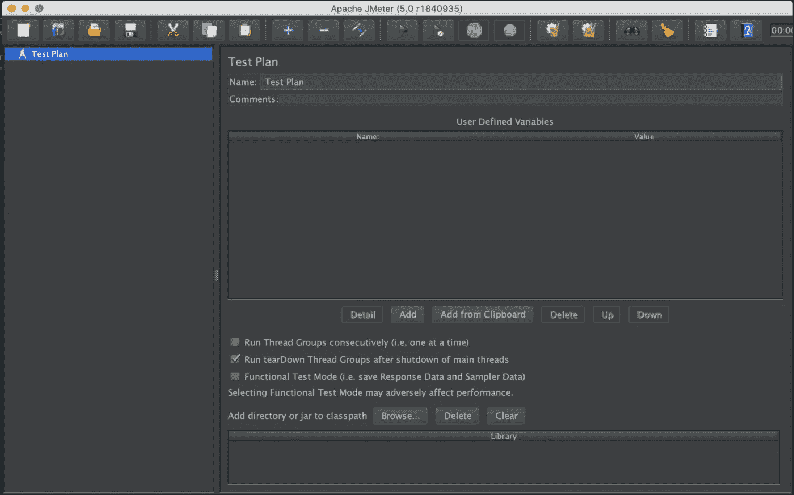](https://javarevisited.blogspot.com/2018/09/top-5-courses-to-learn-intellij-idea-java-and-android-development.html)

# 测试计划

在写测试计划之前，让我们看看它是什么，一个 ***测试计划*** 可以被看作是运行测试的容器。它定义了测试什么以及如何进行测试。一个合适的测试计划将包含一些要素，如:

*   线程组
*   逻辑控制器
*   定时器
*   前后处理器
*   配置元素等。

*请注意，在一个测试计划中，必须至少有一个* ***线程组*** *。*

您可以简单地 ***添加*** 或 ***删除*** 以上元素到一个 **T *est 计划*** 中，方法是右击 **T *est 计划*** (即在我的例子中，它是如下所示的测试计划)，然后从菜单中选择`add`，选择您想要添加的任何元素。

[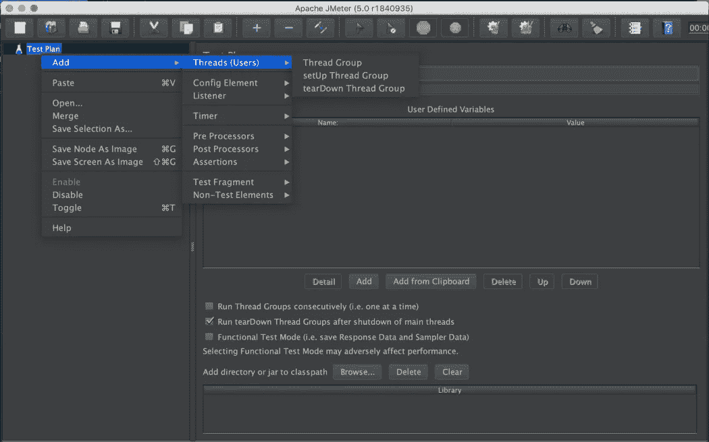](https://javarevisited.blogspot.com/2019/04/top-5-junit-and-unit-testing-courses-java-programmers.html#axzz6iYmMFnsA)

# 配置测试计划

正如我们所了解的，为了运行负载测试，测试计划至少需要一个线程组*。所以我们先给 ***测试计划添加一个线程组。****

*要添加一个 T ***hread 组*** 右击测试计划然后`add -> Threads -> Thread Groups`*

*[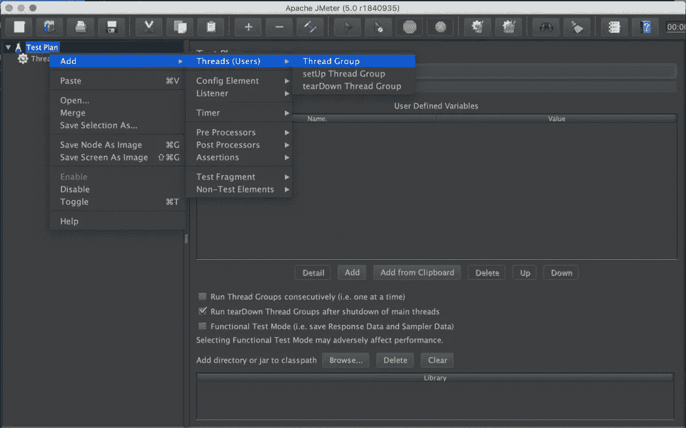](https://javarevisited.blogspot.com/2021/12/top-5-courses-to-learn-rest-assured-for.html)

添加线程组* 

*如果成功，您将看到**线程组**已经添加到您的**测试计划**中，如下所示。*

*[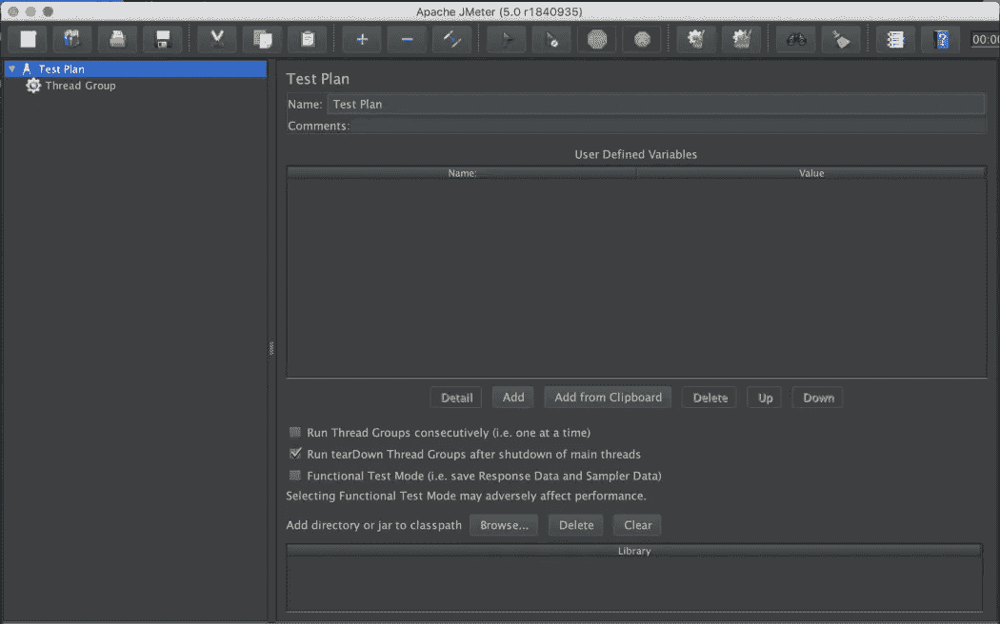](https://javarevisited.blogspot.com/2022/01/top-5-courses-to-learn-swagger-or-open.html)

线程组已添加到测试计划中。* 

*然后，您需要做的是在 ***线程组*** 下添加另一个元素，用于 ***HTTP 请求*** ，就像我们之前所做的那样，我们可以通过右键单击将一个新的 ***HTTP 请求*** 元素添加到 ***线程组*** 中，并选择如下图所示的菜单项。*

*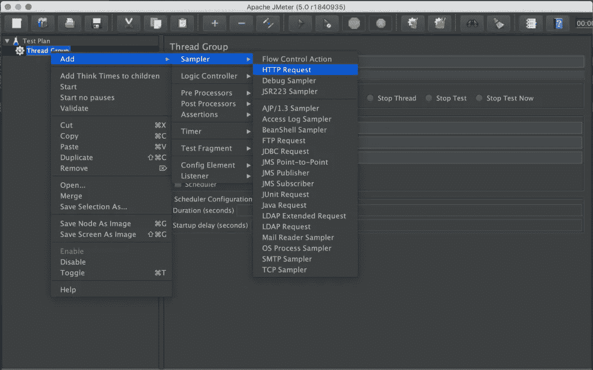*

*向线程组添加 HTTP 请求元素。*

*如果成功，您将看到您的 ***HTTP 请求*** 元素列在 ***线程组*** 元素下，如下所示。*

*[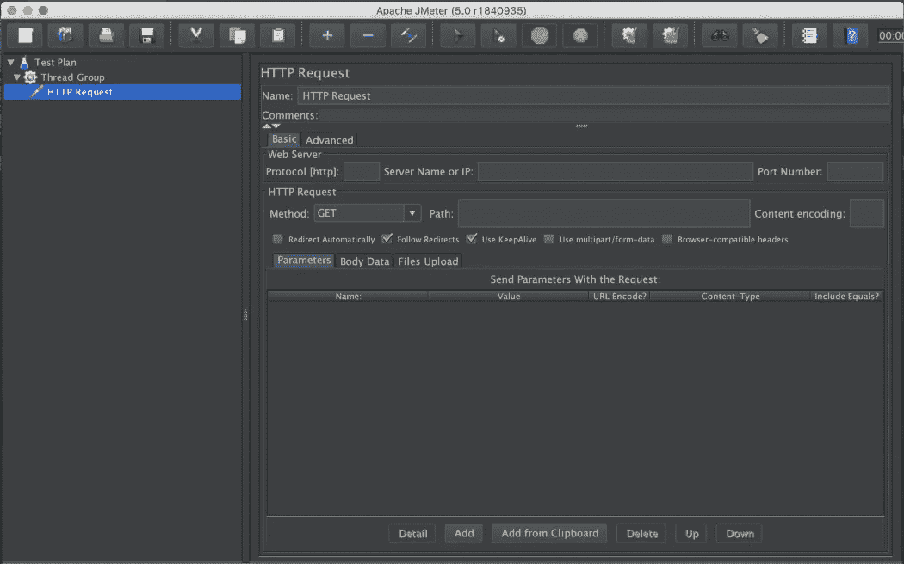](https://javarevisited.blogspot.com/2021/04/top-5-tools-to-test-rest-apis-in-java.html#axzz7CGBoUS1n)

已配置的 HTTP 请求元素* 

*让我们用`*Protocol, Server Name, Port Number, Http Request Method*` 和`*Path*` 的相关值来配置我们的 ***HTTP 请求*** 元素，如下所示。*

*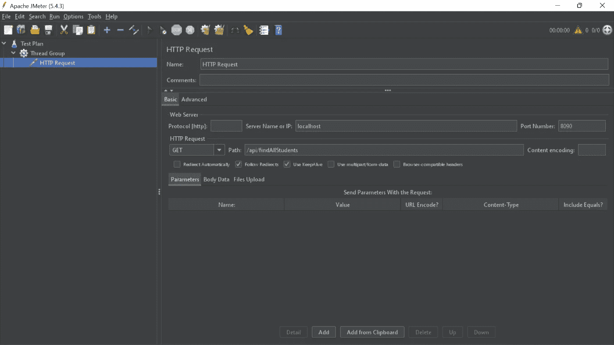*

*HTTP 获取请求配置*

*现在我们已经成功配置了我们的 ***HTTP 请求*** 元素。然后我们需要配置一个监听器来查看 HTTP 请求的结果。*

***如果你想为一个 POST API 端点配置一个测试计划***

*如果您想要使用有效负载对 POST 端点进行负载测试，那么您需要配置您的 ***HTTP 请求*** 以具有与上面不同的配置，您将必须在**主体数据**部分下传递有效负载以及相关的端口号和路径值。*

*

为 POST API 端点配置的 HTTP 请求。* 

# *添加监听器*

*在 JMeter 中，监听器用于输出负载测试的结果。JMeter 中有几种类型的监听器，但是对于这个测试，我们将使用树 监听器中的 ***视图结果，这是一个更简单的监听器。****

*要将树中的 ***视图结果*** 元素添加到 ***线程组*** 元素中，请右键单击 ***线程组*** 元素，并像之前一样选择如图所示的菜单项。*

*[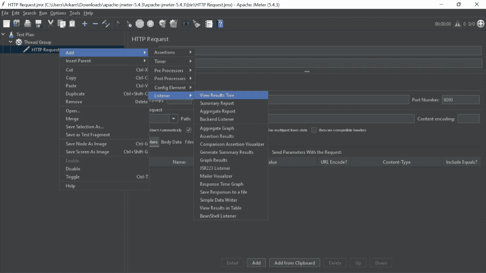](https://javarevisited.blogspot.com/2016/05/what-are-idempotent-and-safe-methods-of-HTTP-and-REST.html)

将视图结果树添加到线程组元素。* 

***在运行监听器之前保存文件***

*为了查看负载测试的输出结果，我们必须保存该文件。*

*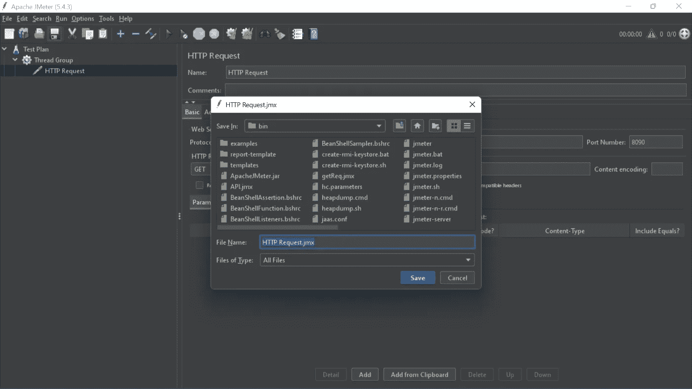*

*保存文件*

*文件将保存在。jmx 格式如上图。*

*如果您已经正确地将元素添加到了 ***线程组*** 元素中，那么我们的设置将类似于下面的屏幕截图*

*[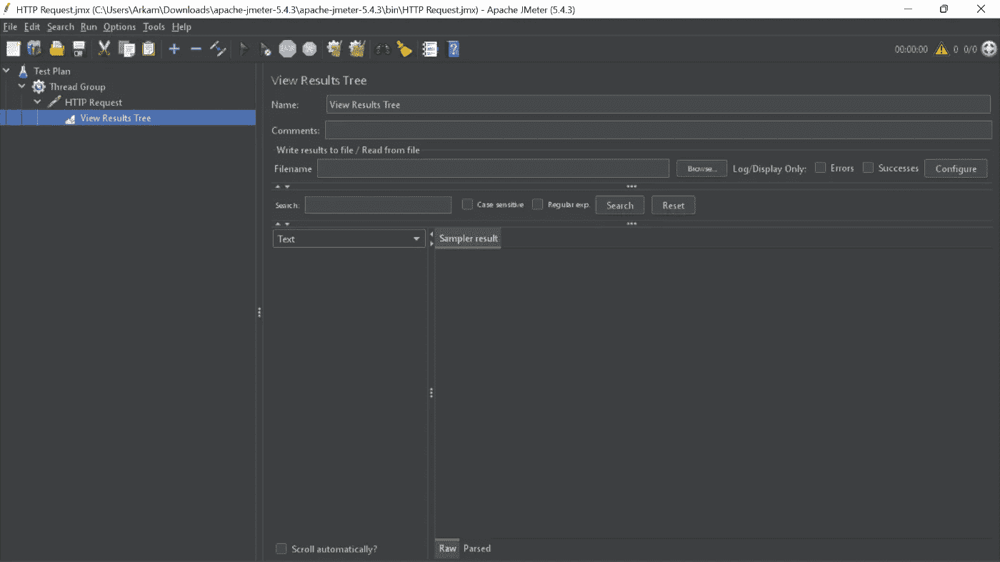](https://javarevisited.blogspot.com/2021/11/top-5-courses-to-learn-soapui-online-in.html#axzz7CANam4JD)

树侦听器中的配置视图结果。* 

# *运行测试计划*

*现在我们已经正确地配置了测试计划。然后让我们运行测试，看看结果。*

*在左侧窗格中选择 ***查看结果树*** 元素，然后在主菜单中点击 ***运行*** ，然后点击*开始*(或者直接点击主菜单下方的绿色开始箭头)，如下图所示。*

*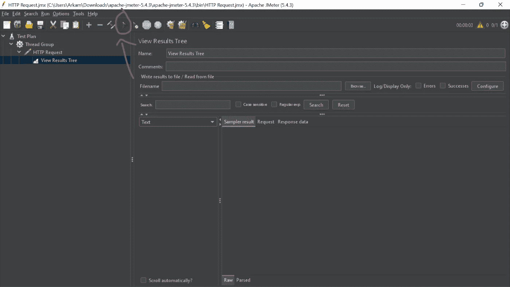*

*如果您正确地遵循了这些步骤，那么您应该会看到如下输出。*

*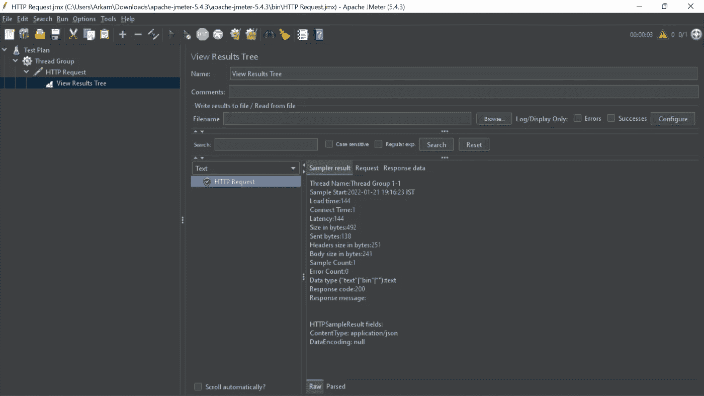*

*HTTP 请求测试响应*

*因为这是一个 Get 请求，所以我们得到了一个带有响应数据的 200 成功响应。*

# *负载测试*

*好了，酷，现在一切都设置正确了。现在是运行负载测试的时候了。为了做到这一点，我们需要在我们的 ***测试计划*** 中重新配置我们的 ***线程组*** 元素，以拥有几个线程相关的属性。为此，单击 ***线程组*** ，并向其添加以下属性。因为作为一个负载测试，我们应该给 API 的端点提供一些重负载。通过更改 ***线程组*** 中的以下参数，允许 JMeters 在指定的用户数量下执行适当的负载测试。*

*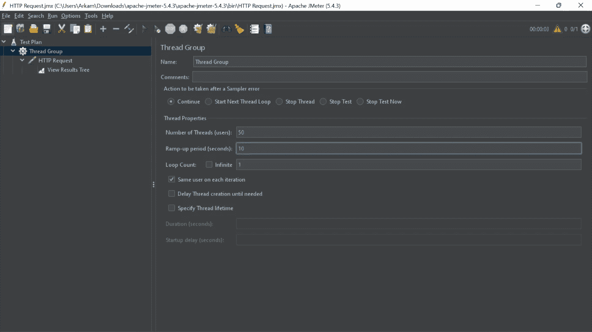*

*更新的线程组*

*这些更改的值是影响负载测试的三个特别重要的属性:*

*   ***线程(用户)数量:**JMeter 将尝试模拟的用户数量。*
*   ***上升周期(秒):**JMeter 分配线程开始的持续时间。*
*   ***循环计数:**执行测试的次数。*

*然后再次保存**测试计划**，然后按照上述步骤再次运行测试，您会看到类似下面的内容。*

*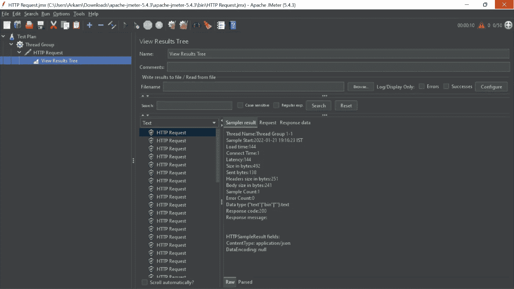*

*负荷试验*

# *了解结果*

*我们可以看到，上面截图中所有请求的 ***状态*** 都是“成功”(用一个带勾的绿色盾牌表示)。之后，**采样时间(毫秒)**和 ***延迟*** 列可能是结果集中最感兴趣的列。*

*   ****延迟:***JMeter 发送请求和收到初始响应之间经过的毫秒数*
*   ****采样时间:*** 服务器完全满足请求(`response + latency`)所用的毫秒数*

*根据 ***查看结果树*** 输出，则**加载*时间*** 为 144。对于一个简单的 [Rest API](/javarevisited/10-best-java-web-services-rest-soap-and-api-courses-for-beginners-724a8f51298d) 来说，这是一个相当高的值，但是在我的情况下，这个端点几乎不执行繁重的任务，这对我来说是可以接受的。根据 REST API 端点的功能和其他因素，您可能会得到与我不同的结果，比如；地理距离(通常会增加等待时间)、所请求项目的大小(会增加传输时间)等..所以不要担心结果，如果你和我的价值观不同。*

*因此，基本上我们所做的是模拟 50 个用户在 10 秒内访问一个 API 端点(每秒 5 个)。*

*正如您所看到的，很明显，只需对线程组配置进行简单的更改，就可以很容易地用虚拟用户的数量来测试 API。*

*使用 JMeter，用户可以进行负载测试之外的测试，例如压力测试、功能测试、分布式测试。*

*快乐编码..*