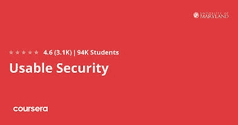
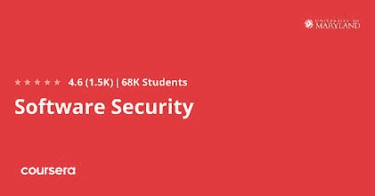
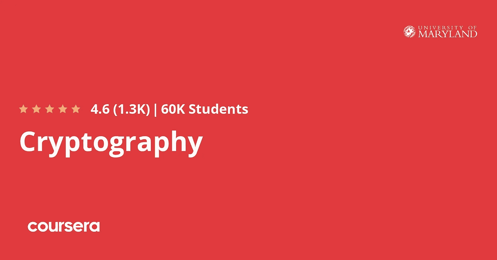
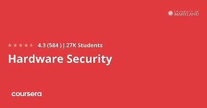

# 回顾—2023 年马里兰大学 Coursera 的网络安全专业值得吗？

> 原文：<https://medium.com/javarevisited/review-is-courseras-cybersecurity-specialization-by-maryland-university-worth-it-2eab07ce7ab4?source=collection_archive---------3----------------------->

## 找有证书的网络安全课程？马里兰大学开设的 Coursera 网络安全专业是最好的从零开始的专业。

你好伙计们，如果你想在 2023 年学习网络安全和信息安全来开始你的职业生涯，那么你来对地方了。网络安全领域充满了机会，网络安全工程师、笔测试员和安全专家有很多工作和机会，所以在 2023 年学习网络安全实际上是一个伟大的决定。

之前，我已经分享了[最佳网络安全课程](/javarevisited/7-best-cyber-security-courses-for-programmers-and-developers-50afafae050b)，f [ree 渗透测试课程](/javarevisited/10-free-courses-to-learn-ethical-hacking-and-penetration-testing-for-beginners-84e40104aa6c)，以及[最佳道德黑客课程](/javarevisited/6-best-ethical-hacking-courses-to-learn-online-fe1fe171d05)，在本文中，我将回顾一下 Coursera 著名的 [**网络安全专业**](https://coursera.pxf.io/c/3294490/1164545/14726?u=https%3A%2F%2Fwww.coursera.org%2Fspecializations%2Fcyber-security) ，这是一个由马里兰大学提供的综合性网络安全项目。

网络安全是保护公司基础设施的科学，包括员工的计算机、网络、托管网络应用的服务器以及用户信息或任何敏感信息的数据库。

他们使用一些工具来评估基础设施的安全性，并发现新的漏洞。

这个领域被称为网络安全，是全球增长最快、需求最大的领域之一。公司雇用人们是因为他们在发现漏洞和保护系统方面的才能，而不是你从一所声誉良好的大学获得的学位，因为现在的黑客正在寻找零日漏洞并加以利用。

每个人都可以分享他的课程，即使是知道使用工具但不理解这些漏洞背后的概念以及它们是如何被利用的业余爱好者。尽管如此，我还是在 Coursera 平台上找到了一门由马里兰大学该领域专家创建的课程，名为 [**网络安全专业**](https://coursera.pxf.io/c/3294490/1164545/14726?u=https%3A%2F%2Fwww.coursera.org%2Fspecializations%2Fcyber-security) 。

<https://coursera.pxf.io/c/3294490/1164545/14726?u=https%3A%2F%2Fwww.coursera.org%2Fspecializations%2Fcyber-security>  

# Coursera 上的网络安全专精值得吗？回顾

现在，让我们回顾一下这个令人敬畏的 [*网络安全课程和关于三个主要参数的专业化*](https://coursera.pxf.io/c/3294490/1164545/14726?u=https%3A%2F%2Fwww.coursera.org%2Fspecializations%2Fcyber-security) ，

1.  教师质量，这意味着有经验和专业的教师如何教授这些课程，
2.  第二也是最重要的课程结构和内容质量，这意味着涵盖了哪些主题以及涵盖的程度如何，
3.  最重要的是人们对这些课程的看法，尤其是那些已经参加并完成这门课程的人。

当你用这个参数评估任何课程时，你可以很容易地筛选并找到适合你的课程。

## 1.教员回顾

马里兰大学被视为世界上最受欢迎的大学之一。它有很大的声誉，他们由该领域的顶级专业专家创建了这一网络安全专业化。他们中的一些人是像 [**迈克尔·希克斯**](https://coursera.pxf.io/c/3294490/1164545/14726?u=https%3A%2F%2Fwww.coursera.org%2Fspecializations%2Fcyber-security) 和 [**乔纳森·凯兹**](https://coursera.pxf.io/c/3294490/1164545/14726?u=https%3A%2F%2Fwww.coursera.org%2Fspecializations%2Fcyber-security) 这样的教授来学习网络安全知识。

# 2.课程内容和结构

现在，让我们看看课程的结构和内容，比如涵盖了哪些主题以及涵盖的深度

## 2.1.[可用证券](https://coursera.pxf.io/c/3294490/1164545/14726?u=https%3A%2F%2Fwww.coursera.org%2Flearn%2Fusable-security)

网络安全的第一部分将着重于构建安全的系统。你将学习人机交互，这门科学研究计算机技术的使用，可用性，任务和认知模型。然后转向保护系统、SSL 警告、定性评估和运行受控实验的设计方法。

接下来，你将学习一些保护交互设计的策略，并理解可用的安全指南、权限指南、授权和通信指南。

您还将了解可用的身份验证、为用户增加额外安全层的双因素身份验证、生物特征身份验证。最后，了解功能性隐私基础和隐私政策。

**以下是加入本课程** — [可用安全性](https://coursera.pxf.io/c/3294490/1164545/14726?u=https%3A%2F%2Fwww.coursera.org%2Flearn%2Fusable-security)的链接

## 2.2.[软件安全性](https://coursera.pxf.io/c/3294490/1164545/14726?u=https%3A%2F%2Fwww.coursera.org%2Flearn%2Fsoftware-security)

本节将向人们介绍软件安全的基础和最常见的漏洞。首先，您将了解计算机和软件安全，然后移动低级别的安全性以及它们如何攻击它们并被利用。一些最常见的漏洞是内存布局、缓冲区溢出、代码注入。

既然你已经学会了如何利用这些低级别的攻击，你就要学会保护自己，比如内存安全和安全编码。

你以后会像 SQL 注入一样转向网络安全，在那里你可以从数据库中提取数据，会话劫持，跨站脚本。您还将探索安全软件开发和静态程序分析，以及渗透测试。

**这里是加入本课程**——[软件安全](https://coursera.pxf.io/c/3294490/1164545/14726?u=https%3A%2F%2Fwww.coursera.org%2Flearn%2Fsoftware-security)的链接

## 2.3.[密码术](https://coursera.pxf.io/c/3294490/1164545/14726?u=https%3A%2F%2Fwww.coursera.org%2Flearn%2Fcryptography)

密码学是一门科学，它保护两个相互发送数据或文件的人之间的通信，并保证除了这两个人之外没有其他人可以看到这些数据。您将从学习加密的基础知识、十六进制和 ASCII 以及现代密码学原理开始这一部分。

然后，他们学习计算的保密性、伪随机性和私钥加密，比如用于加密数据和文件的密码。您还将了解消息认证码，如散列函数和两个人通信时的密钥交换。

以下是加入本课程的链接— [密码学](https://coursera.pxf.io/c/3294490/1164545/14726?u=https%3A%2F%2Fwww.coursera.org%2Flearn%2Fcryptography)

## 2.4.[硬件安全](https://coursera.pxf.io/c/3294490/1164545/14726?u=https%3A%2F%2Fwww.coursera.org%2Flearn%2Fhardware-security)

本节将从硬件的角度教你安全性。因此，您首先要学习硬件是如何设计的，并对数字逻辑设计、数字系统规格和实现、时序系统规格和性能有一个大致的了解。

接下来，您将学习如何合法地保护您的硬件设计不被其他人和公司滥用，并学习水印和指纹的基础知识。

您还将了解物理攻击，即如果您的设备在攻击者手中，它会如何伤害您，这种攻击使用了什么工具，以及是什么导致他们对您执行这些操作。

您还将了解侧信道攻击以及现金攻击、功耗分析、内存漏洞等内容。你也可以使用一些工具来检测硬件木马。您将了解到所有这些以及其他许多关于硬件安全的内容。

以下是参加本课程的链接— [硬件安全性](https://coursera.pxf.io/c/3294490/1164545/14726?u=https%3A%2F%2Fwww.coursera.org%2Flearn%2Fhardware-security)

## 2.5.[网络安全顶点工程](https://coursera.pxf.io/c/3294490/1164545/14726?u=https%3A%2F%2Fwww.coursera.org%2Flearn%2Fcyber-security-capstone)

这最后一节将要求学习者建立一个系统。然后其他人会看到他们的项目，并试图发现他们系统的安全流程。

所以这里没什么新东西要学，但是你会实践你在过去四门课中学到的东西，这也很重要。其实这才是这个专业化最重要的部分。

这个项目将会给你一个机会去应用到目前为止你所学到的所有网络安全技能。获得认证也很重要，因为除非您完成本模块，否则您将无法获得证书。

以下是加入本模块的链接— [网络安全顶点工程](https://coursera.pxf.io/c/3294490/1164545/14726?u=https%3A%2F%2Fwww.coursera.org%2Flearn%2Fcyber-security-capstone)

## **结论**

以上是马里兰大学对 Coursera 上最受欢迎的网络安全课程之一 [**网络安全专业**](https://coursera.pxf.io/c/3294490/1164545/14726?u=https%3A%2F%2Fwww.coursera.org%2Fspecializations%2Fcyber-security) 的评论。Courser 的这个 5 门课程+ 1 个项目计划真的是从网络安全开始并在 2023 年成为网络安全专家的一个很好的资源。

完成本课程后，您将学到以下关键技能:

*   软件测试
*   密码系统
*   可用性
*   渗透试验
*   网络安全
*   隐私
*   用户界面
*   模糊测试
*   缓冲区溢出
*   Sql 注入
*   数论
*   公钥密码学

网络安全是一个领域，几乎每个公司都需要有一个专门的团队来发现漏洞并修补漏洞。你也需要学习它，即使你在其他 it 领域工作，比如网络开发，这会让你比你的竞争对手更有优势。

其他**认证资源**面向 **IT 专业人员**和 Java 程序员

*   [如何在 2023 年成为 DevOps 工程师](https://javarevisited.blogspot.com/2018/09/the-2018-devops-roadmap-your-guide-to-become-DevOps-Engineer.html)
*   [2023 年通过 CompTIA Security+考试的 5 门最佳课程](https://javarevisited.blogspot.com/2020/06/top-5-courses-to-crack-comptia-security-certification-exam-sy0-501.html)
*   [学习道德黑客的 5 门最佳课程](https://javarevisited.blogspot.com/2021/04/top-5-courses-to-learn-ethical-hacking.html)
*   [每个软件开发人员都应该学习的 10 件事](https://dev.to/javinpaul/10-things-every-software-developer-should-know-39pe)
*   [学习 Linux 命令行的 5 门免费课程](https://hackernoon.com/top-5-free-linux-courses-for-programmers-4a433b4edade)
*   [经验丰富的 Java 开发人员的五大职业选择](https://javarevisited.blogspot.com/2018/10/top-5-carrer-options-for-experienced-java-programmers.html)
*   [学习道德黑客的 5 门免费课程](https://www.java67.com/2021/04/free-ethical-hacking-courses-for.html)
*   [完整的前端和后端开发者路线图](https://javarevisited.blogspot.com/2019/02/the-2019-web-developer-roadmap.html)
*   [现代网络开发者应该学习的 10 件事](/javarevisited/10-things-aspiring-web-developers-should-learn-in-2021-6747bfbfc12e)
*   [十大移动应用开发框架和库](/@javinpaul/10-frameworks-and-libraries-mobile-application-developers-can-learn-in-2020-e0b91391cade)
*   [完整的 Java 开发者路线图](https://javarevisited.blogspot.com/2019/10/the-java-developer-roadmap.html)
*   [2023 年 Java 程序员可以学到的 21 项技术技能](https://javarevisited.blogspot.com/2020/03/top-20-skills-java-developers-can-learn.html#axzz6k4XBgTw4)
*   [破解任何编码面试的 5 个关键技巧](https://javarevisited.blogspot.com/2020/04/5-essential-skills-to-crack-coding-interviews.html)
*   [每个开发人员都应该学习的 10 个 Linux 命令选项](https://javarevisited.blogspot.com/2020/08/10-examples-of-essential-linux-commands.html#axzz6nH4euiJX)
*   [5 个免费学习 Python 编码的网站](https://javarevisited.blogspot.com/2019/09/5-websites-to-learn-python-for-free.html)
*   [面向开发人员和安全工程师的 7 门 Linux 课程](/javarevisited/7-best-linux-courses-for-developers-cloud-engineers-and-devops-in-2021-7415314087e1)

感谢您阅读本文。如果你喜欢 Coursera *、*的这些网络安全认证，请分享给你的朋友和同事。如果您有任何问题或反馈，请留言。

**P. S.** —如果你渴望学习网络安全并成为一名安全工程师，但负担不起这些课程，或者正在寻找一门免费的网络安全课程，你也可以在 Udemy 上查看这门 [**初学者网络安全课程【免费】**](https://click.linksynergy.com/deeplink?id=JVFxdTr9V80&mid=39197&murl=https%3A%2F%2Fwww.udemy.com%2Fcourse%2Fcertified-secure-netizen%2F) 课程。完全免费，已经有超过 90K 的学生加入了这门课程。

</javarevisited/5-best-free-cyber-security-courses-for-beginners-a4abec9d5e6c> 