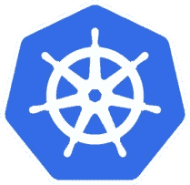

# 使用 kubernetes 作业运行 CPU 或内存密集型操作

> 原文：<https://medium.com/javarevisited/run-cpu-or-memory-intensive-operations-using-kubernetes-job-f086ba832ba7?source=collection_archive---------0----------------------->



外部 web 应用程序或服务器 pod

## 问题陈述:

如果您在 kubernetes pod 中运行一个 web 应用程序，您可能会遇到的一个常见用例或需求是运行一些内存密集型操作，这是并行运行的用户流的一部分，支持多个请求。部分要求是确保正在运行的 web 应用程序不受此操作的影响

## 使用案例:

比方说，你有一个新的需求或功能请求，从用户那里接受一个个人资料图片，生成 4 个不同版本的 thubmail (XS，M & L)流的一部分。用户可以上传大小从 100 到 200 MB 不等的原始图像。这个特性应该支持每秒 50 个并行请求

## 使用 java 线程:

解决这个问题的简单方法是使用 java 线程，流程如下:

*   用户通过浏览器将原始图像上传到服务器
*   J2EE 应用程序用原始图像作为参数为每个请求旋转一个新线程
*   该线程将负责生成所需的缩略图，并将其保存在所有窗格都可以访问的共享位置

> **该方法的问题/议题**

*   处理 50 个请求，每个请求处理大约 100 MB 的图像，很快就会导致[内存不足](http://javarevisited.blogspot.sg/2011/09/javalangoutofmemoryerror-permgen-space.html#axzz5DmwFLA1K)错误，最终导致 pod 崩溃
*   肯定不可扩展。如果每秒的请求数量增加，唯一的扩展方式是垂直扩展或添加更多的 web 应用程序单元(如果我们只是为了处理缩略图生成而这样做，而网站不需要这样做，则不需要这样做)

## 使用 Kubernetes 作业:

使用 kubernetes job 将是解决此流程问题的更好方式:

*   用户通过浏览器将原始图像上传到服务器
*   J2EE 应用程序创建一个 [kubernetes 作业](https://javarevisited.blogspot.com/2019/01/top-5-free-kubernetes-courses-for-DevOps-Engineer.html)，并提供原始图像作为作业处理程序的参数
*   处理完成后，作业会将图像写入共享位置，供所有 pod 访问

> **这种方法的优势**

*   现在，缩略图处理被移出了 web 应用程序窗格，因此 web 应用程序可以在窗格中运行，而没有任何内存问题或限制。
*   更容易扩展，因为应用程序处理的缩略图请求的数量与 kubernetes 集群中的可用资源成正比。如果我们想要扩大规模，我们可以在更精细的级别添加更多资源。

## 编写 kubernetes 作业(使用 java)

```
final KubernetesClient client = new DefaultKubernetesClient();
Map<String, String> labelMap = new HashMap<String, String>();
 jobLabelsMap.put(“app”, “label”);String compilerImage = “<<Docker Image for Compiler >>”;String jobName = “thubmailGeneratorContainer”;// Delete any pre-existing jobs with the same name. Cascade to created pods
 client.batch().jobs().inNamespace(“applicationNameSpace”).withName(jobName).cascading(true).delete();
 final Job job = new JobBuilder()
 .withApiVersion(“image/v1”) // API version
 .withNewMetadata()
 .withName(jobName)
 .withLabels(labelMap) // Labels
 .endMetadata()
 .editOrNewSpec()
 .editOrNewTemplate()
 .withNewMetadata()
 .withLabels(labelMap)
 .endMetadata()
 .editOrNewSpec()
 .withRestartPolicy(“OnFailure”)
 .addNewContainer()
 .withName(jobName) // Job Name
 .withImage(compilerImage) // Docker image
 .withImagePullPolicy(“Always”)
 .endEnv()
 .withNewResources()
 .addToRequests(“cpu”, new Quantity(“1”)) // CPU
 .addToRequests(“memory”, new Quantity(“1Gi”)) // Memory
 .addToLimits(“cpu”, new Quantity(“2”)) // CPU limit
 .addToLimits(“memory”, new Quantity(“2Gi”)) // Memory limit
 .endResources()
 .addToCommand(0, “java”)
 .addToCommand(1, “-jar”)
 .addToCommand(2, “/tmp/thumbGenerate.jar”) // Jar for thumbnail generation
 .addToCommand(3, “<<Path Of Image RAW File >>”)
 .endContainer()
 .withRestartPolicy(“Never”)
 .endSpec()
 .endTemplate()
 .endSpec()
 .build();client.batch().jobs().inNamespace(“applicationNameSpace”).create(job); // Run Job
```

感谢您的阅读，如果您对这种方法或解决方案有任何意见，请随时联系我