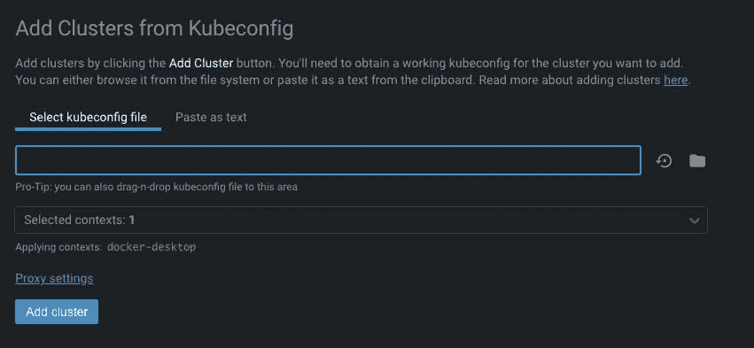
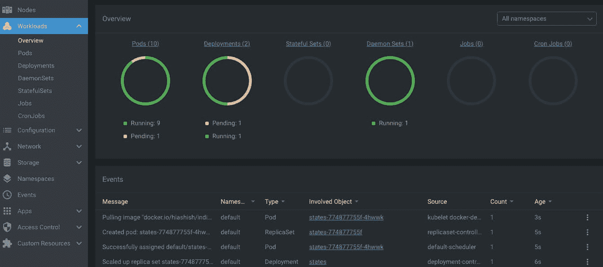
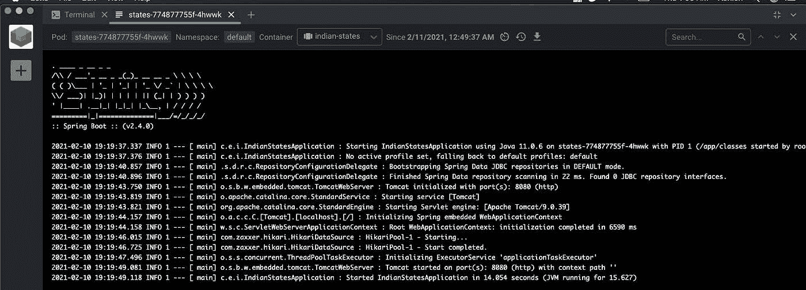
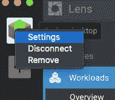
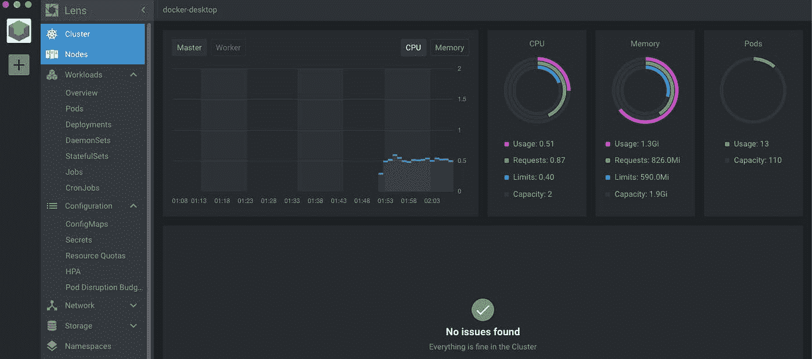

# 在 Kubernetes 上部署 Spring Boot 应用程序

> 原文：<https://medium.com/javarevisited/running-kubernetes-on-docker-desktop-for-mac-ec9bae049311?source=collection_archive---------1----------------------->

> 在本文中，我将解释如何启用 kubernetes、创建 pod、部署 spring boot 应用程序、使用 Docker 桌面上的 Lens IDE 监控单节点集群。


图像源 Docker

# 你将学到什么

*   如何在 Mac 版 Docker 桌面上启用 Kubernetes
*   如何创建 Pod
*   如何在 Kubernetes 上部署有效的 Spring Boot 应用程序
*   如何用 Lens IDE 监控和管理 Kubernetes 集群

接下来，您可能不知道这一点，但是您完全可以通过以下步骤在 Docker 桌面上本地运行一个功能性的单节点 Kubernetes 集群。但是等等，Docker 桌面是什么？

# Docker 桌面是什么？

根据官方[文件](https://www.docker.com/products/docker-desktop)。

> Docker Desktop 是用于 MacOS 和 Windows 机器的应用程序，用于构建和共享容器化的应用程序和微服务。

如果你还没有安装的话，你可以遵循 Docker 官方的桌面安装指南。

  

## 如何在 Mac 版 Docker 桌面上启用 Kubernetes

*   前往 Docker 菜单栏中的偏好设置。然后点击 Kubernetes 选项卡。单击复选框启用 Kubernetes，并将默认的 orchestrator 切换到 [Kubernetes](https://javarevisited.blogspot.com/2020/06/top-5-courses-to-learn-kubernetes-for-devops-and-certification.html) 。启用 Kubernetes 需要一些时间。


启用 Kubernetes

*   一旦它被启用，你会在你的 [Docker](https://javarevisited.blogspot.com/2019/05/top-5-courses-to-learn-docker-and-kubernetes-for-devops.html) 菜单栏上看到如下内容。


Kubernetes 跑步

*   接下来，如果有多个集群或环境在本地运行，还应该将 Kubernetes 上下文设置为 docker-desktop。


上下文设置为 docker-desktop

根据官方[文件](https://docs.docker.com/docker-for-mac/kubernetes/)

mac Kubernetes 集成在`/usr/local/bin/kubectl`提供了 Kubernetes CLI 命令。这个位置可能不在您的 shell 的`PATH`变量中，所以您可能需要键入命令的完整路径或者将其添加到`PATH`中。

`kubectl`是一个针对集群运行命令的 Kubernetes CLI 工具。

现在我们可以使用下面的`kubectl`命令来验证设置。输出应该类似于下面这样。

```
kubectl get nodesNAME             STATUS   ROLES    AGE   VERSIONdocker-desktop   Ready    master   17d   v1.18.8
```

# 如何在 Kubernetes 上创建 Pod

Kubernetes 中的 Pod 是最小的可能执行单元。它可以再包含一个容器。但是，我们将按照下面的步骤在本地 Kubernetes 集群上创建一个简单的 pod 和一个容器映像来测试设置。这个容器运行一个 Nginx 映像。

1.  使用下面的`YAML`文件创建一个 pod。

```
apiVersion: v1kind: Podmetadata:name: nginxlabels:app: nginxspec:containers:- name: mycontainerimage: docker.io/nginxports:- containerPort: 80
```

使用`*kubectl create*`和`YAML`文件名创建一个 pod。

```
kubectl create -f pod.yamlpod/nginx created
```

2.检查我们刚刚创建的 pod 的状态。

```
kubectl get podsNAME    READY   STATUS    RESTARTS   AGEnginx   1/1     Running   0          2m38s
```

3.为了进一步调试 pod 并使其工作，我们可以使用`*kubectl exec*` 命令*将 shell 添加到正在运行的容器中。进入容器后，我们将使用 curl 来验证 Nginx 的设置。让我们现在做那件事。*

```
kubectl exec -it nginx -- /bin/sh# curl 10.1.0.65<!DOCTYPE html><html><head><title>Welcome to nginx!</title><style>body {width: 35em;margin: 0 auto;font-family: Tahoma, Verdana, Arial, sans-serif;}</style></head><body><h1>Welcome to nginx!</h1><p>If you see this page, the nginx web server is successfully installed andworking. Further configuration is required.</p><p>For online documentation and support please refer to<a href="http://nginx.org/">nginx.org</a>.<br/>Commercial support is available at<a href="http://nginx.com/">nginx.com</a>.</p><p><em>Thank you for using nginx.</em></p></body></html>
```

# 如何在 Kubernetes 上部署有效的 Spring Boot 应用程序

让我们在本地 Kubernetes 集群上部署一个工作的 Spring Boot 应用程序。我们将使用 Indian-states 应用程序进行演示。您可以查看[GitHub 库来了解这个应用程序的更多信息。](https://github.com/yrashish/indian-states)

<https://github.com/yrashish/indian-states>  

在我的上一篇文章中，我已经解释了这个 Kubernetes 应用程序的服务和部署资源。

<https://ashishtechmill.com/cicd-workflow-for-springboot-applications-on-kubernetes-via-skaffold>  

现在我们将克隆这个库，并使用下面的命令创建 Kubernetes 清单。

```
git clone [https://github.com/yrashish/indian-states](https://github.com/yrashish/indian-states)cd indian-states/k8skubectl create -f myservice.yamlservice/states createdkubectl create -f mydeployment.yamldeployment.apps/states createdkubectl get allNAME                          READY   STATUS    RESTARTS   AGEpod/states-6664b9dbf6-l2tgj   1/1     Running   0          8sNAME                 TYPE        CLUSTER-IP     EXTERNAL-IP   PORT(S)          AGEservice/kubernetes   ClusterIP   10.96.0.1      <none>        443/TCP          55sservice/states       NodePort    10.96.78.225   <none>        8080:31238/TCP   15sNAME                     READY   UP-TO-DATE   AVAILABLE   AGEdeployment.apps/states   1/1     1            1           8sNAME                                DESIRED   CURRENT   READY   AGEreplicaset.apps/states-6664b9dbf6   1         1         1       8s 
```

现在只需使用 curl 并访问/states REST 端点，看看会发生什么。

```
curl localhost:31238/states[{“name”:”Andra Pradesh”,”capital”:”Hyderabad”},{“name”:”Arunachal Pradesh”,”capital”:”Itangar”},{“name”:”Assam”,”capital”:”Dispur”},{“name”:”Bihar”,”capital”:”Patna”},{“name”:”Chhattisgarh”,”capital”:”Raipur”},{“name”:”Goa”,”capital”:”Panaji”},{“name”:”Gujarat”,”capital”:”Gandhinagar”},{“name”:”Haryana”,”capital”:”Chandigarh”},{“name”:”Himachal Pradesh”,”capital”:”Shimla”},{“name”:”Jharkhand”,”capital”:”Ranchi”},{“name”:”Karnataka”,”capital”:”Bangalore”},{“name”:”Kerala”,”capital”:”Thiruvananthapuram”},{“name”:”Madhya Pradesh”,”capital”:”Bhopal”},{“name”:”Maharashtra”,”capital”:”Mumbai”},{“name”:”Manipur”,”capital”:”Imphal”},{“name”:”Meghalaya”,”capital”:”Shillong”},{“name”:”Mizoram”,”capital”:”Aizawi”},{“name”:”Nagaland”,”capital”:”Kohima”},{“name”:”Orissa”,”capital”:”Bhubaneshwar”},{“name”:”Rajasthan”,”capital”:”Jaipur”},{“name”:”Sikkim”,”capital”:”Gangtok”},{“name”:”Tamil Nadu”,”capital”:”Chennai”},{“name”:”Telangana”,”capital”:”Hyderabad”},{“name”:”Tripura”,”capital”:”Agartala”},{“name”:”Uttaranchal”,”capital”:”Dehradun”},{“name”:”Uttar Pradesh”,”capital”:”Lucknow”},{“name”:”West Bengal”,”capital”:”Kolkata”},{“name”:”Punjab”,”capital”:”Chandigarh”}]
```

# 如何用 Lens IDE 监控和管理 Kubernetes 集群

Lens IDE for Kubernetes 是一个桌面应用程序，用于 macOS、Windows 和 Linux 来管理您的集群。它是完全免费和开源的。你可以从[这里](https://k8slens.dev/)下载。开发人员、DevOps 工程师、SRE 以及在笔记本电脑上学习 Kubernetes 的人可以使用它来查看和管理他们的集群。以下是它提供的一些突出的功能。

*   使用单个 IDE 管理多个集群。
*   360 度全方位了解您的集群。
*   普罗米修斯积分
*   环境感知内置终端
*   管理舵图的内置支持

安装后，您可以首先添加一个集群。Lens 使用通常位于您的`$HOME/.kube`目录中的`kubeconfig`文件连接到您的 Kubernetes 集群。您也可以选择将其粘贴为文本文件。现在选择`kubeconfig`文件，并点击添加集群。



将群集添加到镜头 IDE

添加集群后，您可以在左侧导航栏上看到它。出于演示目的，我已经重新部署了 Spring Boot 应用程序。在 events 下，您可以看到我们的应用程序映像正在被提取。



Kubernetes 集群概述

我们还可以查看刚刚完成的部署的日志。如您所见，应用程序已经部署并正在运行。



Spring Boot 应用程序日志

您可以从 Lens IDE 本身缩放、重新启动、编辑和删除 Kubernetes 清单。


查看部署

在“网络”下，您还可以查看 Kubernetes 服务。


查看服务

Lens 有一个特性，它允许您在集群中安装 Prometheus stack，以便您可以收集关于集群及其节点的指标。对于安装，右键单击 Lens UI 左上角的集群图标，然后选择设置。



镜头设置

在“设置”页面的“功能”下，您可以看到一个指标部分和一个安装 Prometheus 的按钮。单击安装将 Prometheus 堆栈部署到您的集群。


安装普罗米修斯

大约一分钟后，镜头将开始显示指标。



普罗米修斯矩阵

我们只讨论了 Kubernetes 提供的 IDE 的一些特性。现在已经结束了。

# 结论

在本文中，我们学习了如何在 Docker Desktop for Mac 上启用 Kubernetes，创建了一个基本 pod，部署了一个 Spring Boot 应用程序，并在 Lens IDE 的帮助下监控了我们的单节点 Kubernetes 集群。你还在等什么？去容器化和分享你的应用？

# 支持我

如果你喜欢你刚刚读到的，那么你可以点击下图中的链接给我买杯咖啡:

[](https://www.buymeacoffee.com/meashish)

# 进一步阅读

可以继续看我之前的一些文章。

<https://ashishtechmill.com/running-simple-springboot-app-on-openshift>  <https://ashishtechmill.com/local-variable-type-inference-declare-var-not-war> 