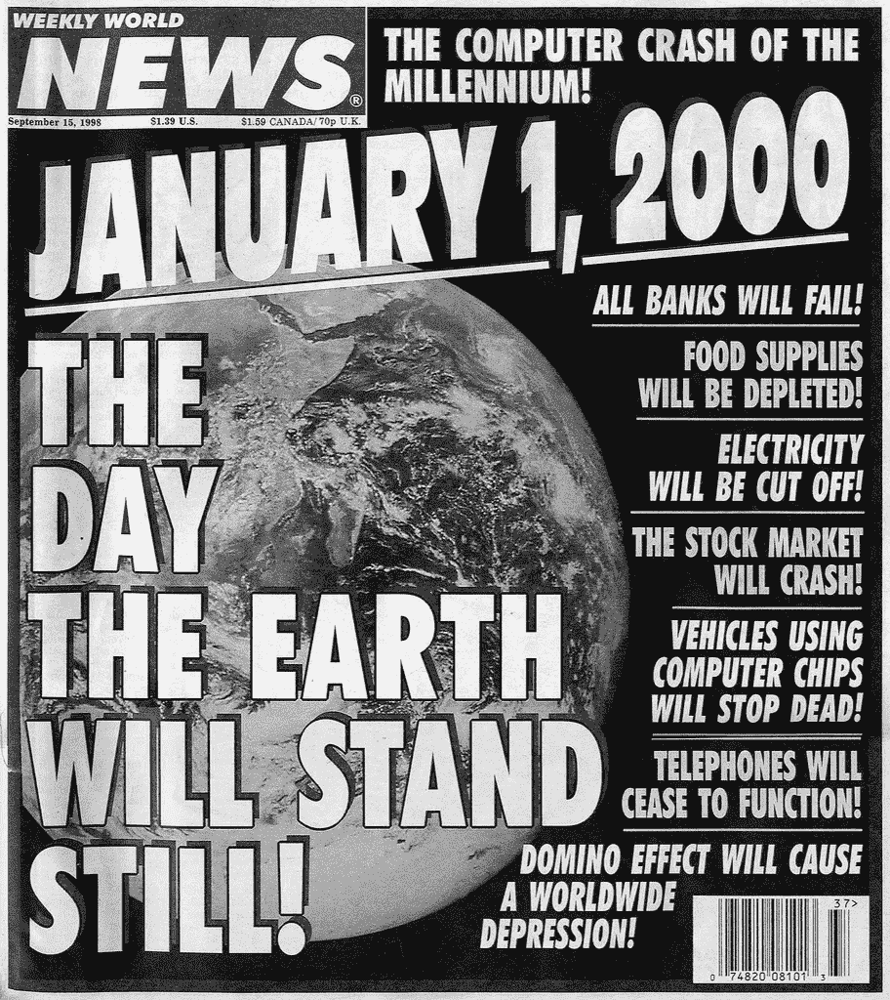

# 将你的假期安排在 2038 年

> 原文：<https://medium.com/javarevisited/schedule-your-holiday-for-2038-3d611f91e10a?source=collection_archive---------6----------------------->

年底将至，是时候开始安排下一年的假期了。但是我决定更进一步，已经为 2038 年做了计划！为什么？几个星期前，我给学生们做了一个报告，当我意识到他们在提到 2000 年问题时根本不知道我在说什么。他们中的大多数人在 2000 年还没有出生呢！我也在那一刻意识到，我可能正在成为一个脾气暴躁的老人，但这是另一个帖子的主题……；-)但我也发现了一个新的类似问题即将在… 2038 年出现！

让我们调查一下在那一年`jshell`会发生什么...

# 2000 年问题是什么？

在 2000 年之前的最后几年，人们越来越关注使用日期的计算机系统，以及它们如何处理从 1999 年到 2000 年的过渡。事实上，许多系统只使用最后两位数字的年份，肯定会导致排序问题。

例如，以 YYMMDD 格式存储日期的数据库系统将包含这些数据，很明显，从 2000 年开始，排序将会“混乱”:

```
February 28th of 1970   -->     700228
October 23st of 1982    -->     821023
January 1st of 2000     -->     000101
```



因为千年虫，报纸封面宣布世界末日

幸运的是，在世界崩溃之前，大多数系统都被打了补丁，千年虫很快就消失了。

# jshell 是什么？

在版本 9 中,`jshell`工具被添加到 Java 开发工具包(JDK)中。它能够快速测试 Java 代码。如果你有一个安装了的 [JDK，你可以在你的命令行或终端中使用`jshell`。](https://javarevisited.blogspot.com/2013/02/how-to-install-jdk-7-on-windows-8-java-32bit-64.html)

检查您的 Java 版本并启动`jshell`:

```
$ java -version
openjdk version "19" 2022-09-20
OpenJDK Runtime Environment Zulu19.28+81-CA (build 19+36)
OpenJDK 64-Bit Server VM Zulu19.28+81-CA (build 19+36, mixed mode, sharing)

$ jshell
|  Welcome to JShell -- Version 19
|  For an introduction type: /help intro

jshell>
```

想知道你能做什么，输入`/help intro`:

```
jshell> /help intro
|
|                                   intro
|                                   =====
|
|  The jshell tool allows you to execute Java code, getting immediate results.
|  You can enter a Java definition (variable, method, class, etc), like:  int x = 8
|  or a Java expression, like:  x + x
|  or a Java statement or import.
|  These little chunks of Java code are called 'snippets'.
|
|  There are also the jshell tool commands that allow you to understand and
|  control what you are doing, like:  /list
|
|  For a list of commands: /help
```

一个简单的例子:

```
jshell> var txt = "Hello World!"
txt ==> "Hello World!"

jshell> txt
txt ==> "Hello World!"

jshell> txt + (5*4)
$3 ==> "Hello World!20"

jshell> txt.substring(2, 5)
$4 ==> "llo"
```

要结束“jshell ”,请使用“/exit ”:

```
jshell> /exit
|  Goodbye
```

# 2038 年会发生什么？

一个新的千年虫似乎正在逼近，但幸运的是我们还有时间去阻止它！或者你已经可以为 2038 年安排一个长假了…

我们来看看`jshell`的问题。首先，我们需要导入一些包，因为我们将使用一些日期和时间方法。

```
jshell> import java.time.Instant
jshell> import java.time.ZoneId
jshell> import java.time.ZonedDateTime
```

如你所知，许多日期格式始于 1970 年 1 月 1 日。Matt Howells 和社区贡献在这个 [StackOverflow 回答](https://stackoverflow.com/questions/1090869/why-is-1-1-1970-the-epoch-time)中对此做了很好的解释:

*早期版本的 unix 以 1/60 秒的间隔测量系统时间。这意味着 32 位无符号整数只能表示小于 829 天的时间跨度。因此，由数字 0 代表的时间(称为纪元)必须设定在最近的过去。因为这是在 20 世纪 70 年代初，纪元被设定为 1971-01-01。*

*后来系统时间改为每秒递增，将 32 位无符号整数所能表示的时间跨度增加到 136 年左右。由于从计数器中挤出每一秒不再那么重要，这个纪元被四舍五入到最近的十年，因此成为 1970-01-01。人们必须假设，这被认为比 1971 年 1 月 1 日的情况要好一些。*

*请注意，使用 1970–01–01 作为历元的 32 位有符号整数可以表示直到 2038–01–19 的日期，在该日期，它将绕回 1901–12–13。*

根据这个答案，使用整数存储日期显然不是一个理想的解决方案…这可以通过几行代码进行完美的测试:

```
jshell> var testDate = ZonedDateTime.of(1970, 1, 1, 0, 0, 0, 0, ZoneId.of("UTC"));
testDate ==> 1970-01-01T00:00Z[UTC]

jshell> testDate.toEpochSecond()
$5 ==> 0
```

事实上，1970–01–01 返回值 0 作为纪元。现在让我们回到未来，将最大整数值分配给我们的测试日期:

```
jshell> testDate = ZonedDateTime.ofInstant(Instant.ofEpochSecond(Integer.MAX_VALUE), ZoneId.of("UTC"));
testDate ==> 2038-01-19T03:14:07Z[UTC]

jshell> testDate.toEpochSecond()
$5 ==> 2147483647

jshell> testDate = testDate.minusSeconds(1)
testDate ==> 2038-01-19T03:14:06Z[UTC]

jshell> testDate.toEpochSecond()
$6 ==> 2147483646

jshell> testDate = testDate.plusSeconds(2)
testDate ==> 2038-01-19T03:14:08Z[UTC]

jshell> testDate.toEpochSecond()
$7 ==> 2147483648
```

一切似乎都没问题，但是由于`toEpochSecond()`返回一个 long 类型的值，当我们将最后一个值转换为整数时，问题就变得很明显了。它变成了一个负值，当它被用作重建日期的瞬间时，会让我们回到 1901 年 12 月 13 日！

```
jshell> (int) testDate.toEpochSecond()
$8 ==> -2147483648

jshell> testDate = ZonedDateTime.ofInstant(Instant.ofEpochSecond(-2147483648), ZoneId.of("UTC"));
testDate ==> 1901-12-13T20:45:52Z[UTC]
```

# 结论

在过去，当存储空间有限且昂贵时，选择最小的变量类型来存储数据是有意义的。但是，如果我们不限制存储日期和时间的空间，我们未来的自己和/或维护我们现在正在构建的系统的人将会非常感激。

*原发布于*[*https://web techie . be*](https://webtechie.be/post/2022-12-01-schedule-holiday-2038/)*。*