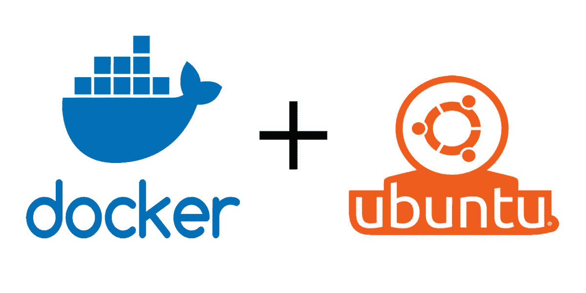
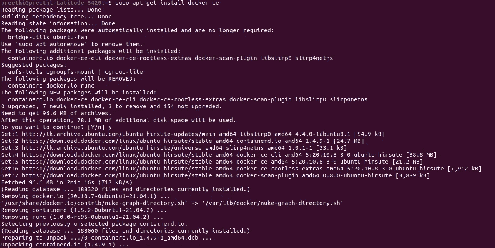

# Ubuntu 20.04 上的自宿主 Docker

> 原文：<https://medium.com/javarevisited/self-host-docker-on-ubuntu-20-04-f7d716cddc83?source=collection_archive---------2----------------------->



请将此作为如何在 Ubuntu 20.04 上安装 docker 的快速指南

docker 的简单思想是一组平台即服务产品，用于启动和管理容器。开发人员使用 [Docker 容器](/javarevisited/top-15-online-courses-to-learn-docker-kubernetes-and-aws-for-fullstack-developers-and-devops-d8cc4f16e773)来开发和部署应用程序，因为它们提供了隔离的、轻量级的虚拟环境。

## 先决条件

*   安装在 64 位操作系统上的 Ubuntu 20.04
*   拥有 **sudo** 权限的用户帐户

所有的命令都是以 sudo 用户的身份执行的，所以请记住，您可能需要在下面所有的命令前面加上`sudo`。

我作为根用户运行所有这些步骤。如果您不是 root 用户，要么在命令前添加`sudo`，要么使用`sudo`的模拟初始登录选项，以 root 用户身份启动一个交互式 shell:`sudo -i`

*   命令行/终端( **Ctrl+Alt+T** 或**应用菜单>附件>终端**
*   Docker 软件仓库(可选)

## 步骤 1:更新软件存储库

Docker Registry 是一个管理存储和交付 Docker 容器图像的应用程序。注册中心集中了容器映像，减少了开发人员的构建时间。

Docker 映像通过虚拟化保证了相同的运行时环境，但是构建映像需要大量的时间投入。

例如，开发人员可以从包含所有必要组件的注册表中下载压缩映像，而不是单独安装依赖项和包来使用 [Docker](/javarevisited/10-free-courses-to-learn-docker-and-devops-for-frontend-developers-691ac7652cee?source=---------94------------------) 。

首先打开一个终端窗口并更新本地存储库:

```
sudo apt update
```

等待该过程完成。

[](https://javarevisited.blogspot.com/2020/09/top-5-courses-to-crack-docker-certified-associate-certification.html#axzz6mKbga8XV)

更新软件存储库

## 步骤 2:下载依赖项

通过运行以下命令，允许您的 Ubuntu 20.04 系统通过 HTTPS 访问 Docker 库:

```
sudo apt-get install apt-transport-https ca-certificates curl software-properties-common
```

上述命令:

*   授予软件包管理器通过 **https** 传输文件和数据的权限。
*   允许系统检查安全证书。
*   安装 [**curl**](https://javarevisited.blogspot.com/2017/03/10-examples-of-curl-command-in-unix-and-Linux.html#axzz6iYmMFnsA) ，传输数据的工具。
*   添加用于管理软件的脚本。

[](https://javarevisited.blogspot.com/2019/05/top-5-courses-to-learn-docker-and-kubernetes-for-devops.html)

下载依赖项

## 步骤 3:添加 Docker 的 GPG 键

接下来，添加 GPG 密钥以确保软件包的真实性:

```
curl -fsSL https://download.docker.com/linux/ubuntu/gpg | sudo apt-key add -
```


添加码头工人的 GPG 键

## 步骤 4:安装 Docker 存储库

现在使用以下命令安装 Docker 存储库:

```
sudo add-apt-repository "deb [arch=amd64] https://download.docker.com/linux/ubuntu  $(lsb_release -cs)  stable"
```

该命令为您的特定 Ubuntu 版本安装最新的存储库

[](https://javarevisited.blogspot.com/2018/02/10-free-docker-container-courses-for-Java-Developers.html#axzz63ewnlq5p)

安装 Docker 存储库

## 步骤 5:安装最新的 Docker

从再次更新存储库开始:

```
sudo apt update
```

现在，您可以安装最新的 Docker 版本:

```
sudo apt-get install docker-ce
```

[](https://www.java67.com/2018/02/5-free-docker-courses-for-java-and-DevOps-engineers.html)

安装最新的 Docker

## 步骤 6:验证 Docker 安装

要确认安装，请检查 Docker 的版本:

```
docker --version
```


验证 Docker 安装

## 步骤 7:启用 Docker 服务

要启动 Docker 服务，请运行以下命令:

`sudo systemctl start docker`

启用 Docker 在启动时运行

`sudo systemctl enable docker`

要检查服务的状态，请使用以下命令:

`sudo systemctl status docker`

输出应该显示 Docker 是`**active (running)**`。

这篇文章应该可以帮助你在 Ubuntu 20.04 上安装并开始使用 Docker。保持阅读:)

你可能喜欢的其他 **Docker 文章和资源**

</javarevisited/top-15-online-courses-to-learn-docker-kubernetes-and-aws-for-fullstack-developers-and-devops-d8cc4f16e773>  </javarevisited/top-5-free-courses-to-learn-docker-for-beginners-best-of-lot-b2b1ad2b98ad>  </javarevisited/10-free-courses-to-learn-docker-and-devops-for-frontend-developers-691ac7652cee> 