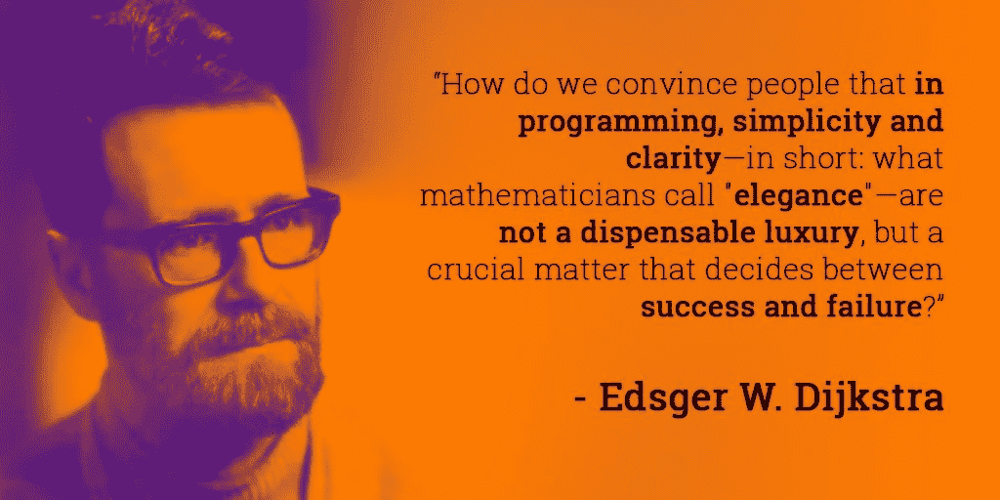

# 扇那个丑码！

> 原文：<https://medium.com/javarevisited/slap-that-ugly-code-6ec276d3a4bc?source=collection_archive---------2----------------------->

一个软件工匠给了一些肮脏、丑陋、写得很差的代码一记应得的耳光。

**的**S**single**L**level A**b striction**P**principle 通常被称为 **SLA** principle **，**但是如果你想让它听起来很酷，就像我一样，那么你可以称之为**巴掌**。这个原则被许多软件开发文献的作者解释过，但可能大多数程序员记得听到的是罗伯特·c·马丁(又名鲍勃叔叔)在他的畅销书 [**干净的代码**](https://books.google.co.uk/books/about/Clean_Code.html?id=dwSfGQAACAAJ&redir_esc=y) **(2009)** 中的 [**。**](https://en.wikipedia.org/wiki/Robert_C._Martin)

这一原则背后的思想是，一个方法中的所有代码都应该处于同一抽象级别。这样更容易阅读和理解代码。如果在同一个方法中用不同的抽象层次来表达代码，这将会导致混乱和难以理解。

> 在同一个方法中混合不同层次的抽象会使阅读和理解变得更加困难。我们应该总是试图将方法中的代码保持在同一抽象层次上。

同样重要的是要提到，尊重 SLAP 原则并不一定意味着你的代码会更短，它只是意味着它会更容易阅读。

这条原则即使看起来不太重要，但却非常重要，因为可读性和可维护性之间有着非常紧密的关系。

> **代码易于阅读和推理，易于维护**

也许现在我应该给你看一些这个原理的代码示例，但是我想先继续看几行有点无聊但是必要的理论。原因是，我觉得即使这个原则很容易理解和应用，但有些程序员并没有遵循它。但是为什么呢？

嗯，我思考了一下，我得出的结论是，一些程序员不遵循它的原因是因为他们觉得懒得重构，而且一旦他们实现了一个特性，他们认为他们不会再回到代码的那个部分。但是直到他们回头去看他们没有写的或者他们很久以前写的代码，他们才意识到为什么 SLAP 是重要的。

计算机科学家<https://en.wikipedia.org/wiki/Edsger_W._Dijkstra>****在 20 世纪 70 年代的一本关于科学思想 **的刊物中第一次提到了 [**分离的概念**](https://en.wikipedia.org/wiki/Separation_of_concerns) 。在不涉及太多细节的情况下，将一个问题的不同方面分开的想法允许科学家一次解决一个问题，并简化了推理过程。如你所见，在 Dijkstra 的关注点分离和现代的 SLAP 原则之间有联系。******

**无聊的理论结束了，现在是的看看一点点代码。请简要地看一下这段代码，但不要看太久，因为这是令人厌恶的，你的眼睛可能会受伤。**

**不要看这个太久不好的代码对你的健康没有好处**

**在上面代码示例中，我们可以清楚地看到违反了 SLAP 原则。例如，第 3 行委托了一个可能类似于第 2 行和第 4 行的行为。此外，这些变量试图表达一些更抽象的概念，但它们与底层实现细节混在一起。**

**我们现在将展示一小段代码，它隐藏了细节，将复杂性推到了一个不同的抽象层次，并在方法中留下了至少可以阅读的东西。**

**在这个例子中，代码处于同一抽象级别。**

**现在更容易理解这个方法在做什么了，因为它里面的代码，在同一抽象层次上。**

****

**如果你喜欢这个故事，请给我们一些👏还有 [**跟着我们**](https://javing-uk.medium.com/)**