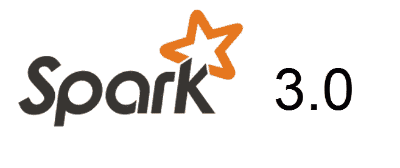

# Spark 3.0 —简而言之的新功能

> 原文：<https://medium.com/javarevisited/spark-3-0-new-functions-in-a-nutshell-a929fca93413?source=collection_archive---------0----------------------->

[](https://medium.com/javarevisited/5-free-courses-to-learn-apache-spark-in-2020-bdff2d60c800)

最近，Apache Spark 社区发布了 Spark 3.0 的预览版，其中包含许多重要的新功能，将有助于 Spark 在这个[大数据](/dataseries/top-6-courses-to-learn-big-data-and-hadoop-in-2020-2e20593347fe)和[数据科学](https://becominghuman.ai/9-data-science-and-machine-learning-courses-by-harvard-ibm-udemy-and-others-12a0c7c23ec1)时代拥有广泛的企业用户和开发人员。

在新版本中，spark community 已经将一些函数从 Spark [SQL](/javarevisited/7-free-courses-to-learn-database-and-sql-for-programmers-and-data-scientist-e7ae19514ed2) 移植到编程 Scala API( `org.apache.spark.sql.functions`)中，这鼓励开发人员将这些函数直接用作其数据帧转换的一部分，而不是进入 SQL 模式或创建视图，并将这些函数与 SQL 表达式或 **callUDF** 函数一起使用。

社区也努力引入了一些新的数据转换函数和 partition_transforms 函数，这些函数在使用 Spark 的新`DataFrameWriterv2` 将数据写到外部存储器时非常有用。

> Spark 3 中的一些新功能已经是 Databricks Spark 以前版本的一部分。因此，如果您曾在 Databricks cloud 中工作过，您可能会发现其中一些函数很熟悉。

在整篇文章中，我们将介绍 Spark 在 Spark SQL 和 Scala API 中的新函数，用于访问`DataFrame` 操作，以及从 Spark SQL 移植到 Scala API 的函数，用于编程访问。

# **Spark 3.0 在 Spark SQL 中引入的函数，用于数据帧转换**

## **from_csv**

像 from_json 一样，这个函数解析包含 CSV 字符串的列，并将其转换为 Struct 类型。如果 CSV 字符串不可解析，它将返回 null。

***例题*** :

这个函数需要一个结构模式和选项来指示如何解析 CSV 字符串。选项与 CSV 数据源相同。

```
val studentInfo = "1,Jerin,CSE"::"2,Jerlin,ECE"::"3,Arun,CSE"::*Nil*val *schema* = new StructType() 
            .add("Id",IntegerType)
            .add("Name",StringType)
            .add("Dept",StringType)val *options* = *Map*("delimiter" ->",")val studentDF = studentInfo.toDF("Student_Info")
.withColumn("csv_struct",*from_csv*('Student_Info, *schema*,*options*))
studentDF.show()
```

## **至 _csv**

将结构类型列转换为 CSV 字符串。

***例题*** *:*

除了 Struct type 列，该函数还接受一个可选的 options 参数，该参数指示如何将 Struct 列转换为 CSV 字符串。

```
studentDF
.withColumn("csv_string",*to_csv*($"csv_struct",*Map*.*empty*[String, String].asJava))
.show
```

## **模式 _of_csv**

推断 CSV 字符串的架构，并以 DDL 格式返回架构。

***举例:***

这个函数需要一个 CSV 字符串列和一个可选参数，该参数包含如何解析 CSV 字符串的选项。

```
studentDF
.withColumn("schema",*schema_of_csv*("csv_string"))
.show
```

## **for_all**

将给定的谓词应用于数组中的所有元素，并且仅当数组中的所有元素评估为 true 时返回 true，否则产生 false。

***举例:***

检查给定数组列中的所有元素是否都是偶数。

```
*val  df = Seq*(*Seq*(2,4,6),*Seq*(5,10,3)).toDF("int_array")
df.withColumn("flag",*forall*($"int_array",(x:Column)=>(*lit*(x%2==0))))
.show
```

## **变换**

将函数应用于数组中的所有元素后，返回一个新数组。

***举例:***

将数组中的所有元素加“1”。

```
val df = *Seq*((*Seq*(2,4,6)),(*Seq*(5,10,3))).toDF("num_array")
df
.withColumn("num_array",*transform*($"num_array",x=>x+1))
.show
```

## **叠加**

用从指定字节位置到可选指定字节长度的实际替换内容替换列的内容。

***举例:***

将特定人的问候语改为传统的“Hello World”

这里我们用 world 替换人名，因为姓名的起始位置是 7，我们想在替换内容之前删除完整的姓名，需要删除的字节位置的长度应该大于或等于列中姓名的最大长度。

因此，我们将替换单词作为“World”传递，替换内容的特定起始位置为“7”，从指定起始位置移除的位置数为“12”(这是可选的，如果没有指定，函数将使用指定起始位置的替换内容替换源内容)。

> Overlay 替换 StringType、TimeStampType、IntegerType 等的内容，但是不管列的输入类型是什么，列的返回类型总是 StringType。

```
val *greetingMsg* = "Hello Arun"::"Hello Mohit Chawla"::"Hello Shaurya"::*Nil*val *greetingDF* = *greetingMsg*.toDF("greet_msg")*greetingDF*.withColumn("greet_msg",*overlay*($"greet_msg",*lit*("World"),*lit*("7"),*lit*("12")))
.show
```

## **拆分**

根据给定的正则表达式和指定的限制拆分字符串表达式，指定的限制指示对给定的字符串表达式应用正则表达式的次数。

如果指定的限制小于或等于零，正则表达式将多次应用于字符串，结果数组将根据给定的正则表达式包含所有可能的字符串拆分。

如果指定的限制大于零，则应用的正则表达式不会超过该限制

***例如:***

根据正则表达式将给定的字符串表达式一分为二。即字符串分隔符。

```
val *num* = "one~two~three"::"four~five"::*Nil* val *numDF* = *num*.toDF("numbers")
*numDF* .withColumn("numbers",*split*($"numbers","~",2))
.show
```

将同一个字符串表达式拆分成多个部分，拆分次数与分隔符出现的次数一样多

```
*numDF* .withColumn("numbers",*split*($"numbers","~",0))
.show
```

## *地图 _ 条目*

将映射键值转换成无序的条目数组。

***举例:***

获取数组中地图的所有键和值。

```
val *df* = *Seq*(*Map*(1->"x",2->"y")).toDF("key_values")
*df*.withColumn("key_value_array",*map_entries*($"key_values"))
.show
```

## **map_zip_with**

使用函数根据关键字将两个地图合并成一个地图。

***举例:***

计算跨部门雇员完成的总销售额，并通过传递一个函数来获得单个映射中特定雇员的总销售额，该函数将根据键对两个不同映射列的总销售额进行求和。

```
val *df* = *Seq*((*Map*("EID_1"->10000,"EID_2"->25000),
             *Map*("EID_1"->1000,"EID_2"->2500)))   .toDF("emp_sales_dept1","emp_sales_dept2")

*df*.
withColumn("total_emp_sales",*map_zip_with*($"emp_sales_dept1",$"emp_sales_dept2",(k,v1,v2)=>(v1+v2)))
.show
```

## **地图 _ 过滤器**

返回只包含满足给定谓词函数的映射值的新键值对。

***举例:***

只过滤掉销售额高于 20000 的雇员

```
val *df* = *Seq*(*Map*("EID_1"->10000,"EID_2"->25000))
          .toDF("emp_sales")

*df* .withColumn("filtered_sales",*map_filter*($"emp_sales",(k,v)=>(v>20000)))
.show
```

## **转换值**

根据给定的函数操作映射列中所有元素的值。

***举例:***

通过给每个雇员增加 5000 来计算雇员薪金

```
val *df* = *Seq*(*Map*("EID_1"->10000,"EID_2"->25000))
         .toDF("emp_salary")

*df* .withColumn("emp_salary",*transform_values*($"emp_salary",(k,v)=>(v+5000)))
.show
```

## **变换 _ 键**

根据给定的函数操作地图列中所有元素的键。

***举例:***

将公司名称“XYZ”添加到员工 id 中。

```
val df = *Seq*(*Map*("EID_1" -> 10000, "EID_2" -> 25000))
        .toDF("employees")
df
.withColumn("employees", *transform_keys*($"employees", (k, v) => *concat*(k,*lit*("_XYZ"))))
.show
```

## **xhash64**

使用 64 位 xxhash 算法计算给定列内容的哈希代码，并将结果返回为 long。

# **Spark 3.0 中从 Spark SQL 移植到 Scala API 的函数，用于数据帧转换**

大多数 Spark SQL 函数都以 Scala API 的形式提供，这使得相同的函数可以作为 DataFrame 操作的一部分使用。但是仍然有一些功能不能作为编程功能使用。要使用这些函数，必须进入 Spark SQL 模式，并将这些函数作为 SQL 表达式的一部分使用，或者使用 Spark“call UDF”函数来使用相同的函数。随着函数的流行和使用的不断发展，这些函数中的一些曾经被移植到较新版本的编程 spark API 中。以下是从以前版本的 Spark SQL function 移植到 Scala API 的函数(org.spark.apache.sql.functions)

## **日期 _ 子**

从日期、时间戳和字符串数据类型中减去天数。如果数据类型为字符串，则数据类型应为可转换为日期的格式“yyyy*-MM-DD”**或“* yyyy *-MM-dd HH:mm:ss”。SSSS"*

***举例:***

从事件日期时间中减去“1 天”。

> 如果要减去的天数为负数，该函数将给定的天数加到实际日期上。

```
var *df* = *Seq*(
        (1, Timestamp.*valueOf*("2020-01-01 23:00:01")),
        (2, Timestamp.*valueOf*("2020-01-02 12:40:32")),
        (3, Timestamp.*valueOf*("2020-01-03 09:54:00")),
        (4, Timestamp.*valueOf*("2020-01-04 10:12:43"))
         )
     .toDF("typeId","eventDateTime")

 *df*.withColumn("Adjusted_Date",*date_sub*($"eventDateTime",1)).show()
```

## **日期 _ 添加**

与 date_sub 相同，但将天数添加到实际天数中。

***例如:***

将“1 天”添加到事件日期时间

```
var *df* = *Seq*(
         (1, Timestamp.*valueOf*("2020-01-01 23:00:01")),
         (2, Timestamp.*valueOf*("2020-01-02 12:40:32")),
         (3, Timestamp.*valueOf*("2020-01-03 09:54:00")),
         (4, Timestamp.*valueOf*("2020-01-04 10:12:43"))
         )
    .toDF("Id","eventDateTime")*df* .withColumn("Adjusted Date",*date_add*($"eventDateTime",1))
.show()
```

## **月份 _ 添加**

像 date_add 和 date_sub 一样，这个函数有助于添加月份到日期。

> 要减去月份，请将要减去的月份数指定为负数，因为没有单独的减去月份的减法函数

***例如:***

从 eventDateTime 中加减一个月。

```
var *df* = *Seq*(
    (1, Timestamp.*valueOf*("2020-01-01 23:00:01")),
    (2, Timestamp.*valueOf*("2020-01-02 12:40:32")),
    (3, Timestamp.*valueOf*("2020-01-03 09:54:00")),
    (4, Timestamp.*valueOf*("2020-01-04 10:12:43"))
     ).toDF("typeId","eventDateTime")
//To add one months
 *df* .withColumn("Adjusted Date",*add_months*($"eventDateTime",1))
.show()
//To subtract one months
*df* .withColumn("Adjusted Date",*add_months*($"eventDateTime",-1))
.show()
```

## **zip_with**

通过应用函数来合并左右数组。

该函数期望两个数组长度相同，以防其中一个数组比另一个短，将添加 null 来匹配较长的数组长度。

***举例:***

将两个数组的内容相加并合并成一个数组

```
val df = *Seq*((*Seq*(2,4,6),*Seq*(5,10,3)))
         .toDF("array_1","array_2")

 df
.withColumn("merged_array",*zip_with*($"array_1",$"array_2",(x,y)=>(x+y)))
 .show 
```

将谓词应用于所有元素，并检查数组中至少有一个或多个元素符合谓词函数。

***举例:***

检查数组中是否至少有一个元素是偶数。

```
*val df= Seq*(*Seq*(2,4,6),*Seq*(5,10,3)).toDF("num_array")
df.withColumn("flag",exists($"num_array", x =>*lit*(x%2===0)))
.show
```

## **过滤器**

将给定的谓词应用于数组中的所有元素，并过滤出谓词为真的元素。

*示例:*

只过滤掉数组中的偶数元素。

```
*val df = Seq*(*Seq*(2,4,6),*Seq*(5,10,3)).toDF("num_array")
df.withColumn("even_array",*filter*($"num_array", x =>*lit*(x%2===0)))
.show
```

## **聚合**

用给定函数将给定数组和另一个值/状态缩减为单个值，并应用可选的 finish 函数将缩减后的值转换为另一个状态/值。

***举例:***

将数组的总和加 10，然后将结果乘以 2

```
val *df* = *Seq*((*Seq*(2,4,6),3),(*Seq*(5,10,3),8))
  .toDF("num_array","constant")
*df*.withColumn("reduced_array",*aggregate*($"num_array", $"constant",(x,y)=>x+y,x => x*2))
  .show
```

# **Spark 3.0 中为 Spark SQL 模式引入的功能**

以下是新的 SQL 函数，您只能在 Spark SQL 模式下利用这些函数。

## acosh

求给定表达式的双曲余弦的倒数。

## 阿辛

求给定表达式的双曲正弦的倒数。

## **阿坦赫**

求给定表达式的双曲正切的倒数。

## **位与、位或和位异或**

要计算逐位 AND、OR 和 XOR 值

## **位计数**

返回位数计数。

## **布尔 _ 与和布尔 _ 或**

验证表达式的所有值是否为真，或者验证至少一个表达式为真。

## **count_if**

返回列中真值的数量

示例:

找出给定列中偶数的个数

```
var *df* = *Seq*((1),(2),(4)).toDF("num")

 *df*.createOrReplaceTempView("table")
*spark*.sql("select count_if(num %2==0) from table").show
```

## **日期 _ 部分**

提取日期/时间戳的一部分，如小时、分钟等…

## **div**

用于将表达式或列与另一个表达式/列相除

## **每一个和一些**

如果给定表达式对每个的所有列值求值为 true，并且至少有一个值对某些列值求值为 true，则此函数返回 true

## **制造日期、制造间隔和制造时间戳**

构建日期、时间戳和特定的时间间隔。

***举例:***

```
SELECT make_timestamp(2020, 01, 7, 30, 45.887)
```

## **最大值和最小值**

比较两列并返回左列的值，该值与右列的最大/最小值相关联

***举例:***

```
var *df* = *Seq*((1,1),(2,1),(4,3)).toDF("x","y")

 *df*.createOrReplaceTempView("table")
*spark*.sql("select max_by(x,y) from table").show
```

## **类型**

返回列值的数据类型

## **版本**

返回 Spark 版本及其 git 版本

## **调整天数、调整小时数和调整时间间隔**

新引入的 justify 函数用于调整时间间隔。

***举例:***

将 30 天表示为一个月，

```
SELECT justify_days(interval '30 day')
```

## **分区变换函数**

从 [Spark 3.0](/swlh/5-free-online-courses-to-learn-big-data-hadoop-and-spark-in-2019-a553e6ccfe30) 开始，出现了一些有助于数据分区的新功能，我将在另一篇文章中介绍。

总的来说，我们已经分析了 spark 3.0 中的所有数据转换和分析功能。希望本指南有助于理解这些新功能。这些功能肯定会加速 spark 开发工作，并有助于建立坚实有效的 spark 管道。

如果你有任何疑问，请在 twitter 上向我提出。