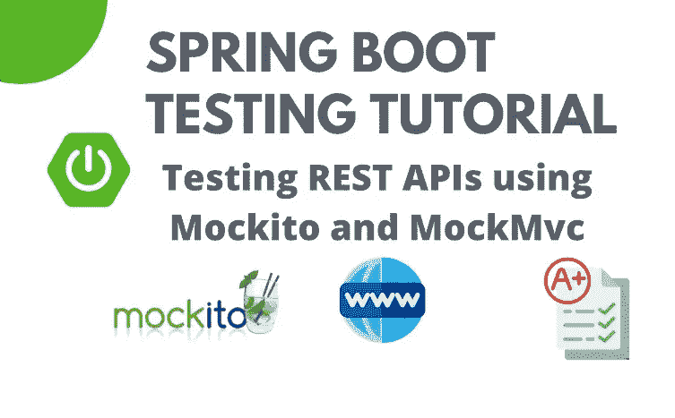

# Spring Boot 2 +朱尼特 5 +莫奇托

> 原文：<https://medium.com/javarevisited/spring-boot-2-junit-5-mockito-d8e2e5c8a90d?source=collection_archive---------0----------------------->



Spring Boot 2 +朱尼特 5 +莫奇托

# 介绍

在本文中，我们将学习如何在 Spring Boot 应用程序中使用 Mockito 创建一个 JUnit 5 测试类。JUnit 是 Java 应用程序最流行的测试框架之一。JUnit 5 支持 Java 8 的所有现代特性，并允许在测试中使用许多不同的方法和风格。

在本文中，我们将使用以下三种方法。

*   使用`MockMvc`执行 REST 调用进行测试。
*   利用`TestRestTemplate`调用 REST API 的 Spring boot 测试。
*   `HelloController`类的单元测试。

# Maven 依赖性

幸运的是，来自版本`2.2.0`的`spring-boot-starter-test`依赖项已经随 Junit 5 一起提供，并且还包含用于测试的 Hamcrest 和 Mockito 库。这是个好消息，因为我们不需要在最终的`pom.xml`文件中添加很多依赖项。

JUnit 5 由两个组件组成，例如:

*   JUnit Jupiter——用于在 JUnit 5 中编写测试和扩展，
*   JUnit Vintage —为在平台上运行基于 JUnit 3 和 JUnit 4 的测试提供测试引擎。

对于我们的例子，我们不需要 JUnit 3 和 JUnit 4 支持，这就是为什么我们将排除这种依赖性。

最终`pom.xml`的结构如下:

```
 <?xml version="1.0" encoding="UTF-8"?>
<project  xmlns:xsi="http://www.w3.org/2001/XMLSchema-instance"
         xsi:schemaLocation="http://maven.apache.org/POM/4.0.0 https://maven.apache.org/xsd/maven-4.0.0.xsd">
    <modelVersion>4.0.0</modelVersion>

    <groupId>com.demo.springboot</groupId>
    <artifactId>spring-boot2-junit5-mockito</artifactId>
    <version>0.0.1-SNAPSHOT</version>

    <!-- Inherit defaults from Spring Boot -->
    <parent>
        <groupId>org.springframework.boot</groupId>
        <artifactId>spring-boot-starter-parent</artifactId>
        <version>2.4.1</version>
    </parent>

    <properties>
        <java.version>1.8</java.version>
    </properties>

    **<!-- Add typical dependencies for a web application -->**
    <dependencies>
        <dependency>
            <groupId>org.springframework.boot</groupId>
            <artifactId>spring-boot-starter-web</artifactId>
        </dependency>
        <dependency>
            <groupId>org.springframework.boot</groupId>
            <artifactId>spring-boot-starter-test</artifactId>
            <scope>test</scope>
            <exclusions>
                <exclusion>
                    <groupId>org.junit.vintage</groupId>
                    <artifactId>junit-vintage-engine</artifactId>
                </exclusion>
            </exclusions>
        </dependency>
    </dependencies>

    **<!-- Package as an executable jar -->**
    <build>
        <plugins>
            <plugin>
                <groupId>org.springframework.boot</groupId>
                <artifactId>spring-boot-maven-plugin</artifactId>
            </plugin>
        </plugins>
    </build>
</project>
```

我们有两个主要的依赖关系:

*   `spring-boot-starter-web` - web 容器用于创建 Spring REST API。
*   `spring-boot-starter-test` -单元和集成测试的主要依赖项。

`spring-boot-maven-plugin`用于创建 Spring Boot 应用程序的可执行 jar。

# 项目结构

测试项目具有以下结构:

```
 ├── pom.xml
├── src
│   ├── main
│   │   ├── java
│   │   │   └── com
│   │   │       └── demo
│   │   │           └── springboot
│   │   │               ├── Application.java
│   │   │               ├── controller
│   │   │               │   └── HelloController.java
│   │   │               └── service
│   │   │                   └── HelloService.java
│   └── test
│       └── java
│           └── com
│               └── demo
│                   └── springboot
│                       └── controller
│                           ├── HelloControllerMockitoTest.java
│                           ├── HelloControllerMockMvcTest.java
│                           └── HelloControllerRestTemplTest.java
```

我们使用以下类:

*   `Application` -用于启动 web 容器的主 Spring Boot 应用程序类。
*   `HelloController` -测试用弹簧支架控制器。
*   `HelloService` -用于检查 autowire 在测试中如何工作的 Spring 服务。
*   `HelloControllerMockitoTest` -使用 Mockito 测试`HelloController`，
*   `HelloControllerMockMvcTest` -使用 MockMvc 测试`HelloController`，
*   `HelloControllerRestTemplTest` -使用 TestRestTemplate 测试`HelloController`。

# 用于 JUnit 5 测试的 Spring REST API

## `HelloController`

名为`HelloController`的 Spring REST 控制器将被用作我们测试的主类。它使用`@Autowired`注释来注入`HelloService`。

`@GetMapping`注释标记了`greeting()`方法，从现在开始，该方法将用于处理对根路径`/`的所有`GET`请求。

```
package com.demo.springboot.controller;

import org.springframework.beans.factory.annotation.Autowired;
import org.springframework.web.bind.annotation.GetMapping;
import org.springframework.web.bind.annotation.ResponseBody;
import org.springframework.web.bind.annotation.RestController;

import com.demo.springboot.service.HelloService;

@RestController
public class HelloController {

    private final HelloService helloService;

    @Autowired
    public HelloController(HelloService helloService) {
        this.helloService = helloService;
    }

    @GetMapping("/")
    public @ResponseBody String greeting() {
        return helloService.getWelcomeMessage();
    }
}
```

## 你好服务

`HelloService`是一个简单的 Spring 服务，其方法`getWelcomeMessage()`将在 REST 控制器类中运行。这个类的主要目的是展示我们如何在 JUnit 测试中使用 Mockito 来模拟类。

```
 package com.demo.springboot.service;

import org.springframework.stereotype.Service;

@Service
public class HelloService {

    public String getWelcomeMessage() {
        return "Hello World!";
    }
}
```

## 主`@SpringBootApplication`类

主 Spring Boot 应用程序类标有`@SpringBootApplication`注释，并且包含一个单独的`public static void main(String[] args)`方法，该方法默认启动 web 容器 Tomcat。

```
 package com.demo.springboot;

import org.springframework.boot.SpringApplication;
import org.springframework.boot.autoconfigure.SpringBootApplication;

@SpringBootApplication
public class Application {

    public static void main(String[] args) {
        SpringApplication.run(Application.class, args);
    }
}
```

# 方法 1:使用`MockMvc`执行 REST 调用进行测试

让我们从一个使用`MockMvc`的测试类开始我们的测试冒险。在这种方法中，不会启动 Spring Boot 应用服务器，但是会以与处理 HTTP 请求完全相同的方式调用代码。

测试类如下所示:

```
package com.demo.springboot.controller;

import static org.hamcrest.Matchers.containsString;
import static org.springframework.test.web.servlet.request.MockMvcRequestBuilders.get;
import static org.springframework.test.web.servlet.result.MockMvcResultHandlers.print;
import static org.springframework.test.web.servlet.result.MockMvcResultMatchers.content;
import static org.springframework.test.web.servlet.result.MockMvcResultMatchers.status;

import org.junit.jupiter.api.Test;
import org.springframework.beans.factory.annotation.Autowired;
import org.springframework.boot.test.autoconfigure.web.servlet.AutoConfigureMockMvc;
import org.springframework.boot.test.context.SpringBootTest;
import org.springframework.test.web.servlet.MockMvc;

@SpringBootTest
@AutoConfigureMockMvc
public class HelloControllerMockMvcTest {

    @Autowired
    private MockMvc mockMvc;

    @Test
    public void shouldReturnDefaultMessage() throws Exception {
        this.mockMvc.perform(get("/"))
                    .andDo(print())
                    .andExpect(status().isOk())
                    .andExpect(content().string(containsString("Hello World!")));
    }
}
```

我们使用了`MockMvc`类和`@AutoConfigureMockMvc`来配置它并将其注入到测试类中。`MockMvc`类用于执行 API 调用，但是 Spring 将只测试在`HelloController`中处理它们的实现，而不是 HTTP 请求。

# 方法 2:利用`TestRestTemplate`调用 REST API 的 Spring boot 测试

在下一个方法中，我们将使用用于启动 Spring 应用程序上下文的`@SpringBootTest`注释。

```
 package com.demo.springboot.controller;

import static org.assertj.core.api.Assertions.assertThat;

import org.junit.jupiter.api.BeforeEach;
import org.junit.jupiter.api.Test;
import org.springframework.beans.factory.annotation.Autowired;
import org.springframework.boot.test.context.SpringBootTest;
import org.springframework.boot.test.web.client.TestRestTemplate;
import org.springframework.boot.web.server.LocalServerPort;

@SpringBootTest(webEnvironment = SpringBootTest.WebEnvironment.RANDOM_PORT)
public class HelloControllerRestTemplTest {

    @LocalServerPort
    private int port;

    private String url;

    @Autowired
    private TestRestTemplate restTemplate;

    @BeforeEach
    public void setUp() {
        url = String.format("http://localhost:%d/", port);
    }

    @Test
    public void greetingShouldReturnDefaultMessage() {
        assertThat(this.restTemplate.getForObject(url, String.class)).contains("Hello World!");
    }
}
```

在这种方法中，我们可以像在运行时应用程序中一样使用`@Autowired`注释。Spring 将解释它们并进行必要的注入。在`@SpringBootTest`测试中，真正的 Spring Boot 应用服务器正在启动。

在测试中，我们使用了:

*   `webEnvironment = SpringBootTest.WebEnvironment.RANDOM_PORT` -使用随机端口启动服务器，以避免任何端口冲突。
*   `@LocalServerPort` -该注释告诉 Spring 向特定字段注入一个随机端口，
*   `TestRestTemplate` - `RestTemplate`用于测试用来发出一个真实的 HTTP 请求。

# 方法 3:`HelloController`类的 Mockito 单元测试

如果我们想在测试`HelloController`类时模仿一些对象，我们可以在单元测试中使用 Mockito 框架。在这种方法中，我们只是用 JUnit 和 Mockito 测试类，而没有进行任何 HTTP 调用。这是可能的，因为我们的 REST 控制器是一个普通的类。

```
 package com.demo.springboot.controller;

import static org.assertj.core.api.Assertions.assertThat;
import static org.mockito.Mockito.when;

import org.junit.jupiter.api.BeforeEach;
import org.junit.jupiter.api.Test;
import org.junit.jupiter.api.extension.ExtendWith;
import org.mockito.InjectMocks;
import org.mockito.Mock;
import org.mockito.junit.jupiter.MockitoExtension;

import com.demo.springboot.service.HelloService;

@ExtendWith(MockitoExtension.class)
public class HelloControllerMockitoTest {

    @Mock
    private HelloService helloService;

    @InjectMocks
    private HelloController helloController;

    @BeforeEach
    void setMockOutput() {
        when(helloService.getWelcomeMessage()).thenReturn("Hello Mockito Test");
    }

    @Test
    public void shouldReturnDefaultMessage() {
        String response = helloController.greeting();
        assertThat(response).isEqualTo("Hello Mockito Test");
    }
}
```

要开始在 JUnit 测试中使用 Mockito，我们需要用`@ExtendWith(MockitoExtension.class)`注释一个类。在我们的测试类中，我们模仿`HelloService`来改变`getWelcomeMessage()`方法的响应。`@InjectMocks`注释告诉 Mockito 将所有模拟对象注入到测试类中。

# 结论

在本文中，我们介绍了几种使用 JUnit 5 和 Mockito 库测试 Spring REST 控制器的方法。这取决于我们是想使用`@SpringBootTest`注释启动真正的 Spring Boot 服务器，还是简单地运行使用`MockMvc`在 HTTP 请求上调用的实现。如果需要模仿或窥探依赖关系，也可以使用 Mockito 来测试 REST 控制器类。