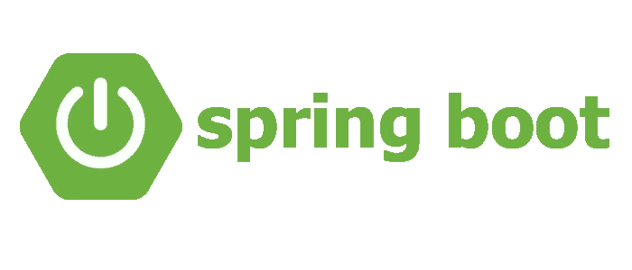

# Spring Boot 旗帜报

> 原文：<https://medium.com/javarevisited/spring-boot-banner-927383bdf154?source=collection_archive---------5----------------------->

## 创建您的自定义横幅



通常，当您启动一个 Spring Boot 应用程序时，您的控制台输出中会有这样的内容:

```
 .   ____          _            __ _ _
 /\\ / ___'_ __ _ _(_)_ __  __ _ \ \ \ \
( ( )\___ | '_ | '_| | '_ \/ _` | \ \ \ \
 \\/  ___)| |_)| | | | | || (_| |  ) ) ) )
  '  |____| .__|_| |_|_| |_\__, | / / / /
 =========|_|==============|___/=/_/_/_/
 :: Spring Boot ::                (v2.5.5)
```

但是你知道你可以禁用它，甚至创建一个自定义的吗？
没有？是的，而且很简单，所以我们走吧。

# 关闭横幅

如果您不想在应用程序启动时显示横幅，您有两个选择:

*   在您的 *application.properties* 文件中将属性设置为 off

```
spring.main.banner-mode=off
```

*   在您的主类中，更改代码行以运行应用程序

```
SpringApplication.run(BannerApplication.class, args);
```

对此

```
new SpringApplicationBuilder(BannerApplication.class)
        .bannerMode(Banner.Mode.*OFF*)
        .run(args);
```

# 拥有自定义横幅

默认情况下，Spring Boot 会在你的 ressources 文件夹中搜索一个名为 banner.txt 的文件来使用它，但是你的横幅也可以是一个图像(将被转换成 ASCII 码)，所以如果你想使用一个图像，你应该在你的 *application.properties* 文件中添加一个属性

```
spring.banner.image.location=**classpath:banner.png**
```

这里我使用了 Stich 的图片作为横幅，输出如下


不是很漂亮也不可读，所以让我们看看如果我用一个 *banner.txt* 代替一张图片我会有什么。

所以，我在我的 ressources 文件夹中创建了一个 *banner.txt* 文件，在这个文件中我写了“Hello the World！!"然后开始了我的项目


简单而有效，但是，我们可以做得更好，一些网站为您提供了横幅生成器，让您选择文本和字体，我相信您会使用谷歌来找到它们，但作为一个例子，您可以有这样的东西:


你可以使用占位符在你的横幅上添加一些信息。

此外，文本可以用变量着色，如`${AnsiColor.NAME}`或`${AnsiBackground.NAME}`。