# Spring Boot 初学者指南:CRUD

> 原文：<https://medium.com/javarevisited/spring-boot-guide-for-beginner-crud-c682d5437a0e?source=collection_archive---------1----------------------->

## 处理许多 HTTP 请求的指南:GET、POST、PUT、DELETE

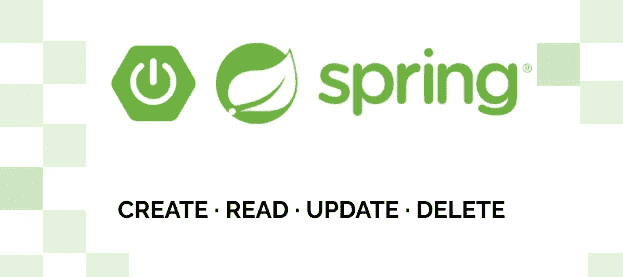

标题图像

许多项目有时会将后端和前端服务分开。由于每个服务的安全性和可维护性，进行关注点分离是一个很好的实践。

然而，这种方法带来的问题是如何连接这些服务并让它们说话。前端需要从后端访问资源，而只使用后端会让用户感到沮丧。

这种情况就是 HTTP 请求发挥作用的地方。互联网工程任务组(IETF)制定了 RFC 2616，该标准将与主机服务的通信标准化。该文档为每个典型的 web 事务定义了 HTTP 请求方法。

这些 web 事务统称为 CRUD 操作，是创建、读取、更新和删除的缩写。CRUD 操作和 HTTP 请求之间的关系描述如下:

*   要创建信息，请使用 HTTP POST 方法。
*   要读取信息，请使用 HTTP GET 方法。
*   要更新信息，请使用 HTTP PUT 方法。
*   若要删除信息，请使用 HTTP DELETE 方法。

本文将是在 Spring Boot 实现 CRUD 操作的指南。使用 [Spring Boot](/javarevisited/top-10-courses-to-learn-spring-boot-in-2020-best-of-lot-6ffce88a1b6e) 的好处之一是它的[自动配置](https://javarevisited.blogspot.com/2018/11/top-5-spring-boot-features-java.html#axzz6i534L5Aj)。所以，除了你的商业逻辑，你什么都不用担心。本文的目标是我们想要在一个`Guest`实体/模型上进行创建、读取、更新和删除操作。

# 先决条件

在这个指令中，需要的依赖项很少，本文不会涉及。尽管如此，下面还是提供了安装说明的外部链接作为超链接:

*   [JDK 1.8](https://javarevisited.blogspot.com/2013/02/how-to-install-jdk-7-on-windows-8-java-32bit-64.html)
*   [IntelliJ IDEA](/javarevisited/7-best-courses-to-learn-intellij-idea-for-beginners-and-experienced-java-programmers-2e9aa9bb0c05?source=---------16------------------)
*   [Postman](/javarevisited/7-best-courses-to-learn-postman-tool-for-web-service-and-api-testing-f225c138fa5a) 或任何 API 测试工具

# 实践学习

这里的 [***链接提供了启动程序代码***](https://github.com/andhikayusup/springboot-startercode)**以方便启动和运行* ***。*** 不过，这是可选的。您可以使用 [Spring Initialzr](https://start.spring.io/) 自行生成启动代码。此外，如果您喜欢使用其他 Java 版本或添加额外的依赖项，可以开发自己的起始代码。我有一篇报道这件事的文章；拜托，去看看。*

*[](/@andhikayusup/spring-boot-guide-for-beginner-hello-world-64e248eec793) [## Spring Boot 初学者指南:你好，世界

### 通过这种简单的设置，让您的 Spring Boot 项目正常运行

medium.com](/@andhikayusup/spring-boot-guide-for-beginner-hello-world-64e248eec793) 

## 制作新文档

在克隆存储库(或者生成你自己的启动代码)之后，使用 IntelliJ IDEA 或者你选择的任何 IDE 打开源代码。然后，导航到`src/main/java/com/andhikayusup/learncrud`文件夹，那里是你做大部分工作的地方。右键单击父文件夹，然后导航到`new -> Package`，使用 IntelliJ IDEA 创建一个新的包/文件夹。你可以通过下面的 gif 按照前面的说明去做。

[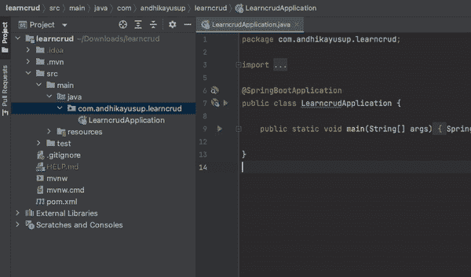](https://javarevisited.blogspot.com/2018/09/top-5-courses-to-learn-intellij-idea-java-and-android-development.html)

使用 IntelliJ IDEA 创建新的包/文件夹

在生成了`guest`文件夹之后，您将需要创建额外的文件来跟进这篇文章。IntelliJ IDEA 通过右键单击`guest`文件夹并导航到`new -> Java Class`来轻松生成 Java 类。该操作将生成 Java 类，并准备好一些预填充的模板代码。你可以通过下面的 gif 按照前面的说明去做。

[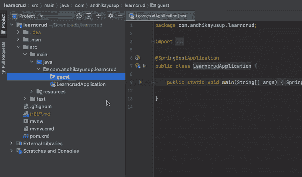](https://www.java67.com/2018/08/top-10-free-java-courses-for-beginners-experienced-developers.html)

使用 IntelliJ IDEA 创建新的 Java 类

为了交付更好的代码，我们需要将生产代码分发到单独的文件中，以便每个文件都有自己的集体功能。我们可以将 CRUD 操作的实现分成三个文件:`Guest`、`GuestService`和`GuestController`。

在 [OOP 范例](/javarevisited/my-favorite-courses-to-learn-object-oriented-programming-and-design-in-2019-197bab351733)中，我们将世界建模为对象的交互。类是我们对象的模板，它定义了默认的属性和方法。我们创建的第一个文件是`Guest.java`，它作为我们问题的一个类。对于这种情况，我们有一个带有几个属性和方法的`Guest`类。这个类的属性有`ID`、`full name`、`age`；同时，这些方法是每个属性的 setter 和 getter。该文件的最终代码应该如下所示:

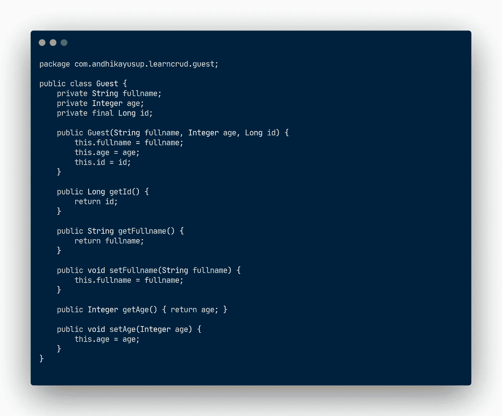

Guest.java

我们生成的第二个文件是`GuestService`。这个文件应该是我们业务逻辑的实现。我们现在不使用像 [PostgreSQL](/javarevisited/7-best-free-postgresql-courses-for-beginners-to-learn-in-2021-3bf369d73794) 这样的存储数据库；我们将把`Guest`对象作为数组列表保存在我们的服务器内存中。因此，这个文件将实现创建、检索、更新和删除这些对象到我们定义的 [ArrayList](https://javarevisited.blogspot.com/2011/05/example-of-arraylist-in-java-tutorial.html#axzz6qVaG06bu) 中的业务逻辑。

上面的代码为我们的`GuestService`类添加了`@Component`注释。这个注释告诉 [Spring Boot](/javarevisited/10-advanced-spring-boot-courses-for-experienced-java-developers-5e57606816bd?source=collection_home---4------0-----------------------) 在我们进行依赖注入的地方实例化它们。依赖注入是 Spring Boot 的优势之一，因为它消除了类之间的解耦。Amigoscode 在他的视频[上有一个很棒的视频来解释这件事。](https://www.youtube.com/watch?v=oqYRl06DNHQ)

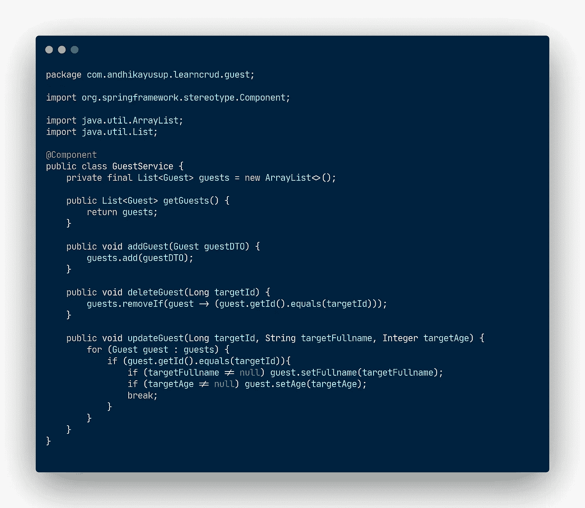

GuestService.java

## 休息控制器

我们应该实现的第三个文件是`GuestController`。在这个类上使用的注释告诉 Spring Boot，这个类将是 REST 控制器，是我们服务的入口点。另外，`@RequestMapping(<path>)`用于映射所述 REST 控制器控制请求的路径。这个 REST 控制器类将在`api/v1/guest`路径接受这个问题的请求。

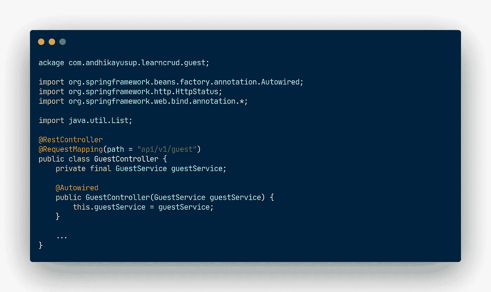

GuestController.java

还记得我们在`GuestService.java`上声明的`[@Component](https://javarevisited.blogspot.com/2017/11/difference-between-component-service.html)`注释吗？我们将在这个类上使用[依赖注入](https://javarevisited.blogspot.com/2012/12/inversion-of-control-dependency-injection-design-pattern-spring-example-tutorial.html#axzz6u4HTHz4Z)实例化`GuestService`。要执行这个动作，首先，我们需要实现`GuestController`类的构造函数，用`GuestService`对象作为它的参数。然后，我们使用`@Autowired`注释向 Spring Boot 表明我们使用了依赖注入。

## 处理 GET 请求

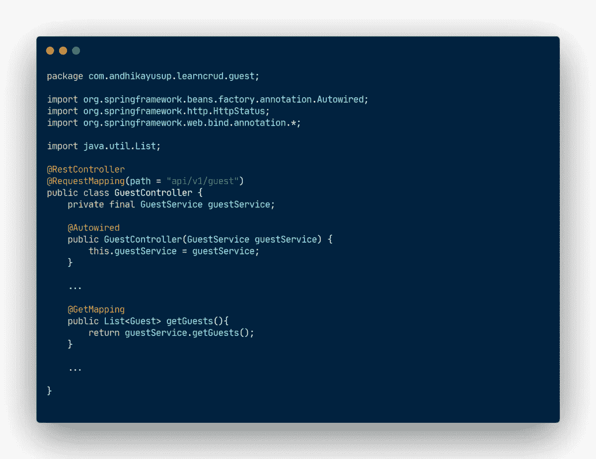

HTTP GET 方法通常用于从托管服务读取数据。`@GetMapping`用于表示所述方法是 GET 请求方法的处理程序。

这个处理程序的实现非常简单。我们只需要返回我们在`GuestService`类中定义的`getGuests`方法的输出。

## 处理发布请求

[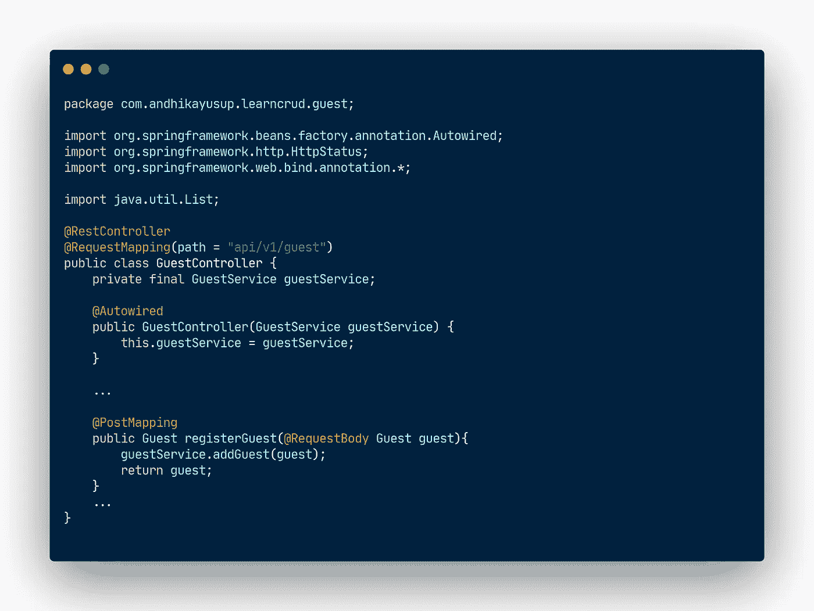](https://www.java67.com/2017/11/top-5-free-core-spring-mvc-courses-learn-online.html)

一个方法必须使用`@PostMapping`注释，这样 Spring Boot 就可以知道这个方法是 [POST 请求](https://javarevisited.blogspot.com/2015/10/how-to-send-http-request-from-unix-or-linux-curl-wget-example.html)的处理程序。

该方法的目标是将用户的客人信息保存到系统中。我们决定要求用户将他们的数据放在请求体中。 [Spring Boot](/javarevisited/top-10-free-courses-to-learn-spring-framework-for-java-developers-639db9348d25) 很容易将用户在请求体**中提供的所有信息直接**提取到`Guest`类的一个实例中。

这可以通过在参数中附加`@RequestBody`注释来实现。然后，调用`GuestService`类中的`addGuest`方法，将这些数据插入到我们的(内存)数据库中。最后，我们需要将该实例返回给用户，由前端服务进一步处理。

## 处理删除请求

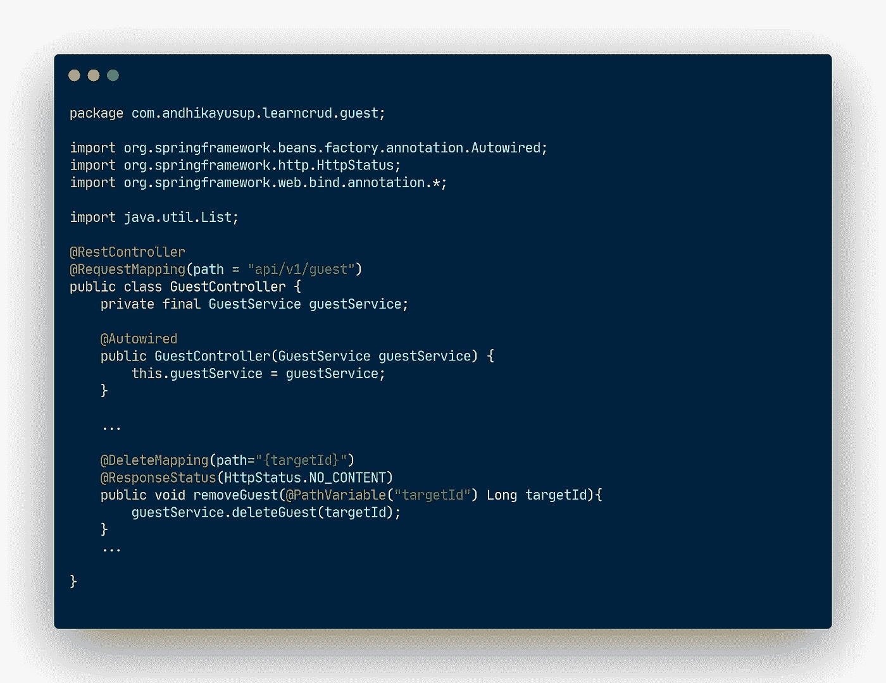

HTTP 删除处理程序

如果我们想指示删除服务上的一条信息，HTTP DELETE 请求方法是执行的合适方法。一个方法使用了`@DeleteMapping(<Path>)`注释，这样 [Spring Boot](/hackernoon/top-5-spring-boot-and-spring-cloud-books-for-java-developers-75df155dcedc) 就可以知道这个方法是删除请求的处理程序。我们设计了 API 路径，以便包含目标`guest` ID 号的附加信息。在该 API 路径中检索信息很容易。我们只需要将`@PathVariable(<var>)`方法放入函数参数中。

然后，我们将这些`guest` ID 作为参数传递给`GuestService`类中的`deleteGuest`方法来执行信息删除。这个函数不返回任何数据，所以最佳实践是告诉我们的用户一个`204 No Content`响应状态。

## 处理 PUT 请求

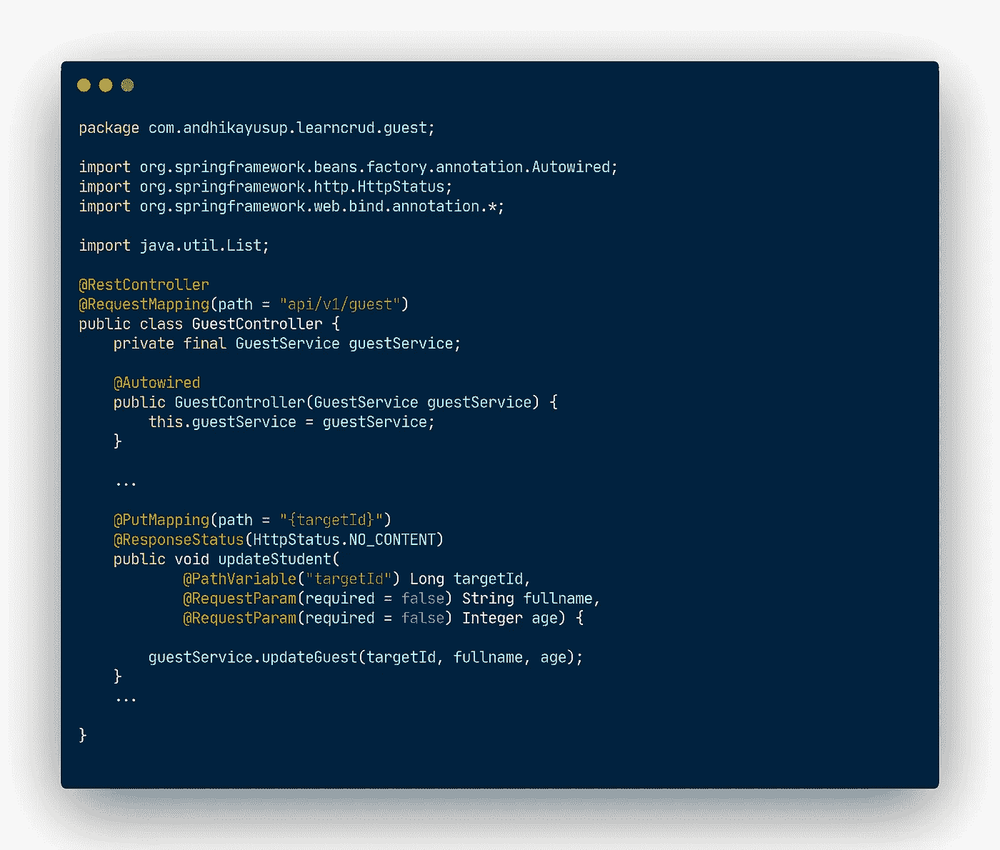

HTTP 上传处理程序

一个方法必须使用`@PutMapping`注释，这样 Spring Boot 就可以知道这个方法是用于 [HTTP PUT 请求](https://javarevisited.blogspot.com/2016/10/difference-between-put-and-post-in-restful-web-service.html) s 的处理程序。此外，我们还需要 path 变量的其他信息作为请求参数。为了能够做到这一点，我们应该给目标参数加上`@RequestParams(required=false)`注释。请求参数和路径变量的区别在于我们可以将请求参数设置为可选的。* 

*虽然最终的结果肯定是不一样的，但是如果你按照本文的说明去做，最终的`GuestController.java`代码应该是下图这样的:*

*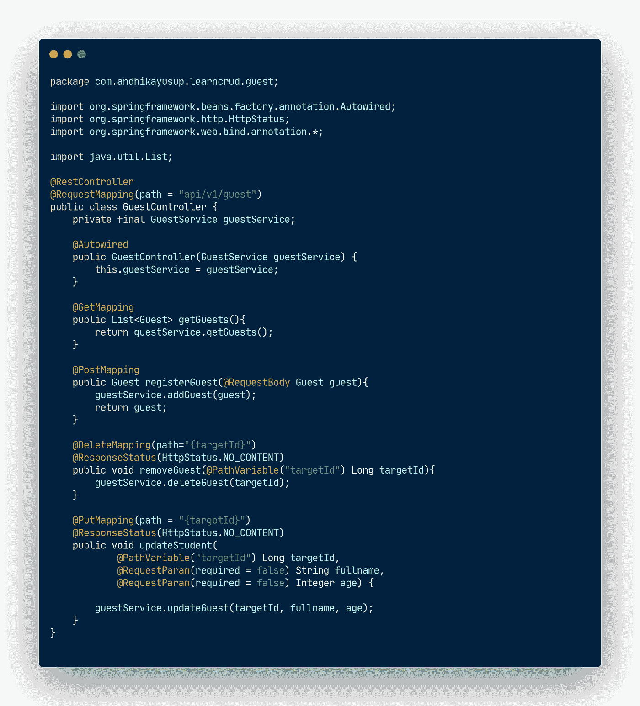*

*GuestController.java 全面实施*

# *结果*

*如果你按照这个指南读到了这一节，那么恭喜你！您只需要运行应用程序，这样我们就可以测试我们的服务。我们将使用 [Postman](/javarevisited/6-best-rest-api-tools-for-testing-design-and-development-1c5f69ed1f22) 对服务执行 CRUD 操作。我分享了 API 集合，所以你可以通过下面的链接导入到 Postman。*

```
*[https://www.getpostman.com/collections/14480a416e8c1e3d9963](https://www.getpostman.com/collections/14480a416e8c1e3d9963)*
```

*按照下面的 GIF 使用 Postman API 测试工具测试我们的 web 应用程序:*

*[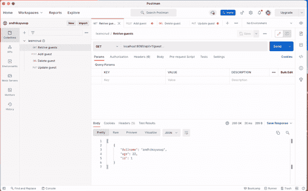](https://javarevisited.blogspot.com/2020/02/top-5-postman-tutorials-and-courses-for-web-developers.html)

CRUD API 测试* 

# *进一步阅读*

*这是在 Spring Boot 上开发 CRUD 操作的简单指南。你应该做很多改进。我在下面放了外部链接，供您了解 Spring Boot 的其他改进和组件:*

*   *Ignacio Oliveto 与 JWT Spring Boot 公司合作保护应用程序*
*   *[用 Spring Boot 和春云搭建微服务](/clover-platform-blog/building-a-microservice-with-spring-boot-and-spring-cloud-1c8275d7d229) bt 三叶草平台*
*   *[GraphQL 与 Java 和 Spring Boot](https://tiagoamp.medium.com/graphql-with-java-and-spring-boot-a081839122ad) 由 Tiago Albuquerque 开发*

*特别向[朋友们喊出](https://www.youtube.com/user/djdjalas)。他的伟大和通俗易懂的内容真的帮助我了解 Spring Boot。请去看看他的 Youtube 频道，别忘了订阅。*