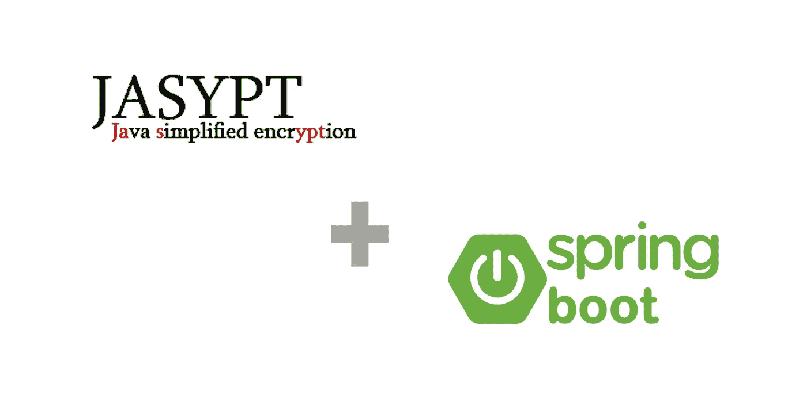

# 使用 Jasypt 的 Spring Boot 秘密加密

> 原文：<https://medium.com/javarevisited/spring-boot-secrets-encryption-using-jasypt-63e542a12dec?source=collection_archive---------1----------------------->

[](https://javarevisited.blogspot.com/2022/01/spring-boot-reactjs-example-for-java.html)

Spring Boot 秘密加密/解密使用 Jasypt。

保护敏感数据非常重要，将应用程序相关的凭证和机密以纯文本形式存储在源代码存储库中始终是一个安全问题。

在这篇博客中，让我们看看如何使用 **Jasypt** 库加密 Spring Boot 应用程序配置文件(即 application.properties 或 application.yml)的敏感信息，例如数据源的用户名和密码、SMTP 服务器的用户凭证等。

[**jas ypt**](http://www.jasypt.org/)**(Java 简化加密)是一个 Java 库，它允许开发人员用最少的努力将基本的加密功能添加到他们的项目中，并且不需要深入了解加密是如何工作的。**

## **1.添加 maven 依赖项**

**为了理解用法，让我们创建一个基本的 spring boot 应用程序，并在下面添加对 pom.xml 的依赖关系**

```
<dependency>
   <groupId>com.github.ulisesbocchio</groupId>
   <artifactId>jasypt-spring-boot-starter</artifactId>
   <version>3.0.4</version>
</dependency>
```

***我们可以从像*[*jas ypt-online-encryption-decryption*](https://www.devglan.com/online-tools/jasypt-online-encryption-decryption)*这样的在线工具中创建加密值，但是为了简单起见，我们将使用下面的 maven 插件并生成加密值。***

```
<plugin>
    <groupId>com.github.ulisesbocchio</groupId>
    <artifactId>jasypt-maven-plugin</artifactId>
    <version>3.0.4</version>
</plugin>
```

## ****2。让我们决定一个用于加密和解密的密钥****

**密钥用于加密密码，稍后可用于解密加密值以获得实际密码。您可以选择任何值作为密钥。**

## **3.生成加密值并运行应用程序**

**我们有三个值用户名、密码和令牌，我们将为它们创建加密值。**

**运行以下命令:**

```
mvn jasypt:encrypt-value -Djasypt.encryptor.password=masterpassword -Djasypt.encryptor.algorithm=PBEWithMD5AndDES -Djasypt.plugin.value=myusername
```

*   ****jas ypt . plugin . value**:my username(要加密的实际凭证)**
*   ****jas ypt . encryptor . password**:主密码(您选择的密钥)**
*   ****算法** : PBEWithMD5AndDES(使用的算法)**

**您可以在该命令后看到，日志打印如下:
*ENC(wekfisbtevbdnsi 878s 6 lb/bucy 35 vvb)***

```
[INFO] Started MavenCli in 0.954 seconds (JVM running for 2.84)
[INFO] Active Profiles: Default
[INFO] Encrypting value myusername
[INFO] String Encryptor custom Bean not found with name 'jasyptStringEncryptor'. Initializing Default String Encryptor
[INFO] Encryptor config not found for property jasypt.encryptor.key-obtention-iterations, using default value: 1000
[INFO] Encryptor config not found for property jasypt.encryptor.pool-size, using default value: 1
[INFO] Encryptor config not found for property jasypt.encryptor.provider-name, using default value: null
[INFO] Encryptor config not found for property jasypt.encryptor.provider-class-name, using default value: null
[INFO] Encryptor config not found for property jasypt.encryptor.salt-generator-classname, using default value: org.jasypt.salt.RandomSaltGenerator
[INFO] Encryptor config not found for property jasypt.encryptor.string-output-type, using default value: base64
[INFO] 
ENC(wEKFisBteVBDNsi878s6lB/bUCy35Vvb)
[INFO] -------------------------------------------------------------
[INFO] BUILD SUCCESS
[INFO] -------------------------------------------------------------
[INFO] Total time:  1.774 s
[INFO] Finished at: 2022-02-05T14:08:24+05:30
[INFO] -------------------------------------------------------------
```

**如果我们再次运行相同的命令，我们将看到一个不同的加密值，因为默认的加密器使用随机生成器。这意味着一个字符串可以是不同的加密值，尽管私钥是相同的**

**算法是双向的，也就是说你可以做解密。键入以下命令:**

```
mvn jasypt:decrypt-value -Djasypt.encryptor.password=masterpassword -Djasypt.plugin.value=wEKFisBteVBDNsi878s6lB/bUCy35Vvb
```

**您将在日志末尾获得实际值:**

```
[INFO] Started MavenCli in 0.973 seconds (JVM running for 2.871)
[INFO] Active Profiles: Default
[INFO] Decrypting value wEKFisBteVBDNsi878s6lB/bUCy35Vvb
[INFO] String Encryptor custom Bean not found with name 'jasyptStringEncryptor'. Initializing Default String Encryptor
[INFO] Encryptor config not found for property jasypt.encryptor.key-obtention-iterations, using default value: 1000
[INFO] Encryptor config not found for property jasypt.encryptor.pool-size, using default value: 1
[INFO] Encryptor config not found for property jasypt.encryptor.provider-name, using default value: null
[INFO] Encryptor config not found for property jasypt.encryptor.provider-class-name, using default value: null
[INFO] Encryptor config not found for property jasypt.encryptor.salt-generator-classname, using default value: org.jasypt.salt.RandomSaltGenerator
[INFO] Encryptor config not found for property jasypt.encryptor.string-output-type, using default value: base64
[INFO] 
myusername
[INFO] -------------------------------------------------------------
[INFO] BUILD SUCCESS
[INFO] -------------------------------------------------------------
[INFO] Total time:  1.798 s
[INFO] Finished at: 2022-02-05T14:12:54+05:30
[INFO] -------------------------------------------------------------
```

**我已经使用上面的命令加密了所有三个值，并将它们添加到 *application.properties* 文件中。**

```
demo.props.username=myusername
demo.props.password=password123
demo.props.token=0cc63b93-da6c-4e7d-9529-0e3f8e8eae17
```

**加密值到 *application.properties* 文件如下:**

```
demo.props.username=ENC(wEKFisBteVBDNsi878s6lB/bUCy35Vvb)
demo.props.password=ENC(P10CoyaMe1gUAIk2y97H/x/IjjUs9zwI)
demo.props.token=ENC(2sqTkT+GAWGqh3ImnoWNEmtyBRxgfXbm+k1Ls+vu72+aLUbNM4mLp21TkEuQgVG8)
```

**现在，我们可以通过在命令提示符下提供主密钥密码作为运行参数来运行 Spring Boot 应用程序，如下所示:**

```
mvn spring-boot:run -Dspring-boot.run.arguments=--jasypt.encryptor.password=masterpassword
```

**或者我们可以运行为**

```
java -Djasypt.encryptor.password=masterpassword -jar springboot-jasypt-demo-0.0.1-SNAPSHOT.jar
```

**启动日志:**

```
2022-02-05 14:56:12.683  INFO 39975 --- [           main] c.u.j.EncryptablePropertySourceConverter : Converting PropertySource servletContextInitParams [org.springframework.web.context.support.ServletContextPropertySource] to EncryptableEnumerablePropertySourceWrapper
2022-02-05 14:56:12.690  INFO 39975 --- [           main] c.p.j.example.JasyptDemoApplication      : Started JasyptDemoApplication in 1.465 seconds (JVM running for 1.767)
```

**我添加了一个 [REST 端点](https://javarevisited.blogspot.com/2018/02/top-5-restful-web-services-with-spring-courses-for-experienced-java-programmers.html)来检查解密后的配置值。**

```
$ curl http://localhost:8080/app-configsDemoConfigProperties[username='myusername', password='password123', token='0cc63b93-da6c-4e7d-9529-0e3f8e8eae17']
```

## **4.在 application.properties 文件中生成**加密凭证****

**在 application.props 文件本身中也有一个更简单的生成加密值的选项。**

**只需将 DEC()中的值包装起来，如下所示:**

```
demo.props.username=DEC(myusername)
demo.props.password=DEC(password123)
demo.props.token=DEC(0cc63b93-da6c-4e7d-9529-0e3f8e8eae17)
```

**并运行以下命令**

```
mvn jasypt:encrypt -Djasypt.encryptor.password=masterpassword -Djasypt.encryptor.algorithm=PBEWithMD5AndDES
```

**它将自动替换 application.properties 文件中的 DEC()占位符，并用加密值填充:**

```
demo.props.username=ENC(cUWN0KrDJo2fcmW5y7Kx0uaPQFkLBFDt)
demo.props.password=ENC(KFcroeSyayy0csUynGGyFiGfHqIye2oK)
demo.props.token=ENC(iZqWOV/Wi8S5iW5WdT0MdY+otWdFVsYtCUeTszHE86yYXXxtUYgIZo6Lpk0AbqqT)
```

**现在，通过命令行中的 VM 参数或 IDE 传递主密钥，如步骤 3 中所述。**

**我还建议编写测试用例来生成加密密钥并测试解密。**

## **摘要**

**因此，我们已经看到了如何利用 jasypt lib 并快速保护我们的凭证免受外部世界的攻击。我们还可以通过覆盖默认值来定制 Jasypt Spring bean 的属性。你可以从[这里](https://github.com/ulisesbocchio/jasypt-spring-boot)得到那些细节。**

**我还在 [github repo](https://github.com/PraveenGNair/spring-boot-jasypt-demo) 中推送了示例演示代码。**

**快乐学习！！**