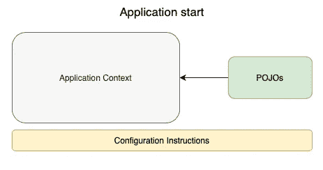

# Spring 核心:IoC 和容器

> 原文：<https://medium.com/javarevisited/spring-core-ioc-and-container-c01608b527a1?source=collection_archive---------2----------------------->

## 理解 Spring 如何在幕后工作——第一章


如果你对 Java 生态系统有点熟悉，你肯定已经熟悉 Spring 和其他补充框架和库，但是你知道它是如何构造的，以及它如何在幕后管理我们所有的 beans 吗？

这篇文章是一个小系列的第一篇，详细解释了 [Spring](/javarevisited/10-best-spring-framework-books-for-java-developers-360284c37036) 是如何工作的，以及如何改进你的日常代码。让我们从最基本的开始，国际奥委会。

# 控制反转

这可以被认为是 Spring 的基石。开始时，这个名字不能不言自明，所以让我们从一个比喻开始:

你正在准备一个蛋糕，但你并不真正知道需要什么。所以，根据你在一些烹饪电视节目中看到的，你会用鸡蛋、面粉、黄油和牛奶。然后，混合所有的材料，瞧，我们有我们的蛋糕！将其翻译成伪代码语法可能是这样的:

```
class Cake {

    milk
    butter
    eggs
    flour

    prepare() {
        milk + butter + eggs + flour
    }

}
```

好的，那很好。我们控制着所需的原料，我们必须提供它们。现在，假设你想在一个月后准备同样的蛋糕，而你忘了买牛奶。

这不好，对吗？但是，如果你不去猜测主要成分，而是按照预订收据去做，会发生什么呢？现在，这本书详细说明了准备一个蛋糕你需要什么，而你只需要负责从超市里拿到原料。现在书在控制中，对吗？准确的说，那就是控制原理的[反转。翻译成伪代码，应该是这样的:](https://javarevisited.blogspot.com/2012/12/inversion-of-control-dependency-injection-design-pattern-spring-example-tutorial.html#axzz6u4HTHz4Z)

```
class Cake {

    Cake(milk, butter, eggs, flour) {
        milk + butter + eggs + flour
    }

}
```

因此，我们可以恢复 IoC，让对象本身指定它自己的依赖项。按照这个例子，我们可以假设`Cake`是我们的对象，并且在[构造器级别](https://javarevisited.blogspot.com/2012/11/difference-between-setter-injection-vs-constructor-injection-spring-framework.html)有自己的依赖规范，所以如果我们没有准备好所有的依赖项，我们就不能做新的蛋糕。为了提供这些服务，我们可以:

*   用厨房里的东西。
*   去超市买。

这与 Spring 的工作方式完全相同。 [Spring](/javarevisited/top-10-free-courses-to-learn-spring-framework-for-java-developers-639db9348d25) 是唯一被鼓励管理对象依赖关系的人，那些依赖关系可以随时使用(已经在 Spring 上下文中创建)或者他需要获得一个新的并存储在上下文中。如果上下文这个词现在听起来很奇怪，请不要担心，我们稍后将详细介绍它。因此，将我们的例子转换成 Spring 逻辑将是这样的:

*   使用厨房里的东西->从上下文中获取一个现有的对象
*   去超市购买它们->创建一个新对象并将其存储在上下文中。

那么，语境本身是什么呢？

# 理解 Spring 上下文

背景本身是一个词，用来根据时间、空间和情况确定你的当前状态。与您类似，应用程序在运行时也有上下文。

Spring 上下文并没有取代您的[应用程序上下文](https://javarevisited.blogspot.com/2012/11/difference-between-beanfactory-vs-applicationcontext-spring-framework.html)，而是创建了一个额外的层来存储创建的 beans 以及它们之间的所有关系。它不仅“存在”，而且是按照一个结构良好的过程创建的，扫描您的代码，并建立层次结构。

## 创造环境

应用程序上下文在应用程序启动时创建。因此，此时我们需要让我们的代码准备好被 Spring 上下文初始化器扫描，并让框架创建所需的对象:

[](https://javarevisited.blogspot.com/2012/11/difference-between-beanfactory-vs-applicationcontext-spring-framework.html)

正如您所看到的，配置指令是将我们的 POJO(Plain Old Java Object)添加到 [Spring 上下文](https://javarevisited.blogspot.com/2011/09/spring-interview-questions-answers-j2ee.html)的基础。例如，我们有以下 java 代码:

```
class Cake {

    public Cake(Milk milk, Butter butter, List<Egg> eggs, Flour flour) {
        // return prepared cake;
    }
}class CakeService {

    public Cake prepare() {
        Milk milk = new Milk();
        Butter butter = new Butter();
        List<Egg> eggs = new ArrayList<>();
        Flour flour = new Flour();

        Cake cake = new Cake(milk, butter, eggs, flour);
        return cake;
    }}
```

我们应用了 IoC 原则，但是如果你再看两次，你会发现我们每次调用 prepare 方法都在创造新的牛奶、黄油、鸡蛋和面粉。既然我们已经知道黄油永远都是黄油，牛奶永远都是牛奶，等等，如果我们需要的时候可以随时使用，那不是很好吗？现在是时候开始介绍一些配置说明了:

```
[@Configuration](http://twitter.com/Configuration)
class ApplicationConfig {

    [@Bean](http://twitter.com/Bean)
    public Milk milk() {
        return new Milk();
    }

    [@Bean](http://twitter.com/Bean)
    public Butter butter() {
        return new Butter();
    }

    [@Bean](http://twitter.com/Bean)
    public Flour flour() {
        return new Flour();
    }

    [@Bean](http://twitter.com/Bean)
    public List<Egg> eggs() {
        return new ArrayList<Egg>();
    }

}
```

基本上，我们正在创建一个标记为`@Configuration`的`ApplicationConfig`类。Spring 将使用该注释来识别哪些类需要首先扫描，并探索内部元素。现在还不要担心这个过程是如何执行的，只要记住这个注释是创建 Spring 上下文的起点。

现在，顾名思义，我们需要在类中添加配置指令。配置的真正含义是存储在 Spring 上下文中的对象。

此时，您可以为存储在 Spring 上下文中的每个 bean(对象)创建和分配自定义属性，例如，将蓝色分配给面粉。最后，注释的`@Bean`也会被扫描并告诉 [Spring](/javarevisited/10-best-spring-framework-books-for-java-developers-360284c37036) “嘿，帮我把这个对象保存在你的上下文中，我以后会用到它”。

现在，如果我们使用刚才存储在 Spring 上下文中的 beans 来更新代码，我们将会得到如下结果:

```
class Cake { private Milk milk;
    private Butter butter;
    private List<Egg> eggs;
    private Flour flour;

    [@Autowired](http://twitter.com/Autowired)
    public Cake(Milk milk, Butter butter, List<Egg> eggs, Flour flour) {
        // return prepared cake;
    }
}
```

蛋糕现在正在定义自己的依赖项，并从 Spring 上下文中获取它们。怎么会？使用`@Autowired`注释。现在还不用担心这个，我们将在下一篇文章中介绍弹簧的[自动布线过程。到目前为止，主要目标是理解什么是 Spring 上下文，以及它是如何在高层次上创建的。](https://javarevisited.blogspot.com/2017/04/difference-between-autowired-and-inject-annotation-in-spring-framework.html#axzz6qnblZnVj)

一些需要记住的事情:

*   避免在 Spring 上下文中复制 beans。
*   如果需要，您可以创建多个配置类。
*   您可以管理 bean 上下文存储策略。
*   应用程序上下文也可以通过 xml 文件创建。

这是 Spring 容器如何工作的基本原理。现在你已经准备好自己深入下去，为下一篇文章做准备了。我强烈建议阅读:

<https://docs.spring.io/spring-framework/docs/current/reference/html/core.html#beans-introduction>  

关于 Spring 上下文的更多信息:

[https://www.baeldung.com/spring-application-context](https://www.baeldung.com/spring-application-context)

和关于 Spring bean 作用域的额外信息:

[https://Java re visited . blogspot . com/2012/05/what-is-bean-scope-in-spring-MVC . html](https://javarevisited.blogspot.com/2012/05/what-is-bean-scope-in-spring-mvc.html)

这是我将在本月发布的 Spring Core 系列的第一篇文章。如果你觉得有用，请关注我，并关注下一章:

*   弹簧芯:IoC 和容器
*   **[Spring Core:关于依赖注入你需要知道的一切](/javarevisited/spring-core-all-you-need-to-know-about-dependency-injection-2048d80340af)**
*   **[Spring Core:在你的技能中包含面向方面编程](/javarevisited/spring-core-including-aspect-oriented-programming-in-your-skills-2c37eaa75c2a)**
*   **[Spring Core:有效管理事务](/javarevisited/spring-core-managing-transactions-effectively-781bba6c47e8)**
*   **[Spring Core:使用 REST 和 Spring MVC](/javarevisited/spring-core-using-rest-and-spring-mvc-cef35acbec8e)**

# **更新**

**下一章可用！**

**<https://diego-rojas.medium.com/spring-core-all-you-need-to-know-about-dependency-injection-2048d80340af>  

还有，不要犹豫，把你的疑惑贴出来。我非常乐意在这个奇妙的旅程中帮助你。

</javarevisited/my-favorite-spring-mvc-courses-for-java-developers-5ede7f85dd88>  </javarevisited/21-spring-mvc-rest-interview-questions-answers-for-beginners-and-experienced-developers-21ad3d4c9b82> **