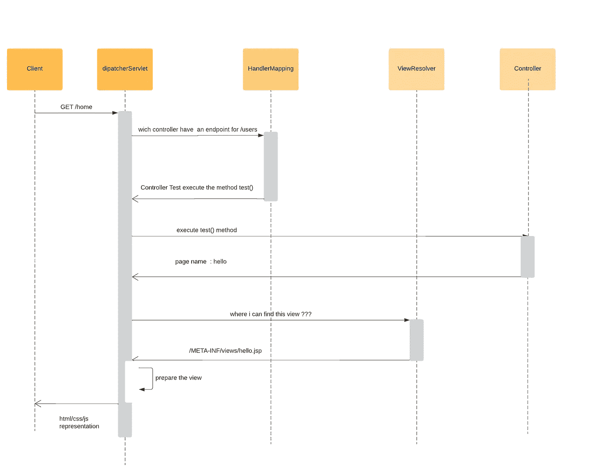
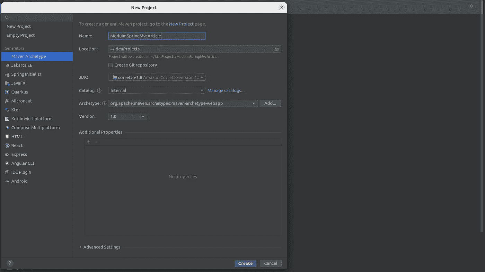
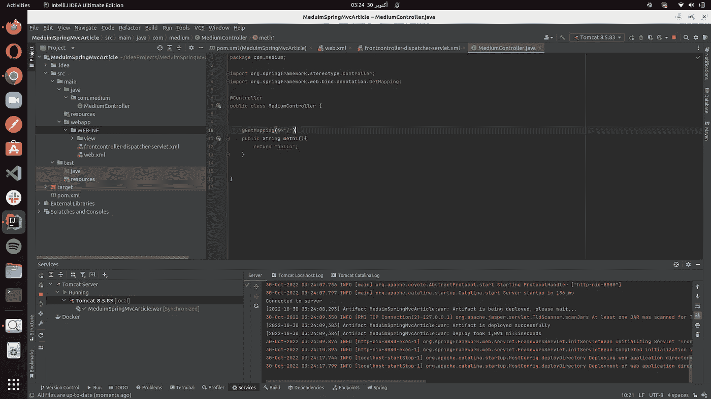
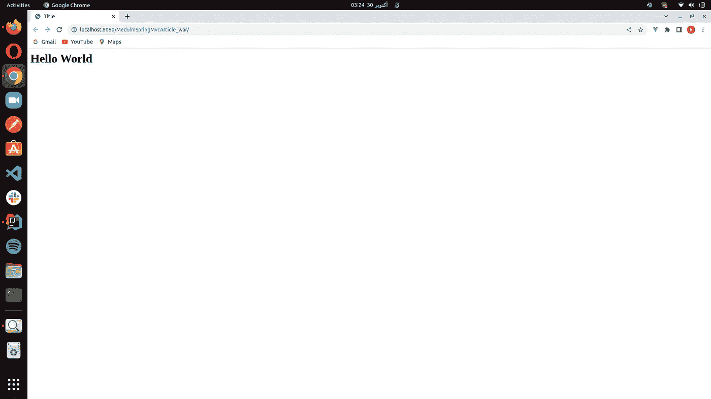

# Spring MVC 第 1 部分:大图[更新]

> 原文：<https://medium.com/javarevisited/spring-mvc-part-1-build-your-first-hello-world-web-application-2c6e1ad54e5e?source=collection_archive---------1----------------------->


## 在本文中，我们将讨论以下主题:

*   Spring MVC 架构简介
*   如何配置您的开发环境来使用 [Spring MVC](/javarevisited/my-favorite-spring-mvc-courses-for-java-developers-5ede7f85dd88)

我们将从概述 [Spring MVC 架构](https://javarevisited.blogspot.com/2017/06/how-spring-mvc-framework-works-web-flow.html)开始，包括它的主要特性和好处。然后，我们将讨论如何设置您的开发环境，包括您使用 [Spring MVC](https://www.java67.com/2017/11/top-5-free-core-spring-mvc-courses-learn-online.html) 所需的工具和依赖项。到本文结束时，您将对 Spring MVC 以及如何在自己的 web 开发项目中使用它有更好的理解。

## [1]Spring MVC 架构介绍

1.  介绍

Spring MVC 遵循 MVC 设计模式，将应用程序分成三个主要组件:模型、视图和控制器。

模型是保存将在视图中显示的数据的对象。该模型通常用于存储来自数据库、服务或其他数据源的数据。然后将模型传递给视图，视图使用模型中的数据生成发送给客户端的 [HTML](http://javarevisited.blogspot.sg/2014/09/how-to-parse-html-file-in-java-jsoup-example.html) 、 [JSON](https://javarevisited.blogspot.com/2022/03/3-examples-to-parse-json-in-java-using.html) 或其他输出。

视图负责呈现应用程序的用户界面。它将模型中的数据呈现给用户，并为用户提供了一种与应用程序交互的方式。该视图可以使用不同的技术来实现，比如 JSP、Thymeleaf。

控制器是架构的核心组件。它负责处理来自客户端的传入请求，并返回适当的响应。控制器包含方法，这些方法通常是简单的方法，在响应返回视图名称的传入请求时执行。在 Spring MVC 中，控制器方法被映射到特定的 URL 和 HTTP 方法，这样当从客户端收到请求时，就会调用适当的控制器方法来处理请求。然后，控制器方法返回的视图名称用于向客户端呈现响应。

2.工作流(从接收请求到生成响应)。



spring mvc 基本工作流

3.说明

*   当客户机向服务器端发送 HTTP 请求时，web 容器(如 Tomcat)接收请求并处理它。

什么是 web 容器？

web 容器维护 servlets 的生命周期。如果您不是来自 JEE 世界，Servlet 只是一个可以处理 HTTP 请求的简单类。我们的 DispatcherServlet 仍然是一个简单的 Servlet，我们将使用一个 web 容器来维护它的生命周期。

*   web 容器(如 Tomcat)将 http 请求传递给 DispatcherServlet 进行进一步处理。

什么是 DispatcherServlet？

DispatcherServlet 是 Spring MVC 架构的一个关键组件，这是一个用 Java 构建 web 应用程序的模型-视图-控制器(MVC)框架。DispatcherServlet 扮演前端控制器的角色，前端控制器是一种设计模式，它定义了一种集中式请求处理机制来处理所有传入的请求，并将它们分派给适当的处理程序组件。

当 HTTP 请求被发送到 Spring MVC 应用程序时，DispatcherServlet 接收请求并检查请求 URL、HTTP 方法和其他请求参数。然后，它使用配置的处理程序映射将请求映射到适当的处理程序方法，这通常是一个处理请求并生成响应的控制器方法。DispatcherServlet 还使用已配置的视图解析器将处理程序方法返回的视图名称解析为具体的视图组件，如 JSP 页面或百里香模板，以呈现响应。

/!\我们将在本文接下来的部分详细介绍每一个步骤

## [2]配置开发环境

作为一个 IDE，我使用 IntelliJ Ultimate 版本(你可以使用你喜欢的 IDE)和 Tomcat 作为 web 容器。

在这一部分，我们将不使用 Spring Boot，因为它为我们做了大量的内部配置。

*   步骤 1:创建一个 maven 项目(选择 webapp 原型来生成一个简单的 maven web 应用程序项目)



项目创建

*   第 2 步:进入 maven repository 并搜索 Spring Web MVC，将依赖项添加到 pom.xml 文件中

```
<dependency>
  <groupId>org.springframework</groupId>
  <artifactId>spring-webmvc</artifactId>LOad Maen changes
  <version>5.3.23</version>
</dependency>
```

*   第三步:设置你的服务器(例如:Tomcat)。

要设置您的服务器配置，请检查此链接:

[](https://www.jetbrains.com/idea/guide/tutorials/working-with-apache-tomcat/using-existing-application/) [## 在现有应用程序中使用 Apache Tomcat

### 如果您不是从头开始创建一个新项目，而是有一个运行在 Tomcat 上的现有项目，您可以…

www.jetbrains.com](https://www.jetbrains.com/idea/guide/tutorials/working-with-apache-tomcat/using-existing-application/) 

*   步骤 4: DispatcherServlet 配置

有许多方法可以配置我们的 DispatcherServlet，但是不要担心，我们将介绍所有的方法。

1- XML 方法

DispatcherServlet 在基于 Spring MVC 的应用程序中充当前端控制器，它将接受任何到达我们应用程序的请求，然后它将决定(使用内部处理程序映射)要执行的正确端点。所以在您的 web.xml( `WEB-INF` 文件夹)文件中添加这个配置。

```
<!DOCTYPE web-app PUBLIC
 "-//Sun Microsystems, Inc.//DTD Web Application 2.3//EN"
 "http://java.sun.com/dtd/web-app_2_3.dtd" >

<web-app>
  <display-name>Archetype Created Web Application</display-name>

  <servlet>
    <servlet-name>frontcontroller-dispatcher</servlet-name>
    <servlet-class>org.springframework.web.servlet.DispatcherServlet
    </servlet-class>
  </servlet>

  <servlet-mapping>
    <servlet-name>frontcontroller-dispatcher</servlet-name>
    <url-pattern>/</url-pattern>
  </servlet-mapping>

</web-app>
```

当我们将应用程序部署到我们的服务器(例如:Tomcat)时，web 容器将读取 web.xml 文件来实例化 DispatcherServlet 类并配置它的映射。(Servlet 生命周期将由 web 容器处理)

注意:当一个 web 应用程序被部署到 Tomcat 时，Tomcat 会读取 web 部署描述符一次，以获取应用程序的配置和设置。之后，Tomcat 将配置和设置存储在内存中，以便它可以针对每个传入的请求快速有效地访问它们。

如果我们现在运行我们的应用程序，我们将会遇到异常

```
Caused by: java.io.FileNotFoundException: Could not open ServletContext resource [/WEB-INF/frontcontroller-dispatcher-servlet.xml]
```

为什么？

DispatcherServlet 使用各种对象来完成工作，比如处理程序映射、视图解析器和控制器。默认情况下，DispatcherServlet 会查找名为 we b-INF/[您的 dispatcher-servlet 在 web.xml 中的名称]-servlet.xml 的文件。

在 WEB-INF 文件夹中创建一个名为[您的 dispatcher-servlet name in WEB . XML]-servlet . XML 的文件。

```
<?xml version="1.0" encoding="UTF-8"?>
<beans 
 xmlns:xsi="http://www.w3.org/2001/XMLSchema-instance"
 xmlns:context="http://www.springframework.org/schema/context"
 xmlns:mvc="http://www.springframework.org/schema/mvc"
 xsi:schemaLocation="http://www.springframework.org/schema/beans
    http://www.springframework.org/schema/beans/spring-beans.xsd
    http://www.springframework.org/schema/context
    http://www.springframework.org/schema/context/spring-context.xsd
    http://www.springframework.org/schema/mvc
    http://www.springframework.org/schema/mvc/spring-mvc.xsd">

    <!-- component scanning -->
    <context:component-scan base-package="com.medium" />

    <!-- Define Spring MVC view resolver -->
    <bean        class="org.springframework.web.servlet.view.InternalResourceViewResolver">
        <property name="prefix" value="/WEB-INF/views/" />
        <property name="suffix" value=".jsp" />
    </bean>
</beans>
```

DispatcherServlet 创建一个 WebApplicationContext，这是一个 IOC 容器(WebApplicationContex textends application context，用于独立的应用程序)。WebApplicationContext 处理应用程序中的所有 beans。我们刚刚创建的文件是 WebApplicationContext 的配置文件。当我们启用组件扫描时，WebApplicationContext 自动为每个用`@Component`或其子注释之一注释的类创建一个 bean，例如`@Repository`、`@Controller`、`@RestController`和`@Service` …

如您所见，我们在 XML 文件中显式配置了一个名为 InternalResourceViewResolver 的 bean。这是 Spring 中视图解析器模式的实现之一。

什么是视图解析模式？

视图解析器模式是 web 应用程序开发中使用的一种设计模式，用于将控制器返回的逻辑视图名称解析为应该呈现给客户端的物理视图(例如:JSP 或 HTML 文件)。

现在创建一个控制器来测试 dispatcherServlet 配置

```
@Controller
public class MediumController {

    @GetMapping("/")
    public String meth1(){
        return "hello";
    }
}
```

要在 Spring MVC 中创建新的 JSP 页面，您可以遵循以下步骤:

1.  在 web 应用程序的`WEB-INF`目录中，创建一个名为`views`的新目录。
2.  在`views`目录中，创建一个名为`hello.jsp`的新 JSP 文件。
3.  在`hello.jsp`文件中，添加页面的 HTML 代码。
4.  如果您想为您的 JSP 文件使用不同的文件扩展名(例如`.html`，您可以转到`dispatcher-servlet`配置文件(位于`WEB-INF/[dispatcher-servlet name in web.xml]-servlet.xml`)并更改`viewResolver` bean 的后缀。例如，如果您想使用`.html`作为文件扩展名，您可以将后缀从`.jsp`改为`.html`。
5.  如果希望将 JSP 文件存储在不同的位置，可以在`dispatcher-servlet`配置文件中更改`viewResolver` bean 的前缀。这将告诉 Spring MVC 在哪里寻找您的 JSP 文件。



带有 xml 配置的项目结构



jsp 页面运行成功

干得好！您已经成功完成了 hello world 项目。

2.带有 WebApplicationInitializer 接口的 Java 配置

删除 Spring MVC 应用程序中的`web.xml`文件。

值得注意的是，如果没有`web.xml`文件或上下文配置文件，您的 web 应用程序将没有`DispatcherServlet`来处理传入的请求。这意味着您将无法响应来自客户端的请求，并且您的 web 应用程序将无法正常运行。要解决这个问题，您需要创建一个实现`WebApplicationInitializer`接口的类，并使用它为您的 web 应用程序配置和初始化`DispatcherServlet`。

如果 Tomcat 没有找到 web.xml，它会在部署 web 应用程序时自动寻找实现`WebApplicationInitializer`接口的类。如果找到这样的类，它将使用它来配置和初始化 web 应用程序，而不是使用 web.xml 文件。

例如:

```
public class MyWebApplicationInitializer implements WebApplicationInitializer {
  public void onStartup(ServletContext servletContext) {
    // Load the XML configuration file
    XmlWebApplicationContext appContext = new XmlWebApplicationContext();
    appContext.setConfigLocation("/WEB-INF/my-config.xml");

    // Create and register the DispatcherServlet
    ServletRegistration.Dynamic dispatcher = servletContext.addServlet("dispatcher", new DispatcherServlet(appContext));
    dispatcher.setLoadOnStartup(1);
    dispatcher.addMapping("/");
  }
}
```

3.具有 AbstractAnnotationConfigDispatcherServletInitializer 类的 Java 配置

AbstractAnnotationConfigDispatcherServletInitializer 是一个抽象类，它有 3 个抽象方法，我们应该覆盖这些方法来配置我们的 dispatcherServlet

1- getServletMapping()来配置 dispatcherServlet 的映射

```
protected String[] getServletMappings() {
    return new String[]{"/"}; // give your mapping to this anounymous array 
}
```

2- getServletConfigClasses()来初始化我们的 webApplicationContext

```
protected Class<?>[] getServletConfigClasses() {
    Class[] classes = {MyConfig.class} ;
    return classes ;
}
```

MyConfig 类是一个配置类(替换包含我们的 bean 或使用组件扫描来查找我们的 bean 的 xml 文件)

例如:

```
@Configuration
@ComponentScan("com.medium")
public class MyConfig {
}
```

当 DispatcherServlet 查找 applicationContext 时，它将使用该类来查找我们应该实例化的所有 bean(即控制器、服务 bean、存储库等)。) .

最终类应该是这样的:

```
public class MyAppConfig extends AbstractAnnotationConfigDispatcherServletInitializer {
    protected Class<?>[] getRootConfigClasses() {
        return new Class[0];
    }

    protected Class<?>[] getServletConfigClasses() {
        Class[] classes = {MyConfig.class} ;
        return classes ;
    }

    protected String[] getServletMappings() {
        return new String[]{"/"};
    }
}
```

注意:默认情况下，我们的 WebApplicationContext 中没有添加 ViewResolver，所以我们需要在容器中添加一个。我们可以通过在之前创建的配置类(例如 MyConfig)中创建一个 bean 来实现，如下所示:

```
@Configuration
@ComponentScan("com.medium")
public class MyConfig {

    @Bean
    ViewResolver viewResolver(){
         InternalResourceViewResolver internalResourceViewResolver = new InternalResourceViewResolver();
         internalResourceViewResolver.setPrefix("/WEB-INF/views/");
        internalResourceViewResolver.setSuffix(".jsp");
        return  internalResourceViewResolver;
    }
}
```