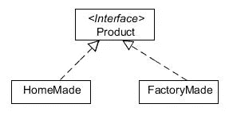

# 静态工厂方法，公共构造函数的替代方法

> 原文：<https://medium.com/javarevisited/static-factory-methods-an-alternative-to-public-constructors-73cbe8b9fda?source=collection_archive---------2----------------------->


允许 Java 程序的其他部分获取某种类型的对象的最广泛使用的技术是创建公共构造函数。

一个具有公共空构造函数的 java 类

还有另一种技术，它提供了各种优势，非常值得推荐给每一个程序员去了解。类可以提供**的静态工厂方法。*这种方法是返回实例的另一种方式。*

*使用静态工厂方法而不是公共构造函数的 java 类*

*更具描述性的命名是可能的
方法有名字，所以我们在构造对象时可以更具描述性。构造函数不能有名字，但是方法可以，所以通过拥有这种类型的方法，我们可以更流畅地表达对象是如何构造的。所以代替这个的是:*

*用构造函数初始化*

*我们可以这样创建我们的对象:*

*用静态工厂方法初始化*

***资源优化**
每次调用关键字 ***new*** 都会创建一个新的实例。在很多场合，特别是在大型系统中，程序员需要小心使用资源。在一些[设计模式](/javarevisited/7-best-books-to-learn-design-patterns-for-java-programmers-5627b93eefdb)中使用静态工厂方法并不少见。Singleton 和 fluent Builder 模式将使用静态工厂方法:*

*   *拥有缓存的对象，并确保它们被正确清理。(谷歌搜索 ***单胞模式*** )。*
*   *使用提供预定义状态的不可变对象。(谷歌搜索 ***生成器模式*** )*

***如果需要，灵活性。在我们的例子中，我们通过使*Product.java*成为 final 来限制继承，但是如果我们愿意，我们可以通过使用 use 子类来拥有一个更灵活的工厂。这是一个非常有趣的特性，如果您愿意，它可以为您的静态工厂带来一点额外的灵活性。在下面这段代码中，您将看到一个缓存对象的非常简单的实现:***

**

*在此示例中，您可以看到如何使用静态工厂方法来创建不同类型或实现类型的实例:*

*稍微复杂一点的静态工厂方法*

```
**Originally posted at:* [http://javing.blogspot.com/2012/10/static-factory-methods-have-many.html](http://javing.blogspot.com/2012/10/static-factory-methods-have-many.html)*
```