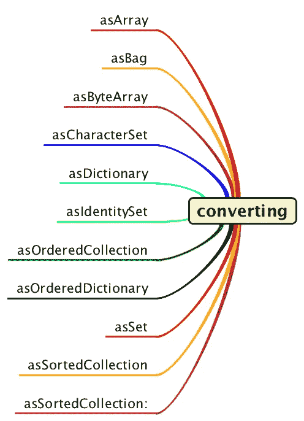

# Stream.toList()和其他我从 Java 2 开始就想要的转换器方法

> 原文：<https://medium.com/javarevisited/stream-tolist-and-other-converter-methods-ive-wanted-since-java-2-c620500cb7ab?source=collection_archive---------1----------------------->

迟到总比不到好？


经过 7 年的规划，完美的晚餐布置——新泽西州汉密尔顿雕塑广场

# 仅限自助服务

2004 年，我是一家大型金融服务公司的 Java 架构师。Java 缺少我在 Smalltalk 中拥有的大部分集合生产力特性，所以我决定“就这么做”，并开始在最终成为开源 Java 库的 [Eclipse Collections](https://github.com/eclipse/eclipse-collections) 中构建第一个实用程序类。一年前我在博客上写了这个。

[](/javarevisited/java-streams-are-great-but-its-time-for-better-java-collections-42d2c04235d1) [## Java 流很棒，但现在是更好的 Java 集合的时候了

### 25 年后，Java 是时候进行集合升级了。

medium.com](/javarevisited/java-streams-are-great-but-its-time-for-better-java-collections-42d2c04235d1) 

# 40 年来每天供应全套菜单晚餐

Smalltalk 的集合类型一直都有转换器方法。转换器方法允许您通过揭示方法名称的意图将一种类型转换为另一种类型。在 Smalltalk 中，转换器方法都以前缀“as”开头。我创建了一个思维导图，捕捉 Smalltalk 集合 API 上可用的转换器方法。Smalltalk 在过去的 40 年里一直拥有这些方法。

[](https://javarevisited.blogspot.com/2020/04/top-5-courses-to-learn-java-collections-and-streams.html#axzz6XMFoMrEo)

Smalltalk 转换器方法

在过去的 40 年里，Smalltalk 开发人员已经证明这些方法是有用的。20 世纪 90 年代，当我在 Smalltalk 中进行专业开发时，我曾经使用过所有这些工具。

Smalltalk -> Java 等价物

*   `asArray`->-`toArray`
*   `asDictionary`->-
*   `asOrderedCollection`->-`Collectors.toList`
*   `asSet`->-

Java 对`[Collectors](https://www.java67.com/2018/11/10-examples-of-collectors-in-java-8.html)` [](https://www.java67.com/2018/11/10-examples-of-collectors-in-java-8.html)类中的转换器方法以及`Collection`和`Stream`上的`toArray`使用前缀“to”。Smalltalk 中可用的其他方法在今天的`Collectors`中没有对等物。

那么 Smalltalk 为什么要在 40 年前增加`List`、`Bag`、`Set`、`Map`、`IdentitySet`、`OrderedMap`、`SortedList`的对称转换器方法呢？我相信这是因为收益远远超过了每种方法的成本。

# 策划了 7 年的完美晚餐

当 Java 16 在三月份发布时，距离 Java 8 发布 [lambdas](/javarevisited/8-best-lambdas-stream-and-functional-programming-courses-for-java-developers-3d1836a97a1d) 和 [Streams](/javarevisited/7-best-java-collections-and-stream-api-courses-for-beginners-in-2020-3ad18d52c38) 已经过去了七年。Java 16 中新的`Stream.toList()`方法没有了家人朋友会有些失望(`toSet`、`toMap`、`toCollection`)。

在 GitHub 上快速搜索，我找到了以下出现的`Collectors.toList()`、`Collectors.toSet()`、`Collectors.toMap()`和`Collectors.toCollection()`。

*   `Collectors.toList()`->-`1,363,648`
*   `Collectors.toSet()`->-`283,944`
*   `Collectors.toMap()`->-`169,753`
*   `Collectors.toCollection()`->
*   `Collectors.counting()` - > `14,765`(相当于`toBag`)
*   `Collectors.toUnmodifiableList()`->-`4,712`
*   `Collectors.toUnmodifiableSet()`->-`2,064`
*   `Collectors.toUnmodifiableMap()`->-`1,386`

显然，`toList()`是最常用的方法。这并不奇怪。但是还有超过 50 万个使用转换器方法的其他实例。这只是在 [GitHub](/javarevisited/7-best-courses-to-master-git-and-github-for-programmers-d671859a68b2) 中搜索项目。

大多数企业应用都不在 GitHub 中。如果我们可以扫描世界上所有的私有 Java 代码仓库，我预计每种方法的使用量至少会增加一到两个数量级。

在《JDK 16》中`toList`加入 Stream 之后，我们还需要几个月或者几年才能看到`toSet`、`toMap`和`toCollection`？

# 霍布森的晚餐菜单

当我们在 Java 16 中得到`Stream.toList()`时，它将是每晚晚餐一餐的选择。我们可以在`Stream`上使用任何我们想要的转换器方法，只要是`toList`。这是一个[霍布森的选择](https://en.wikipedia.org/wiki/Hobson%27s_choice)。

如果我们需要另一个转换器方法，我们可以将`collect`和`Collectors`用于其他集合类型。这将导致`Stream` API 使用中不幸的不对称。方法`toList`将非常流畅，而对其他类型使用`Collectors`就不那么流畅了。

# 可变的、不可变的或不可修改的

命名很重要。给某物起个好名字很难。`List`是一个可变接口。接口有“不可修改”的实现，这使得`List`接口“有条件地”可变。这类似于提供“条件线程安全”的`List`的“同步”实现。

对于任何有条件的东西，开发人员需要理解和处理任何潜在的条件性。我希望名为`toList`的方法返回可变类型。

该名称并不表示返回不可修改或不可变的实现。调用者必须越过名称和返回类型，查看 Javadoc 中的规范或直接研究实现代码，以理解返回结果所支持的行为。

由于返回了一个不可修改的实现，如果将其命名为`toUnmodifiableList`，该方法会更加清晰。这个名字与`Collectors.toUnmodifiableList()`有很好的对称性。`Stream.toList`其实更类似于`Collectors.toUnmodifiabList`。如果`toList`实际上返回了一个可变的`List`，那么它将与`Collectors.toList()`具有良好的对称性。

# Stream.toCollection =自助餐吃到饱

将方法`toCollection`添加到`Stream`将非常有益。`Collectors.toCollection`接受一个返回`Collection`子类型的`Supplier`。实际返回的实现类型由开发人员决定，并且所有实现都必须是可变的。

```
<T, R extends Collection<T>> R toCollection(Supplier<R> supplier)
```

这使得`Stream`可以很好地与宇宙中所有类型的`Collection`一起工作。这也将与`Collectors`上的相同方法一致。它的实现可以简单地通过一个默认的方法来实现。如果需要简洁，我会将名称简化为“to”，因为`Supplier`已经阐明了返回类型。

```
<T, R extends Collection<T>> R to(Supplier<R> supplier)
```

# 多项选择晚餐菜单

如果转换器方法的对称性对您很重要，您可以选择。你可以一直使用 [Eclipse Collections](https://github.com/eclipse/eclipse-collections) ，它在对象和原语 Iterables 上有许多转换器方法。`RichIterable`上可用的转换器方法如下:

[](https://javarevisited.blogspot.com/2020/04/top-10-advanced-core-java-courses-for-experienced-developers.html#axzz6KyOHbmCo)

丰富的转换器方法

`RichIterable`是 Eclipse 集合中大多数对象类型容器的父接口。

如果您想了解当今 Eclipse 集合中可用的许多转换器方法，我在 2020 年底写了一篇博客，其中有一个相关的[代码 kata](https://github.com/eclipse/eclipse-collections-kata/tree/master/converter-method-kata) 。

[](/javarevisited/converter-methods-in-eclipse-collections-6b9bfc0f2490) [## Eclipse 集合中的转换器方法

### 从一种集合类型转换到另一种集合类型

medium.com](/javarevisited/converter-methods-in-eclipse-collections-6b9bfc0f2490) 

# 摘要

带着不可修改的返回类型到达 JDK 16 的方法`Stream.toList()`可能会引起一些混乱。我教新的和有经验的开发人员 Java。

名称`toList`本身并没有揭示意图。命名方法`toUnmodifiableList`会使它与`Collectors`上的相同方法一致。

在等了 7 年之后，菜单上说三分熟的汉堡可能会让一些开发商不满意。没有鱼或素食也可能令人失望(`toSet`和`toMap`)。

在 JDK 17 中，将方法`toCollection`添加到`Stream`将比新的`Stream.toList`方法覆盖更多的用例。命名不会有混乱，因为它将与`Collectors`上命名为`toCollection`的方法完全一致。

这将给开发者一个几乎无限的菜单。既然我们已经得到了`toList`它，我们真的应该添加这个方法来满足开发者的胃口。

Eclipse Collections 已经为对象、原始、串行、并行、急切、懒惰、可变和不可变 API 提供了许多转换器方法。拥有`Stream.toCollection`将允许从流到 Eclipse 集合中大量集合类型的流畅转换。

这将是一个极好的补充。我计划开始倡导将它纳入 JDK 17。我更喜欢更简单、更短的名字`to`，但也满足于`toCollection`与`Collectors.toCollection`保持一致。一致性和清晰性比简洁更重要。

*我是*[*Eclipse Collections*](https://github.com/eclipse/eclipse-collections)*OSS 项目在*[*Eclipse Foundation*](https://projects.eclipse.org/projects/technology.collections)*的项目负责人。* [*月食收藏*](https://github.com/eclipse/eclipse-collections) *为* [*投稿*](https://github.com/eclipse/eclipse-collections/blob/master/CONTRIBUTING.md) *。如果你喜欢这个库，你可以在 GitHub 上让我们知道。*