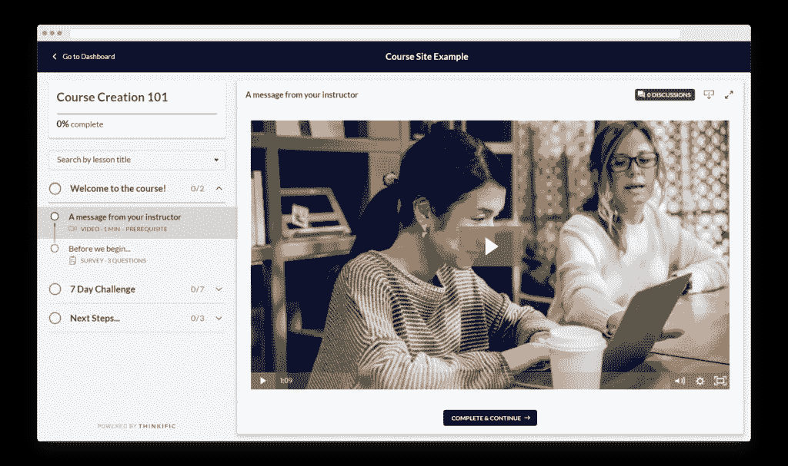
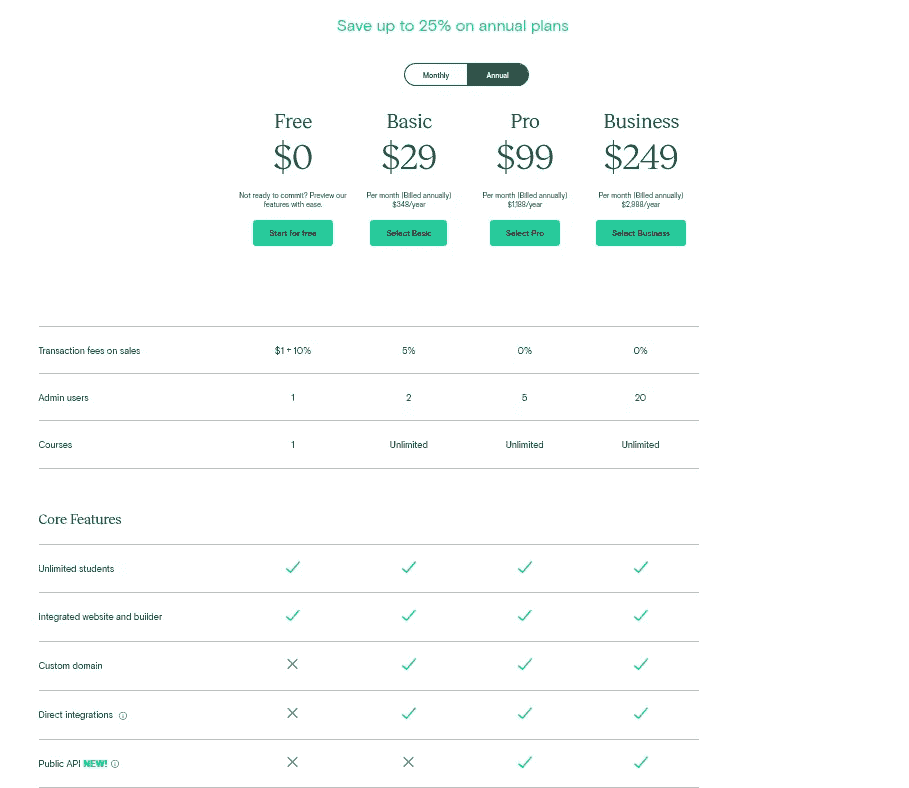

# 可教的 vs .思考的，或 Podia？2022 年网络课程创作者最好的平台是哪个？

> 原文：<https://medium.com/javarevisited/teachable-thinkific-or-udemy-which-is-the-best-platform-for-first-time-course-creators-in-2021-9da6133d73b?source=collection_archive---------1----------------------->

## 我对 Teachable、Thinkific 和 Udemy 这三个最受 2022 年首次在线课程创作者欢迎的在线课程平台的看法。

image _ credit—thinkfic

大家好，如果你是第一次创建课程的人，或者是程序员、博客作者或教师，想以创建在线课程为生，但不知道该选择哪个平台来托管和销售你的第一个在线课程，那么你来对地方了。

自去年以来，我一直在研究如何创建一个成功的在线课程，并对 Teachable、Thinkific 和 Udemy 这三个创建和销售在线课程的主要平台进行了大量研究。

一路走来，我也开始指导许多读者如何创建在线课程以及为什么他们应该创建这些课程。我为什么要这么做？因为我相信我们一起可以学得更好并取得成功。如果我有一群热爱在线教学的开发人员，就有更大的机会创建一个成功的在线课程。

反正不断冒出来的一个常见问题就是初学者用哪个平台比较好， [**可教**](https://teachable.sjv.io/c/1193463/998814/12646) **，**[**thinkfic，**](http://try.thinkific.com/javinpaul8817-omf) **还是**[**Udemy**](https://click.linksynergy.com/fs-bin/click?id=JVFxdTr9V80&offerid=323058.9409&type=3&subid=0)**？**创建和销售在线课程哪个支持的比较好？如果你也有类似的疑惑，那么你来对地方了。

在这篇文章中，我将分享我对 *Teachable、Thinkific 和 Udemy、*这两个最受欢迎的在线课程平台的一些理解和见解，这将有助于你做出决定。

与 Udemy 相比，我所说的关于可教的大部分观点同样适用于 Thinkific。

All、 *Teachable、Thinkific 或 Udemy* 都有创建和托管在线课程以及处理支付的工具，所以它们非常相似，但在一些点上它们有很大的不同，不理解这些差异可能是你的课程成败的关键。

# 可教的，有思想的还是无意义的？2022 年制作销售网络课程最好的网站是哪个？

这里有一些有用的观点，可以帮助你分析三个最受欢迎的在线课程创建平台 [Teachable、Thinkific 和 Udemy](https://javarevisited.blogspot.com/2019/09/teachable-or-udemy-which-platform-is-best-online-course.html) 的优缺点，并帮助你决定选择合适的平台来创建和销售你的课程。

## 1.受众[销售]

如果你问我*在线课程业务最难的是什么？*我会说**获得观众并实现销售**。是的，即使你在网上有自己的形象，在这个问题上有权威，也不容易做成一笔交易，除非你有一个感兴趣的相关受众。

创建在线课程很容易，但销售课程却非常困难，我这样说并不是要打击你，只是分享我的经验，你需要努力工作，最终，你会成功，通过从别人那里学习，你也可以在更短的时间内销售更多。

有了 [Udemy](https://javarevisited.blogspot.com/2019/08/top-10-udemy-courses-and-certifications-for-programmers.html) ，你就有了这个受众，这也是选择 Udemy 最关键的原因。平台上注册的学生超过 5000 万，很多人在互联网上推广 Udemy 课程，这意味着一旦你在 Udemy 上直播你的课程，就会吸引很多眼球。

当然，它需要你的一点推广来启动许多人所说的 **Udemy 的良性增长循环**，但一旦你开始发送流量，你的课程就会暴露在这些海量观众面前。

有了**可教性，**你就没有了听众；因此，您需要自己构建它。虽然可教的人和有思想的人都很有帮助，他们提供了很多指导、工具和电子邮件模板来推销你的课程，并为你创造听众。

例如，你可以阅读文章 [7 个步骤来推出你自己的盈利在线课程](https://teachable.sjv.io/c/1193463/1014938/12646)来学习关于创建盈利课程的一切。他们还有一个 [**免费网上研讨会**](https://teachable.sjv.io/c/1193463/998807/12646) ，你可以参加，学习如何在 2022 年创建在线课程

<https://teachable.sjv.io/c/1193463/998807/12646>  

类似地，**thinkfic**也允许你创建并拥有自己的在线课程平台，但你需要带上你的听众。**thinkfic 是一个**伟大的平台，他们也有一个 [**一个月的免费试用**](http://try.thinkific.com/javinpaul8817-omf) 这是一个伟大的开始。

<http://try.thinkific.com/javinpaul8817-omf>  

## 2.所有权和控制权[你所谓的你自己的]

受众的另一个关键区别来自于 Udemy 不允许你保留你的受众，这意味着你不知道他们的电子邮件地址，也无法在 Udemy 之外与他们交流。

*这意味着如果明天你需要转到你自己的课程网站，你就不能带着你多年来在 Udemy 上建立起来的受众。*

另一方面，无论是还是[thinkfic](http://try.thinkific.com/javinpaul8817-omf)都可以让你收集电子邮件地址，你拥有自己的受众，从长远来看，这是一笔重要的资产。

因此，如果你长期从事在线课程业务，你应该努力创造课程，那么对于持续的成功来说，可教的和有思想的是比 Udemy 更好的选择。但是，如果你需要先看到成功，我想你会在 Udemy 而不是 Teachable 上很快看到，特别是如果你没有自己的在线存在和观众的话。

换句话说，从短期来看，Udemy 是好的，但是从长期来看，你应该明确地把你的学校建立在可教的或有思想的基础上，这是没有借口的。你也可以使用 thinkfic 的 [**一个月免费试用**](http://try.thinkific.com/javinpaul8817-omf) 为此，这是 thinkfic 给内容创作者社区的一份大礼。

<http://try.thinkific.com/javinpaul8817-omf>  

## 3.成本[费用]

就费用而言，Udemy 是完全免费的，你不需要支付一分钱来开设你的课程，但当销售发生时，他们会从你的付款中扣除很多。

例如，如果 Udemy 带来了流量来购买你的课程，他们会拿走将近 50%的钱，但是如果你带来了流量来出售课程，除了最小的交易成本，你会得到所有的现金。

另一方面，你需要购买像[**teacible Pro Plan**](https://teachable.sjv.io/c/1193463/1010411/12646)这样的 Teachable plan 来托管你在 teacible 上的课程。该计划不仅允许您组织课程，还会为您提供所有的帮助、指导、辅导和工具，以成功创建您的课程，这意味着它物有所值，但确实需要成本。

Teachable 还提供许多免费的在线培训，如 Teachable Creator Challenge 和 **Teachable Live，**他们提供低至每月 29 美元的 Teachable 捆绑包( [Teachable Basic Plan](https://teachable.sjv.io/c/1193463/1010411/12646) )，但这是一个促销优惠，你应该很幸运能得到它。因此，如果你不想购买计划，也没有固定的受众或在线存在，那么 Udemy 对你来说是一个更好的选择，但同样，如果你是长期投资，在 Teachable 上投资一点钱，创建自己的在线学校，从长远来看，你会获得更大的回报。

这里是他们[**teacheable 的不同年度计划**](https://teachable.sjv.io/c/1193463/1010411/12646) 的一个快照，如果你还没有准备好提交或者在你的课程的早期阶段，你可以实际上加入他们的[*teacheable 免费计划*](https://teachable.sjv.io/c/1193463/1010411/12646) ，它允许你免费创建你的第一门课程。您可以点击图片了解更多信息:

顺便说一句，当谈到创建自己的在线学校时，可教不是唯一的选择，**thinkfic**也是一个很好的平台，你也可以尝试一下。你甚至可以使用他们的 [**一个月免费试用**](http://try.thinkific.com/javinpaul8817-omf) 来检验这个平台，看看它是否适合你。

<http://try.thinkific.com/javinpaul8817-omf>  

## 4.社区[支持]

起初，创建一个在线课程可能是一项艰巨的任务。除了主题专业知识，你还需要了解拍摄的技术细节和你需要的工具，比如选择哪种麦克风(我喜欢 [**BlueYeti**](https://www.amazon.com/Blue-Yeti-USB-Microphone-Copper/dp/B07CY5HS72?tag=javamysqlanta-20) )、选择哪种相机，以及如何创建声音清脆的高清课程材料。

虽然 Udemy 也提供了很多有用的素材让自己熟悉视频创作过程，但我相信 Teachable 有更好的社区支持。

他们经常举办可教的课程创建者挑战赛，你可以与许多成功的课程创建者互动，并从他们的经验中学习。你还需要在一个确定的时间框架内创建一个课程，并与其他创作者合作。这是一个令人愉快且非常吸引人的过程。你也会碰巧从别人那里学到很多东西。当你达到重要的里程碑时，比如你的第一次销售，你也将获得奖励！。

他们还为课程创建者提供许多免费的在线培训，如 **Teachable Live，**这是一个为期 3 天的现场活动，成功的 Teachable 课程创建者将教你创建成功的在线课程所需的一切。这种挑战和社区支持是我推荐我的许多追随者加入 Teachable 的最大原因，他们对创建在线课程感兴趣。

除了这三个主要原因，还有很多像 [Teachable](https://teachable.sjv.io/c/1193463/998814/12646) 这样的技术原因可以让你改变你的网校(网站)的外观和感觉来配合你的品牌，你可以完全控制你的网校的设计，这在 Udemy 上是做不到的。

> 品牌和所有权是选择可教的或有思想的而不是神秘的最大原因

顺便说一下，如果你需要更多可教的和 Thinkfiic 的替代方案，那么你也可以检查一下 [**Podia**](https://podia.sjv.io/c/3294490/1274189/15666?u=https%3A%2F%2Fwww.podia.com%2F) 和 Kajabi，这是我另外两个喜欢的在线平台，我已经在我的帖子中分享了关于 [b *est 在线课程托管平台 2022*](/javarevisited/5-best-online-course-platforms-for-instructors-bloggers-teachers-and-creators-in-2021-84dd9cadd66f) 。

好消息是，所有前三名的在线课程平台 Teachable、Thinkific 和 Podia 现在都提供了一个免费计划，你可以用它来免费开始你的第一门在线课程。我向第一次创建课程的人强烈推荐它们。

<https://podia.sjv.io/c/3294490/1274189/15666?u=https%3A%2F%2Fwww.podia.com%2F>  

## 结论

这就是 2022 年在线课程创建者的可教性/思想性 vs Udemy。在我看来，在选择“我的世界”还是“可教的世界”和“思考的世界”之间，关键在于你是否有一个在线的存在，以及你是否想建立它。

如果你很乐意创建一个课程，又不想花太多时间在营销上，那么 Udemy 就是最好的平台，因为它会帮你在睡觉的时候也能做销售。

它会在谷歌和脸书等各种平台上推广你的课程。所以，你只能专注于打造一门课程，让它变得牛逼。对于没有观众和追随者的人来说，这是最好的平台。

[**可教的**](https://teachable.sjv.io/c/1193463/998814/12646) 和 [**有思想的**](http://try.thinkific.com/javinpaul8817-omf) **，**你需要做自己的营销，但有可能赚得比 Udemy 多得多，因为你可以自己定价，你不需要像 Udemy 那样只卖 9.9 美元的课程。

可教性和思想性，也为你提供了出色的支持和增加销售，最重要的是，无论你建立它将是你的喜欢观众和你的网上学校。

这对未来是一件大事，因为一旦你建立了一个观众群，你就可以创造更多的课程，你就有一个观众群可以推销，不像 Udemy，你在这里不拥有你的学生，你拥有。因此，它更适合那些已经在网上有自己的博客或者想长期展示自己的人。

另一方面，你可能不需要在 [Udemy](/javarevisited/pluralsight-or-udemy-d9a94d2e8ee) 上销售那么多的课程，你可能需要等待更长时间才能成功，但无论你将构建什么都是你的，当你转移到另一个平台或创建另一个课程时，你可以利用这一点。

我还没有推出我的视频课程，但我已经开始了一些 Udemy 实践课程，如我在 Udemy 上的 [**春季认证实践考试课程**](https://www.udemy.com/course/spring-professional-practice-test-questions-vmware-edu-certification/?referralCode=7419B0A2C8AB79F0520E) ，到目前为止已有超过 1500 名学生。

我选择 Udemy 是因为他们有一个很好的实践测试平台，但我正在 Teachable 和 Thinkific 等平台上托管我的课程，以创建一个完全由我拥有的在线课程网站

其他**技术和编程文章**你可能会喜欢

*   [推出自己赚钱的 7 个步骤**干练在线课程**](https://teachable.sjv.io/c/1193463/1014938/12646)
*   [创建最畅销在线课程的 5 种资源](https://javarevisited.blogspot.com/2019/12/top-5-courses-to-learn-how-to-create-online-courses.html)
*   [学习如何在 10 分钟内创建在线课程](https://javarevisited.blogspot.com/2019/12/how-to-create-online-courses-for-free.html)
*   [完整的 Web 开发者路线图](https://hackernoon.com/the-2019-web-developer-roadmap-ab89ac3c380e)
*   [完整的 React.js 开发者路线图](https://javarevisited.blogspot.com/2018/10/the-2018-react-developer-roadmap.html)
*   [面向程序员的 10 门免费 Python 编程课程](https://hackernoon.com/10-free-python-programming-courses-for-beginners-to-learn-online-38312f3b9912)
*   [10 程序员数据结构与算法课程](https://www.java67.com/2019/02/top-10-free-algorithms-and-data.html)
*   [面向开发者的十大 Java 和 Web 开发框架](http://javarevisited.blogspot.sg/2018/01/top-10-udemy-courses-for-java-and-web-developers.html)
*   [2022 年学习 Python 的 5 大课程](https://dzone.com/articles/top-5-courses-to-learn-python-in-2018-best-of-lot)
*   [创建和销售课程的 5 个最佳网站](https://javarevisited.blogspot.com/2020/03/top-5-websites-to-create-online-courses.html)

如果你加入 Teachable，我建议你参加他们的 [**专业计划**](https://teachable.sjv.io/c/1193463/1014949/12646) ，费用大约为 *$99 每月*。在这个计划中，您不需要支付在基本计划上销售您的课程所必须支付的 5%交易费，并且您还可以获得许多更有用的高级功能，如课程完成证书和支持，这对于销售在线课程非常重要。

<https://teachable.sjv.io/c/1193463/1014949/12646>  

顺便说一句，当谈到创建自己的在线学校时，可教不是唯一的选择，**thinkfic**也是一个很好的平台，你也可以尝试一下。你可以使用他们的 [**一个月免费试用**](http://try.thinkific.com/javinpaul8817-omf) 来检验这个平台，看看它是否适合你。

<http://try.thinkific.com/javinpaul8817-omf> 