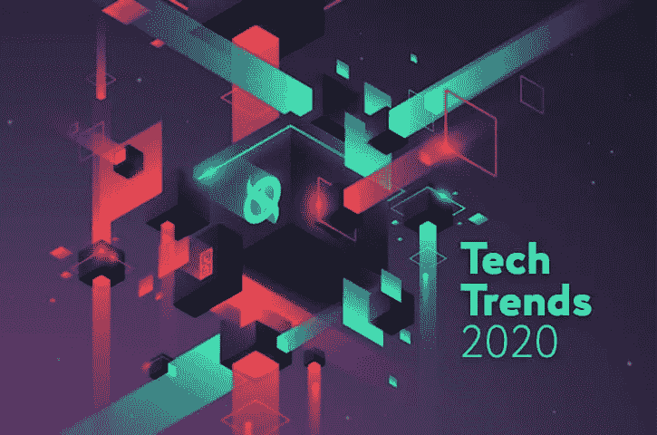

# 2020 年的技术趋势

> 原文：<https://medium.com/javarevisited/tech-trends-for-2020-1470a293afe3?source=collection_archive---------4----------------------->

软件开发行业是复杂和动态的。年复一年，我们看到新的技术、服务、平台和工具。2019 年是微服务、云迁移、增强现实繁荣和神经网络的一年。

2020 年到了。因此，让我们来看看今年等待我们的一些软件开发趋势。

# 5G 网络

5G 技术是 2019 年的热门话题。它应该在 2020 年底进入市场，并成为无线技术的驱动力。5G 的增强特性将允许开发人员创建更强大的应用程序，具有新的功能，特别是处理视频和增强现实的功能。5G 将以其 20 Gbps 的速度彻底改变物联网，这意味着高速无线连接、更大的带宽和更低的延迟。

# 对物联网的更多需求

物联网设备的总安装基数将在 2020 年向前迈进一大步。这项技术已经进入人们的家庭，但还没有达到极限。目前世界上大约有 260 亿台联网设备，而且这个数字肯定会逐年增加。物联网的重要性在于包含高级分析、5G、传感器技术和边缘计算的技术。

# 人工智能驱动的软件开发

基于人工智能的软件并不是一个新事物。但是，由于它的流行和极快的传播速度，它将在 2020 年占据一个稳定的位置。根据[Tractica](https://www.tractica.com/research/artificial-intelligence-market-forecasts/)最近的研究，到 2025 年，全球人工智能软件市场的增长将达到 1260 亿美元。从广泛使用的聊天机器人到透视分析解决方案，人工智能和机器学习将在大多数行业越来越多的产品中出现。随着技术的进步，更多的人工智能应用将有助于公司赚更多的钱，特别是在营销、分析、客户服务和机器人领域。

如果你想在 2020 年学习人工智能，我们有一些[有用的资源](https://javarevisited.blogspot.com/2019/10/top-5-courses-to-learn-artificial-intelligence-AI.html)可以开始:

<https://javarevisited.blogspot.com/2019/10/top-5-courses-to-learn-artificial-intelligence-AI.html>  

# 增强现实/虚拟现实/磁共振

虽然 AR 被用于培训目的，但 VR 已经在游戏和视频行业找到了自己的路。沉浸式技术必将达到新的市场高度，利用它来促进业务增长是有意义的。

Statista 预测，到 2022 年，沉浸式技术的全球市场将达到 2092 亿美元。

# 分布式云

分布式云是指公共云提供商将云服务分发到物理数据中心之外的不同地理位置。分布式云的核心优势在于，它有助于降低延迟，并确保符合与数据位置相关的法规。分布式云数据中心还有助于支持物联网和边缘计算的快速扩展。

[预计](https://www.gartner.com/smarterwithgartner/what-edge-computing-means-for-infrastructure-and-operations-leaders/)到 2025 年，75%的企业生成数据将被处理，而不考虑集中式数据中心。这项技术将成为 2020 年云基础设施的重大突破。

如果你刚刚起步，想学习云计算，这里是我们推荐的资源

<https://javarevisited.blogspot.com/2019/07/top-5-online-courses-to-learn-cloud-computing-aws.html>  

# 边缘计算

边缘计算提供了一种方法，这意味着将信息处理从集中式数据中心移走，并将其放置在更靠近最终用户或边缘的位置。边缘计算的理念是将流量保持在本地和分布式，以减少延迟。

由于边缘计算受到物联网快速发展的推动，我们可以预测它在未来十年内的爆炸式增长。根据 [Statista 预测](https://www.statista.com/statistics/948744/worldwide-edge-computing-market-size/)，边缘计算全球市场将在 2018 年至 2025 年间增长约 28 倍。

# 网络安全

按照目前的软件趋势，到 2020 年，使用网络安全来保障应用程序和软件安全的需求将显著增加。这只能通过雇佣能够为你的企业设计定制应用程序和软件的开发人员来实现。

# 低代码开发

低代码开发是在没有编码的情况下使用图形用户界面构建软件或应用程序。它提供了更快的部署，有助于降低成本，并克服了 UX 资源的缺乏。Gartner 预测，到 2024 年，65%以上的软件开发项目将使用低代码平台。

但是，如果你想在 2020 年学习编程和编码，你可以从这些很棒的资源开始:

<https://javarevisited.blogspot.com/2019/03/top-5-online-courses-to-learn-to-code.html>  

# 渐进式网络应用

PWA 是一种类似于原生移动应用的网站，尽管它在浏览器中运行。PWAs 似乎是企业和游客的完美解决方案。Gartner 的[调查](https://www.gartner.com/en/documents/3901479/survey-analysis-insights-to-kick-start-an-enterprise-mul)中，93%的受访者希望在 2020 年底前开发出 PWAs。所有这些都表明，2020 年是我们开始告别移动网站、支持进步的网络应用的一年。

# 结论

软件技术世界正在发生巨大的变化，毫无疑问，它将会进一步发展壮大。由于软件技术有助于提高业务效率并从中获益，因此研究技术趋势并选择最佳解决方案来实现您的业务目标将是一个明智的解决方案。

其他**编程和技术文章**你可能喜欢的
[2020 年 Java 开发者路线图](https://javarevisited.blogspot.com/2019/10/the-java-developer-roadmap.html)
[2020 年 Java 程序员应该学习的 10 件事](https://javarevisited.blogspot.com/2017/12/10-things-java-programmers-should-learn.html#axzz5atl0BngO)
[2020 年前端和后端开发者路线图](https://javarevisited.blogspot.com/2019/02/the-2019-web-developer-roadmap.html)
[2020 年你可以学习的 10 种编程语言](http://www.java67.com/2017/12/10-programming-languages-to-learn-in.html)
[2020 年 DevOps 工程师路线图](https://javarevisited.blogspot.com/2018/09/the-2018-devops-roadmap-your-guide-to-become-DevOps-Engineer.html#axzz61d5FPRru)
[Java 和 Web 开发者应该学习的 10 个框架](http://javarevisited.blogspot.sg/2018/01/10-frameworks-java-and-web-developers-should-learn.html)
[2020 年学习 Python 的 10 个理由](https://javarevisited.blogspot.com/2018/05/10-reasons-to-learn-python-programming.html)
[2020 年学习 iOS 和 Swift 的 5 大课程](/swlh/top-5-course-to-learn-ios-12-and-swift-4-in-depth-5a7351785f8d)
[2020 年学习的 10 个 JavaScript 框架和库](https://www.java67.com/2019/01/top-10-javascript-frameworks-and-libraries-for-web-developers.html)

<https://javarevisited.blogspot.com/2020/01/10-things-mobile-app-developers-can-learn.html>  </javarevisited/what-java-programmers-should-learn-in-2020-648050533c83>  

*原载于 2020 年 1 月 3 日 https://intexsoft.com*<https://intexsoft.com/>**。**