# 面向 Java 程序员的测试驱动开发(TDD)

> 原文：<https://medium.com/javarevisited/test-driven-development-tdd-for-java-programmers-cb73878afdde?source=collection_archive---------0----------------------->

甚至大多数专业人员都做的最常见但被低估的实践之一是编写代码而不实现测试。尽管很明显，如果您理解了业务逻辑，您就可以直接深入实现，但这并不意味着您遵循了编程专家久经考验的最佳实践。实现你的程序的最好方法之一是遵循 TDD 或[测试驱动开发](https://javarevisited.blogspot.com/2019/04/top-5-junit-and-unit-testing-courses-java-programmers.html)。在本文中，我们将看看什么是 TDD，以及如何使用 TDD 进行更好的编程。

## 什么是 TDD？

TDD 仅仅意味着我们使用测试来驱动代码的实现。但实际上，重构是一个从红到绿的工作流程。

[](https://javarevisited.blogspot.com/2019/04/top-5-junit-and-unit-testing-courses-java-programmers.html#axzz6iYmMFnsA)

TDD 流程

最初，新的测试将从红色状态开始，这意味着它将失败。在初始状态失败后，我们将更正测试和逻辑以通过或到达绿色状态。一旦我们的测试通过，我们就可以[重构](/javarevisited/7-best-courses-to-learn-refactoring-and-clean-coding-in-java-47bea3c67006)测试和业务逻辑的实现，使它们更加高效。如果[重构](https://javarevisited.blogspot.com/2020/12/top-5-course-to-improve-coding-skills.html)导致测试回到红色状态，我们将修复测试进入绿色状态，然后再次重构，从而创建一个循环。

## ISBN 验证

为了更详细地理解 TDD，我们将看看如何在项目中使用 TDD。在这个项目中，我们将看看如何验证一本书的 ISBN 号。ISBN 代表国际标准书号，这些是你在任何一本书的条形码上都能找到的数字。ISBN 号的有效性基于以下简单的逻辑。

如果 ISBN 号包含 10 个数字，并且它们都是数字，那么 ISBN 数字与 10 到 1 的乘积之和除以 11 应该得到一个整数值。

[](https://javarevisited.blogspot.com/2013/04/JUnit-tutorial-example-test-exception-thrown-by-java-method.html)

国际标准书号 10 位数

在上面的例子中，总和是 132，当它除以 11 时，我们得到 12，一个整数值。因此这是一个有效的 ISBN 号。

如果 ISBN 号的最后一位数字是 9 位字母“X ”,那么将“X”视为 10，ISBN 号数字与 10 到 1 的乘积之和除以 11 应该得到一个整数值。


带 X 的 ISBN 9 位数

这里，乘积之和是 209，除以 11 得到 19，这是一个整数值。

最后，如果 ISBN 号包含 13 个数字，那么这些数字应该交替乘以 1 和 3。之后，总和除以 10 应该给出一个整数值。


ISBN 13 位数字

这里，乘积之和是 100，除以 10 得到 10，这是一个整数值。

## 在 IntelliJ 上设置项目

为此，我们将创建一个新的 maven 项目。为此，我们将使用 [IntelliJ IDEA 终极版](/javarevisited/7-best-courses-to-learn-intellij-idea-for-beginners-and-experienced-java-programmers-2e9aa9bb0c05)。要创建新的 maven 项目，请转到文件→新建→项目，然后选择 maven。然后给`com.book`作为组 id，给`tdd`作为工件 id。生成项目后，转到`pom.xml`文件，添加以下内容，将 JUnit 添加为依赖项。

```
<dependency>
    <groupId>junit</groupId>
    <artifactId>junit</artifactId>
    <version>4.13.2</version>
    <scope>test</scope>
</dependency>
```

接下来，转到`src` → `main` → `java`，创建一个新的包`com.book.tdd`，并添加一个名为`ValidateISBN.java`的新类。然后，转到`src` → `test` → `java`并创建一个新包`com.book.tdd`并向其中添加一个名为`ValidateISBNTests.class`的新类。添加上述配置后，您的项目应该如下所示。

[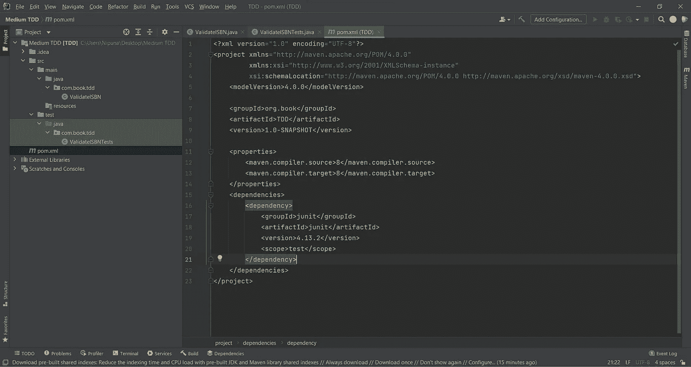](https://javarevisited.blogspot.com/2018/09/top-5-courses-to-learn-intellij-idea-java-and-android-development.html)

初始项目配置

因为我们正在使用 [TDD](https://javarevisited.blogspot.com/2021/04/junit-interview-questions-with-answers.html) ，首先我们将转到`ValidateISBNTest.java`文件并创建我们的第一个测试。这是因为，在 TDD 中，代码实现是由测试驱动的。

```
@Test
public void checkValidateISBN(){ *fail*("Not implemented");
}
```

正如我们前面提到的，我们正在从红色走向绿色。因此，最初我们将无法通过测试，并获得红色状态。为了运行这个测试，我们将通过使用`import org.junit.Test;`和`import org.junit.Assert.*;`来导入`Test`这里，我们使用了静态方法导入，因为我们不想在代码中使用断言作为`Assert.assertTrue()`。当您使用*水槽运行图标*运行该测试时，您将获得以下输出。

[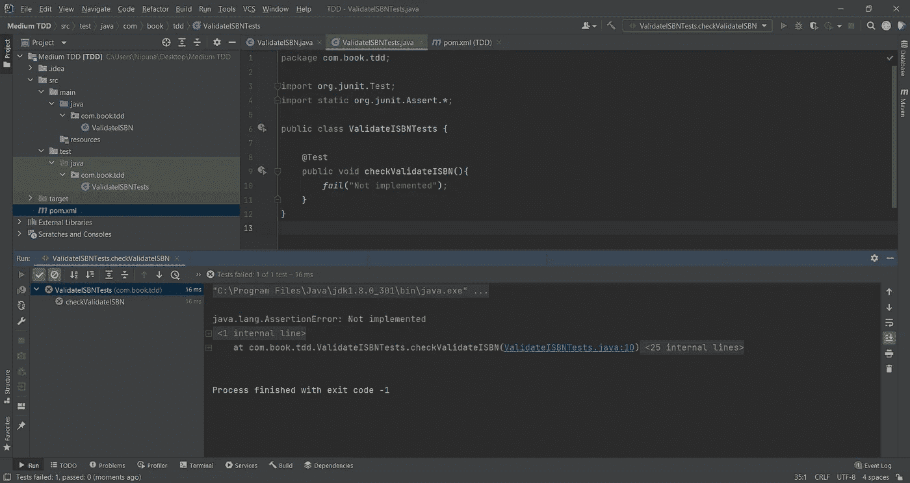](https://www.java67.com/2018/02/5-free-eclipse-and-junit-online-courses-java-developers.html)

初始故障状态

现在我们需要进入绿色状态，为此我们可以删除第 10 行，`fail("Not Implemented");`并添加我们期望的方法来检查有效性。为此，我们可以这样调整我们的测试。

```
@Test
public void checkValidateISBN(){ ValidateISBN validateISBN = new ValidateISBN();
    boolean result = validateISBN.checkISBN(0140441926);
}
```

正如你所注意到的，`checkISBN(int isbn)`方法还没有实现，我们也没有说参数类型应该是一个[字符串](https://javarevisited.blogspot.com/2012/12/how-to-convert-string-to-long-in-java-4-examples.html#axzz5N6yBqnlo)或者其他什么。我们假设它为 int，因为它是一个数。如果数量不是这种类型，我们可以在以后用测试结果来验证它。

当我们运行这个时，我们得到下面的错误，说整数[太大了。](https://www.java67.com/2015/10/java-how-to-convert-from-integer-to-String-in-Java.html)

[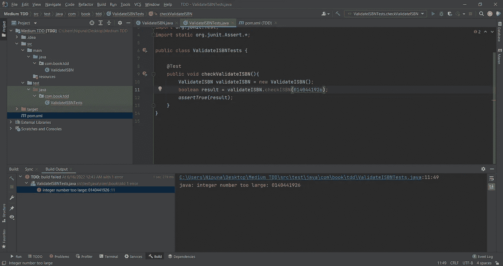](https://javarevisited.blogspot.com/2015/01/top-20-string-coding-interview-question-programming-interview.html)

运行 checkISBN()方法

由于这个原因，我把变量变成了一个字符串[并再次检查。现在我得到了下面的错误。](/javarevisited/top-21-string-programming-interview-questions-for-beginners-and-experienced-developers-56037048de45?source=collection_home---4------0-----------------------)

[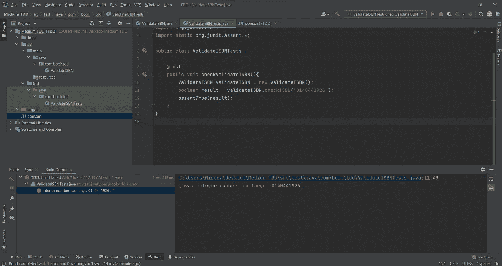](https://www.java67.com/2018/06/top-35-java-string-interview-questions.html)

运行 checkISBN()方法

我知道这是因为我没有实现这个方法。因此，我单击变红的方法，并在 Windows 中按下`alt + enter`或在 Mac 中按下`option+enter`来选择我必须修复这个问题的选项，从我选择的下拉列表中，`Create method 'checkISBN' in 'ValidateISBN'`在我们的`ValidateISBN.java`文件中创建新方法。

[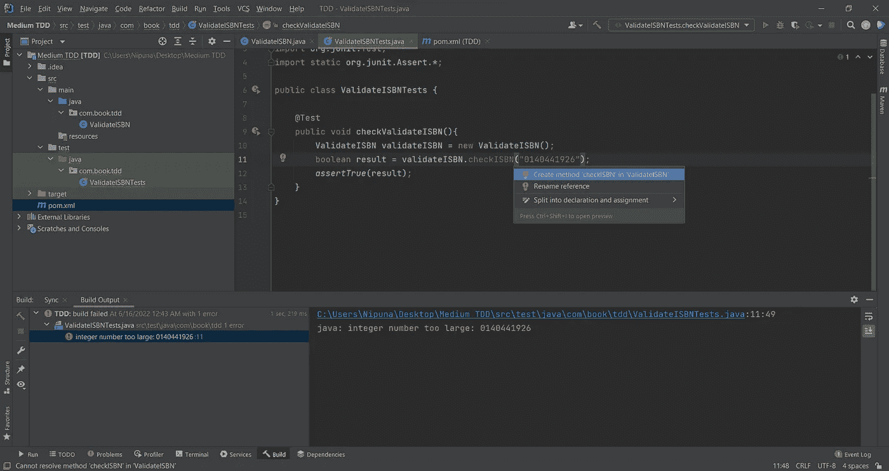](https://www.java67.com/2019/11/how-to-remove-duplicate-characters-from-string-in-java.html)

运行 checkISBN()方法

在`ValidateISBN.java`文件中创建了`checkISBN()`方法，并返回`false`作为默认值后，我们可以再次运行测试。

[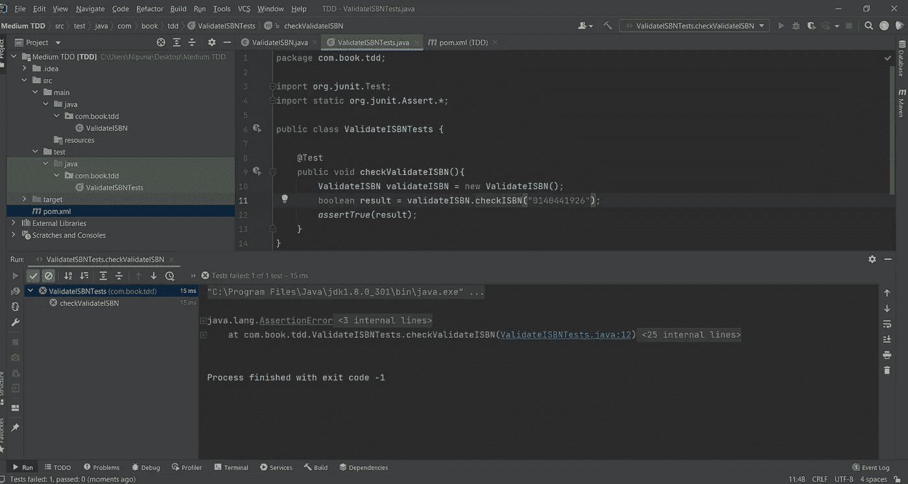](https://javarevisited.blogspot.com/2015/02/simple-junit-example-unit-tests-for-linked-list-java.html)

运行 checkISBN()方法

这里，我们得到了一个`AssertonError`，因为我们为一个假值声明了 true。如果我们将第 12 行改为`assertFalse(result);`，测试将通过，因为我们断言为假。

现在让我们转到`ValidateISBN.java`文件并编写我们的实现。这里，要记住的最重要的事情之一是编写只需要通过测试的代码。这里，为了通过我们的测试，我们可以将`return false;`改为`return true;`，现在我们的代码处于绿色状态。

现在假设我想验证一个无效的 ISBN 号。然后我可以在`ValidateISBNTests.java`文件中编写下面的测试。

```
@Test
public void checkInvalidISBN(){ ValidateISBN validateISBN = new ValidateISBN();
    boolean result = validateISBN.checkISBN("0140441927");
    *assertFalse*(result);
}
```

现在，当我们运行它时，它失败了，因为我们总是从`checkISBN()`方法返回`true`。现在，由于我们处于红色状态，我们需要编写一些代码来进入绿色状态。我们将首先编写我们前面讨论过的 ISBN 号验证所需的第一个检查；如果位数等于 10 并且都是数字。

```
public boolean checkISBN(String isbn) {

    int total = 0;
    for (int i = 0; i < 10; i++) {
        total += isbn.charAt(i) * (10 - i);
    }
    if (total % 11 == 0) {
        return true;
    } else {
        return false;
    }
}
```

现在，如果我们运行我们编写的测试，我们可以看到`checkInvalidISBN()`没有错误，但是`checkValidateISBN()`有错误，这是因为我们检查的 ISBN 号无效。我们可以用之前讨论 ISBN 号背后的逻辑 0140449116 来代替。

为了给`checkValidateISBN()`起一个更有意义的名字，我们可以将它的名字重构为`checkValidISBN()`，现在我们可以再次运行测试了。

[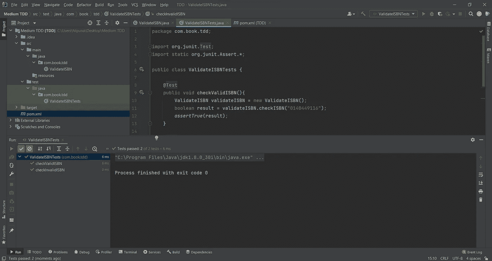](https://www.java67.com/2018/05/top-75-programming-interview-questions-answers.html)

checkValidateISBN()和 checkInvalidISBN()的测试通过

现在我们需要添加另一个测试来验证 ISBN 号的长度。我们知道 ISBN 号的长度只能是 10 或 13。因此，我们将运行一个测试，测试 ISBN 的长度不能超过 10 或 13。为此，我们将首先编写一个失败状态的测试。

```
@Test
public void checkISBNLengthTenOrThirteen(){ *fail*();
}
```

如果我们将它调整到下面并运行测试，我们将得到一个`[StringIndexOutOfBoundsException](https://javarevisited.blogspot.com/2016/03/how-to-remove-first-and-last-character-from-String-in-java-example.html)` [，因为](https://javarevisited.blogspot.com/2016/03/how-to-remove-first-and-last-character-from-String-in-java-example.html)只包含 9 个数字。

```
@Test
public void checkISBNLengthTenOrThirteen(){ ValidateISBN validateISBN  = new ValidateISBN();
    boolean result = validateISBN.checkISBN("012345678");
}
```

虽然我们可以创建一个新的异常来处理这个问题，但是我们可以使用 Java 的`[NumberFormatException](http://javarevisited.blogspot.com/2016/08/javalangnumberformatexception-for-input-string-null-java.html)` <http://javarevisited.blogspot.com/2016/08/javalangnumberformatexception-for-input-string-null-java.html>来处理这个问题。因为我们知道这是错误的，并且我们预期会有一个错误，我们可以将测试注释更改为我们预期的错误。

```
@Test(expected = NumberFormatException.class)
public void checkISBNLengthTenOrThirteen(){ ValidateISBN validateISBN  = new ValidateISBN();
    boolean result = validateISBN.checkISBN("012345678");
}
```

[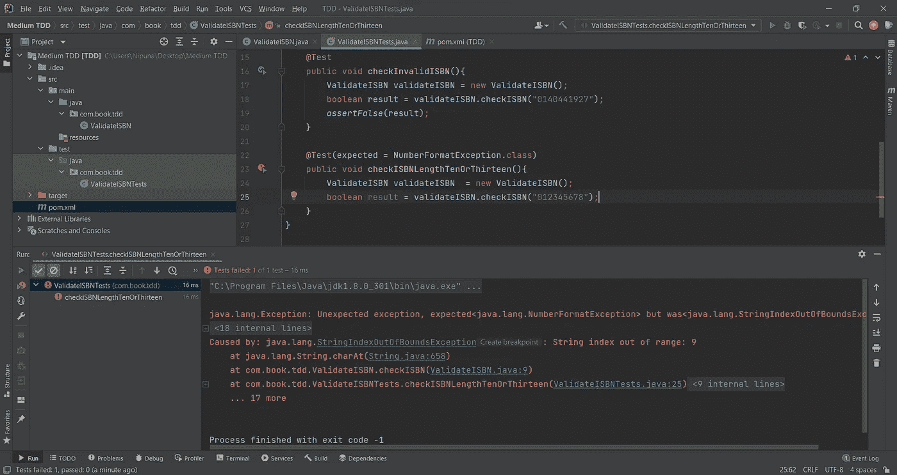](https://javarevisited.blogspot.com/2016/02/solving-javalangarrayindexoutofboundsexception-0-1-2-in-java.html)

意外异常？

但是测试表明它得到了一个意外的异常，因为它提前得到了`StringOutOfBoundsException`。那么我们该如何解决这个问题呢？为了解决这个问题，我们需要更新我们的`checkISBN()`方法。

```
public boolean checkISBN(String isbn) {

    if (isbn.length() == 10 || isbn.length() == 13) {
        int total = 0;
        for (int i = 0; i < 10; i++) {
            total += isbn.charAt(i) * (10 - i);
        }
        if (total % 11 == 0) {
            return true;
        } else {
            return false;
        }
    } else {
        throw new NumberFormatException("ISBN number should have length of 10 or 13");
    }
}
```

所以，现在当我们运行测试时，我们得到了预期的结果。


正在运行 checkISBNLengthTenOrThirteen()方法

因为变量`result`是灰色的，这意味着`result`变量是不必要的。所以我们可以将这个方法重构如下。

```
@Test(expected = NumberFormatException.class)
public void checkISBNLengthTenOrThirteen(){ ValidateISBN validateISBN  = new ValidateISBN();
    validateISBN.checkISBN("012345678");
}
```

现在我们需要测试我们传递给`checkISBN()`的 ISBN 是否是数值(尽管我们讨论了 ISBN 数字中的字母 X)。为了检查它，我们将实现下面的测试。

```
@Test
public void checkISBNNumeric(){ *fail*();
}
```

之后，我们可以将其调整为以下代码。因为我们正在传递一个字符串，我们可以期待一个`NumberFormatException`

```
@Test(expected = NumberFormatException.class)
public void checkISBNNumeric(){ ValidateISBN validateISBN = new ValidateISBN();
    validateISBN.checkISBN("helloworld");
}
```

如果我们运行它，我们会得到一个错误。这是因为我们应该关注数字而不是字母。为了解决这个问题，我们稍微调整了一下我们的`checkISBN()`代码。

```
public boolean checkISBN(String isbn) {

    if (isbn.length() == 10 || isbn.length() == 13) {
        int total = 0;
        for (int i = 0; i < 10; i++) {
            if (!Character.*isDigit*(isbn.charAt(i))){
                throw new NumberFormatException("ISBN numbers can only have digits.");
            }
            total += isbn.charAt(i) * (10 - i);
        }
        if (total % 11 == 0) {
            return true;
        } else {
            return false;
        }
    } else {
        throw new NumberFormatException("ISBN number should have length of 10 or 13");
    }
```

现在，当我们运行测试时，它通过了。

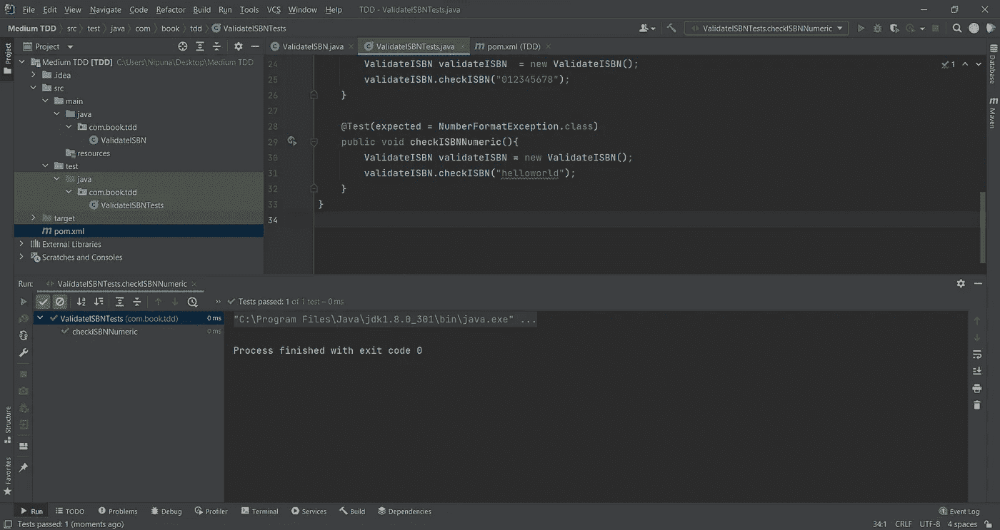

运行 checkISBNNumeric()方法

现在我们可以检查包含 9 个数字和字母“X”的 ISBN 号。检查我们是否可以创建一个新方法，以`fail();`作为初始状态。

```
@Test
public void checkContainsX(){ *fail*();
}
```

现在，我们可以将以下内容添加到测试中，当我们运行它时，我们会得到一个`NumberFormatException`,这要感谢我们之前所做的测试和代码修正。

```
@Test
public void checkContainsX(){ ValidateISBN validateISBN = new ValidateISBN();
    boolean result = validateISBN.checkISBN("080442957X");
    *assertTrue*(result);
}
```

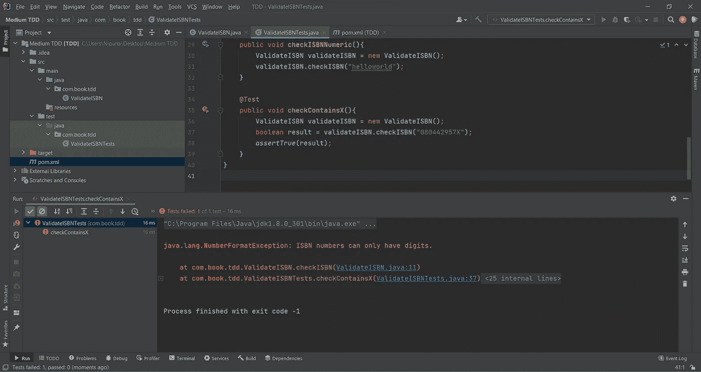

运行 checkContainsX()方法。

现在，为了解决这个问题，我们可以改变我们的`checkISBN()`方法。

```
public boolean checkISBN(String isbn) {

    if (isbn.length() == 10 || isbn.length() == 13) {
        int total = 0;
        for (int i = 0; i < 10; i++) {
            if (!Character.*isDigit*(isbn.charAt(i))) {
                if (i == 9 && isbn.charAt(i) == 'X') {
                    //do nothing
                } else {
                    throw new NumberFormatException("ISBN numbers can only have digits.");
                }
            }
            total += isbn.charAt(i) * (10 - i);
        }
        if (total % 11 == 0) {
            return true;
        } else {
            return false;
        }
    } else {
        throw new NumberFormatException("ISBN number should have length of 10 or 13");
    }
}
```

你可以看到`if(i==9 && isbn.charAt(i)=='X')`我们什么都不做，否则我们抛出一个异常。如果我们运行这个，我们会得到一个错误，说我们的断言是错误的。这是因为我们需要将 10 乘以 1 加到总数上。因此，我们可以通过在添加注释`//do nothing`的地方添加`total+=10;`来修复它，并在`total += isbn.charAt(i) * (10 — i);`处添加一个`else`块来修复我们的正常流程。

```
public boolean checkISBN(String isbn) {

    if (isbn.length() == 10 || isbn.length() == 13) {
        int total = 0;
        for (int i = 0; i < 10; i++) {
            if (!Character.*isDigit*(isbn.charAt(i))) {
                if (i == 9 && isbn.charAt(i) == 'X') {
                    total += 10;
                } else {
                    throw new NumberFormatException("ISBN numbers can only have digits.");
                }
            } else {
                total += isbn.charAt(i) * (10 - i);
            }
        }
        if (total % 11 == 0) {
            return true;
        } else {
            return false;
        }
    } else {
        throw new NumberFormatException("ISBN number should have length of 10 or 13");
    }
}
```

现在，当我们运行这个测试时，仍然会得到一个错误。

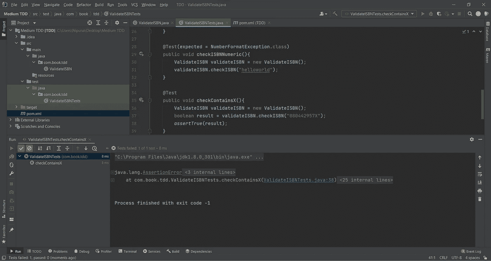

运行 checkContainsX()方法

为了理解这一点，我们将调试指针添加到`checkISBN()`方法的第 21 行和第 23 行，并调试测试。

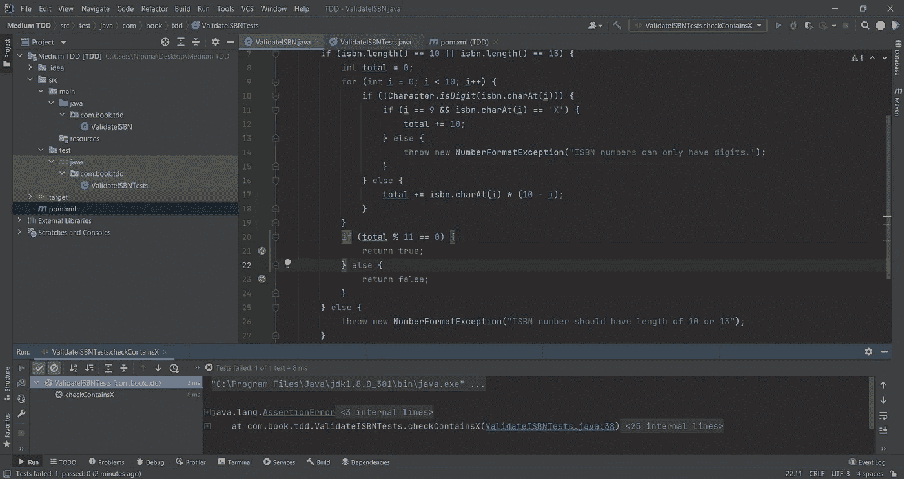

调试 checkISBN()方法和 checkContainsX()方法

当我们调试它时，我们得到的`total`是 2801，这是不可能的，因为我们知道`total`是 209(我们之前讨论过的例子)。

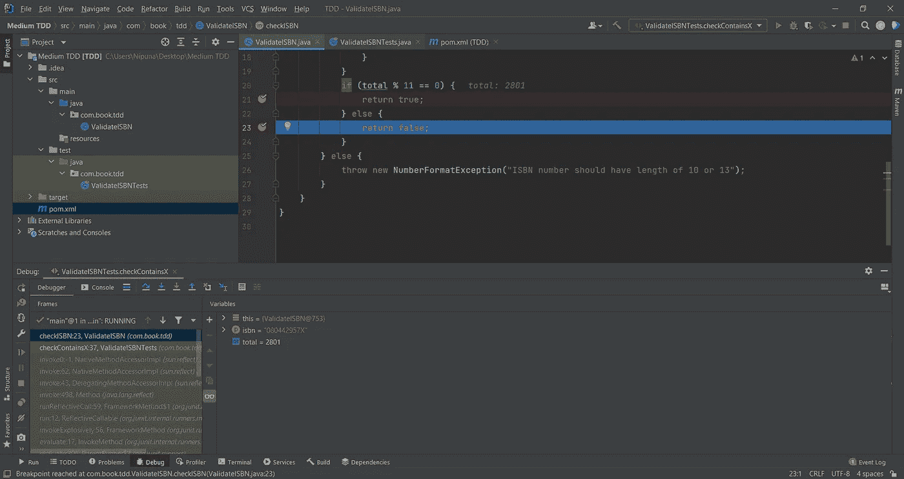

调试 checkISBN()方法和 checkContainsX()方法

那么，为什么会出现这种情况呢？这是因为第 11 行中的`isbn.charAt()`方法返回 ASCII 值，并且该值正在被相乘。我们可以使用`Characters.getNumericValue()`方法解决这个问题。之后的`checkISBN()`方法是这样的。

```
public boolean checkISBN(String isbn) {

    if (isbn.length() == 10 || isbn.length() == 13) {
        int total = 0;
        for (int i = 0; i < 10; i++) {
            if (!Character.*isDigit*(isbn.charAt(i))) {
                if (i == 9 && isbn.charAt(i) == 'X') {
                    total += 10;
                } else {
                    throw new NumberFormatException("ISBN numbers can only have digits.");
                }
            } else {
                total += Character.*getNumericValue*(isbn.charAt(i)) * (10 - i);
            }
        }
        if (total % 11 == 0) {
            return true;
        } else {
            return false;
        }
    } else {
        throw new NumberFormatException("ISBN number should have length of 10 or 13");
    }
}
```

现在，当我们运行`checkContainsX()`测试时，它通过了。

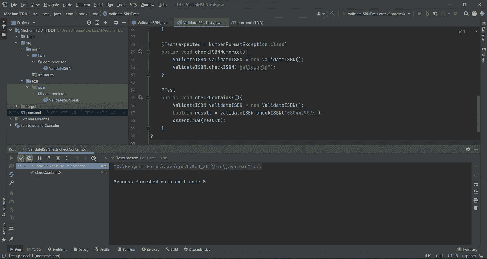

运行 checkContainsX()方法

现在，我们已经实现了 10 位数的 ISBN 号和 9 位数的 ISBN 号以及' X '的代码。所以现在我们需要完成的唯一部分是 13 位的 ISBN 号。为了实现这一点，我们将首先创建一个测试。

```
@Test
public void checkValidThirteenDigitISBN(){ *fail*();
}
```

现在我们可以调整我们的测试用例来检查 13 位数字。

```
@Test
public void checkValidThirteenDigitISBN(){ ValidateISBN validateISBN = new ValidateISBN();
    boolean result = validateISBN.checkISBN("9780306406157");
    *assertTrue*(result);
}
```

我们知道这是一个 ISBN 号，因为这是我们用来讨论业务逻辑的。但是当我们运行这个时，我们得到一个错误。

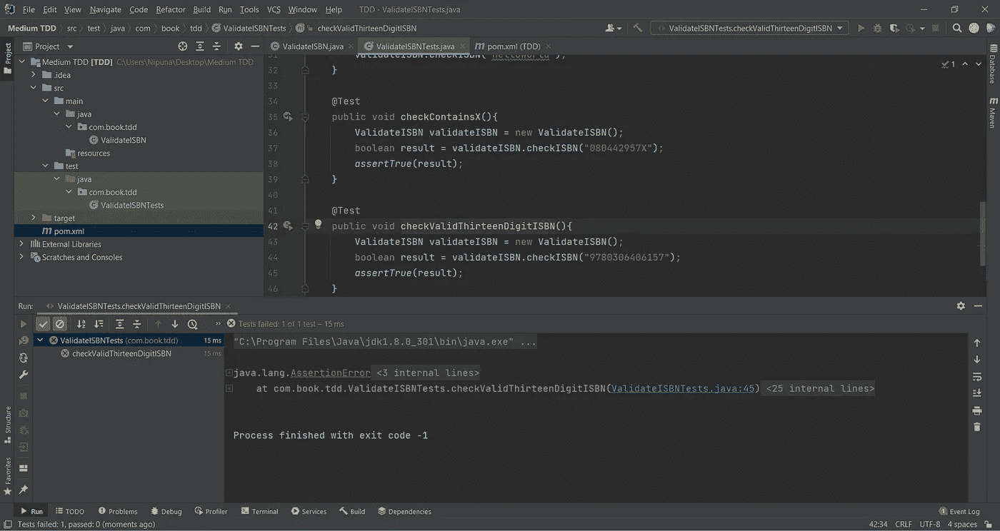

正在运行 checkValidThirteenDigitISBN()方法

这是因为我们还没有为此实现业务逻辑。为此，我们可以将`checkISBN()`方法改为下面的代码片段。

```
public boolean checkISBN(String isbn) {

    if (isbn.length() == 10 || isbn.length() == 13) {
        if (isbn.length() == 13) {
            int total = 0;
            for (int i = 0; i < 13; i++) {
                if (Character.*isDigit*(isbn.charAt(i))) {
                    if (i % 2 == 0) {
                        total += Character.*getNumericValue*(isbn.charAt(i)) * 1;
                    } else {
                        total += Character.*getNumericValue*(isbn.charAt(i)) * 3;
                    }
                } else {
                    throw new NumberFormatException("ISBN numbers can only have digits.");
                }
            }
            if (total % 10 == 0) {
                return true;
            } else {
                return false;
            }
        } else {
            int total = 0;
            for (int i = 0; i < 10; i++) {
                if (!Character.*isDigit*(isbn.charAt(i))) {
                    if (i == 9 && isbn.charAt(i) == 'X') {
                        total += 10;
                    } else {
                        throw new NumberFormatException("ISBN numbers can only have digits.");
                    }
                } else {
                    total += Character.*getNumericValue*(isbn.charAt(i)) * (10 - i);
                }
            }
            if (total % 11 == 0) {
                return true;
            } else {
                return false;
            }
        }
    } else {
        throw new NumberFormatException("ISBN number should have length of 10 or 13");
    }
}
```

在改变了`checkISBN()`方法并运行测试之后，它就通过了。

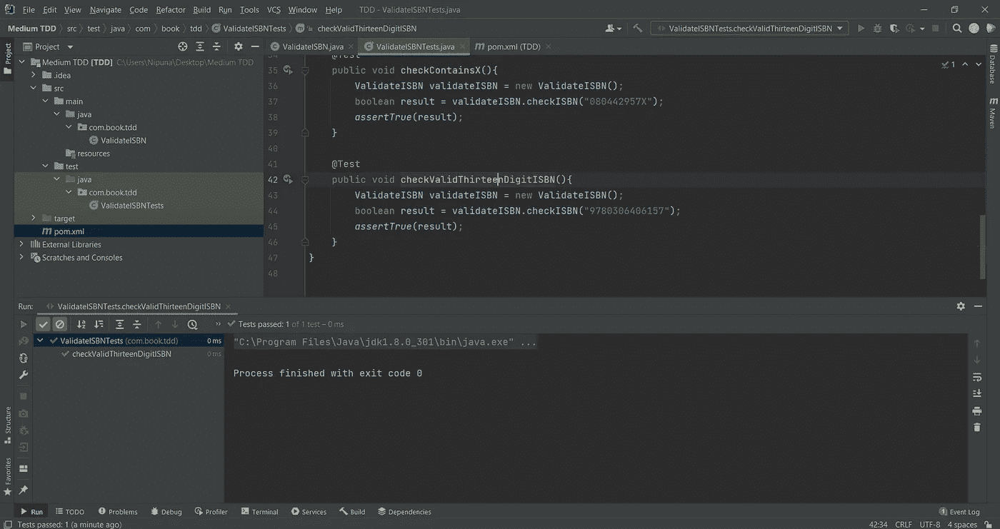

正在运行 checkValidThirteenDigitISBN()方法

虽然，我们的代码，`checkISBN()`运行良好，但看起来很乱。为了清理它，我们进行了重构。这是通过创建常量和方法来完成的。重构代码后，看起来是这样的。

```
package com.book.tdd;

public class ValidateISBN {

    public static final int *ISBN_SHORT* = 10;
    public static final int *ISBN_LONG* = 13;
    public static final int *ISBN_SHORT_VALIDATOR* = 11;
    public static final int *ISBN_LONG_VALIDATOR* = 10;

    public boolean checkISBN(String isbn) {

        if (isbn.length() == *ISBN_SHORT* || isbn.length() == *ISBN_LONG*) {
            if (isbn.length() == *ISBN_LONG*) {
                return checkISBNThirteenDigits(isbn);
            } else {
                return checkISBNTenDigits(isbn);
            }
        } else {
            throw new NumberFormatException("ISBN number should have length of 10 or 13");
        }
    }

    private boolean checkISBNTenDigits(String isbn) {

        int total = 0;
        for (int i = 0; i < *ISBN_SHORT*; i++) {
            if (!Character.*isDigit*(isbn.charAt(i))) {
                if (i == 9 && isbn.charAt(i) == 'X') {
                    total += 10;
                } else {
                    throw new NumberFormatException("ISBN numbers can only have digits.");
                }
            } else {
                total += Character.*getNumericValue*(isbn.charAt(i)) * (*ISBN_SHORT* - i);
            }
        }
        if (total % *ISBN_SHORT_VALIDATOR* == 0) {
            return true;
        }
        return false;
    }

    private boolean checkISBNThirteenDigits(String isbn) {

        int total = 0;
        for (int i = 0; i < *ISBN_LONG*; i++) {
            if (Character.*isDigit*(isbn.charAt(i))) {
                if (i % 2 == 0) {
                    total += Character.*getNumericValue*(isbn.charAt(i)) * 1;
                } else {
                    total += Character.*getNumericValue*(isbn.charAt(i)) * 3;
                }
            } else {
                throw new NumberFormatException("ISBN numbers can only have digits.");
            }
        }
        if (total % *ISBN_LONG_VALIDATOR* == 0) {
            return true;
        }
        return false;
    }
}
```

现在，如果我们运行测试套件，我们会得到以下结果。

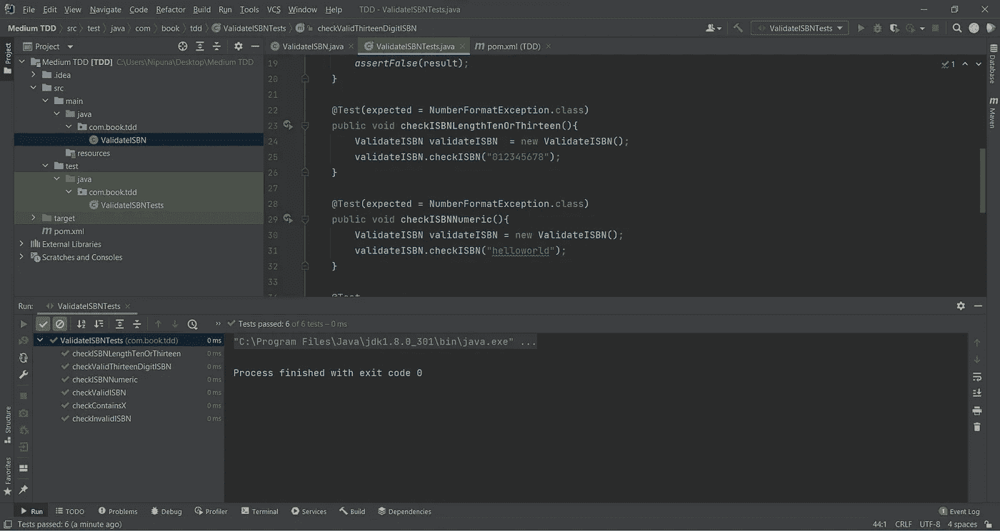

所有测试都通过了

但是查看我们的测试文件，我们可以看到我们在一遍又一遍地使用变量`validateISBN`。为了避免这种情况，我们可以使用`@Before`注释。在一个方法中使用注释之后，我们得到了下面的最终测试套件。

```
package com.book.tdd;

import org.junit.Before;
import org.junit.Test;

import static org.junit.Assert.*;

public class ValidateISBNTests {

    ValidateISBN validateISBN;

    @Before
    public void setup() {

        validateISBN = new ValidateISBN();
    }

    @Test
    public void checkValidISBN() {

        boolean result = validateISBN.checkISBN("0140449116");
        *assertTrue*(result);
    }

    @Test
    public void checkInvalidISBN() {

        boolean result = validateISBN.checkISBN("0140441927");
        *assertFalse*(result);
    }

    @Test(expected = NumberFormatException.class)
    public void checkISBNLengthTenOrThirteen() {

        validateISBN.checkISBN("012345678");
    }

    @Test(expected = NumberFormatException.class)
    public void checkISBNNumeric() {

        validateISBN.checkISBN("helloworld");
    }

    @Test
    public void checkContainsX() {

        boolean result = validateISBN.checkISBN("080442957X");
        *assertTrue*(result);
    }

    @Test
    public void checkValidThirteenDigitISBN() {

        boolean result = validateISBN.checkISBN("9780306406157");
        *assertTrue*(result);
    }
}
```

## 最终注释

你可以看到，通过使用 TDD，我们可以构建无错误、高效的代码。这是大多数公司将 TDD 作为最佳实践的主要原因。

虽然我们在这里只使用了 JUnit，但是在进行 TDD 时，完全依赖于 [JUnit](/javarevisited/5-courses-to-learn-junit-and-mockito-in-2019-best-of-lot-f217d8b93688) 几乎是不可能的。根据我们的实现，我们必须使用多个测试库来测试我们的代码。但是所有这些都是为了在我们的实现过程中使用 TDD。我希望你们已经学会了如何使用 TDD 进行高效的实现。ISBN 验证项目代码库的链接可以在[这里](https://github.com/nipunaupeksha/tdd-isbn-validation)找到。干杯！