# 2023 年 React JS 开发者路线图[更新]

> 原文：<https://medium.com/javarevisited/the-2019-react-js-developer-roadmap-9a8e290b8a56?source=collection_archive---------0----------------------->

## 2023 年成为 React 开发人员的图解指南，包含相关课程的链接

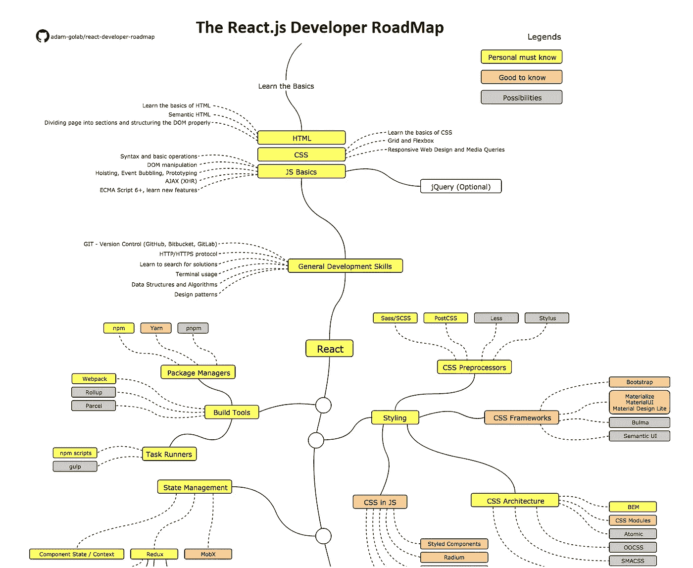

大家好，如果你想在 2023 年成为一名 React 开发者并寻找最好的资源，那么你来对地方了。之前我已经分享了 [**最好的 React.js 课程**](https://javinpaul.medium.com/top-5-courses-to-learn-react-js-in-2019-best-of-lot-fa02cd96cdf0)[书籍](/javarevisited/5-best-react-js-books-for-beginners-and-experienced-web-developers-e7b90b1ab9d2)，以及[2023 年学习 React.js 最好的网站](/javarevisited/6-best-websites-to-learn-react-js-coding-for-free-ba7ec5c43433)，在这篇文章中，我将分享完整的 React 开发者路线图。

React JS 或简称 React 是用于开发前端或 GUI web 应用程序的领先 JavaScript 库之一。

在脸书设计公司的支持下，React JS，也称为 just React is，近年来发展迅猛，已经成为基于组件的 GUI 开发的事实上的库。

虽然也有其他前端框架，如**[**Angular**](http://javarevisited.blogspot.sg/2018/01/10-frameworks-java-and-web-developers-should-learn.html)和 [**Vue.js**](http://bit.ly/2ngYICV) 可用，但 sets 与众不同的地方可能是它只专注于基于组件的 GUI 开发，而没有侵入其他领域。**

**例如， [Angular](https://javarevisited.blogspot.com/2018/06/5-best-courses-to-learn-angular.html) 是一个完整的框架，给了你很多现成的特性，比如[依赖注入](https://javarevisited.blogspot.com/2015/06/difference-between-dependency-injection.html)、钩子、路由系统、表单处理、HTTP 请求、动画、i18n 支持，以及一个强大的模块系统，具有轻松的惰性加载。**

**因此，如果你已经有库来做这些事情，或者你可能根本不需要它们，那么 React 是一个很好的选择，但是学习 React 并不容易，特别是如果你是 web 开发的新手。**

**今年开始学 [React JS](https://javarevisited.blogspot.com/2018/08/top-5-react-js-and-redux-courses-to-learn-online.html) 的时候，有一些 web 开发的背景，之前用过 [HTML](http://www.java67.com/2018/02/5-free-html-and-css-courses-to-learn-web-development.html) 、 [CSS](http://javarevisited.blogspot.sg/2018/01/top-10-udemy-courses-for-java-and-web-developers.html) 、 [JavaScript](http://bit.ly/2QlikCB) ，对前端开发也略知一二，但是学 React JS 也是费尽周折。其实我还在学。**

**当我在做一些关于学习 React JS 的正确方法的研究时，我看到了[这份](https://github.com/adam-golab/react-developer-roadmap/blob/master/roadmap.png)优秀的 **React 开发人员路线图**，它概述了什么是必修的，什么是应该知道的，以及作为 React 开发人员你可以学习的一些额外的东西。**

**这个 React 开发人员路线图是由 Adam [-Golab，](https://github.com/adam-golab/react-developer-roadmap/blob/master/roadmap.png)构建的，它概述了您可以选择的途径以及成为 React 开发人员需要学习的库。**

> **所以，如果你想知道，作为一名 React 开发人员，你下一步应该学习什么？那么这个路线图可以帮助你。**

**与我之前分享的 [DevOps 路线图](https://javarevisited.blogspot.com/2018/09/the-2018-devops-roadmap-your-guide-to-become-DevOps-Engineer.html)、 [Java](https://javarevisited.blogspot.com/2019/10/the-java-developer-roadmap.html) 和 [Web 开发者路线图](/hackernoon/the-2019-web-developer-roadmap-ab89ac3c380e)类似，React JS 路线图在探索 React 方面也很棒，你可以利用它成为更好的 React 开发者。**

**但是，如果你想知道在哪里学习这些强制性的技能，那么不要担心，我也分享了一些免费和付费的在线课程，你可以学习这些技能。**

# **2023 年 React 开发者路线图**

**无论如何，这是我所说的 React 开发者路线图:**

**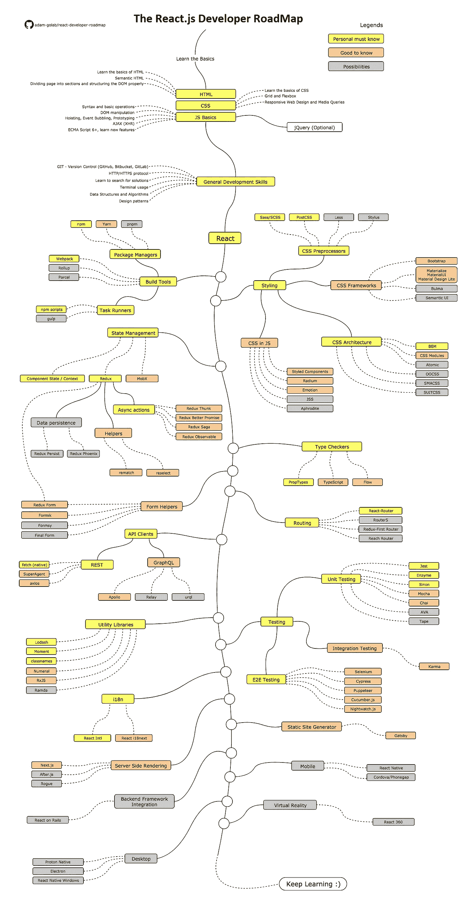**

**现在，让我们一步一步地浏览路线图，了解如何在 2023 年和未来几年学习成为 React 开发人员的基本技能:**

## **1.基础**

**无论你学习哪个框架或库进行 web 开发，你都必须知道基础知识，我说的基础知识是指 [HTML](https://hackernoon.com/top-5-free-online-courses-to-learn-html-css-web-development-in-2020-ae8e7466dfa7) 、 [CSS](https://javarevisited.blogspot.com/2019/05/top-5-html-5-and-css-3-courses-for-web-developers.html) 和 [JavaScript](https://hackernoon.com/10-websites-to-learn-javascript-for-beginners-31e13bbdbb5c) ，这三者是 web 开发的三大支柱。**

## **1.1 HTML
它是网站开发者的第一支柱之一，也是最重要的技能，因为它为网页提供了结构。**

**如果想学 HTML，可以去 Udemy 上查看 [**用 HTML5 和 CSS3**](http://bit.ly/2DCAqNE) 课程构建响应式真实世界网站。**

**[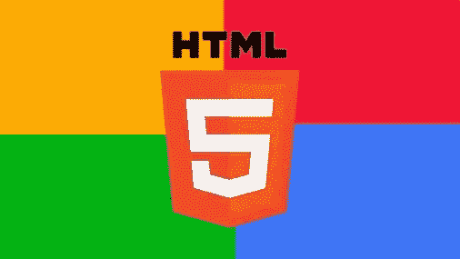](http://bit.ly/2DCAqNE)**

**如果你不介意从免费资源中学习，那么你也可以看看我列出的[免费 HTML 课程](http://www.java67.com/2018/02/5-free-html-and-css-courses-to-learn-web-development.html)。**

## **1.2 CSS
它是 web 开发的第二个支柱，用于设计网页的样式，使它们看起来更好。**

**如果你想学习 CSS，那么你可以在 Udemy 上查看 Maimillian Scwarzmuller 的名为 [**CSS 的牛逼课程——2023 年完整指南(包含 Flexbox，Grid & Sass)**](https://click.linksynergy.com/deeplink?id=CuIbQrBnhiw&mid=39197&murl=https%3A%2F%2Fwww.udemy.com%2Fcourse%2Fcss-the-complete-guide-incl-flexbox-grid-sass%2F) 。这是我发现的从零开始学习 CSS 的最好的在线资源之一。**

**[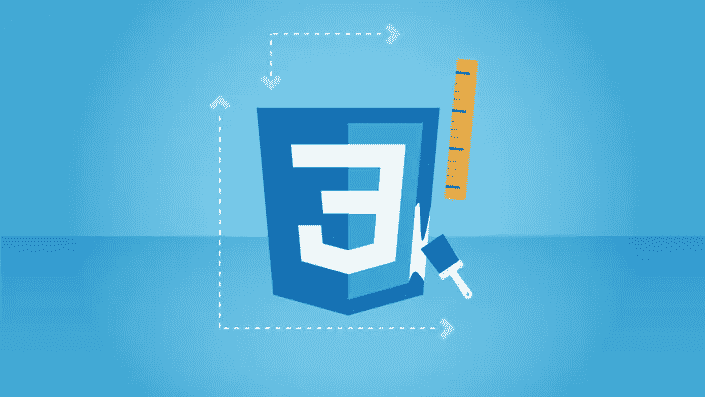](https://click.linksynergy.com/deeplink?id=CuIbQrBnhiw&mid=39197&murl=https%3A%2F%2Fwww.udemy.com%2Fcourse%2Fcss-the-complete-guide-incl-flexbox-grid-sass%2F)**

**如果你需要更多的资源，你也可以在我的免费网络开发课程列表中找到一些免费的 CSS 课程。**

## **1.3 JavaScript
这是 web 开发的第三个支柱，用来让你的网页具有交互性。**

**这也是 React 框架背后的原因，因此在尝试学习 React JS 之前，您应该了解 JavaScript 并很好地了解它。**

**如果你想从零开始学习 JavaScript，建议你加入 [**完整的 JavaScript 课程 2023:构建真实项目！**](http://bit.ly/2DAthxz) 课程。简直牛逼。**

**[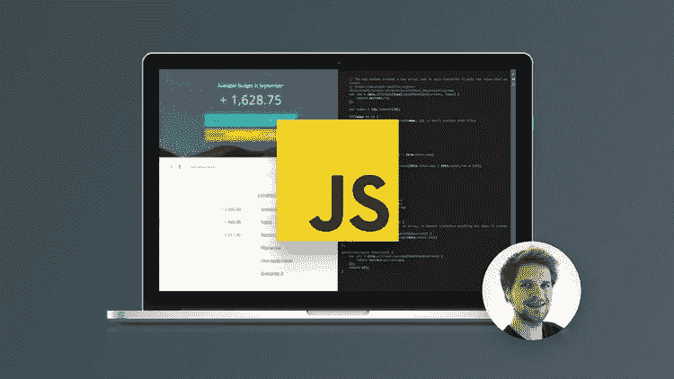](http://bit.ly/2DAthxz)**

**首先，你也可以看看我的[免费 JavaScript 课程列表](http://www.java67.com/2018/04/top-5-free-javascript-courses-to-learn.html)。**

**顺便说一下，与其单独学习这些技术，不如参加一个完整的 web 开发课程，如 [**由**](https://click.linksynergy.com/fs-bin/click?id=JVFxdTr9V80&subid=0&offerid=323058.1&type=10&tmpid=14538&RD_PARM1=https%3A%2F%2Fwww.udemy.com%2Fthe-web-developer-bootcamp%2F) **[Colt_Steele](https://medium.com/u/b74a1e474498?source=post_page-----9a8e290b8a56--------------------------------) 举办的 web 开发人员训练营** ，它会教你成为 Web 开发人员所需的所有基本技能。**

**<https://click.linksynergy.com/fs-bin/click?id=JVFxdTr9V80&subid=0&offerid=508237.1&type=10&tmpid=14538&RD_PARM1=https%3A%2F%2Fwww.udemy.com%2Fthe-advanced-web-developer-bootcamp%2F> ** 

# **2.一般发展技能**

**无论你是前端开发人员还是后端开发人员，甚至是全栈软件工程师，都无关紧要。你必须知道一些通用的开发技巧才能在编程世界生存，下面是其中一些技巧的列表**

## ****2.1 学习 GIT****

**2023 年的 Git 你一定绝对知道。尝试在 Github 上创建几个库，与他人共享您的代码，并学习如何在您喜欢的 IDE 上从 GitHub 下载代码。**

**如果你想学习，那么[**Git Complete:Git**](http://bit.ly/2C0O0cH)的权威分步指南是一门很棒的课程。**

****

**如果你需要更多的选择，并且不介意从免费资源中学习，那么你也可以探索我的[免费课程列表来学习 Git](https://javarevisited.blogspot.com/2018/01/5-free-git-courses-for-programmers-to-learn-online.html) 。**

## ****2.2 了解 HTTP(S)协议****

**如果你想成为一名 web 开发人员，那么了解 HTTP 并且很好的了解它是绝对必须的。**

**我不要求您阅读规范，但是您至少应该熟悉常见的 HTTP 请求方法，如 [GET](http://javarevisited.blogspot.sg/2012/03/get-post-method-in-http-and-https.html) 、 [POST](https://javarevisited.blogspot.com/2016/04/what-is-purpose-of-http-request-types-in-RESTful-web-service.html) 、 [PUT](https://javarevisited.blogspot.com/2016/10/difference-between-put-and-post-in-restful-web-service.html) 、PATCH、DELETE、OPTIONS，以及 HTTP/HTTPS 的一般工作方式。**

## ****2.3。学习终端****

**虽然前端开发人员不一定要学习 Linux 或终端，但我强烈建议您熟悉终端，配置您的 shell (bash、zsh、csh)等。如果你想学习 terminal 和 bash，那么我建议你看看 Udemy 上的这个 [**Linux 命令行基础知识**](http://bit.ly/2QJoTzn) 课程。**

****

**如果你需要更多的选择，你也可以探索我为开发者提供的[免费 Linux 课程](http://www.java67.com/2018/02/5-free-linux-unix-courses-for-programmers-learn-online.html)列表。**

## ****2.4。算法和数据结构****

**好吧，这又是一个通用的编程技能，不是成为一个 React 开发人员所必需的，但却是成为一个程序员所必须的。**

**要学习数据结构和算法，你要么读几本书，要么参加一个好的课程，如 [**《算法和数据结构第 1 部分和第 2 部分**](https://pluralsight.pxf.io/c/1193463/424552/7490?u=https%3A%2F%2Fwww.pluralsight.com%2Fcourses%2Fads-part1) 。**

**[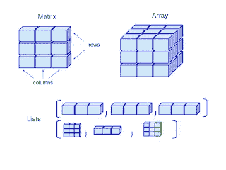](https://pluralsight.pxf.io/c/1193463/424552/7490?u=https%3A%2F%2Fwww.pluralsight.com%2Fcourses%2Fads-part1)**

**如果需要更多选择，还可以查看我的[免费数据结构与算法课程列表](https://javarevisited.blogspot.com/2018/01/top-5-free-data-structure-and-algorithm-courses-java--c-programmers.html)。**

**而且，如果你爱书胜过爱课程，这里有每个开发者都应该阅读的 10 本算法书籍。**

## ****2.5。学习设计模式****

**就像[算法](https://www.java67.com/2019/07/top-10-online-courses-to-learn-data-structure-and-algorithms-in-java.html)和[数据结构](https://dev.to/javinpaul/10-best-books-to-learn-data-structure-and-algorithms-in-java-python-c-and-c-5743)一样，学习设计模式并不是成为一名 React 开发者的必要条件，但是通过学习它，你会对自己大有裨益。**

> ***设计模式是软件开发中常见问题的屡试不爽的解决方案。***

**了解它们将有助于你找到一个经得起时间考验的解决方案。你可以读几本关于设计模式的书来学习它们，或者参加一个像 [**设计模式库**](https://pluralsight.pxf.io/c/1193463/424552/7490?u=https%3A%2F%2Fwww.pluralsight.com%2Fcourses%2Fpatterns-library) **这样的综合课程。****

**[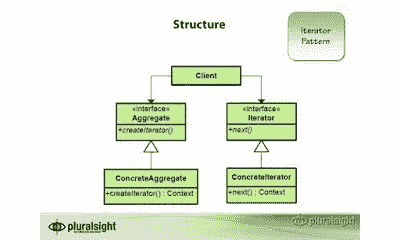](https://pluralsight.pxf.io/c/1193463/424552/7490?u=https%3A%2F%2Fwww.pluralsight.com%2Fcourses%2Fpatterns-library)**

**如果你需要更多的选择，你也可以查看[我的 OOP 和设计模式课程清单](https://javarevisited.blogspot.com/2018/08/5-object-oriented-programming-and-design-courses-for-Java-programmers.html)来获得更多的想法。**

# **3.学习反应 JS**

**现在，这是**的主要交易**。要成为一名 React 开发人员，你必须学习 React 并学好它。学习 React 最好的地方是官方网站，但作为初学者，它可能会让你有点不知所措。**

**这就是为什么我建议你参加一些课程，比如 Max 的 React 大师班或 Stephen Grider 的 React 和 Redux，以学习如何更好地做出反应。这两门是我最喜欢的 React 课程，也受到了成千上万的 web 开发人员的信任。**

**如果你对你的反应技能很认真，我强烈建议你去看看这些课程。**

*   **[**React 16-Max**](https://click.linksynergy.com/fs-bin/click?id=JVFxdTr9V80&subid=0&offerid=508237.1&type=10&tmpid=14538&RD_PARM1=https%3A%2F%2Fwww.udemy.com%2Freact-the-complete-guide-incl-redux%2F)全攻略**
*   **[**现代反应与 Redux 作者斯蒂芬·格里德**](https://click.linksynergy.com/fs-bin/click?id=JVFxdTr9V80&subid=0&offerid=508237.1&type=10&tmpid=14538&RD_PARM1=https%3A%2F%2Fwww.udemy.com%2Freact-redux%2F)**

**而且，如果你不介意从免费资源中学习，那么你也可以看看这个免费 React JS 课程列表。**

****

# **4.了解构建工具**

**如果你想成为一名专业的 React 开发人员，那么你应该花一些时间来熟悉你将作为一名 web 开发人员使用的工具，如构建工具、单元测试工具、调试工具等。**

**首先，这里是路线图中提到的一些构建工具:**

****包管理器****

*   **npm**
*   **故事**
*   **pnpm**
*   **任务执行者**
*   **npm 脚本**
*   **吞咽**
*   **网络包**
*   **卷曲**
*   **包裹**

**Btw，这些工具学不学都不重要，初学者只学 npm 和 Webpack 应该就够了。一旦您对 web 开发和 React 生态系统有了更多的了解，您就可以探索其他工具了。**

**如果你想学习 Webpack，那么 [**Webpack 2:完全开发者指南**](http://bit.ly/2QEJlB8) 是一个很好的起点。**

**[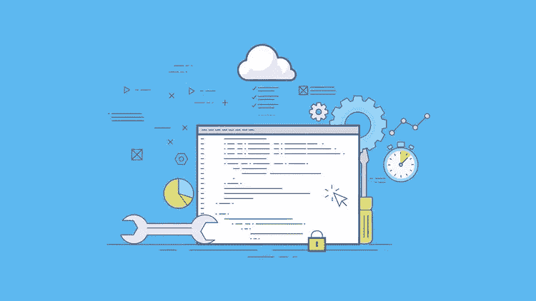](http://bit.ly/2QEJlB8)**

# **5.式样**

**如果你的目标是成为像 React developer 那样的前端开发人员，那么了解一点风格不会有什么坏处。尽管路线图提到了很多东西，如 CSS 预处理程序、CSS 框架、CSS 架构和 JS 中的 CSS。**

**我建议你至少学习 Bootstrap，这是你最终会不时用到的最重要的 CSS 框架。并且，如果你需要一门课程， [**用 5 个项目从零开始 Bootstrap 4**](http://bit.ly/2DyWtFj)是一门得心应手的课程。**

**[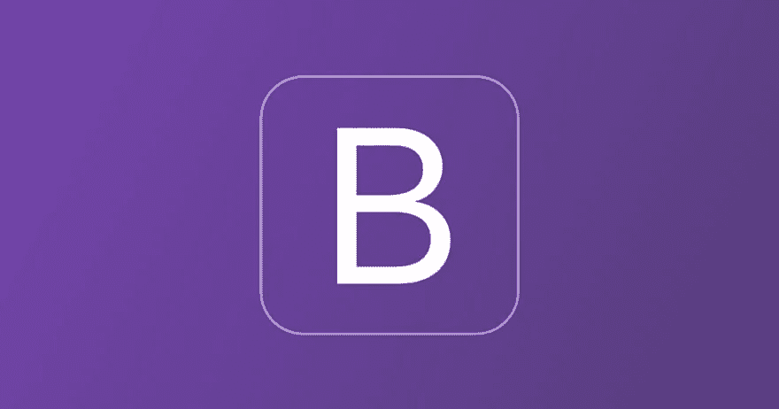](http://bit.ly/2DyWtFj)

[用 5 个项目从零开始自举 4 个](http://bit.ly/2DyWtFj)** 

**而且，如果你想[学习 bootstrap](https://www.java67.com/2019/01/5-free-bootstrap-course-to-learn-online.html) ，如果你想领先一步，还可以学习 Materialize 或者 Material UI。**

# **6.状态管理**

**这是 React 开发人员需要关注的另一个重要领域。路线图提到了需要掌握的以下概念和框架:**

*   **组件状态/上下文 API**
*   **Redux**
*   **异步操作(副作用)**
*   **Redux Thunk**
*   **Redux 最好的承诺**
*   **Redux 传奇**
*   **重复可观察**
*   **助手**
*   **复赛**
*   **重新选**
*   **数据持久性**
*   **Redux 持续**
*   **Redux 凤凰**
*   **冗余形式**
*   **MobX**

**如果这对你来说听起来太多了，我建议你只关注 Redux，它很棒，Stephen Griderto 有一个很棒的课程，可以很好地学习 Redux 框架。**

**Max 的 [**React 16-完全指南**](https://javarevisited.blogspot.com/2018/08/top-5-react-js-and-redux-courses-to-learn-online.html) 和 Stephen Grider 的[**Modern React with Redux**](https://click.linksynergy.com/fs-bin/click?id=JVFxdTr9V80&subid=0&offerid=323058.1&type=10&tmpid=14538&RD_PARM1=https%3A%2F%2Fwww.udemy.com%2Freact-redux%2F)**课程也都详细介绍了 React 和 Redux 中的状态管理。****

****[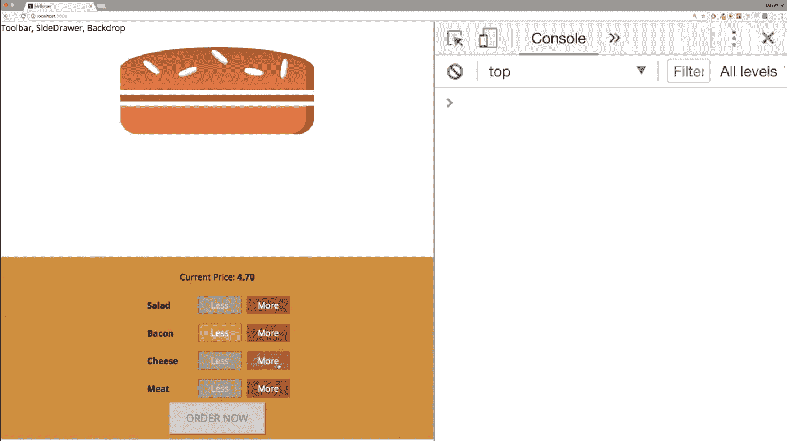](https://javarevisited.blogspot.com/2018/08/top-5-react-js-and-redux-courses-to-learn-online.html)****

# ****7.类型检查器****

****因为 JavaScript 不是一种强类型语言，所以您没有足够的编译器来捕捉那些与类型相关的错误。****

****随着应用程序的增长，你可以通过类型检查发现很多错误，特别是如果你可以使用像 Flow 或 [TypeScript](https://javarevisited.blogspot.com/2018/07/top-5-courses-to-learn-typescript.html) 这样的 JavaScript 扩展来对你的整个应用程序进行类型检查。****

****但是，即使您不使用这些，React 也有一些内置的类型检查功能，学习它们可以帮助您尽早发现错误。****

****由于 Angular 也使用 TypeScript，我认为值得学习 TypeScript 和 JavaScript，如果你也这样认为，那么你可以查看 Udemy 上的 [**终极 TypeScript**](https://javarevisited.blogspot.com/2018/07/top-5-courses-to-learn-typescript.html#axzz5QyVwWVg3) 课程。****

****[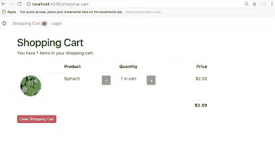](https://javarevisited.blogspot.com/2018/07/top-5-courses-to-learn-typescript.html#axzz5QyVwWVg3)****

****而且，如果你需要更多的选择，并且不介意从免费资源中学习，那么你也可以看看我为 web 开发人员提供的免费类型脚本课程列表。****

# ******8。表单助手******

****除了类型检查器，学习像 Redux Form 这样的表单帮助也很好，它提供了在 Redux 中管理表单状态的最佳方式。除了 Redux 表单，您还可以看看 Formik、Formsy 和 Final 表单。****

# ******9。路由******

****组件是 React 强大的声明式编程模型的核心，路由组件是任何应用程序的重要组成部分。****

****React Router 提供了一组导航组件，这些组件以声明方式与您的应用程序组合在一起。****

****无论您是想要为您的 web 应用程序提供可添加书签的 URL，还是想要在 React Native 中以可组合的方式导航，React Router 都可以在 React 渲染的任何地方工作。****

****除了 React-Router，你还可以看看 Router 5，Redux-First Router 和 React Router。****

****Max 的 [**React 16 —完全指南**](https://javarevisited.blogspot.com/2018/08/top-5-react-js-and-redux-courses-to-learn-online.html) 和 Stephen Grider 的**[**Modern React with Redux**](https://click.linksynergy.com/fs-bin/click?id=JVFxdTr9V80&subid=0&offerid=323058.1&type=10&tmpid=14538&RD_PARM1=https%3A%2F%2Fwww.udemy.com%2Freact-redux%2F)课程也详细介绍了 React 路由器。******

********

# ****10.API 客户端****

****在今天的世界里，你很少会构建一个孤立的 GUI，相反，你更有可能会构建一些与其他应用程序通信的东西，这些应用程序使用像 [REST](https://click.linksynergy.com/fs-bin/click?id=JVFxdTr9V80&subid=0&offerid=508237.1&type=10&tmpid=14538&RD_PARM1=https%3A%2F%2Fwww.udemy.com%2Frest-api%2F) 和 [GraphQL](https://click.linksynergy.com/fs-bin/click?id=JVFxdTr9V80&subid=0&offerid=508237.1&type=10&tmpid=14538&RD_PARM1=https%3A%2F%2Fwww.udemy.com%2Fgraphql-with-react-course%2F) 这样的 API。****

****幸运的是，React 开发人员可以使用许多 API 客户端，下面是其中的一个列表:****

## ******休息******

*   ****取得****
*   ****超级代理****
*   ****axios****

## ******图表 QL******

*   ****阿波罗****
*   ****继电器****
*   ****urql****

****Apollo Client 是我最喜欢的，它提供了一种使用 GraphQL 构建客户端应用程序的简单方法。该客户端旨在帮助您快速构建一个使用 [GraphQL](https://hackernoon.com/top-5-graphql-courses-for-beginners-26cad52bcd3e) 获取数据的 UI，并且可以用于任何 JavaScript 前端****

****Btw，如果你不知道 GraphQL 和 REST，我建议你花点时间学习它们。如果你需要课程，以下是我的建议:****

*   ****[**GraphQL 与 React:开发者完全指南**](https://click.linksynergy.com/fs-bin/click?id=JVFxdTr9V80&subid=0&offerid=508237.1&type=10&tmpid=14538&RD_PARM1=https%3A%2F%2Fwww.udemy.com%2Fgraphql-with-react-course%2F)****
*   ****[**REST API 设计、开发&管理**](https://click.linksynergy.com/fs-bin/click?id=JVFxdTr9V80&subid=0&offerid=508237.1&type=10&tmpid=14538&RD_PARM1=https%3A%2F%2Fwww.udemy.com%2Frest-api%2F)****

********

# ****11.实用程序库****

****这些是使你的工作更容易的库。React 开发人员可以使用许多实用程序库，如下所示:****

*   ****洛达什****
*   ****瞬间****
*   ****类名****
*   ****数字****
*   ****RxJS****
*   ****拉姆达****

****我不建议你学习所有这些，路线图也是如此。如果你仔细看，只有 Lodash、Moment 和 Classnames 是用黄色画出来的，说明你应该从它们开始。****

# ******12。测试******

****现在，这是 React 开发人员的重要技能之一，但经常被忽视，但如果你想在竞争中保持领先，那么你应该专注于学习[库](https://javarevisited.blogspot.com/2018/01/10-unit-testing-and-integration-tools-for-java-programmers.html)，这将帮助你进行测试。这里也有用于单元测试、集成测试和端到端测试的库。****

## ****下面是路线图中提到的库列表:
**单元测试******

*   ****玩笑****
*   ****酶****
*   ****西农****
*   ****摩卡****
*   ****柴****
*   ****自动话频警报器(automatic voice alarm)ˌ视听教具(audiovisual aids)****
*   ****磁带****

## ******端到端测试******

*   ****Selenium，网络驱动****
*   ****柏树****
*   ****操纵木偶的人****
*   ****cumber.js****
*   ****守夜人. js****

******集成测试******

*   ****因果报应****

****你可以学习你想要的库，但是推荐 Jest 和 Enzyme。 [**完整的 React Web Developer 课程(带 Redux)**](https://click.linksynergy.com/fs-bin/click?id=JVFxdTr9V80&subid=0&offerid=508237.1&type=10&tmpid=14538&RD_PARM1=https%3A%2F%2Fwww.udemy.com%2Freact-2nd-edition%2F) 还涵盖了测试 React 应用程序，包括 Jest 和 Enzyme。****

****[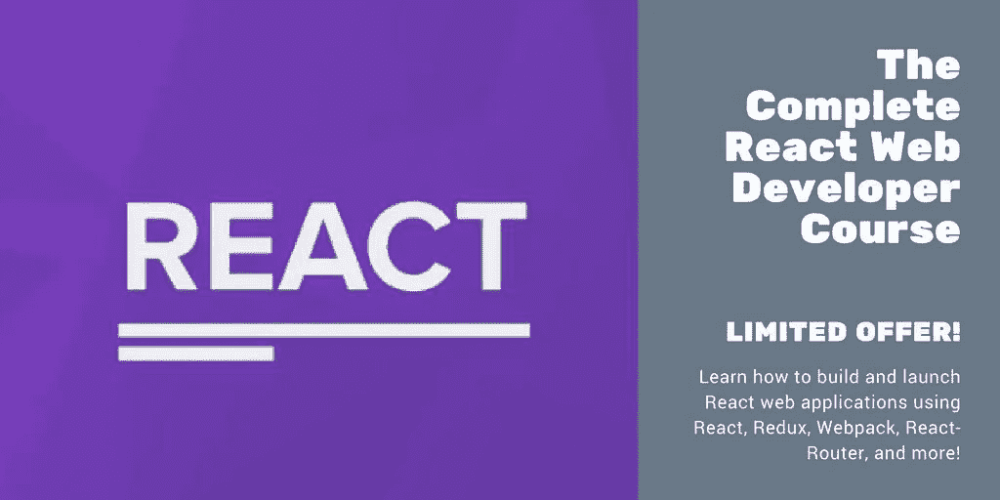](https://click.linksynergy.com/fs-bin/click?id=JVFxdTr9V80&subid=0&offerid=508237.1&type=10&tmpid=14538&RD_PARM1=https%3A%2F%2Fwww.udemy.com%2Freact-2nd-edition%2F)****

# ******13。国际化******

****这是开发全球通用的前端的另一个重要课题。您可能需要支持日本、中国、西班牙和其他欧洲国家的本地 GUI 版本。****

****路线图建议您学习以下技术，但这些技术都是需要了解的:****

*   ****国际反应****
*   ****下一步反应 i18****

****这两个库都提供了 React 组件和 API 来格式化日期、数字和字符串，包括复数和处理翻译。****

## ****14。服务器端渲染****

****你可能会想服务器端渲染和客户端渲染有什么区别，在讨论支持 React 服务器端渲染的库之前，让我们先搞清楚这一点。****

****在客户端渲染中，你的浏览器下载一个最小的 HTML 页面。然后，它呈现 JavaScript[并向其中填充内容。](https://hackernoon.com/10-of-the-most-popular-javascript-libraries-for-frontend-and-backend-development-ph1h0326n)****

****而在服务器端呈现的情况下，React 组件在服务器上呈现，输出的 HTML 内容被交付给客户机或浏览器。****

****路线图建议使用以下服务器端渲染:****

*   ****Next.js****
*   ****After.js****
*   ****流氓****

****但是，我建议学习 Next.js 就足够了，谢天谢地，Max 的[**React 16——完整指南**](https://click.linksynergy.com/fs-bin/click?id=JVFxdTr9V80&subid=0&offerid=508237.1&type=10&tmpid=14538&RD_PARM1=https%3A%2F%2Fwww.udemy.com%2Freact-the-complete-guide-incl-redux%2F) 也涵盖了 Next.js 的基础知识，应该足够好了。****

****[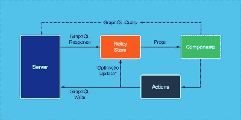](https://click.linksynergy.com/fs-bin/click?id=JVFxdTr9V80&subid=0&offerid=508237.1&type=10&tmpid=14538&RD_PARM1=https%3A%2F%2Fwww.udemy.com%2Freact-the-complete-guide-incl-redux%2F)****

# ******15。静态现场发生器******

****js 是一个现代的静态站点生成器。您可以使用 Gatsby 创建一个个性化的登录体验网站。它们将您的数据与 JavaScript 结合起来，创建格式良好的 HTML 内容。****

## ******16。后端框架集成******

****React on Rails 集成了 Rails 和脸书 React 前端框架(的服务器渲染)。它提供服务器渲染，通常用于 SEO 爬虫索引和 UX 性能，而不是由 rails/webpacker 提供。****

## ******17。手机******

****这是学习 React 可以真正受益的另一个领域，因为 [React Native](https://hackernoon.com/top-5-react-native-courses-for-mobile-application-developers-b82febdf8a46?source=user_profile---------6---------------------) 正迅速成为用 JavaScript 开发具有本机外观和感觉的移动应用程序的标准方式。****

****路线图建议您学习以下库:****

*   ****反应自然****
*   ****科尔多瓦/PhoneGap****

****但是，我认为，仅仅学习母语就足够了。****

****值得庆幸的是，也有一些学习 React Native 的好课程，如 Stephen Grider 的 [**完整的 React Native 和 Redux**](https://click.linksynergy.com/fs-bin/click?id=JVFxdTr9V80&subid=0&offerid=508237.1&type=10&tmpid=14538&RD_PARM1=https%3A%2F%2Fwww.udemy.com%2Fthe-complete-react-native-and-redux-course%2F) 课程，它将教你如何以惊人的速度构建完整的 React Native 移动应用程序！****

********

****18。桌面
也有一些基于 React 的框架来构建桌面 GUI，比如 React 原生窗口，它允许你用 React 构建原生的 UWP 和 WPF 应用。****

****该框架建议使用以下库:****

*   ****质子原生****
*   ****电子****
*   ****反应本机窗口****

****但是，它们都是为了高级探索。如果你已经掌握了 React，你可以看看它们。****

## ******19。虚拟现实******

****如果你对构建基于虚拟现实的应用感兴趣，那么你也有一些像 React 360 这样的框架，它允许你使用 React 获得令人兴奋的 360°和 VR 体验。如果你对那个领域感兴趣，可以进一步探索 React 360。****

## ****20.[全栈反应](https://gumroad.com/a/934179955)****

****如果你喜欢边看课程边看书，那么这本书是给你的。一个明智的开发人员会希望对 web 开发有一个全面的了解。为了获得这一点，你应该使用一些其他的由经验丰富的专业人员使用的学科。****

****在本书中，您将从专家那里学习全栈式反应，如[安东尼·阿科马佐](https://medium.com/u/c981f7a96bed?source=post_page-----9a8e290b8a56--------------------------------)、[内特·默里](https://medium.com/u/6538666cdb34?source=post_page-----9a8e290b8a56--------------------------------)、[阿里·勒纳](https://medium.com/u/aca4e71969df?source=post_page-----9a8e290b8a56--------------------------------)、[克莱·奥尔索普](https://medium.com/u/d28ccbf19c49?source=post_page-----9a8e290b8a56--------------------------------)、[大卫·古特曼](https://medium.com/u/786236147337?source=post_page-----9a8e290b8a56--------------------------------)和[泰勒·麦金尼斯](https://medium.com/u/c52389e3ee63?source=post_page-----9a8e290b8a56--------------------------------)。几乎没有哪本书能让你有机会在一个地方向这么多专家学习。****

****这本书拓宽了我们对多种框架和采用全栈开发方式的理解。在理解了这篇重要文章中的主题后，你将成为一个自信的开发者。所有的贡献者都是受人尊敬的作者和开发人员，对许多语言和框架都有丰富的经验****

****这里是购买这本书的链接。[全栈反应](https://gumroad.com/a/934179955)****

********

****以上是关于**完整的 React JS 路线图**。它确实非常全面，很有可能您在 2023 年的剩余时间里不会学到所有这些内容，但不要担心，所有技术在 2023 年仍然有效，您可以有效地将此路线图用作**2023 年 React 开发者路线图。******

****你可能喜欢的其他**编程文章******

****[前端和后端开发者路线图](https://javarevisited.blogspot.com/2019/08/top-5-online-training-courses-to-learn-frontend-web-development.html)
[2023 年 Java 开发者路线图](https://javarevisited.blogspot.com/2019/10/the-java-developer-roadmap.html)
[2023 年学习 Python 的 10 个理由](https://javarevisited.blogspot.com/2018/05/10-reasons-to-learn-python-programming.html)
[2023 年可以学习的 10 种编程语言](http://www.java67.com/2017/12/10-programming-languages-to-learn-in.html)
[10 个工具每个 Java 开发者都应该知道的](http://www.java67.com/2018/04/10-tools-java-developers-should-learn.html)
[学习 Java 编程语言的 10 个理由](http://javarevisited.blogspot.sg/2013/04/10-reasons-to-learn-java-programming.html)
[Java 和 Web 开发者应该学习的 10 个框架](http://javarevisited.blogspot.sg/2018/01/10-frameworks-java-and-web-developers-should-learn.html)

[2023 年要学习的 5 大 Java 框架](http://javarevisited.blogspot.sg/2018/04/top-5-java-frameworks-to-learn-in-2018_27.html)
[10 个测试库每个 Java 开发者都应该知道](https://javarevisited.blogspot.sg/2018/01/10-unit-testing-and-integration-tools-for-java-programmers.html)
[2023 年 DevOps 高级开发者路线图](https://hackernoon.com/the-2018-devops-roadmap-31588d8670cb)
[2023 年要学习 React Native 的 10 大课程](/javarevisited/top-5-react-native-courses-for-mobile-application-developers-b82febdf8a46)
[10 大免费课程学习 React Hooks 和 Context API](/javarevisited/top-10-free-courses-to-learn-react-js-c14edbd3b35f)****

# ****结束语****

****感谢您阅读本文。你可能会想，有这么多东西要学，有这么多课程要参加，但你不需要担心。****

****很有可能你已经知道了大部分内容，也有很多有用的免费资源供你使用，我也在这里和那里链接了它们以及最好的资源，它们当然不是免费的，但完全值得你花时间和金钱。****

****我是 [Udemy 课程](https://click.linksynergy.com/fs-bin/click?id=JVFxdTr9V80&offerid=323058.9409&type=3&subid=0)的特别粉丝，因为它们非常实惠，并且以很少的金额提供很多价值，但是你可以自由选择你想要的课程。****

****说到底，你应该对这里提到的事情有足够的知识和经验。****

****祝你的 React JS 之旅好运！当然**不会很容易**，但是通过遵循这个路线图和指南，你离成为 React 开发者又近了一步，这是你一直想要的****

****如果你想在每篇新文章发布时得到通知，请考虑订阅这个博客，并且不要忘记在 Twitter 上关注**[**javarevisited**](https://twitter.com/javarevisited)和在 Medium 上关注 [javinpaul](https://medium.com/u/bb36d8439904?source=post_page-----4d0a43814c02----------------------) 。******

****祝你的 React 之旅一切顺利！！****

******附言——**如果你不介意从免费资源中学习，那么你也可以查看我的[免费 React JS 课程列表](http://www.java67.com/2018/02/5-free-react-courses-for-web-developers.html)开始你的旅程。****

****<https://javarevisited.blogspot.com/2019/04/10-free-angular-and-react-courses-for.html>  

## 你可能喜欢的其他媒体文章

</javarevisited/top-10-angular-books-and-courses-for-beginners-and-experienced-web-developers-best-of-lot-9a2dae87f04c>  </javarevisited/10-courses-to-learn-angular-for-web-development-6da1bd2856dc> ****