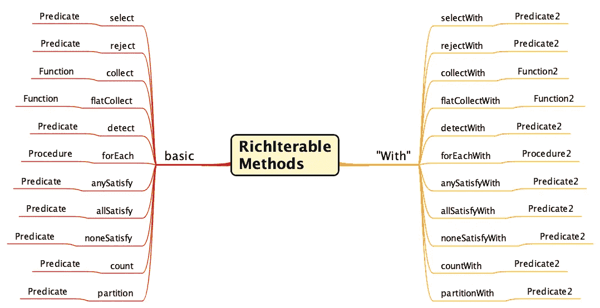

# 难以捉摸而美丽的 Java 方法参考

> 原文：<https://medium.com/javarevisited/the-elusive-and-beautiful-java-method-reference-97e566d2088b?source=collection_archive---------0----------------------->

我喜欢 Java 8 中的 lambdas，但是方法引用难以捉摸，令人惊讶


照片由[乔纳森派](https://unsplash.com/@r3dmax?utm_source=medium&utm_medium=referral)在 [Unsplash](https://unsplash.com?utm_source=medium&utm_medium=referral) 上拍摄

# Lambdas 是灵活的匿名代码

我们可以用 lambdas 解决 Java 中很多有趣的问题。对于简单的事情，我们可以使用表达式，对于更复杂的事情，我们可以使用语句。Lambdas 可以调用当前对象(`this`)或范围内对象的其他方法，如迭代的当前元素，或 lambda 之外的最终局部变量。我们总是可以通过将代码放入另一个方法来简化 lambda。

写好兰姆达斯需要自律。例如，为参数使用揭示意图的名称是很重要的。这里有一个简单的例子，使用λ来过滤`Strings`的`List`。

```
@Test
public void filterStringsLambda()
{
    var list = Lists.mutable.with(
            "Atlanta", 
            "Atlantic City", 
            "Boston", 
            "Boca Raton");

    var actual = list.stream()
            .filter(string -> string.startsWith("At"))
            .collect(Collectors.toList());

    var expected = List.of("Atlanta", "Atlantic City");

    Assertions.assertEquals(expected, actual);
}
```

在这段代码中，lambda 是以`Predicate`的形式传递给`filter`方法的参数。在这个例子中，`Predicate`接受一个类型为`String`的参数，我将其命名为`string`。分隔符(`->`)后的表达式将针对列表中的每个元素进行计算，并且只包括计算结果为`true`的元素。

在`Stream` API 中有几个方法将把`Predicate`作为参数。方法包括`filter`、`anyMatch`、`allMatch`、`noneMatch`。

这里我没有简单的方法来使用方法引用，因为我需要将参数`“At”`传递给方法`startsWith`。参数是方法引用使用的氪星石。我们可以通过使用 lambda 并将其提取到一个单独的方法中来模拟方法引用，如下所示。

```
@Test
public void filterStringsLambdaInMethod()
{
    var list = Lists.mutable.with(
            "Atlanta", 
            "Atlantic City", 
            "Boston", 
            "Boca Raton");

    var actual = list.stream()
            .filter(this.stringStartsWith("At"))
            .collect(Collectors.toList());

    var expected = List.of("Atlanta", "Atlantic City");

    Assertions.assertEquals(expected, actual);
}

private Predicate<String> stringStartsWith(String prefix)
{
    return string -> string.startsWith(prefix);
}
```

必须在一个类上创建一个方法来生成可以在范围内利用局部变量的 lambdas 并不理想。我希望能够只使用`startsWith`方法作为方法引用。

# 如何满足一个方法引用偏好？

使用 [Eclipse 集合](https://github.com/eclipse/eclipse-collections)中的`With`方法。

> 这是方法

对于 Eclipse 集合 API 中的许多可用方法，都有一个对应的带后缀`With`的方法。每个`With`方法都有一个不同的命名函数接口，该接口有两个参数(例如`Predicate2`、`Function2`等)。).下面的思维导图展示了 Eclipse Collections API 中的一些基本方法，以及它们对应的`With`等价物和它们作为参数的函数接口类型。



可丰富的 basic 和“With”方法

这些额外的方法如何帮助您使用带参数的方法引用？让我们看一些例子。

## 基本使用 Lambda

让我们看一个使用 lambda 的一个基本 Eclipse 集合方法过滤字符串列表的例子。

```
@Test
public void selectStringsLambda()
{
    var list = Lists.mutable.with(
            "Atlanta", 
            "Atlantic City", 
            "Boston", 
            "Boca Raton");

    var actual = list.select(string -> string.startsWith("At"));

    var expected = List.of("Atlanta", "Atlantic City");

    Assertions.assertEquals(expected, actual);
}
```

## `With`方法参考

现在让我们看看如何使用与`select`等价的`With`来满足我们的方法引用偏好。

```
@Test
public void selectStringsWithMethodReference()
{
    var list = Lists.mutable.with(
            "Atlanta", 
            "Atlantic City", 
            "Boston", 
            "Boca Raton");

    var actual = list.selectWith(String::startsWith, "At");

    var expected = List.of("Atlanta", "Atlantic City");

    Assertions.assertEquals(expected, actual);
}
```

> 我已经说过了

如果你没有“啊哈！”矩，不要惊慌。我们仍然不能将参数直接传递给方法引用。目前 Java 中没有支持它的语法。这里有一个诡计。

让我试着解释一下这是如何工作的。方法`selectWith`有两个参数。第一个参数是一个`Predicate2`，它将匹配`String::startsWith`的签名。更具体地说，`Predicate2<String, String>`与`String::startsWith`的签名相匹配。第二个参数`selectWith`是任何类型的参数，在本例中恰好是一个`String`。

下面是`RichIterable`上`selectWith`的确切签名。

```
<P> RichIterable<T> selectWith(
        Predicate2<? super T, ? super P> predicate, 
        P parameter);
```

在我最初发表博客后，我添加了下一部分。一个朋友建议，一个小的改进是包括一个“如何做”的例子，这样开发人员可以看到没有魔法，可以开始利用他们自己的代码。谢谢你的建议 Rustam！

# 一个`selectWith`模式实现的例子

Eclipse 集合中有一个名为`[IteratorIterate](https://github.com/eclipse/eclipse-collections/blob/master/eclipse-collections/src/main/java/org/eclipse/collections/impl/utility/internal/IteratorIterate.java)`的类。它包含了 Eclipse 集合中的许多基本的急切迭代模式，这些模式允许与 Java 中的任何`Iterable`类型一起使用。我分享这个例子是因为`Iterator`是一个足够基本的概念，大多数 Java 开发人员应该能够阅读和理解代码。下面显示了在`IteratorIterate`中`[selectWith](https://github.com/eclipse/eclipse-collections/blob/master/eclipse-collections/src/main/java/org/eclipse/collections/impl/utility/internal/IteratorIterate.java#L271)`的实现，它对于带有单个参数的方法引用是方法引用友好的。

```
public static <T, P, R extends Collection<T>> R selectWith(
        Iterator<T> iterator,
        Predicate2<? super T, ? super P> predicate,
        P injectedValue,
        R targetCollection)
{
    while (iterator.hasNext())
    {
        T item = iterator.next();
        if (predicate.accept(item, injectedValue))
        {
            targetCollection.add(item);
        }
    }
    return targetCollection;
}
```

这种模式可以用于任何可以创建`Iterator`的类型。

这里有一个使用 JDK `Set`和`IteratorIterate.selectWith`的例子。

```
@Test
public void selectWithOnIteratorIterate()
{
    Set<String> strings = Set.of(
            "Atlanta", 
            "Atlantic City", 
            "Boston", 
            "Boca Raton");

    HashSet<String> actual = IteratorIterate.selectWith(
            strings.iterator(),
            String::startsWith,
            "At",
            new HashSet<>());
    var expected = Set.of("Atlanta", "Atlantic City");
    Assertions.assertEquals(expected, actual);
}
```

我希望这个额外的部分是有帮助的。

# 更多的方法参考请！

既然我们已经知道了如何在`With`方法中使用方法引用，让我给你看更多的例子。

```
@Test
public void predicatesWithMethodReference()
{
    var list = Lists.mutable.with(
            "Atlanta", 
            "Atlantic City", 
            "Boston", 
            "Boca Raton");

    var selected1 = list.selectWith(String::startsWith, "At");

    var expected1 = List.of("Atlanta", "Atlantic City");
    Assertions.assertEquals(expected1, selected1);

    var rejected = list.rejectWith(String::startsWith, "At");

    var expected2 = List.of("Boston", "Boca Raton");
    Assertions.assertEquals(expected2, rejected);

    var selected2 = list.selectWith(String::startsWith, "Bo");

    Assertions.assertEquals(expected2, selected2);

    var detected = list.detectWith(String::endsWith, "y");

    Assertions.assertEquals("Atlantic City", detected);

    var count = list.countWith(String::contains, "c");

    Assertions.assertEquals(2, count);
    Assertions.assertTrue(
        list.anySatisfyWith(String::contains, "a"));
    Assertions.assertTrue(
        list.allSatisfyWith(String::contains, "t"));
    Assertions.assertTrue(
         list.noneSatisfyWith(String::contains, "z"));

    var partitioned = list.partitionWith(String::endsWith, "n");

    Assertions.assertEquals(expected2, partitioned.getSelected());
    Assertions.assertEquals(expected1, partitioned.getRejected());
}
```

有很多取单参数的方法可以匹配`Predicate2`、`Function2`、`Procedure2`等。作为方法引用。Eclipse 集合中的 With 方法大大增加了可以使用方法引用而不是 lambdas 的地方。

# 享受方法引用和 Lambdas

我希望这篇博客能帮助您发现 Eclipse 集合中可用的一个漂亮特性，它能帮助您找到更多使用方法引用的地方。在方法引用出现在 Java 8 之前，我们在 Eclipse 集合中就有了“`With`”方法。我们最初添加它们是为了创造更多的机会将匿名内部类提升到静态变量中，以减少垃圾生成。我们过去称这些为“fat free 闭包”,因为它们不需要你不断向堆中添加新的对象。巧合的是，这使得利用方法引用来利用这些方法变得更加容易，这是一个令人非常愉快和受欢迎的惊喜。

感谢您阅读本博客！我希望你能像我现在一样喜欢使用方法引用。

*我是*[*Eclipse Collections*](https://github.com/eclipse/eclipse-collections)*OSS 项目在*[*Eclipse Foundation*](https://projects.eclipse.org/projects/technology.collections)*的项目负责人。* [*月食收藏*](https://github.com/eclipse/eclipse-collections) *是开投* [*投稿*](https://github.com/eclipse/eclipse-collections/blob/master/CONTRIBUTING.md) *。如果你喜欢这个库，你可以在 GitHub 上让我们知道。*

## 进一步学习

[](/javarevisited/10-best-places-to-learn-java-online-for-free-ce5e713ab5b2) [## 2022 年免费在线学习 Java 的 10 个最佳地点

### 我最喜欢的免费在线学习 Java 的网站，适合初学者和想学习 Java 编码的人…

medium.com](/javarevisited/10-best-places-to-learn-java-online-for-free-ce5e713ab5b2) [](/javarevisited/the-java-programmer-roadmap-f9db163ef2c2) [## 2022 年 Java 程序员路线图

### 2022 年成为 Java 开发人员的图解指南，包含相关课程的链接

medium.com](/javarevisited/the-java-programmer-roadmap-f9db163ef2c2) [](/javarevisited/20-essential-java-libraries-and-apis-every-programmer-should-learn-5ccd41812fc7) [## 2022 年每个程序员都应该学习的 22 个基本 Java 库和 API

### 成为更好的 Java 开发人员可以学习的最基本的 Java 库。它包括用于日志记录的 Java 库…

medium.com](/javarevisited/20-essential-java-libraries-and-apis-every-programmer-should-learn-5ccd41812fc7)