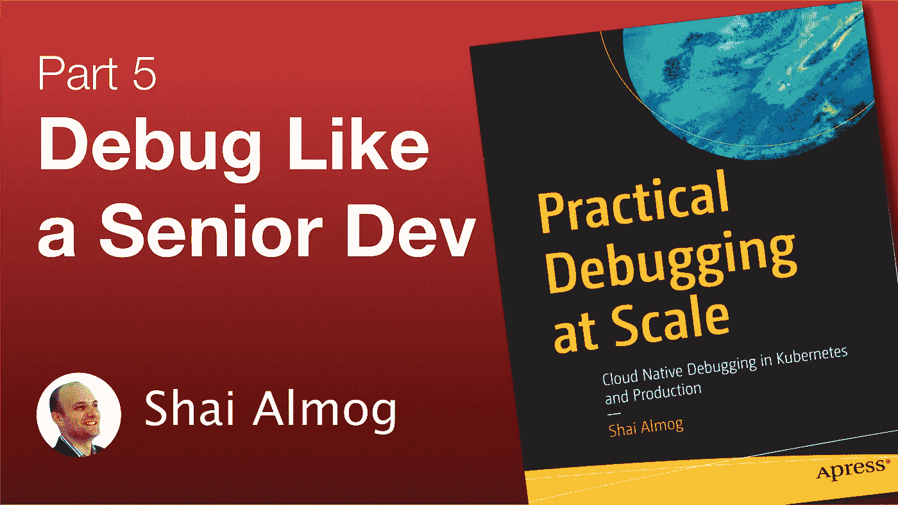

# 断点巨大的隐藏力量

> 原文：<https://medium.com/javarevisited/the-massive-hidden-power-of-breakpoints-9a40e7aaa876?source=collection_archive---------3----------------------->

这是重要的一周。我目前正在审阅我即将出版的调试书的最终草稿。这总是一个发人深省和令人兴奋的时刻。几个月的工作突然变得“真实”的时刻。

我还为 YouTube 录制了 9 个视频，使课程中的视频总数达到 29 个(还有更多的视频在制作中)。我正在开始另外两门免费课程[，其中一门是针对绝对初学者的](https://www.youtube.com/playlist?list=PL8GhfcywW9YMucwRw2IbpeCp1FBMEgsmk)。另一个是关于现代 Java 编程的，我很快就会发布。两者都将在[我的 youtube 频道](https://youtube.com/@debugagent)(强制“喜欢、订阅和分享”)免费。

在本周的帖子中，我们将讨论断点。这是一个很长的问题，因为我们所说的断点实际上只是“行断点”。正如你在下面看到的，它们还有更多。

# 副本

欢迎回到大规模调试的第四部分，我们踢屁股，取名字。[变量名！](https://javarevisited.blogspot.com/2014/10/10-java-best-practices-to-name-variables-methods-classes-packages.html)

在本节中，我们将讨论断点，断点是[调试](https://javarevisited.blogspot.com/2022/09/java-debugging-interview-questions.html)时最基本的工作单元。但是它们不仅仅是破碎。

我们在第一期中讨论了最基本的断点。这一次，我们将深入挖掘一些鲜为人知的细微差别。

# 条件断点

我们从条件断点开始。条件断点让我们定义断点命中的条件。这可以防止线程在[断点](https://javarevisited.blogspot.com/2011/07/java-debugging-tutorial-example-tips.html)处不断停止。我之前讨论过我们在之前的视频中创建的 myThread 标记对象。在这种情况下，我们只停止如果它不同于当前线程。这意味着这个断点只有在不同的线程调用它时才会命中。这是检测线程相关问题的好方法，比如[死锁](https://enlear.academy/how-to-avoid-a-deadlock-while-writing-concurrent-programs-java-example-988bb07db25f)或竞争。这个特性值得重复，因为它是如此重要的一个特性。

# 方法断点

方法断点很成问题。

作为复习，我们可以在方法中的任何一行放置一个行断点，断点将在那里停止。这是如此普遍，我们只是称之为“断点”。

我们可以用 control-F8 切换标准行断点，或者在 mac 上用`Command-F8`切换。

当我们进入一个方法时，方法断点停止。你可能觉得这没用。为什么不使用行断点？

你是对的。方法断点要慢得多，你不应该使用它们:对于这一点，有一个方法断点的用例。请注意，因为方法断点非常慢，所以它们通常由 IDE 模拟。它只是使用行断点来模拟方法断点。作为 IDE 的用户，这对于我们来说几乎是无缝的，但是我们需要了解它，因为在过去情况并非如此。你仍然可以在 StackOverflow 上找到用户抱怨方法断点太慢的消息。

要查看方法断点的用例，让我们进入管理断点窗口。假设我们想在名称以 Prime 开头的类中打破所有以字母 I 和 S 开头的方法。我们可以通过使用这样的表达式来停止所有基于模式的方法。这看起来有些牵强，但实际上非常有用。

如果你有一个抽象基类，它的子类遵循一个命名约定，并且有许多相关的方法。你想跟踪一切，你可以使用这种方法。请注意，您还可以在这里使用跟踪点，并获得非常深入的日志记录。我们将在几分钟后讨论跟踪点。

# 现场观察点

字段观察点不是典型的断点。每当字段的值发生变化或被读取时，观察点就会停止。这是一种非常酷的方法，可以捕捉某些代码使变量发生变异的情况，或者发现字段值是如何传播到代码中的。

请注意，我们可以使用此对话框调整它是在读操作、写操作时停止，还是在两者时都停止。我们还可以像处理任何其他断点一样，将观察点设置为有条件的。

它被称为观察点，而不是断点，因为它不是代码停止的地方。它止于入口点，而非场地本身。

# 断点管理

[IDEs](/javarevisited/7-best-courses-to-learn-intellij-idea-for-beginners-and-experienced-java-programmers-2e9aa9bb0c05) 为所有断点提供一个管理 UI。我们可以管理已有的断点，并在“查看断点”菜单中创建新的断点。我可以通过查看断点菜单选项打开它，也可以使用`Shift-Control-F8`组合键。请注意，在 mac 上，我们需要使用 command 而不是 control 键。

在此对话框中，我们可以禁用、删除和编辑断点。你会注意到我们这里有很多选项，我们将很快讨论。我们可以从这里添加断点。有几个有趣的选项，但现在我只添加一个简单的字段断点。

# 异常断点糟透了(或者他们有吗？)

我们可以设置一个断点，在抛出异常时停止。但是有点问题。我有两个选择。首先，我可以通过名称来捕获特定的异常。如果您事先知道将要抛出的异常，这将非常有用。但是我想不出有多少情况下会发生这种情况，而且我还不知道抛出异常的行。

更有价值的用例是捕捉所有异常。这很有用的原因是我有时在调试时可能不看控制台。异常可能会记录在那里，我可能会完全错过它们。我可能会重新启动调试会话，并且可能会错过这些异常。

但是如果一个断点突然在一个异常上停止，那就很难错过了。问题是默认情况下捕捉所有异常都是破的！不幸的是，这很难在一个简单的 prime 主应用程序中展示，所以我将演示切换到一个简单的 spring boot 应用程序。在这种情况下，应用程序的内容并不重要。让我们启用捕捉任何异常，看看会发生什么…

启用 catch 后，我试图继续，但它立即一次又一次地遇到断点。该代码在后台轮询 web 服务。该 WebService 缺少一个 HTTP 头，因此解析该头的代码在一个 [NumberFormatException](http://www.java67.com/2016/10/10-reasons-of-javalangnumberformatexception-in-java-solution.html) 上失败。我们被困在抛出该异常的代码上，这是有效的，因为在编写该代码时，Java 没有提供另一种解析数字头的方法。

那么我们能做什么呢？这实际上使得停止任何异常对于几乎任何真实世界的应用程序都是无用的。

让我们将窗口移动一点，然后放大，看看我们在这里做什么。

现在我们可以定义一个类过滤器。注意，我在两个过滤器前面都加了一个减号，这样就变成了一个排除过滤器。在这里，我为所有 java 包和所有 sun 包定义了一个过滤器。这意味着在这些包中处理的每个异常都不会中断。

一旦我按下“确定”,我就可以按下“继续”,应用程序就可以运行，不会因为有问题的异常而中断。其他[异常](https://javarevisited.blogspot.com/2016/09/javasqlsqlexception-no-suitable-driver-mysql-jdbc-localhost.html)将照常工作，并在我们的代码出现问题时通知我们！

令人惊讶的是，这不是 IDE 的默认设置。没有它，这个特性实际上是没有用的。

# 跟踪点(又名登录点)

跟踪点或日志点是我们拥有的一些最重要的断点类型。我们可以通过按住 shift 键单击檐槽来添加跟踪点。这将打开一个熟悉的断点对话框，但看起来有点不同。首先注意这个

suspend 选项是未选中的，注意我们可以通过取消选中 suspend 复选框将任何断点转换为跟踪点。默认情况下，断点会中断。它会停止当前线程并挂起它，这样我们就可以从容地检查应用程序堆栈，看看发生了什么。跟踪点不会挂起当前线程。应用程序命中断点，然后继续运行而不停止。这是相当开创性的，你如何跨越？

你不知道。相反，我们可以做其他几件事…

每当我们遇到断点时，我们可以记录“断点命中”这个词，但这并没有多大帮助，除非我们只有一个跟踪点，并且只想知道我们是否到达了那个点。我们可以在每次到达跟踪点时打印一个堆栈跟踪，这确实更有用。但差不了多少。很难在一个列表中阅读大量的跟踪并跟踪。我想关注的是别的。

请注意，evaluate 和 log 中已经有了`cnt`值，因为我在按住 shift 键单击边框之前已经在 IDE 中选择了`cnt`值。

我们可以在这里写任何我们想打印的表达式。我可以调用一个方法写描述性的字符串等等。这实际上是一个标准的日志语句，我可以动态地添加到代码中。注意，我仍然可以像任何条件断点一样，使这个跟踪点有条件。这意味着我可以在这个时间点打印任何值。就像其他伐木工一样。这是一个惊人的特征。想象一下我们之前讨论的方法断点，我们可以立即大规模地记录。让我们按 OK

然后运行这个程序，我们可以看到我们在 tracepoint 中添加的日志打印到控制台上，就像我们在代码中写的一样！

# 分组和命名

一旦我们扩大调试规模，分组和命名就变得至关重要。

我们可以使用描述来命名一个断点，以表明它的语义。当我们处理许多断点时，这是非常有用的。我们还可以根据文件、包等对它们进行分组。但是最酷的是我们可以为断点创建自定义组，并且只需一次切换就可以禁用组中的断点。那太方便了！当我们试图进入一个状态时，它让我们免于繁琐的按 continue 键，并让我们管理许多断点。

但这里的真正价值在于规模。假设您有一个复杂的调试会话，多个跟踪点同时运行。您可以将会话分组并禁用断点，同时切换到不同的分支来调试其他内容。完事后回到你在的地方。

# 禁用断点

有时一个断点不断被命中，我们只需要一个特定的堆栈

我们可以禁用一个断点，直到遇到一个不同的断点或异常，此时断点将自动启用。如果我们只想测试一个特定的路径，这可以省去我们一直按 continue 的麻烦。这也适用于异常和异常断点，我们可以决定之后的行为。我们是要再次禁用还是照常继续？

这对于仅通过特定途径的故障非常有用。我可以给第一个方法添加一个跟踪点。然后在那个跟踪点中禁用我想要的实际断点。

# 实例过滤器

实例过滤器让我们只接受来自特定对象实例的断点

注意观察器中标记为“this”的当前对象的实例。请注意，它有一个 at 符号，后面是数字 656。这是 Java 对象 ID，相当于其他编程语言中的指针。在实例过滤器中，我们可以限制断点，使其只命中特定的对象。

假设该行断点被多个实例多次命中，但我只关心来自特定对象实例的结果，并希望过滤掉所有干扰。我可以通过点击这里打开高级细节对话框。

我需要检查实例过滤器选项，然后键入我要过滤的实例的对象 ID。这意味着对于其他实例类型，断点不会停止。要应用此更改，我按完成。

此时，我们可以看到实例过滤器仍然停在预期的断点处…

因此，下一步是将实例过滤器更改为不同的对象实例。我在编一个数字，因为这只是一个测试。请注意，当我右键单击断点时，我会得到该对话框的自定义版本，因为我们有一个实例过滤器。这是一个非常好的特性，它使得用户界面更容易使用。

现在我们已经做了更改，断点不再中断。

# 类别过滤器

类过滤器对于典型的行断点没有意义。当使用字段观察点或异常断点时，类过滤器是有意义的。在这种情况下，我有一个公共字段。我过滤了对字段的访问，忽略了来自 prime main 类的所有访问。如果不同的类访问该字段，断点将会命中。这非常有用，否则我可能会在当前类的观察点上得到很多点击。但我想看看其他案例。

# 呼叫者过滤器

调用者过滤器基于调用方法的签名实现过滤器。要使用它，我们需要再次进入高级菜单。它支持通配符，所以我可以限制调用者只允许 run 方法。注意，它使用 JVM 符号作为方法签名，这是一个非常复杂的主题，我将在后面讨论。在我的调试手册中有一节涉及到了这一点。正如我们在这里看到的，run 方法确实在堆栈跟踪中，所以该方法一直在断点处停止。因此过滤器正确地应用并命中断点。

我们可以在过滤器的快速编辑 UI 中再次自定义断点。在这种情况下，我更改过滤器来查找名为 stop 的方法，该方法并不存在，实际上断点不再中断。

# 一锤定音

这是一个很长的视频，我希望你觉得它是有教育意义和全面的。在下一个视频中，我们将讨论如何调试流和集合。如果您有任何问题，请使用评论部分。谢谢大家！