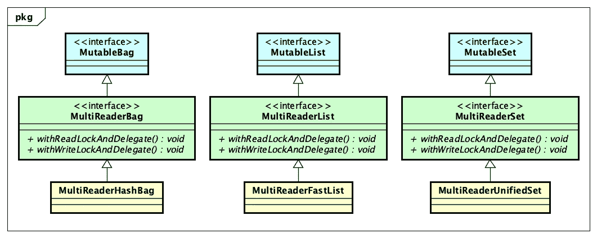
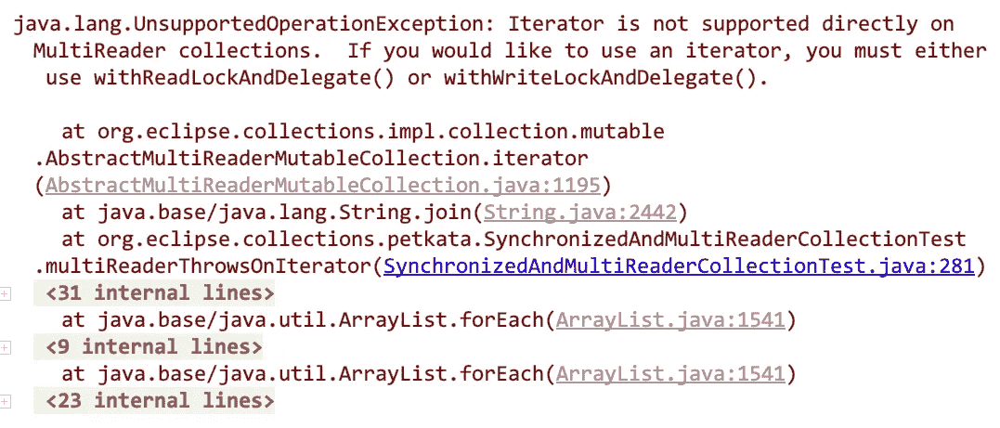
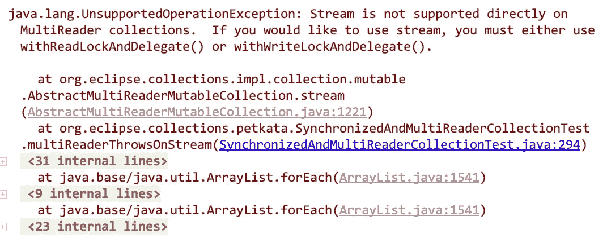

# 没有人告诉过你的缺失的 Java 数据结构—第 2 部分

> 原文：<https://medium.com/javarevisited/the-missing-java-data-structures-no-one-ever-told-you-about-part-2-f484a588cce3?source=collection_archive---------1----------------------->

在 [Eclipse 集合](https://github.com/eclipse/eclipse-collections)中的多读取器集合实现。

凯文·布茨在 [Unsplash](https://unsplash.com?utm_source=medium&utm_medium=referral) 上的照片

# 实践中的 Java 并发

每个 Java 开发人员都应该阅读 Brian Goetz 等人的《[Java Concurrency in Practice](https://jcip.net/)》(又名 JCIP)。艾尔。JCIP 是我最喜欢的 Java 书籍之一。如果我在学习或回忆 Java 中的并发概念或问题时需要一些帮助，我会立即参考这本书。我最近打开了这本书，阅读第 83-84 页的同步集合和“隐藏迭代器”。

当我在 [Eclipse 集合](https://github.com/eclipse/eclipse-collections)中解释`MultiReader`集合的存在、目的和好处时，“隐藏迭代器”将是我在这篇博客中进一步讨论的内容。

注意:JCIP 于 2006 年发布，比 Java 8 和 lambdas、Streams 一起发布早了 8 年。

# 对同步包装器的不满

JDK 中有一些包装类，提供对集合的同步访问，比如`List`、`Set`和`Map`。创建这些包装器的方法可以在`Collections`类中找到。

在 JDK 中创建同步集合包装

同步包装类是“有条件线程安全的”。这意味着无论何时使用外部迭代器对集合进行迭代，开发人员都需要手动对集合进行`synchronize`。

SynchronizedList 的条件线程安全示例

在所有可以使用同步集合的地方手动操作`synchronize`是非常具有挑战性的，尤其是在将集合传递给库代码的时候。在 JDK、第三方库代码和应用程序代码中到处都有“隐藏的迭代器”。在 2006 年 JCIP 的书中描述的“隐藏迭代器”包括像`hashCode`、`equals`、`removeAll`、`retainAll`和`containsAll`这样的方法。自从 Java 8 发布以来，这个列表一直在增长。

## Java 8 之后的同步包装器

照片由 [Redd](https://unsplash.com/@reddalec?utm_source=medium&utm_medium=referral) 在 [Unsplash](https://unsplash.com?utm_source=medium&utm_medium=referral) 上拍摄

当 Java 8 发布时，引入了一组新的“隐藏迭代器”,但没有明确记录在`Collections`类 Javadoc 中。Javadoc 已经更新，并且从 Java 9 开始明确提到了它们。

## Java 8 Javadoc for[synchronized list](https://docs.oracle.com/javase/8/docs/api/java/util/Collections.html#synchronizedList-java.util.List-):

> 迭代时，用户必须手动同步返回的列表

## Java 9 Javadoc for[synchronized list](https://docs.oracle.com/javase/9/docs/api/java/util/Collections.html#synchronizedList-java.util.List-):

> 当用户通过`Iterator`、`Spliterator`或`Stream`遍历返回的列表时，必须手动同步

任何时候开发者从一个同步的集合中创建一个`Stream`或`Spliterator`时，他们应该首先获取一个显式锁，否则他们可能会遇到一个`ConcurrentModificationException`。

带同步列表的安全流使用示例

# 更人性化的同步包装器

Eclipse 集合为库中提供的所有可变集合提供了同步包装器。Eclipse 集合中的每个可变集合都可以通过调用方法`asSynchronized`来返回该类型的同步等价物。

在 Eclipse 集合中创建空的同步集合包装器

Eclipse 集合中的同步包装器与 JDK 中的同步包装器具有相同的基本问题。在没有对对象进行显式锁定的情况下，使用`iterator`、`spliterator`、`stream`、`parallelStream`仍然是不安全的。Eclipse 集合同步包装器有一些显著的区别。

## 通过丰富的 API 提供更安全的迭代机会

Eclipse 集合同步包装器(例如`[SynchronizedMutableList](https://www.eclipse.org/collections/javadoc/10.4.0/org/eclipse/collections/impl/list/mutable/SynchronizedMutableList.html)`)上有许多方法，这些方法在方法内部加锁，并为开发人员执行不同的功能。这是一个丰富的、人性化的 API 设计在提高开发人员生产力和线程安全方面胜过最小 API 设计的例子。

[Tetiana SHYSHKINA](https://unsplash.com/@shyshkina?utm_source=medium&utm_medium=referral) 在 [Unsplash](https://unsplash.com?utm_source=medium&utm_medium=referral) 上拍摄的照片

同步包装器可以安全地执行大多数可用的方法。我想也许对于`asLazy`和`asParallel`会有例外。我惊讶地发现，`SynchronizedMutableList`上的`asParallel`方法返回一个`[SynchronizedParallelListIterable](https://www.eclipse.org/collections/javadoc/10.4.0/org/eclipse/collections/impl/lazy/parallel/list/SynchronizedParallelListIterable.html)`。我仍然建议对你写的任何多线程代码进行实战测试，不要假设事情是“安全的”。

## 陌生的危险

即使在像`SyncrhonizedMutableList`这样的类上使用了所有线程安全的方法，我仍然谨慎地使用同步包装器。我不相信方法`iterator`、`spliterator`、`stream`和`parallelStream`会在某个很难找到的代码路径中被悄悄调用，并且在遇到可怕的`ConcurrentModificationException`之前不会被发现。这就是为什么我们没有停留在仅仅在 Eclipse 集合中提供一个更高效的同步包装器。我想要一个更强的线程安全保证。

# 是时候来点不同的了

这些年来，我已经多次向不同的 Java 开发人员解释了同步集合和“条件线程安全”带来的挑战。当 Java 开发人员告诉我他们不熟悉如何安全地使用同步集合中的`iterator`时，我不再感到惊讶。

大约在 2007 年的某个时候，我决定看看是否有一种方法可以构建一个类似于同步集合但可以安全地用于迭代器的包装器，这样我就可以摆脱向 Java 开发人员阅读规范的工作了。

## 我失败了……非常失败……而且一次又一次。

在没有找到任何方法通过创建线程安全迭代器来保护开发人员不必阅读规范之后，我决定是时候尝试一些不同的东西了。

> “唯一的制胜之道就是不玩。”
> 
> -WOPR，战争游戏

照片由[杰米街](https://unsplash.com/@jamie452?utm_source=medium&utm_medium=referral)上传于 [Unsplash](https://unsplash.com?utm_source=medium&utm_medium=referral)

## “路被堵死了。”— LOTR，王者归来

我认为唯一安全的解决方案是创建快速失败的包装类，并在`iterator`、`spliterator`、`stream`和`parallelStream`方法上抛出一个`UnsupportedOperationException`。抛出后，`UnsupportedOperationException`解释了开发人员如何通过集合包装器本身的方法使用显式锁来解决这个问题。规范将在运行时立即显示给开发人员，而不会让他们困惑为什么在处理多线程时会得到`ConcurrentModificationException`。在包装类上调用`iterator`、`spliterator`、`stream`和`parallelStream`时，无论执行的代码是单线程还是多线程，都会立即失败。

# 输入多读者收藏

MultiReaderBag/List/Set 接口及其实现

Eclipse Collections 有三个用于多阅读器集合的接口:`MultiReaderBag`、`MultiReaderList`、`MultiReaderSet`。对应的实现有`MultiReaderHashBag`、`MultiReaderFastList`和`MultiReaderHashSet`。在`Lists`、`Sets`和`Bags`工厂类中有`multiReader`工厂，如下所示。

创建多读者收藏

多读取器集合使用一个`ReentrantReadWriteLock`并允许在一个集合上获得读锁和写锁。多个读取器可以同时获得锁，获得锁的单个写入器将阻塞所有其他读取器和写入器。

所以锁定语义确定后，我必须弄清楚如何处理客户端锁定，并允许安全使用外部迭代器，如`iterator`和`stream`，以及隐藏迭代器，如`equals`、`hashCode`、`addAll`、`removeAll`、`retainAll`和`containsAll`。

## 双重锁定机制

每个 MultiReader 集合有两个方法:`withReadLockAndDelegate`和`withWriteLockAndDelegate`。两种方法都将名为`Procedure`的`FunctionalInterface`作为参数。`Procedure`接收一个参数，它是后备集合的类型。下面是一些使用`equals`和`stream`读锁和`iterator.remove()`写锁的例子。

多读者列表示例

## 失败得狠，失败得快

以下代码显示了当您尝试将`iterator`与`MultiReaderList`一起使用时会发生什么，无论代码是单线程还是多线程。

MultiReaderList 在迭代器示例中引发

这是在`MultiReaderList`上调用`iterator`时失败的样子。

由于在 String.join()中调用迭代器，引发了 UnspportedOperationException

如果你也使用`stream`，这段代码将会失败。

MultiReaderList 在流示例中引发

在`MultiReaderList`上调用`stream`会抛出一个类似的`UnsupportedOperationException`。

由于调用流而导致 UnsupportedOperationException

这两个例子都可以使用`withReadLockAndDelegate`来实现。

对 stream 使用 withReadLockAndDelegate 的 MultiReaderList

在这种特殊情况下，有一种更好、更安全的替代方法，使用直接在`MultiReaderList`上可用的`makeString`方法，它在方法中使用一个读锁。

带有 makeString 的 MultiReaderList

## 一个重要的教训，几乎被遗忘

当我们在 Eclipse 集合中设计和构建惰性和并行迭代抽象时，我们已经实现了 MultiReader 集合。这是在 Java 8 和 Java Streams 出现之前。对于多读取器集合，我们不能使用`iterator`来实现任何`Lazy`或`ParallelIterable`类。我们必须实现并测试我们的抽象，以确保它们不依赖于`iterator`。这导致了框架中一个非常重要的设计早期决策，这个决策一直延续到今天，并成为 Eclipse 集合开发文化的一部分。

> 比起外部迭代器，更喜欢内部迭代器

正是因为这个重要的教训和设计决策，下面的代码对`asLazy`和`asParallel`两种情况都适用，不需要客户端锁定。方法`iterator`永远不会被调用。被调用的内部迭代器自己获取锁。

在多读者列表中使用 asLazy 和 asParallel

当开发人员使用 Java 流时，他们可能认为他们在支持`Stream`的集合上使用了内部迭代器。他们不是。他们使用外部迭代器，如`spliterator`或`iterator`。当处理同步集合时，外部迭代器需要客户端锁定。

# 一些最终想法和额外的代码示例

我以前从未写过关于多阅读器集合的文章。我唯一能找到的关于多阅读器集合的文章是在公司 Kata 的[结尾。我很感激我开始了这个博客系列。我正在分享我 14 年前学到的经验，当时我第一次试图解决同步集合中条件线程安全的挑战。我希望分享这些例子和教训是有帮助的。](https://github.com/eclipse/eclipse-collections-kata/blob/master/docs/company-kata/slides.md#thread-safe-collections)

我现在计划在 Eclipse Collections kata repo 中创建一个专门用于多阅读器集合的代码 kata，以便为后代保留多阅读器集合的经验。

现在，请欣赏以下要点中一些更复杂的多线程代码示例！

*我是*[*Eclipse Collections*](https://github.com/eclipse/eclipse-collections)*OSS 项目在*[*Eclipse Foundation*](https://projects.eclipse.org/projects/technology.collections)*的项目负责人。* [*月食收藏*](https://github.com/eclipse/eclipse-collections) *是开投* [*投稿*](https://github.com/eclipse/eclipse-collections/blob/master/CONTRIBUTING.md) *。如果你喜欢这个库，你可以在 GitHub 上让我们知道。*

其他 **Java 编程文章**你可能喜欢的:
[Java 程序员应该学会的 10 件事](/javarevisited/9-things-java-programmers-should-learn-in-2018-3f0b2207dfc4)
[完整的 Java 开发者路线图](https://javarevisited.blogspot.com/2019/10/the-java-developer-roadmap.html)
[我最喜欢的初学者免费编程课程](/javarevisited/top-10-free-interactive-programming-courses-from-educative-for-beginners-to-learn-in-2021-713cbf96d4eb)
[10 门免费数据结构与算法课程](/javarevisited/10-free-data-science-online-courses-for-beginners-a5fe78c2cb7b)
[7 门最适合初学者的数据结构与算法课程](/javarevisited/7-best-courses-to-learn-data-structure-and-algorithms-d5379ae2588)
[50+数据结构与算法面试问题【T47](/hackernoon/50-data-structure-and-algorithms-interview-questions-for-programmers-b4b1ac61f5b0)