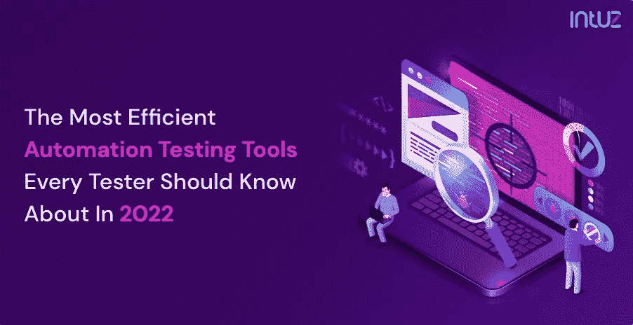
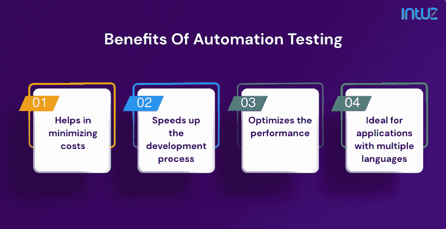
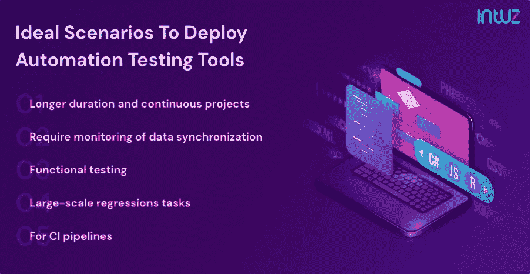
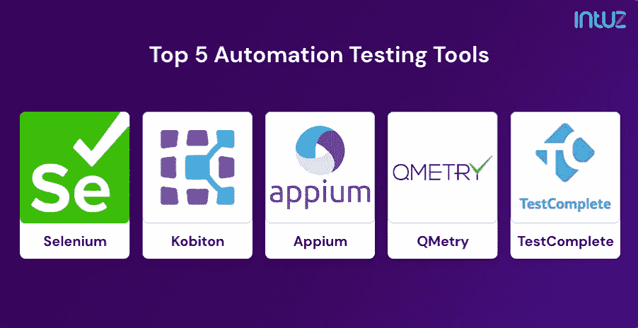

# 2022 年每个测试人员都应该知道的最有效的自动化测试工具

> 原文：<https://medium.com/javarevisited/the-most-efficient-automation-testing-tools-every-tester-should-know-about-in-2022-989ae77b80b9?source=collection_archive---------2----------------------->

软件测试员是一种逐渐变得过时的工作模式。或者，我们应该说它正在演变成一个更小众的角色？

这是我们从单一的软件开发周期和过程转向更精细的软件开发周期和过程的时候了。我们部署 DevOps 和 agile 等方法来确保持续快速的产品开发。这也需要一致的测试。

在这种情况下，手动测试软件应用程序的缺陷和性能没有任何意义。这就是为什么企业越来越喜欢自动化测试策略和实践。

所以，如果你想在软件测试过程中节省时间，部署更高效的系统，这篇文章会给你一个清晰的思路。让我们了解什么是自动化测试工具，并看看一些最流行的自动化测试工具。

# 什么是自动化测试工具？

当软件测试人员由于一遍又一遍地测试手动输入字段而开始经历疲劳时，自动化测试出现了。这种倦怠导致他们错过了几个关键的错误、漏洞，以及他们正在测试的应用程序的其他方面。

有了自动化测试工具，测试人员就拥有了智能高效的框架和平台来自动化大量的测试过程，并极大地减少了人工干预。基于脚本和条件，自动化测试工具执行评估软件应用程序的质量和性能的特定任务，并让测试人员手动将结果与预期结果进行比较，以验证和预测整体应用程序效率。

自动化测试为测试人员和专业人员铺平了道路，使他们不得不重复执行的一些最冗余的测试自动化，并为涉及关键测试用例方面和工作流的任务实现相同的测试。对于外行来说，超过 80%的企业已经在他们的工作流程中部署了自动化测试协议。

# 自动化测试的好处

*   自动化测试极大地有助于降低成本。对于按小时计费的人才，报告显示，它可以将时薪降低[高达 75%](https://docplayer.net/20448512-Table-of-contents-automated-testing-roi-fact-or-fiction-a-customer-s-perspective-what-real-qa-organizations-have-found.html) 。
*   它加快了软件开发过程，并确保产品按时开发。最适合上市时间有限的项目。
*   它优化了应用程序的性能，因为它涵盖了广泛的测试条件和漏洞。
*   对于涉及多种语言的应用程序，自动化测试是理想的。

# **部署自动化测试工具的理想场景**

既然我们知道自动化测试工具是省时的，那么让我们来理解什么时候好好利用它们。为此部署这样的工具可能会适得其反，导致测试阶段延长和结果不正确。因此，理想情况下，您可以使用自动化测试工具来:

*   预计将持续更长时间并需要持续开发和演进的项目
*   需要监控应用程序和远程服务器之间的数据同步的日常任务
*   功能测试，对开发中的应用程序的最基本的功能进行性能测试
*   对于 CI 管道，重复测试是不可避免的，以确保新的提交不会对现有产品性能产生负面影响
*   大规模回归任务

# 五大自动化测试工具

## 硒

Selenium 可能是最流行和最[广泛使用的自动化测试工具](https://www.intuz.com/best-automation-testing-tools)。它是开源的，可以跨不同的操作系统和浏览器工作。对于基于 web 浏览器的应用程序来说，Selenium 更为理想，它得到了 SaaS 一些主要市场参与者的支持，如 SauceLabs 和 BrowserStack，用于自动化测试。有了 Selenium，测试人员可以用不同的编程语言编写脚本，比如 Ruby、Python、PHP、Java 等等。

此外，该工具支持使用足够的知识编写复杂和高级的脚本和测试，使其可扩展用于具有复杂和特殊工作流的企业级应用程序。它还支持跨多个环境和平台的分发。

## 科比顿

Kobiton 脱颖而出，成为最先进入移动领域的自动化测试工具之一。是的，除了使用 web 浏览器和桌面应用程序来测试软件，用户现在还可以从便携式设备上执行自动化测试。

这并不是科比顿唯一吸引人的地方。它支持测试的无脚本执行，也就是说，你不需要知道在 Kobiton 上配置和执行测试的编码。它由人工智能提供支持，支持多种测试类型，如移动和物联网应用的性能、视觉、功能和兼容性。

此外，它也是开源的，任何人都可以使用它。其他一些功能包括人工智能驱动的补救，崩溃检测，详细报告，UX 测试等等。

## Appium

Appium 是专门为测试移动应用而设计的。它与 Kobiton 不同，在 kobi ton 中，测试可以从手机和便携式设备上执行。

这个开源平台支持在服务器架构上测试本地、混合和移动 web 应用程序。与 Appium 相关的学习和技术曲线很少，使初学者和专业人士更容易掌握。此外，Appium 还因提供稳定的结果和效率而广受欢迎。

Appium 的好处在于，它甚至将测试兼容性扩展到了 Android 2.3 设备。有了使用首选编程语言的自由，测试人员可以无缝地编写和执行特定的测试。

此外，它还可以与 UIAutomator 库集成，ui automator 库是 Android 软件开发工具包的一部分，用于提供有见地的报告。这是移动应用领域中一个快速发展的自动化工具。

## 测量

QAS 或 QMetry Automation Studio 构建在 Eclipse IDE 和我们上面讨论过的两个最流行的自动化测试框架——app ium 和 Selenium 之上。之所以称之为 studio，是因为它允许测试所有类型的应用程序——跨多个平台、浏览器和操作系统的移动、web 和桌面应用程序。

它通过让用户更容易地在平台上建立他们的项目，在易用性因素上得分。他们可以根据他们工作的平台或编程语言来定义他们项目的结构，并简单地在其上运行测试。此外，在为未来的项目或其他用例编写脚本之后，您还可以重用或共享您的测试资产。这消除了您为每个会话不断地提出新的测试资产和案例的需要。

此外，它支持所有测试的并行执行，并提供自我修复模式来自动修复测试用例。无论项目的范围、类型和规模如何，这个全面的自动化测试工具都是您项目的理想选择。

## 测试完成

TestComplete 是一个自动化测试工具，专门用于测试图形用户界面或 GUI。它由人工智能提供支持，允许无脚本测试和对象检测，以实现无缝的灵活性和测试。

您可以部署 TestComplete 来测试移动设备、桌面和 web 浏览器的应用程序。该工具还显示出与其他工具难以置信的兼容性，比如吉拉、Git、Jenkins、Azure DevOps 等等。

如果您的项目很复杂，并且达到了企业应用程序的规模，TestComplete 是您的理想伴侣，因为它无缝集成并处理 Salesforce、Oracle EBS、SAP 等应用程序。与 QMetry 类似，它也可以在系统上本地运行并行测试。拥有超过 1，500 个真实世界的测试环境，您可以通过 TestComplete 获得端到端的软件测试自动化工具。

# 你喜欢什么？

因此，这些是您可以为即将到来的一年或项目部署的 5 大自动化测试工具。根据您的需求和项目范围，选择一个理想的。此外，不要忘记这个列表并不详尽，因为市场上还有其他几种同样强大的自动化测试工具。如果你以前和他们一起工作过，请在评论中分享你的想法。