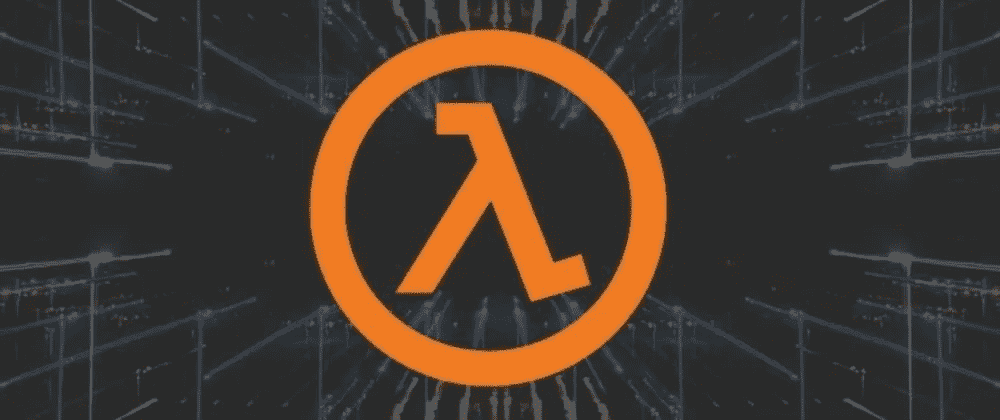

# Java lambda 表达式的威力

> 原文：<https://medium.com/javarevisited/the-power-of-java-lambda-expressions-eb3a8b9ae5f8?source=collection_archive---------2----------------------->

## 尽可能使用 lambdas

在这个故事中，我将展示 Java lambda 表达式有多强大。在大多数情况下，您只需一行代码就可以完成您的工作！让我们假设你有下一个任务要做:

> 您会得到一个由数字和小写英文字母组成的字符串`word`。
> 
> 您将用空格替换每个非数字字符。比如`"a123bc34d8ef34"`会变成`" 123 34 8 34"`。注意，剩下的一些整数至少被一个空格分隔开:`"123"`、`"34"`、`"8"`和`"34"`。
> 
> 对 `word`执行替换操作后，返回***不同整数的个数。***
> 
> **如果两个整数的十进制表示**没有任何前导零**不同，则认为这两个整数不同。**

**下面是解决方案，解释就在 Java 代码下面:**

**强大的 Java lambdas**

**编程只是把对象从一种状态放到另一种状态。下面是如何使用一行代码，通过一些转换，就可以得到一个解决方案:**

1.  **`word.replaceAll("[a-z]+", " ")` -我们用空格替换所有连续的字母。所以我们用空格分隔数字。replaceAll()只返回一个字符串。**
2.  **`word.replaceAll("[a-z]+", " ").split(" ")` -我们将数字拆分成一个数字数组(作为字符串数组)。如果我们在字符串`word.replaceAll("[a-z]+", " ")`的开头或结尾留有空间，那么第一个和最后一个元素可以是空字符串**
3.  **`Arrays.stream(word.replaceAll("[a-z]+", " ").split(" "))` -将数组转换成元素流**
4.  **`.filter(s -> !"".equals(s))` -删除字符串流开头或结尾可能的空字符串**
5.  **`.map(s -> s.replaceFirst("^0+", ""))` -将数字(作为字符串)转换为不带前导零的字符串。这就是告诉 regex `^0+`的内容。我们只删除第一次出现的内容，因为字符串只有一个开头:-)。replaceAll()也可以。**
6.  **`.collect(Collectors.toSet())` -从字符串流制作集合。因为设置了重复项，所以会消除重复项**
7.  **`.size()` -集合的大小是不同数字的个数**

**我们没有使用 Long.parseLong()或 Integer.parseInt()，因为一个数的位数可能很大，我们会有例外。因此，我们使用了一组字符串。**

****都是乡亲们！如果你喜欢这个故事，请跟我来。****