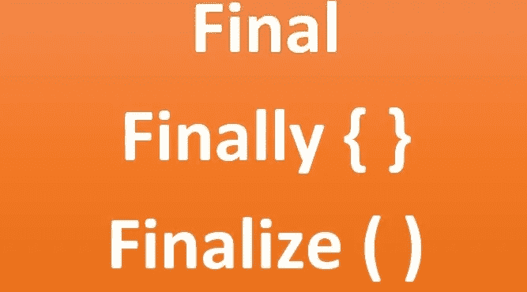

# Java 中的三个 F

> 原文：<https://medium.com/javarevisited/three-f-s-in-java-eb7edc8a0627?source=collection_archive---------8----------------------->

[](https://javarevisited.blogspot.com/2012/11/difference-between-final-finally-and-finalize-java.html#axzz5WKm9BB8F)

java 中三个重要的 Fs 是 final，finally & finalize。知道什么时候使用它们、它们做什么非常重要，从面试的角度来看，知道这些也很好。

1.  **最终关键字:**

它是 java 中的保留关键字，意思是不能用作标识符。所以让我们看看如何使用它-

*a) final 变量:*当我们用 final 声明一个变量时，它的值不能被修改，即常量。这意味着我们必须初始化最终变量一次(*只有一次*)，可能是在声明期间或者之后。

```
*// a final variable - direct initialization*
final int VALUE = 5;*// a final static variable - direct initialization*
static final double PI = 3.141592653589793;*// a blank final variable - initialized later*
final int VALUE;
VALUE=10;
```

如果任何对象引用变量被声明为 final，那么这意味着 final 引用变量在其整个生命周期中永远不能引用不同的对象，但是对象(引用变量所引用的对象)中的数据可以被修改。

```
public class Test
{ 
  ----------
  ----------
  public static void main(String[] args) 
  {
    final Test test = new Test();
    test.setName("Jaydeep");
    *//this is allowed, as we are only changing content of object*
    test.setName("Rishi");

    Test test_new = new Test();
    *//not allowed as test object is final and 
    //can't refer to different object*
    test = test_new(); } }
```

*b) final 类:*当你声明一个类为 final 时，这意味着没有其他类(在相同或不同的包中)可以扩展这个类(final 类)，换句话说，final 类永远不能被子类化。所有包装类，如整数、浮点等。是最后一门课。我们不能延长他们。

final with classes 的另一个用途是创建不可变的类，比如预定义的 tring 类。如果不使一个类成为 final，就不能使它成为不可变的。

*c) final 方法:*当我们将任何方法声明为 final 时，它都可以被覆盖。使一个方法成为 final 的主要意图是方法的内容不应该被子类改变。java.lang.Object 类中的方法数是最终的。

**2。最后关键词:**

这是 java 中的保留关键字，意思是不能用作标识符。finally 关键字与一个 [try/catch 块](https://www.geeksforgeeks.org/flow-control-in-try-catch-finally-in-java/)一起使用，保证一段代码将被执行，即使抛出一个异常。finally 块将在 try 和 catch 块之后，但在控制转移回其原点之前执行。

使用 finally 关键字的主要目的是释放资源。这意味着我们在 try block 中打开的所有资源(如网络连接、数据库连接)都需要关闭，这样我们就不会在打开时丢失资源。所以这些资源需要在 finally 块中关闭。

但是从 jdk 1.7 开始，finally block 现在是可选的(不过您可以使用它)。因为当程序流到达 try 块的末尾时，我们在 try 块中打开的资源将自动被释放/关闭。
这种不使用 finally 块的自动资源释放概念被称为 try-with-resource 语句。

**3)最终确定方法:**

根据 [Javadoc](http://docs.oracle.com/javase/7/docs/api/java/lang/Object.html#finalize%28%29) (值得一读)，它是:

*当垃圾回收确定不再有对对象的引用时，由对象上的垃圾回收器调用。*

当一个对象将要被垃圾收集时，调用`finalize`方法。这可能是在它有资格进行垃圾收集之后的任何时候。一旦 finalize 方法完成，垃圾收集器立即销毁该对象。由于对象类包含 finalize 方法，因此 finalize 方法可用于每个 java 类，因为对象是所有 java 类的超类。

此外，垃圾收集器不能保证在任何特定时间运行。总的来说，我想说的是，如果你依赖于`finalize`来正确操作你的应用程序，那么你就做错了。