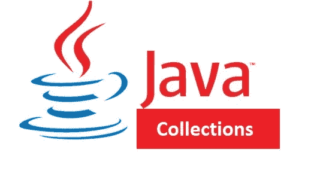

# Java 中每个人都应该知道的三个智能集合

> 原文：<https://medium.com/javarevisited/three-smart-collections-in-java-everyone-should-know-ad1c32720358?source=collection_archive---------5----------------------->



> 集合是软件项目中不可或缺的结构。Java 有一些神奇的集合，可以让你的项目更强大，更易于管理。

在本文中，我将用一些例子来处理 Java 中的三个高级集合。它们是**地图**、**集合**和**队列**。了解这些可以节省你的时间，让你的项目更强大。

我将使用 [**IntelliJ IDEA**](/javarevisited/7-best-courses-to-learn-intellij-idea-for-beginners-and-experienced-java-programmers-2e9aa9bb0c05) 作为 IDE。

## 地图

一个**映射**使得在一个集合中检索一个对象变得容易。它做的事情是用唯一的键来标记对象，你可以决定它们是怎样的。然后，从*地图*集合中调用一个对象所要做的事情就是通过*调用它的关键字*。它使**中的时间**保持不变。时间的长短并不取决于集合中有多少对象。听起来很酷！

让我们通过示例深入主题:

我们有一个名为`Book`的班级

现在我要去上`Main`课了:

首先，我从`Book`类实例化了三个图书对象。并且我创建了名为`books`的魔法收藏*地图*。这里需要注意的是*映射*是从类 [**HashMap**](https://www.java67.com/2013/02/10-examples-of-hashmap-in-java-programming-tutorial.html) 实例化的，因为它是一个 [**接口**](https://www.java67.com/2014/02/what-is-actual-use-of-interface-in-java.html) ，而不是一个 [**类**](https://www.java67.com/2017/08/difference-between-abstract-class-and-interface-in-java8.html) 。

```
Map<String, Book> books = new HashMap<>();
```

上面的短语意味着我们想要创建一个*地图集合*来存储*图书*对象，并为它们标记一些**字符串**关键字。

然后，我用方法`.put()`将这些书添加到收藏`books`中，我用书名标记它们。

使用 [for 循环](https://www.java67.com/2013/08/how-to-iterate-over-array-in-java-15.html)，我只想显示用于调用对象的关键字:

```
War and Peace
White Fang
Crime and Punishment
```

最后，在第 26 行，我们看到[如何工作*映射*](https://javarevisited.blogspot.com/2011/02/how-hashmap-works-in-java.html) 。通过使用方法`.get()`并向其传递关键字(*这里是关键字图书名称*)，我们可以检索整个对象。无环路，时间更少。

```
author: ‘Fyodor Dostoevsky’ title: ‘Crime and Punishment’ number of pages: ‘576’
```

## 设置

一个 [**集合**](https://www.java67.com/2013/01/difference-between-set-list-and-map-in-java.html) 是集合类型。它让我们避免集合中的重复项。因此，它没有*重复值*。

由于是类似 **Maps** 的接口，所以不能从自身实例化。它扩展了**集合**接口。因此，它提供了与其他集合数据结构相同的方法。

*集合*接口有三种实现: [**HashSet**](https://javarevisited.blogspot.com/2012/06/hashset-in-java-10-examples-programs.html) ， [**TreeSet**](https://javarevisited.blogspot.com/2017/04/difference-between-priorityqueue-and-treeset-in-java.html) ，[**LinkedHashSet**](https://javarevisited.blogspot.com/2012/11/difference-between-treeset-hashset-vs-linkedhashset-java.html#axzz6hX6XfwBD)。(您可以点击此[链接](https://docs.oracle.com/javase/tutorial/collections/interfaces/set.html)了解更多相关信息)

让我们看看这个例子:

我从 *HashSet，*实例化了一个名为`mySet`的 *Set* 集合，并添加了四个字符串项。我循环进入`mySet`来显示物品。

输出:

```
Aziz
Aziz Kale
```

是的，我加了四项。但是由于有些项目是[重复的](https://javarevisited.blogspot.com/2017/04/difference-between-priorityqueue-and-treeset-in-java.html) `mySet`没有接受相同的值。所以它只有两个项目。

在第 22 行，为了确定，我检查了它的大小:

输出:

```
I have 2 items.
```

## 行列

有时我们需要根据规则 **FIFO** (先进先出)处理集合中的项目。就像电影院排队一样。如果你是第一个到达检查站的人，你首先进入电影院。最后来的人，最后进入。

[队列](https://javarevisited.blogspot.com/2012/12/blocking-queue-in-java-example-ArrayBlockingQueue-LinkedBlockingQueue.html)系列也是如此。当您将一个项目添加到**队列时，**它将被添加到集合的末尾。

队列也是一个接口。它们不能直接用于实例化一个类。

例子来了:

我创建了名为`myQueue`的队列，就像[映射和设置](https://javarevisited.blogspot.com/2011/09/difference-hashmap-vs-hashset-java.html#axzz6hX6XfwBD)一样，因为它也是一个接口。

我通过使用方法`.add()`添加项目。不同的是，我使用`.poll()`方法调用这些项。在控制台上显示该项后，它将从集合中移除。我通过在控制台上打印出`myQueue`的尺寸来检查这一点。

输出:

```
I am
number of the rest items: 2
a
number of the rest items: 1
interface
number of the rest items: 0
```

## 结论

我们讨论了 Java 中三个非常有用的集合。我们现在知道它们是接口，而不是类。因为它们扩展了 Collection 类，所以它们具有与 Collection 相同的方法。但他们也有自己特殊的方法。